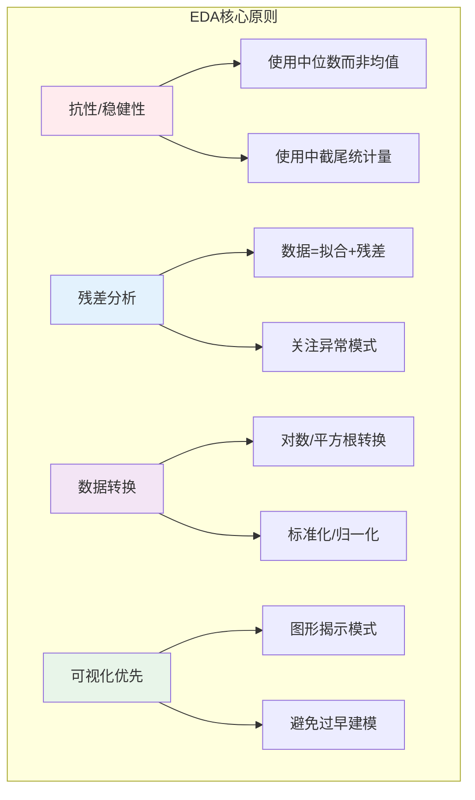

# 9.1.3 探索性数据分析

## 9.1.3.1 引言

**探索性数据分析**（Exploratory Data Analysis, EDA）由John Tukey于1970年代系统提出，是一种通过可视化和技术手段理解数据特征的分析哲学。
与经典统计学的"先假设后检验"不同，EDA强调让数据本身揭示模式。



---

## 9.1.3.2 EDA的四个维度

### 9.1.3.2.1 一维分析（Univariate Analysis）

**定义 9.1.3.1**（一维EDA框架）

对于单变量样本 $\mathbf{x} = (x_1, \ldots, x_n)$，一维EDA包含：

1. **位置度量**：中位数 $\tilde{x}$，截尾均值
2. **散布度量**：IQR，中位数绝对偏差（MAD）
3. **形状特征**：偏度、峰度
4. **异常识别**：基于IQR或MAD的异常值检测

**定义 9.1.3.2**（中位数绝对偏差，MAD）

$$\text{MAD} = \text{median}(|x_i - \tilde{x}|)$$

标准化的MAD估计量：

$$\hat{\sigma}_{\text{MAD}} = 1.4826 \times \text{MAD}$$

（因子1.4826使得对于正态分布，$\hat{\sigma}_{\text{MAD}}$ 是 $\sigma$ 的相合估计）

**定义 9.1.3.3**（截尾均值，Trimmed Mean）

对于截尾比例 $\alpha \in [0, 0.5)$，**$\alpha$-截尾均值**：

$$\bar{x}_{\alpha} = \frac{1}{n - 2k} \sum_{i=k+1}^{n-k} x_{(i)}, \quad k = \lfloor \alpha n \rfloor$$

**定理 9.1.3.1**（截尾均值的崩溃点）

$\alpha$-截尾均值的渐进崩溃点为 $\alpha$。

**证明：**

要使截尾均值任意偏离，至少需要污染 $\alpha n$ 个数据点（从一侧）。因此崩溃点为 $\alpha$。

### 9.1.3.2.2 二维分析（Bivariate Analysis）

**定义 9.1.3.4**（二维EDA框架）

对于双变量样本 $\{(x_i, y_i)\}_{i=1}^n$：

1. **散点图分析**：线性/非线性关系、聚类、异常点
2. **相关度量**：Pearson $r$，Spearman $\rho$，Kendall $\tau$
3. **平滑曲线**：LOESS（Locally Estimated Scatterplot Smoothing）

**定义 9.1.3.5**（Spearman秩相关系数）

$$\rho_S = \frac{\text{Cov}(R_x, R_y)}{\sigma_{R_x} \sigma_{R_y}}$$

其中 $R_x(i)$ 为 $x_i$ 在 $\mathbf{x}$ 中的秩次。

**定义 9.1.3.6**（LOESS平滑）

对于点 $x_0$，局部加权回归：

$$\hat{y}(x_0) = \arg\min_{\beta} \sum_{i=1}^{n} w_i(x_0)(y_i - \beta_0 - \beta_1 x_i)^2$$

其中权重 $w_i(x_0) = W(|x_i - x_0|/d(x_0))$，$d(x_0)$ 为 $x_0$ 到第 $k$ 近邻的距离，$W$ 为三立方权重函数：

$$W(u) = \begin{cases} (1 - |u|^3)^3 & |u| < 1 \\ 0 & \text{otherwise} \end{cases}$$

### 9.1.3.2.3 多维分析（Multivariate Analysis）

**定义 9.1.3.7**（散点图矩阵，Scatter Plot Matrix）

对于 $p$ 维数据 $\mathbf{X} \in \mathbb{R}^{n \times p}$，散点图矩阵是 $p \times p$ 网格：

- 对角线：各变量的单变量分布
- 非对角线 $(i,j)$：第 $i$ 变量对第 $j$ 变量的散点图

**定义 9.1.3.8**（平行坐标图，Parallel Coordinates）

将 $p$ 维空间映射到二维：$p$ 条垂直轴表示各维度，每条数据线穿过各轴上的对应值。

### 9.1.3.2.4 时间序列分析

**定义 9.1.3.9**（时间序列EDA）

对于时间序列 $\{x_t\}_{t=1}^T$：

1. **趋势分解**：$x_t = T_t + S_t + R_t$（趋势+季节+残差）
2. **自相关函数**：$\rho(k) = \text{Corr}(x_t, x_{t-k})$
3. **滞后图**：$(x_t, x_{t-k})$ 散点图

---

## 9.1.3.3 数据转换技术

### 9.1.3.3.1 幂变换族

**定义 9.1.3.10**（Box-Cox变换）

对于正数据 $x > 0$：

$$y(\lambda) = \begin{cases} \frac{x^{\lambda} - 1}{\lambda} & \lambda \neq 0 \\ \ln x & \lambda = 0 \end{cases}$$

**定理 9.1.3.2**（最优Box-Cox参数）

通过最大似然估计选择 $\lambda$：

$$\hat{\lambda} = \arg\max_{\lambda} \left[ -\frac{n}{2}\ln\left(\frac{1}{n}\sum_{i=1}^{n}(y_i(\lambda) - \bar{y}(\lambda))^2\right) + (\lambda - 1)\sum_{i=1}^{n}\ln x_i \right]$$

### 9.1.3.3.2 标准化与归一化

**定义 9.1.3.11**（Z-score标准化）

$$z_i = \frac{x_i - \bar{x}}{s}$$

**定义 9.1.3.12**（Min-Max归一化）

$$x_i^{\text{norm}} = \frac{x_i - x_{(1)}}{x_{(n)} - x_{(1)}}$$

---

## 9.1.3.4 稳健统计方法

### 9.1.3.4.1 M-估计量

**定义 9.1.3.13**（位置M-估计量）

$$\hat{\mu}_M = \arg\min_{\mu} \sum_{i=1}^{n} \rho(x_i - \mu)$$

其中 $\rho$ 为对称、凸的损失函数。

**常用 $\rho$ 函数**：

- **Huber**: $\rho(u) = \begin{cases} \frac{1}{2}u^2 & |u| \leq k \\ k|u| - \frac{1}{2}k^2 & |u| > k \end{cases}$
- **Tukey双平方**: $\rho(u) = \begin{cases} \frac{k^2}{6}\left(1 - (1 - (u/k)^2)^3\right) & |u| \leq k \\ \frac{k^2}{6} & |u| > k \end{cases}$

### 9.1.3.4.2 Rousseeuw的S-估计量和MM-估计量

（详见第9.5章稳健统计）

---

## 9.1.3.5 代码实现

### 9.1.3.5.1 Python实现

```python
import numpy as np
import pandas as pd
from scipy import stats
from scipy.optimize import minimize_scalar
from typing import Dict, Tuple, List, Optional, Callable
import warnings

class EDA:
    """探索性数据分析系统实现"""

    def __init__(self, data: np.ndarray, var_names: Optional[List[str]] = None):
        """
        初始化EDA对象

        Args:
            data: 数组，形状为 (n_samples,) 或 (n_samples, n_features)
            var_names: 变量名称列表
        """
        self.data = np.asarray(data)
        if self.data.ndim == 1:
            self.data = self.data.reshape(-1, 1)

        self.n, self.p = self.data.shape

        if var_names is None:
            self.var_names = [f'Var{i+1}' for i in range(self.p)]
        else:
            self.var_names = var_names

    # ========== 一维分析 ==========

    def univariate_summary(self, col: int = 0) -> Dict:
        """单变量EDA汇总"""
        x = self.data[:, col]

        # 经典统计量
        mean = np.mean(x)
        std = np.std(x, ddof=1)

        # 稳健统计量
        median = np.median(x)
        mad = np.median(np.abs(x - median))
        mad_sigma = 1.4826 * mad  # 正态化MAD

        # 截尾均值
        trimmed_mean_10 = stats.trim_mean(x, 0.1)
        trimmed_mean_20 = stats.trim_mean(x, 0.2)

        # 五数概括
        q0, q25, q50, q75, q100 = np.percentile(x, [0, 25, 50, 75, 100])
        iqr = q75 - q25

        # 异常值检测（基于IQR和MAD）
        iqr_outliers = x[(x < q25 - 1.5*iqr) | (x > q75 + 1.5*iqr)]
        mad_outliers = x[np.abs(x - median) > 3.5 * mad_sigma]

        return {
            'n': len(x),
            'classic': {'mean': mean, 'std': std},
            'robust': {
                'median': median,
                'mad': mad,
                'mad_sigma': mad_sigma
            },
            'trimmed_mean': {
                '10%': trimmed_mean_10,
                '20%': trimmed_mean_20
            },
            'five_number': {
                'min': q0, 'Q1': q25, 'median': q50,
                'Q3': q75, 'max': q100, 'IQR': iqr
            },
            'outliers': {
                'iqr_method': len(iqr_outliers),
                'mad_method': len(mad_outliers)
            }
        }

    # ========== 二维分析 ==========

    def bivariate_analysis(self, col1: int = 0, col2: int = 1) -> Dict:
        """双变量EDA分析"""
        x, y = self.data[:, col1], self.data[:, col2]

        # Pearson相关
        pearson_r, pearson_p = stats.pearsonr(x, y)

        # Spearman秩相关
        spearman_r, spearman_p = stats.spearmanr(x, y)

        # Kendall Tau
        kendall_tau, kendall_p = stats.kendalltau(x, y)

        # 简单线性回归
        slope, intercept, r_value, p_value, std_err = stats.linregress(x, y)

        return {
            'pearson': {'r': pearson_r, 'p_value': pearson_p},
            'spearman': {'rho': spearman_r, 'p_value': spearman_p},
            'kendall': {'tau': kendall_tau, 'p_value': kendall_p},
            'regression': {
                'slope': slope,
                'intercept': intercept,
                'r_squared': r_value**2,
                'std_error': std_err
            }
        }

    def loess_smooth(self, x: np.ndarray, y: np.ndarray,
                     frac: float = 0.666) -> Tuple[np.ndarray, np.ndarray]:
        """
        LOESS平滑

        Args:
            x, y: 输入数据
            frac: 每点使用的数据比例

        Returns:
            x_sorted, y_smooth
        """
        # 排序
        sort_idx = np.argsort(x)
        x_sorted = x[sort_idx]
        y_sorted = y[sort_idx]

        n = len(x)
        k = int(frac * n)  # 邻居数量

        y_smooth = np.zeros(n)

        for i in range(n):
            # 计算距离
            distances = np.abs(x_sorted - x_sorted[i])

            # 找到第k近邻的距离
            d = np.partition(distances, k)[k]
            if d == 0:
                d = 1e-10

            # 三立方权重
            u = distances / d
            weights = np.where(u < 1, (1 - u**3)**3, 0)

            # 加权线性回归
            if np.sum(weights) > 0:
                X = np.column_stack([np.ones(n), x_sorted])
                W = np.diag(weights)
                try:
                    beta = np.linalg.lstsq(X.T @ W @ X, X.T @ W @ y_sorted, rcond=None)[0]
                    y_smooth[i] = beta[0] + beta[1] * x_sorted[i]
                except:
                    y_smooth[i] = np.average(y_sorted, weights=weights)
            else:
                y_smooth[i] = y_sorted[i]

        return x_sorted, y_smooth

    # ========== 数据转换 ==========

    def box_cox_transform(self, x: np.ndarray, lmbda: Optional[float] = None) -> Tuple[np.ndarray, float]:
        """
        Box-Cox变换

        Returns:
            变换后的数据, 最优lambda（如果未指定）
        """
        x = np.asarray(x)
        if np.any(x <= 0):
            raise ValueError("Box-Cox变换要求所有数据为正")

        if lmbda is not None:
            if lmbda == 0:
                return np.log(x), lmbda
            else:
                return (x**lmbda - 1) / lmbda, lmbda

        # 最大似然估计最优lambda
        def box_cox_log_likelihood(lmbda):
            if np.abs(lmbda) < 1e-10:
                y = np.log(x)
            else:
                y = (x**lmbda - 1) / lmbda

            n = len(x)
            y_mean = np.mean(y)
            y_var = np.var(y, ddof=1)

            # 对数似然（忽略常数）
            log_likelihood = -0.5 * n * np.log(y_var) + (lmbda - 1) * np.sum(np.log(x))
            return -log_likelihood

        result = minimize_scalar(box_cox_log_likelihood, bounds=(-5, 5), method='bounded')
        optimal_lambda = result.x

        if np.abs(optimal_lambda) < 0.01:
            optimal_lambda = 0
            y = np.log(x)
        else:
            y = (x**optimal_lambda - 1) / optimal_lambda

        return y, optimal_lambda

    def standardize(self, method: str = 'zscore') -> np.ndarray:
        """
        数据标准化

        method: 'zscore', 'minmax', 'robust'
        """
        result = np.zeros_like(self.data)

        for j in range(self.p):
            x = self.data[:, j]

            if method == 'zscore':
                result[:, j] = (x - np.mean(x)) / np.std(x, ddof=1)
            elif method == 'minmax':
                x_min, x_max = np.min(x), np.max(x)
                result[:, j] = (x - x_min) / (x_max - x_min)
            elif method == 'robust':
                median = np.median(x)
                mad = np.median(np.abs(x - median))
                result[:, j] = (x - median) / (1.4826 * mad)
            else:
                raise ValueError(f"Unknown method: {method}")

        return result

    # ========== 多维分析 ==========

    def correlation_matrix(self, method: str = 'pearson') -> np.ndarray:
        """相关系数矩阵"""
        if method == 'pearson':
            return np.corrcoef(self.data.T)
        elif method == 'spearman':
            return stats.spearmanr(self.data)[0]
        else:
            raise ValueError(f"Unknown method: {method}")

    def covariance_matrix(self) -> np.ndarray:
        """协方差矩阵"""
        return np.cov(self.data.T, ddof=1)

    def comprehensive_report(self) -> Dict:
        """生成综合EDA报告"""
        report = {
            'data_shape': {'n_samples': self.n, 'n_features': self.p},
            'variables': {}
        }

        for j in range(self.p):
            report['variables'][self.var_names[j]] = self.univariate_summary(j)

        # 如果有多于一个变量，添加相关性分析
        if self.p > 1:
            report['correlation_matrix'] = {
                'pearson': self.correlation_matrix('pearson').tolist(),
                'spearman': self.correlation_matrix('spearman').tolist()
            }

        return report


# 使用示例
if __name__ == "__main__":
    np.random.seed(42)

    # 生成多变量测试数据
    n = 500
    # 变量1: 正态
    x1 = np.random.normal(100, 15, n)
    # 变量2: 对数正态（右偏）
    x2 = np.random.lognormal(2, 0.5, n)
    # 变量3: 与x1相关
    x3 = 0.7 * x1 + np.random.normal(0, 10, n)
    # 添加一些异常值
    x1[::50] = x1[::50] + np.random.choice([-50, 50], size=len(x1[::50]))

    data = np.column_stack([x1, x2, x3])

    # 创建EDA对象
    eda = EDA(data, var_names=['Normal', 'LogNormal', 'Correlated'])

    # 单变量分析
    print("=" * 60)
    print("单变量EDA汇总 - Normal变量")
    print("=" * 60)
    summary = eda.univariate_summary(0)
    print(f"样本量: {summary['n']}")
    print(f"经典均值: {summary['classic']['mean']:.4f} ± {summary['classic']['std']:.4f}")
    print(f"稳健中位数: {summary['robust']['median']:.4f} (MAD={summary['robust']['mad']:.4f})")
    print(f"10%截尾均值: {summary['trimmed_mean']['10%']:.4f}")
    print(f"IQR: {summary['five_number']['IQR']:.4f}")
    print(f"异常值数量(IQR): {summary['outliers']['iqr_method']}")

    # 双变量分析
    print("\n" + "=" * 60)
    print("双变量分析 - Normal vs Correlated")
    print("=" * 60)
    biv = eda.bivariate_analysis(0, 2)
    print(f"Pearson r: {biv['pearson']['r']:.4f} (p={biv['pearson']['p_value']:.2e})")
    print(f"Spearman ρ: {biv['spearman']['rho']:.4f}")
    print(f"回归方程: y = {biv['regression']['slope']:.4f}x + {biv['regression']['intercept']:.4f}")
    print(f"R²: {biv['regression']['r_squared']:.4f}")

    # Box-Cox变换
    print("\n" + "=" * 60)
    print("Box-Cox变换（LogNormal变量）")
    print("=" * 60)
    x2_transformed, optimal_lambda = eda.box_cox_transform(x2)
    print(f"最优lambda: {optimal_lambda:.4f}")
    print(f"变换前偏度: {stats.skew(x2):.4f}")
    print(f"变换后偏度: {stats.skew(x2_transformed):.4f}")

    # 综合报告
    print("\n" + "=" * 60)
    print("相关系数矩阵 (Pearson)")
    print("=" * 60)
    corr_mat = eda.correlation_matrix('pearson')
    print(pd.DataFrame(corr_mat,
                       index=eda.var_names,
                       columns=eda.var_names).round(4))
```

---

## 9.1.3.6 与其他章节的交叉引用

| 引用目标 | 章节 | 关系 |
|---------|------|------|
| 集中趋势 | 9.1.1 | EDA中的位置度量 |
| 可视化 | 9.1.2 | EDA的可视化工具 |
| 稳健统计 | 9.5.1 | M-估计量、崩溃点理论 |
| 回归分析 | 9.3.3 | LOESS与线性回归 |
| 时间序列 | 9.6.2 | 时间序列EDA |

---

## 9.1.3.7 参考文献

1. Tukey, J. W. (1977). _Exploratory Data Analysis_. Addison-Wesley.
2. Hoaglin, D. C., Mosteller, F., & Tukey, J. W. (Eds.). (1983). _Understanding Robust and Exploratory Data Analysis_. Wiley.
3. Cleveland, W. S. (1979). Robust locally weighted regression and smoothing scatterplots. _JASA_, 74(368), 829-836.
4. Box, G. E. P., & Cox, D. R. (1964). An analysis of transformations. _JRSS B_, 26(2), 211-252.
5. Huber, P. J., & Ronchetti, E. M. (2009). _Robust Statistics_ (2nd ed.). Wiley.

---

## 9.1.3.8 练习

**练习 9.1.3.1** 证明对于正态分布，MAD $\times$ 1.4826 是 $\sigma$ 的相合估计。

**练习 9.1.3.2** 实现迭代重加权最小二乘法（IRLS）计算Huber M-估计量。

**练习 9.1.3.3** 比较不同稳健位置估计量（中位数、截尾均值、M-估计量）在不同污染比例下的效率。
