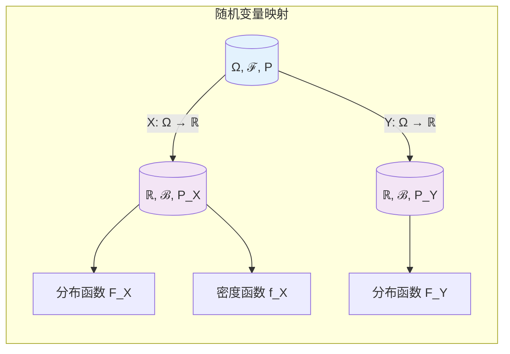

# 9.2.2 随机变量

## 9.2.2.1 引言

随机变量是概率论的核心概念，它将样本空间中的结果映射到实数（或更广义的值域）。
本章形式化定义随机变量、分布函数、概率质量/密度函数，建立从抽象概率空间到具体分布的桥梁。



---

## 9.2.2.2 随机变量的形式化定义

### 9.2.2.2.1 可测函数

**定义 9.2.2.1**（随机变量，Random Variable）

设 $(\Omega, \mathcal{F}, P)$ 为概率空间，$(\mathbb{R}, \mathcal{B}(\mathbb{R}))$ 为可测空间。函数 $X: \Omega \to \mathbb{R}$ 称为**随机变量**（严格地说是**实值随机变量**），如果对任意 Borel 集 $B \in \mathcal{B}(\mathbb{R})$：

$$X^{-1}(B) = \{\omega \in \Omega : X(\omega) \in B\} \in \mathcal{F}$$

即 $X$ 是 $(\Omega, \mathcal{F})$ 到 $(\mathbb{R}, \mathcal{B}(\mathbb{R}))$ 的**可测函数**。

**注**：更一般的，若值域为可测空间 $(E, \mathcal{E})$，则 $X$ 称为**随机元**（random element）。

**定理 9.2.2.1**（随机变量的判定准则）

$X: \Omega \to \mathbb{R}$ 是随机变量当且仅当以下任一条件成立：

1. 对所有 $a \in \mathbb{R}$，$\{\omega : X(\omega) \leq a\} \in \mathcal{F}$
2. 对所有 $a \in \mathbb{R}$，$\{\omega : X(\omega) < a\} \in \mathcal{F}$
3. 对所有区间 $(a, b]$，$X^{-1}((a, b]) \in \mathcal{F}$

**证明：**

由生成 $\sigma$-代数的定义，$\mathcal{B}(\mathbb{R}) = \sigma(\{(-\infty, a] : a \in \mathbb{R}\})$。若所有射线可测，则生成的 $\sigma$-代数也可测。

**证毕。**

**定理 9.2.2.2**（随机变量的运算封闭性）

设 $X, Y$ 为随机变量，$c \in \mathbb{R}$，$g: \mathbb{R} \to \mathbb{R}$ 为 Borel 可测函数，则：

1. $cX$, $X + c$ 是随机变量
2. $X + Y$ 是随机变量
3. $XY$ 是随机变量
4. $g(X)$ 是随机变量（若 $g$ Borel 可测）
5. $\max(X, Y)$, $\min(X, Y)$ 是随机变量
6. 若 $Y \neq 0$ a.s.，则 $X/Y$ 是随机变量

**证明（$X + Y$）：**

对任意 $a \in \mathbb{R}$：
$$\{X + Y < a\} = \bigcup_{q \in \mathbb{Q}} \{X < q\} \cap \{Y < a - q\}$$

有理数可数，故右边是可测集的可数并，可测。

**证毕。**

### 9.2.2.2.2 随机变量的分布

**定义 9.2.2.2**（诱导概率测度 / 分布）

随机变量 $X$ 诱导 $(\mathbb{R}, \mathcal{B}(\mathbb{R}))$ 上的概率测度 $P_X$：

$$P_X(B) = P(X^{-1}(B)) = P(X \in B), \quad \forall B \in \mathcal{B}(\mathbb{R})$$

$(\mathbb{R}, \mathcal{B}(\mathbb{R}), P_X)$ 称为 $X$ 的**分布**。

---

## 9.2.2.3 分布函数

### 9.2.2.3.1 累积分布函数

**定义 9.2.2.3**（累积分布函数，CDF）

随机变量 $X$ 的**累积分布函数**（Cumulative Distribution Function）$F_X: \mathbb{R} \to [0, 1]$ 定义为：

$$F_X(x) = P(X \leq x) = P(\{\omega : X(\omega) \leq x\}) = P_X((-\infty, x])$$

**定理 9.2.2.3**（CDF的特征性质）

函数 $F: \mathbb{R} \to [0, 1]$ 是某个随机变量的CDF当且仅当：

1. **单调不减**：$x_1 < x_2 \Rightarrow F(x_1) \leq F(x_2)$
2. **右连续**：$\lim_{y \downarrow x} F(y) = F(x)$，$\forall x \in \mathbb{R}$
3. **边界条件**：$\lim_{x \to -\infty} F(x) = 0$，$\lim_{x \to +\infty} F(x) = 1$

**证明：**

_必要性_：

1. $x_1 < x_2 \Rightarrow (-\infty, x_1] \subseteq (-\infty, x_2] \Rightarrow F(x_1) \leq F(x_2)$
2. 令 $A_n = \{\omega : X(\omega) \leq x + 1/n\}$，则 $A_n \downarrow \{X \leq x\}$，由连续性 $F(x + 1/n) \downarrow F(x)$
3. $\{X \leq -n\} \downarrow \emptyset$，$\{X \leq n\} \uparrow \Omega$

_充分性_：构造概率空间 $([0, 1], \mathcal{B}([0, 1]), \lambda)$，定义 $X(\omega) = \inf\{x : F(x) \geq \omega\}$（广义逆）。

**证毕。**

**定理 9.2.2.4**（由CDF计算区间概率）

设 $F$ 为CDF，则：

1. $P(a < X \leq b) = F(b) - F(a)$
2. $P(X = x) = F(x) - F(x-)$，其中 $F(x-) = \lim_{y \uparrow x} F(y)$
3. $P(X > a) = 1 - F(a)$
4. $P(X \geq a) = 1 - F(a-)$

### 9.2.2.3.2 生存函数与风险函数

**定义 9.2.2.4**（生存函数，Survival Function）

$$S(x) = P(X > x) = 1 - F(x)$$

**定义 9.2.2.5**（风险函数，Hazard Function）

$$h(x) = \lim_{\Delta x \to 0^+} \frac{P(x < X \leq x + \Delta x | X > x)}{\Delta x} = \frac{f(x)}{S(x)}$$

（要求密度函数 $f$ 存在）

---

## 9.2.2.4 离散型与连续型随机变量

### 9.2.2.4.1 离散型随机变量

**定义 9.2.2.6**（离散型随机变量，Discrete RV）

随机变量 $X$ 称为**离散型**，若存在可数集 $\{x_i\}_{i \in I}$ 使得：

$$P(X \in \{x_i\}) = 1$$

**定义 9.2.2.7**（概率质量函数，PMF）

离散型随机变量 $X$ 的**概率质量函数** $p_X: \mathbb{R} \to [0, 1]$：

$$p_X(x) = P(X = x)$$

满足：

- $p_X(x) \geq 0$
- $\sum_{i \in I} p_X(x_i) = 1$
- $P(X \in A) = \sum_{x_i \in A} p_X(x_i)$

**CDF与PMF的关系**：

$$F_X(x) = \sum_{x_i \leq x} p_X(x_i)$$

$F_X$ 是阶梯函数，在 $x_i$ 处跳跃 $p_X(x_i)$。

### 9.2.2.4.2 连续型随机变量

**定义 9.2.2.8**（连续型随机变量，Continuous RV）

随机变量 $X$ 称为**连续型**，若存在非负可测函数 $f_X: \mathbb{R} \to [0, \infty)$ 使得：

$$F_X(x) = \int_{-\infty}^{x} f_X(t) dt, \quad \forall x \in \mathbb{R}$$

$f_X$ 称为**概率密度函数**（Probability Density Function, PDF）。

**定理 9.2.2.5**（PDF的性质）

1. $f_X(x) \geq 0$，$\forall x$
2. $\int_{-\infty}^{\infty} f_X(x) dx = 1$
3. $P(a < X \leq b) = \int_a^b f_X(x) dx$
4. 若 $f_X$ 在 $x$ 处连续，则 $f_X(x) = F_X'(x)$
5. $P(X = x) = 0$，$\forall x \in \mathbb{R}$

**证明：**

(5) 由连续性：$P(X = x) = \lim_{n \to \infty} P(x - 1/n < X \leq x) = \lim_{n \to \infty} \int_{x-1/n}^{x} f_X(t) dt = 0$

**证毕。**

**注**：存在既非离散也非连续的随机变量（如混合分布）。

---

## 9.2.2.5 分位数函数

**定义 9.2.2.9**（分位数函数，Quantile Function）

CDF $F$ 的**广义逆**或**分位数函数**定义为：

$$F^{-1}(p) = \inf\{x \in \mathbb{R} : F(x) \geq p\}, \quad p \in (0, 1)$$

也称为**分位数函数**或**百分点函数**。

**定理 9.2.2.6**（分位数函数的性质）

1. $F^{-1}$ 单调不减
2. $F(F^{-1}(p)) \geq p$
3. $F^{-1}(F(x)) \leq x$
4. $F^{-1}(p) \leq x \Leftrightarrow p \leq F(x)$

**定义 9.2.2.10**（分位数）

对于 $p \in (0, 1)$，$F^{-1}(p)$ 称为 $X$ 的**第 $p$ 分位数**或**100p-th百分位数**。

特殊分位数：

- **中位数**：$F^{-1}(0.5)$
- **第一四分位数**：$F^{-1}(0.25)$
- **第三四分位数**：$F^{-1}(0.75)$

---

## 9.2.2.6 随机向量与联合分布

**定义 9.2.2.11**（随机向量，Random Vector）

$n$ 维**随机向量** $\mathbf{X} = (X_1, \ldots, X_n)$ 是 $(\Omega, \mathcal{F}, P)$ 到 $(\mathbb{R}^n, \mathcal{B}(\mathbb{R}^n))$ 的可测映射。

**定义 9.2.2.12**（联合分布函数，Joint CDF）

$$F_{\mathbf{X}}(x_1, \ldots, x_n) = P(X_1 \leq x_1, \ldots, X_n \leq x_n)$$

**定义 9.2.2.13**（边缘分布，Marginal Distribution）

$X_i$ 的**边缘CDF**：

$$F_{X_i}(x_i) = \lim_{x_j \to \infty, j \neq i} F_{\mathbf{X}}(x_1, \ldots, x_n) = P(X_i \leq x_i)$$

**定义 9.2.2.14**（独立性）

随机变量 $X_1, \ldots, X_n$ **独立**，如果：

$$F_{\mathbf{X}}(x_1, \ldots, x_n) = \prod_{i=1}^{n} F_{X_i}(x_i), \quad \forall (x_1, \ldots, x_n) \in \mathbb{R}^n$$

等价地，对 Borel 集 $B_1, \ldots, B_n$：

$$P(X_1 \in B_1, \ldots, X_n \in B_n) = \prod_{i=1}^{n} P(X_i \in B_i)$$

---

## 9.2.2.7 代码实现

### 9.2.2.7.1 Python实现

```python
from typing import Callable, Tuple, Union, Optional
from abc import ABC, abstractmethod
import numpy as np
from scipy import stats
from scipy.integrate import quad
import warnings

class RandomVariable(ABC):
    """随机变量抽象基类"""

    def __init__(self, name: str = "X"):
        self.name = name

    @abstractmethod
    def cdf(self, x: float) -> float:
        """累积分布函数 F(x)"""
        pass

    @abstractmethod
    def quantile(self, p: float) -> float:
        """分位数函数 F^{-1}(p)"""
        pass

    def survival(self, x: float) -> float:
        """生存函数 S(x) = 1 - F(x)"""
        return 1 - self.cdf(x)

    def interval_prob(self, a: float, b: float) -> float:
        """区间概率 P(a < X ≤ b)"""
        return max(0, self.cdf(b) - self.cdf(a))

    def median(self) -> float:
        """中位数"""
        return self.quantile(0.5)

    def simulate(self, n: int, random_state: Optional[int] = None) -> np.ndarray:
        """生成随机样本（逆变换采样）"""
        rng = np.random.default_rng(random_state)
        u = rng.random(n)
        return np.array([self.quantile(ui) for ui in u])


class DiscreteRV(RandomVariable):
    """离散型随机变量"""

    def __init__(self, support: np.ndarray, pmf_values: np.ndarray, name: str = "X"):
        """
        Args:
            support: 支撑集（可能取值的集合）
            pmf_values: 对应的概率质量
        """
        super().__init__(name)
        self.support = np.array(support)
        self.pmf_values = np.array(pmf_values)

        # 归一化
        self.pmf_values = self.pmf_values / np.sum(self.pmf_values)

        # 预计算CDF
        self._cdf_values = np.cumsum(self.pmf_values)

    def pmf(self, x: float) -> float:
        """概率质量函数"""
        idx = np.where(np.isclose(self.support, x))[0]
        return self.pmf_values[idx[0]] if len(idx) > 0 else 0.0

    def cdf(self, x: float) -> float:
        """累积分布函数（阶梯函数）"""
        return np.sum(self.pmf_values[self.support <= x])

    def quantile(self, p: float) -> float:
        """分位数函数"""
        if p < 0 or p > 1:
            raise ValueError("p 必须在 [0, 1] 之间")
        if p == 0:
            return self.support[0]
        if p == 1:
            return self.support[-1]

        idx = np.searchsorted(self._cdf_values, p, side='left')
        return self.support[min(idx, len(self.support) - 1)]

    def mean(self) -> float:
        """期望"""
        return np.sum(self.support * self.pmf_values)

    def variance(self) -> float:
        """方差"""
        mean_val = self.mean()
        return np.sum(self.pmf_values * (self.support - mean_val) ** 2)

    def simulate(self, n: int, random_state: Optional[int] = None) -> np.ndarray:
        """离散分布采样"""
        rng = np.random.default_rng(random_state)
        return rng.choice(self.support, size=n, p=self.pmf_values)


class ContinuousRV(RandomVariable):
    """连续型随机变量（基于密度函数）"""

    def __init__(self, pdf: Callable[[float], float],
                 lower: float = -np.inf, upper: float = np.inf,
                 name: str = "X"):
        """
        Args:
            pdf: 概率密度函数
            lower, upper: 支撑集边界
        """
        super().__init__(name)
        self.pdf = pdf
        self.lower = lower
        self.upper = upper

    def cdf(self, x: float) -> float:
        """数值积分计算CDF"""
        if x <= self.lower:
            return 0.0
        if x >= self.upper:
            return 1.0

        result, _ = quad(self.pdf, self.lower, x, limit=100)
        return min(1.0, max(0.0, result))

    def quantile(self, p: float, tol: float = 1e-6) -> float:
        """
        数值方法求分位数（二分查找）
        """
        if p < 0 or p > 1:
            raise ValueError("p 必须在 [0, 1] 之间")

        # 确定搜索范围
        lower, upper = self.lower, self.upper

        if lower == -np.inf:
            # 找到下界使得 CDF(lower) < p
            lower = -1
            while self.cdf(lower) > p:
                lower *= 2

        if upper == np.inf:
            # 找到上界使得 CDF(upper) > p
            upper = 1
            while self.cdf(upper) < p:
                upper *= 2

        # 二分查找
        while upper - lower > tol:
            mid = (lower + upper) / 2
            if self.cdf(mid) < p:
                lower = mid
            else:
                upper = mid

        return (lower + upper) / 2


class JointDistribution:
    """联合分布"""

    def __init__(self, marginals: list, copula: Optional[Callable] = None):
        """
        Args:
            marginals: 边缘分布列表
            copula: Copula函数（连接函数）
        """
        self.marginals = marginals
        self.copula = copula
        self.dim = len(marginals)

    def joint_cdf(self, *x) -> float:
        """联合累积分布函数"""
        if len(x) != self.dim:
            raise ValueError(f"需要{self.dim}个变量")

        if self.copula is None:
            # 独立性假设
            result = 1.0
            for i, xi in enumerate(x):
                result *= self.marginals[i].cdf(xi)
            return result
        else:
            # 使用Copula
            u = [self.marginals[i].cdf(xi) for i, xi in enumerate(x)]
            return self.copula(*u)


# 常用分布工厂函数
def bernoulli(p: float) -> DiscreteRV:
    """伯努利分布 Bernoulli(p)"""
    return DiscreteRV([0, 1], [1-p, p], name=f"Bernoulli({p})")

def binomial_rv(n: int, p: float) -> DiscreteRV:
    """二项分布 Binomial(n, p)"""
    support = np.arange(n + 1)
    pmf_values = stats.binom.pmf(support, n, p)
    return DiscreteRV(support, pmf_values, name=f"Binomial({n}, {p})")

def uniform_continuous(a: float, b: float) -> ContinuousRV:
    """均匀分布 Uniform(a, b)"""
    def pdf(x):
        return 1 / (b - a) if a <= x <= b else 0
    return ContinuousRV(pdf, a, b, name=f"Uniform({a}, {b})")

def exponential_rv(lam: float) -> ContinuousRV:
    """指数分布 Exponential(λ)"""
    def pdf(x):
        return lam * np.exp(-lam * x) if x >= 0 else 0
    return ContinuousRV(pdf, 0, np.inf, name=f"Exponential({lam})")


# 使用示例
if __name__ == "__main__":
    print("=" * 60)
    print("随机变量示例")
    print("=" * 60)

    # 离散型：伯努利分布
    print("\n1. 伯努利分布 Bernoulli(0.3)")
    bern = bernoulli(0.3)
    print(f"   PMF(0) = {bern.pmf(0):.2f}, PMF(1) = {bern.pmf(1):.2f}")
    print(f"   CDF(0) = {bern.cdf(0):.2f}, CDF(1) = {bern.cdf(1):.2f}")
    print(f"   期望 = {bern.mean():.2f}, 方差 = {bern.variance():.4f}")

    # 离散型：自定义分布
    print("\n2. 自定义离散分布")
    support = np.array([1, 2, 3, 4, 5])
    pmf = np.array([0.1, 0.2, 0.4, 0.2, 0.1])
    custom_discrete = DiscreteRV(support, pmf, "Dice")
    print(f"   中位数 = {custom_discrete.median()}")
    print(f"   P(2 < X ≤ 4) = {custom_discrete.interval_prob(2, 4):.2f}")

    # 连续型：均匀分布
    print("\n3. 均匀分布 Uniform(0, 1)")
    unif = uniform_continuous(0, 1)
    print(f"   CDF(0.5) = {unif.cdf(0.5):.4f}")
    print(f"   分位数 F^(-1)(0.75) = {unif.quantile(0.75):.4f}")
    print(f"   区间概率 P(0.25 < X ≤ 0.75) = {unif.interval_prob(0.25, 0.75):.4f}")

    # 连续型：指数分布
    print("\n4. 指数分布 Exponential(1)")
    exp = exponential_rv(1.0)
    print(f"   CDF(1) = {exp.cdf(1):.4f}")
    print(f"   中位数 = {exp.median():.4f}")
    print(f"   生存函数 S(2) = {exp.survival(2):.4f}")

    # 采样
    print("\n5. 随机采样")
    samples = custom_discrete.simulate(1000, random_state=42)
    print(f"   样本均值 = {np.mean(samples):.2f}")
    print(f"   样本方差 = {np.var(samples, ddof=1):.2f}")
```

---

## 9.2.2.8 交叉引用

| 引用目标 | 章节 | 关系 |
|---------|------|------|
| 概率空间 | 9.2.1 | 随机变量的定义基础 |
| 概率分布 | 9.2.3 | 具体分布的定义 |
| 期望与方差 | 9.2.2 | 随机变量的数字特征 |
| 大数定律 | 9.2.4 | 随机变量序列的收敛 |
| 推断统计 | 9.3 | 基于随机变量的推断 |

---

## 9.2.2.9 参考文献

1. Casella, G., & Berger, R. L. (2002). _Statistical Inference_ (2nd ed.). Duxbury. (Ch. 1-2)
2. Durrett, R. (2019). _Probability: Theory and Examples_ (5th ed.). Cambridge.
3. Resnick, S. I. (2019). _A Probability Path_. Birkhäuser.
4. Grimmett, G., & Stirzaker, D. (2020). _Probability and Random Processes_ (4th ed.). Oxford.

---

## 9.2.2.10 练习

**练习 9.2.2.1** 证明若 $X$ 是随机变量，$g: \mathbb{R} \to \mathbb{R}$ 是连续函数，则 $g(X)$ 是随机变量。

**练习 9.2.2.2** 设 $F$ 是CDF，证明 $F$ 至多有可数个跳跃不连续点。

**练习 9.2.2.3** 构造一个随机变量使其分布既不是离散的也不是连续的。

**练习 9.2.2.4** 证明对于独立随机变量 $X, Y$，有 $P(X \leq x, Y \leq y) = P(X \leq x)P(Y \leq y)$。
