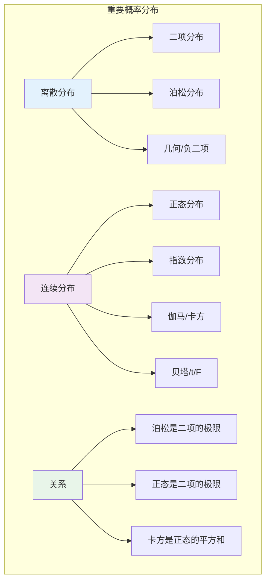
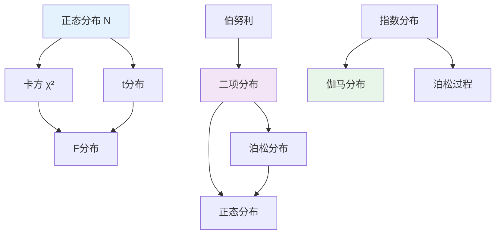

# 9.2.3 概率分布

---

📌 **内容摘要**

本文档深入探讨概率分布的核心原理和关键方法。内容涵盖概率论基础领域的主要知识点，包括相关理论、方法及应用。适合初学者建立基础知识体系。

**关键词**: 概率论基础

📚 **学习目标**

- 理解概率分布的基本概念和核心原理
- 掌握相关术语和符号表示
- 建立该领域的系统性知识框架

🎯 **难度级别**: 初级

⏱️ **预计阅读时间**: 15分钟

**前置知识**: 基础数学知识, 微积分基础

---


## 9.2.3.1 引言

概率分布是描述随机变量统计规律的核心工具。
本章形式化介绍统计学中最重要的一些概率分布：二项分布、泊松分布、正态分布、指数分布等，包括其定义、性质、数字特征及相互关系。



---

## 9.2.3.2 离散分布

### 9.2.3.2.1 二项分布

**定义 9.2.3.1**（二项分布，Binomial Distribution）

设 $n \in \mathbb{N}$，$p \in [0, 1]$，随机变量 $X$ 服从参数为 $(n, p)$ 的**二项分布**，记作 $X \sim \text{Binomial}(n, p)$，若其PMF为：

$$P(X = k) = \binom{n}{k} p^k (1-p)^{n-k}, \quad k = 0, 1, \ldots, n$$

**解释**：$n$ 次独立伯努利试验中成功的次数。

**定理 9.2.3.1**（二项分布的归一化）

$$\sum_{k=0}^{n} \binom{n}{k} p^k (1-p)^{n-k} = 1$$

**证明：** 由二项式定理：$(p + (1-p))^n = 1^n = 1$

**证毕。**

**定理 9.2.3.2**（二项分布的数字特征）

若 $X \sim \text{Binomial}(n, p)$，则：

- **期望**：$E[X] = np$
- **方差**：$\text{Var}(X) = np(1-p)$
- **众数**：$\lfloor (n+1)p \rfloor$ 或 $\lceil (n+1)p \rceil - 1$
- **矩母函数**：$M_X(t) = (1 - p + pe^t)^n$
- **特征函数**：$\varphi_X(t) = (1 - p + pe^{it})^n$

**证明（期望）：**

$$E[X] = \sum_{k=0}^{n} k \binom{n}{k} p^k (1-p)^{n-k}$$

利用 $k\binom{n}{k} = n\binom{n-1}{k-1}$：

$$E[X] = np \sum_{k=1}^{n} \binom{n-1}{k-1} p^{k-1} (1-p)^{n-k} = np (p + (1-p))^{n-1} = np$$

**证毕。**

**定理 9.2.3.3**（可加性）

若 $X \sim \text{Binomial}(n_1, p)$，$Y \sim \text{Binomial}(n_2, p)$ 独立，则：

$$X + Y \sim \text{Binomial}(n_1 + n_2, p)$$

### 9.2.3.2.2 泊松分布

**定义 9.2.3.2**（泊松分布，Poisson Distribution）

设 $\lambda > 0$，随机变量 $X$ 服从参数为 $\lambda$ 的**泊松分布**，记作 $X \sim \text{Poisson}(\lambda)$，若其PMF为：

$$P(X = k) = \frac{e^{-\lambda} \lambda^k}{k!}, \quad k = 0, 1, 2, \ldots$$

**定理 9.2.3.4**（泊松分布的数字特征）

若 $X \sim \text{Poisson}(\lambda)$，则：

- **期望**：$E[X] = \lambda$
- **方差**：$\text{Var}(X) = \lambda$
- **矩母函数**：$M_X(t) = e^{\lambda(e^t - 1)}$
- **特征函数**：$\varphi_X(t) = e^{\lambda(e^{it}-1)}$
- **偏度**：$\gamma_1 = \lambda^{-1/2}$
- **峰度**：$\gamma_2 = \lambda^{-1}$

**定理 9.2.3.5**（泊松分布是二项分布的极限）

设 $\lambda > 0$ 固定，$n \to \infty$，$p_n = \lambda/n$，则：

$$\lim_{n \to \infty} \binom{n}{k} p_n^k (1-p_n)^{n-k} = \frac{e^{-\lambda} \lambda^k}{k!}$$

**证明：**

$$\binom{n}{k} \left(\frac{\lambda}{n}\right)^k \left(1-\frac{\lambda}{n}\right)^{n-k}$$
$$= \frac{n(n-1)\cdots(n-k+1)}{k!} \cdot \frac{\lambda^k}{n^k} \cdot \left(1-\frac{\lambda}{n}\right)^n \cdot \left(1-\frac{\lambda}{n}\right)^{-k}$$
$$= \frac{\lambda^k}{k!} \cdot \frac{n(n-1)\cdots(n-k+1)}{n^k} \cdot \left(1-\frac{\lambda}{n}\right)^n \cdot \left(1-\frac{\lambda}{n}\right)^{-k}$$

当 $n \to \infty$：

- $\frac{n(n-1)\cdots(n-k+1)}{n^k} \to 1$
- $\left(1-\frac{\lambda}{n}\right)^n \to e^{-\lambda}$
- $\left(1-\frac{\lambda}{n}\right)^{-k} \to 1$

**证毕。**

**定理 9.2.3.6**（可加性）

若 $X \sim \text{Poisson}(\lambda_1)$，$Y \sim \text{Poisson}(\lambda_2)$ 独立，则：

$$X + Y \sim \text{Poisson}(\lambda_1 + \lambda_2)$$

### 9.2.3.2.3 几何分布与负二项分布

**定义 9.2.3.3**（几何分布，Geometric Distribution）

随机变量 $X$ 服从参数为 $p$ 的**几何分布**，若其PMF为：

$$P(X = k) = p(1-p)^{k-1}, \quad k = 1, 2, 3, \ldots$$

（首次成功所需的试验次数）

或

$$P(X = k) = p(1-p)^k, \quad k = 0, 1, 2, \ldots$$

（首次成功前的失败次数）

**定义 9.2.3.4**（负二项分布，Negative Binomial）

随机变量 $X$ 服从参数为 $(r, p)$ 的**负二项分布**，若：

$$P(X = k) = \binom{k+r-1}{k} p^r (1-p)^k, \quad k = 0, 1, 2, \ldots$$

（获得 $r$ 次成功前的失败次数）

---

## 9.2.3.3 连续分布

### 9.2.3.3.1 正态分布

**定义 9.2.3.5**（正态分布，Normal/Gaussian Distribution）

随机变量 $X$ 服从参数为 $(\mu, \sigma^2)$ 的**正态分布**，记作 $X \sim N(\mu, \sigma^2)$，若其PDF为：

$$f_X(x) = \frac{1}{\sqrt{2\pi\sigma^2}} \exp\left(-\frac{(x-\mu)^2}{2\sigma^2}\right), \quad x \in \mathbb{R}$$

**标准正态分布**：$Z \sim N(0, 1)$，PDF记作 $\phi(z)$，CDF记作 $\Phi(z)$：

$$\phi(z) = \frac{1}{\sqrt{2\pi}} e^{-z^2/2}$$

**定理 9.2.3.7**（正态分布的线性变换）

若 $X \sim N(\mu, \sigma^2)$，$a, b \in \mathbb{R}$，$a \neq 0$，则：

$$aX + b \sim N(a\mu + b, a^2\sigma^2)$$

特别地，$Z = \frac{X - \mu}{\sigma} \sim N(0, 1)$。

**证明：**

令 $Y = aX + b$。对 $a > 0$：

$$F_Y(y) = P(aX + b \leq y) = P\left(X \leq \frac{y-b}{a}\right) = F_X\left(\frac{y-b}{a}\right)$$

求导：

$$f_Y(y) = \frac{1}{a} f_X\left(\frac{y-b}{a}\right) = \frac{1}{a\sqrt{2\pi\sigma^2}} \exp\left(-\frac{(\frac{y-b}{a}-\mu)^2}{2\sigma^2}\right)$$
$$= \frac{1}{\sqrt{2\pi a^2\sigma^2}} \exp\left(-\frac{(y-(a\mu+b))^2}{2a^2\sigma^2}\right)$$

**证毕。**

**定理 9.2.3.8**（正态分布的数字特征）

若 $X \sim N(\mu, \sigma^2)$，则：

- **期望**：$E[X] = \mu$
- **方差**：$\text{Var}(X) = \sigma^2$
- **众数/中位数**：$\mu$
- **矩母函数**：$M_X(t) = e^{\mu t + \sigma^2 t^2/2}$
- **特征函数**：$\varphi_X(t) = e^{i\mu t - \sigma^2 t^2/2}$
- **偏度**：$\gamma_1 = 0$
- **峰度**：$\gamma_2 = 0$（超值峰度）

**定理 9.2.3.9**（独立正态变量的和）

若 $X_1 \sim N(\mu_1, \sigma_1^2)$，$X_2 \sim N(\mu_2, \sigma_2^2)$ 独立，则：

$$X_1 + X_2 \sim N(\mu_1 + \mu_2, \sigma_1^2 + \sigma_2^2)$$

**证明：**（使用矩母函数）

$$M_{X_1+X_2}(t) = M_{X_1}(t) \cdot M_{X_2}(t) = e^{\mu_1 t + \sigma_1^2 t^2/2} \cdot e^{\mu_2 t + \sigma_2^2 t^2/2}$$
$$= e^{(\mu_1+\mu_2)t + (\sigma_1^2+\sigma_2^2)t^2/2}$$

这是 $N(\mu_1+\mu_2, \sigma_1^2+\sigma_2^2)$ 的MGF。

**证毕。**

### 9.2.3.3.2 指数分布

**定义 9.2.3.6**（指数分布，Exponential Distribution）

随机变量 $X$ 服从参数为 $\lambda > 0$ 的**指数分布**，记作 $X \sim \text{Exp}(\lambda)$，若其PDF为：

$$f_X(x) = \lambda e^{-\lambda x}, \quad x \geq 0$$

CDF为：$F_X(x) = 1 - e^{-\lambda x}$，$x \geq 0$

**定理 9.2.3.10**（指数分布的数字特征）

- **期望**：$E[X] = 1/\lambda$
- **方差**：$\text{Var}(X) = 1/\lambda^2$
- **矩母函数**：$M_X(t) = \frac{\lambda}{\lambda - t}$，$t < \lambda$

**定理 9.2.3.11**（无记忆性）

指数分布是唯一具有**无记忆性**的连续分布：

$$P(X > s + t | X > s) = P(X > t), \quad \forall s, t > 0$$

**证明：**

$$P(X > s + t | X > s) = \frac{P(X > s + t)}{P(X > s)} = \frac{e^{-\lambda(s+t)}}{e^{-\lambda s}} = e^{-\lambda t} = P(X > t)$$

唯一性：设 $G(t) = P(X > t)$ 满足 $G(s+t) = G(s)G(t)$，则 $G(t) = e^{-\lambda t}$。

**证毕。**

### 9.2.3.3.3 伽马分布与卡方分布

**定义 9.2.3.7**（伽马分布，Gamma Distribution）

随机变量 $X$ 服从参数为 $(\alpha, \beta)$ 的**伽马分布**，记作 $X \sim \text{Gamma}(\alpha, \beta)$，若其PDF为：

$$f_X(x) = \frac{\beta^\alpha}{\Gamma(\alpha)} x^{\alpha-1} e^{-\beta x}, \quad x > 0$$

其中 $\Gamma(\alpha) = \int_0^\infty t^{\alpha-1}e^{-t}dt$ 是伽马函数。

**定理 9.2.3.12**（伽马分布的性质）

- **期望**：$E[X] = \alpha/\beta$
- **方差**：$\text{Var}(X) = \alpha/\beta^2$
- **可加性**：独立伽马变量（相同 $\beta$）的和仍为伽马分布

**定义 9.2.3.8**（卡方分布，Chi-Square Distribution）

若 $Z_1, \ldots, Z_k \stackrel{iid}{\sim} N(0, 1)$，则：

$$Q = \sum_{i=1}^{k} Z_i^2 \sim \chi^2(k)$$

服从自由度为 $k$ 的**卡方分布**。这是 $\text{Gamma}(k/2, 1/2)$ 的特例。

### 9.2.3.3.4 t分布与F分布

**定义 9.2.3.9**（t分布，Student's t-Distribution）

若 $Z \sim N(0, 1)$，$V \sim \chi^2(\nu)$ 独立，则：

$$T = \frac{Z}{\sqrt{V/\nu}} \sim t(\nu)$$

服从自由度为 $\nu$ 的 **t分布**。

**定义 9.2.3.10**（F分布，F-Distribution）

若 $U \sim \chi^2(d_1)$，$V \sim \chi^2(d_2)$ 独立，则：

$$F = \frac{U/d_1}{V/d_2} \sim F(d_1, d_2)$$

服从自由度为 $(d_1, d_2)$ 的 **F分布**。

---

## 9.2.3.4 分布之间的关系



**定理 9.2.3.13**（正态是二项的极限 - 德莫弗-拉普拉斯定理）

设 $X_n \sim \text{Binomial}(n, p)$，则：

$$\frac{X_n - np}{\sqrt{np(1-p)}} \stackrel{d}{\to} N(0, 1), \quad n \to \infty$$

（详见第 9.2.4 章中心极限定理）

---

## 9.2.3.5 代码实现

### 9.2.3.5.1 Python实现

```python
import numpy as np
from scipy import stats
from scipy.special import comb, gamma, gammaln
import matplotlib.pyplot as plt
from typing import Tuple, Callable

class ProbabilityDistribution:
    """概率分布基类"""

    def __init__(self, name: str):
        self.name = name

    def pdf_pmf(self, x: float) -> float:
        """概率密度/质量函数"""
        raise NotImplementedError

    def cdf(self, x: float) -> float:
        """累积分布函数"""
        raise NotImplementedError

    def quantile(self, p: float) -> float:
        """分位数函数"""
        raise NotImplementedError

    def mean(self) -> float:
        """期望"""
        raise NotImplementedError

    def variance(self) -> float:
        """方差"""
        raise NotImplementedError


# ========== 离散分布 ==========

class BinomialDistribution(ProbabilityDistribution):
    """二项分布"""

    def __init__(self, n: int, p: float):
        super().__init__(f"Binomial({n}, {p})")
        self.n = n
        self.p = p
        self.scipy_dist = stats.binom(n, p)

    def pmf(self, k: int) -> float:
        """PMF"""
        return self.scipy_dist.pmf(k)

    def cdf(self, x: float) -> float:
        return self.scipy_dist.cdf(x)

    def quantile(self, p: float) -> float:
        return self.scipy_dist.ppf(p)

    def mean(self) -> float:
        return self.n * self.p

    def variance(self) -> float:
        return self.n * self.p * (1 - self.p)

    def mgf(self, t: float) -> float:
        """矩母函数"""
        return (1 - self.p + self.p * np.exp(t)) ** self.n

    @staticmethod
    def normal_approximation(n: int, p: float) -> Tuple[float, float]:
        """
        正态近似参数
        返回: (均值, 方差)
        """
        mean = n * p
        var = n * p * (1 - p)
        return mean, var


class PoissonDistribution(ProbabilityDistribution):
    """泊松分布"""

    def __init__(self, lam: float):
        super().__init__(f"Poisson({lam})")
        self.lam = lam
        self.scipy_dist = stats.poisson(lam)

    def pmf(self, k: int) -> float:
        return self.scipy_dist.pmf(k)

    def cdf(self, x: float) -> float:
        return self.scipy_dist.cdf(x)

    def mean(self) -> float:
        return self.lam

    def variance(self) -> float:
        return self.lam

    def mgf(self, t: float) -> float:
        return np.exp(self.lam * (np.exp(t) - 1))


# ========== 连续分布 ==========

class NormalDistribution(ProbabilityDistribution):
    """正态分布"""

    def __init__(self, mu: float = 0, sigma: float = 1):
        super().__init__(f"N({mu}, {sigma**2})")
        self.mu = mu
        self.sigma = sigma
        self.var = sigma ** 2
        self.scipy_dist = stats.norm(mu, sigma)

    def pdf(self, x: float) -> float:
        return self.scipy_dist.pdf(x)

    def cdf(self, x: float) -> float:
        return self.scipy_dist.cdf(x)

    def quantile(self, p: float) -> float:
        return self.scipy_dist.ppf(p)

    def mean(self) -> float:
        return self.mu

    def variance(self) -> float:
        return self.var

    def mgf(self, t: float) -> float:
        return np.exp(self.mu * t + self.var * t**2 / 2)

    def standardize(self, x: float) -> float:
        """标准化"""
        return (x - self.mu) / self.sigma

    def transform(self, z: float) -> float:
        """反标准化"""
        return self.mu + self.sigma * z


class ExponentialDistribution(ProbabilityDistribution):
    """指数分布"""

    def __init__(self, lam: float):
        super().__init__(f"Exp({lam})")
        self.lam = lam
        self.scipy_dist = stats.expon(scale=1/lam)

    def pdf(self, x: float) -> float:
        return self.scipy_dist.pdf(x)

    def cdf(self, x: float) -> float:
        return self.scipy_dist.cdf(x)

    def survival(self, x: float) -> float:
        """生存函数"""
        return 1 - self.cdf(x)

    def mean(self) -> float:
        return 1 / self.lam

    def variance(self) -> float:
        return 1 / (self.lam ** 2)

    def memoryless_prob(self, s: float, t: float) -> float:
        """
        验证无记忆性: P(X > s+t | X > s) = P(X > t)
        """
        left = self.survival(s + t) / self.survival(s)
        right = self.survival(t)
        return left, right


class GammaDistribution(ProbabilityDistribution):
    """伽马分布"""

    def __init__(self, alpha: float, beta: float):
        """
        alpha: 形状参数
        beta: 速率参数 (1/scale)
        """
        super().__init__(f"Gamma({alpha}, {beta})")
        self.alpha = alpha
        self.beta = beta
        self.scipy_dist = stats.gamma(a=alpha, scale=1/beta)

    def pdf(self, x: float) -> float:
        return self.scipy_dist.pdf(x)

    def cdf(self, x: float) -> float:
        return self.scipy_dist.cdf(x)

    def mean(self) -> float:
        return self.alpha / self.beta

    def variance(self) -> float:
        return self.alpha / (self.beta ** 2)


class ChiSquareDistribution(GammaDistribution):
    """卡方分布"""

    def __init__(self, df: int):
        """
        df: 自由度
        """
        super().__init__(alpha=df/2, beta=1/2)
        self.df = df
        self.name = f"χ²({df})"
        self.scipy_dist = stats.chi2(df)


class TDistribution(ProbabilityDistribution):
    """t分布"""

    def __init__(self, df: int):
        super().__init__(f"t({df})")
        self.df = df
        self.scipy_dist = stats.t(df)

    def pdf(self, x: float) -> float:
        return self.scipy_dist.pdf(x)

    def cdf(self, x: float) -> float:
        return self.scipy_dist.cdf(x)

    def mean(self) -> float:
        return 0 if self.df > 1 else float('nan')

    def variance(self) -> float:
        return self.df / (self.df - 2) if self.df > 2 else float('inf')


class FDistribution(ProbabilityDistribution):
    """F分布"""

    def __init__(self, dfn: int, dfd: int):
        super().__init__(f"F({dfn}, {dfd})")
        self.dfn = dfn
        self.dfd = dfd
        self.scipy_dist = stats.f(dfn, dfd)

    def pdf(self, x: float) -> float:
        return self.scipy_dist.pdf(x)

    def cdf(self, x: float) -> float:
        return self.scipy_dist.cdf(x)

    def mean(self) -> float:
        return self.dfd / (self.dfd - 2) if self.dfd > 2 else float('inf')


# 使用示例
if __name__ == "__main__":
    print("=" * 60)
    print("概率分布示例")
    print("=" * 60)

    # 二项分布
    print("\n1. 二项分布 Binomial(10, 0.3)")
    binom = BinomialDistribution(10, 0.3)
    print(f"   P(X=3) = {binom.pmf(3):.4f}")
    print(f"   E[X] = {binom.mean():.2f}, Var(X) = {binom.variance():.4f}")

    # 泊松分布
    print("\n2. 泊松分布 Poisson(4)")
    pois = PoissonDistribution(4)
    print(f"   P(X=2) = {pois.pmf(2):.4f}")
    print(f"   E[X] = Var(X) = {pois.mean():.2f}")

    # 正态分布
    print("\n3. 正态分布 N(100, 225)")
    normal = NormalDistribution(100, 15)
    print(f"   P(X < 85) = {normal.cdf(85):.4f}")
    print(f"   P(85 < X < 115) = {normal.cdf(115) - normal.cdf(85):.4f}")
    print(f"   95%分位数 = {normal.quantile(0.95):.2f}")

    # 指数分布无记忆性
    print("\n4. 指数分布无记忆性验证 Exp(0.5)")
    exp = ExponentialDistribution(0.5)
    left, right = exp.memoryless_prob(2, 3)
    print(f"   P(X > 5 | X > 2) = {left:.6f}")
    print(f"   P(X > 3) = {right:.6f}")
    print(f"   无记忆性成立: {np.isclose(left, right)}")

    # 卡方分布
    print("\n5. 卡方分布 χ²(5)")
    chisq = ChiSquareDistribution(5)
    print(f"   E[X] = {chisq.mean():.2f}, Var(X) = {chisq.variance():.2f}")

    # t分布
    print("\n6. t分布 t(10)")
    t_dist = TDistribution(10)
    print(f"   E[X] = {t_dist.mean():.2f}, Var(X) = {t_dist.variance():.4f}")
    print(f"   95%临界值 = ±{t_dist.quantile(0.975):.3f}")

    # 泊松是二项的极限验证
    print("\n7. 泊松是二项的极限")
    n, p, k = 100, 0.05, 3
    lam = n * p
    binom_large = BinomialDistribution(n, p)
    pois_approx = PoissonDistribution(lam)
    print(f"   Binomial({n}, {p}): P(X={k}) = {binom_large.pmf(k):.6f}")
    print(f"   Poisson({lam}): P(X={k}) = {pois_approx.pmf(k):.6f}")
```

---

## 9.2.3.6 交叉引用

| 引用目标 | 章节 | 关系 |
|---------|------|------|
| 随机变量 | 9.2.2 | 分布的定义基础 |
| 大数定律 | 9.2.4 | 分布的极限性质 |
| 中心极限定理 | 9.2.4 | 正态分布的重要性 |
| 点估计 | 9.3.1 | MLE涉及分布 |
| 假设检验 | 9.3.3 | 检验统计量的分布 |

---

## 9.2.3.7 参考文献

1. Johnson, N. L., Kotz, S., & Balakrishnan, N. (1994-1995). _Continuous Univariate Distributions_ (Vols. 1-2, 2nd ed.). Wiley.
2. Johnson, N. L., Kemp, A. W., & Kotz, S. (2005). _Univariate Discrete Distributions_ (3rd ed.). Wiley.
3. Casella, G., & Berger, R. L. (2002). _Statistical Inference_ (2nd ed.). Duxbury.
4. Forbes, C., Evans, M., Hastings, N., & Peacock, B. (2011). _Statistical Distributions_ (4th ed.). Wiley.

---

## 9.2.3.8 练习

**练习 9.2.3.1** 证明泊松分布 $\text{Poisson}(\lambda)$ 的众数为 $\lfloor \lambda \rfloor$ 或 $\lceil \lambda \rceil - 1$。

**练习 9.2.3.2** 证明卡方分布是伽马分布的特例。

**练习 9.2.3.3** 设 $X \sim N(0, 1)$，推导 $X^2$ 的分布（即 $\chi^2(1)$）。

**练习 9.2.3.4** 证明若 $T \sim t(\nu)$，则 $T^2 \sim F(1, \nu)$。
---

## 📚 延伸阅读

- [9.2.4 大数定律与中心极限定理](./09_统计学/02_概率论基础/02.4_大数定律与中心极限定理.md)
- [9.2.2 随机变量](./09_统计学/02_概率论基础/02.2_随机变量.md)
- [9.3.1 点估计](./09_统计学/03_推断统计/03.1_点估计.md)
- [03_推断统计 - Statistical Inference](./09_统计学/03_推断统计.md)
- [9.3.3 假设检验](./09_统计学/03_推断统计/03.3_假设检验.md)
