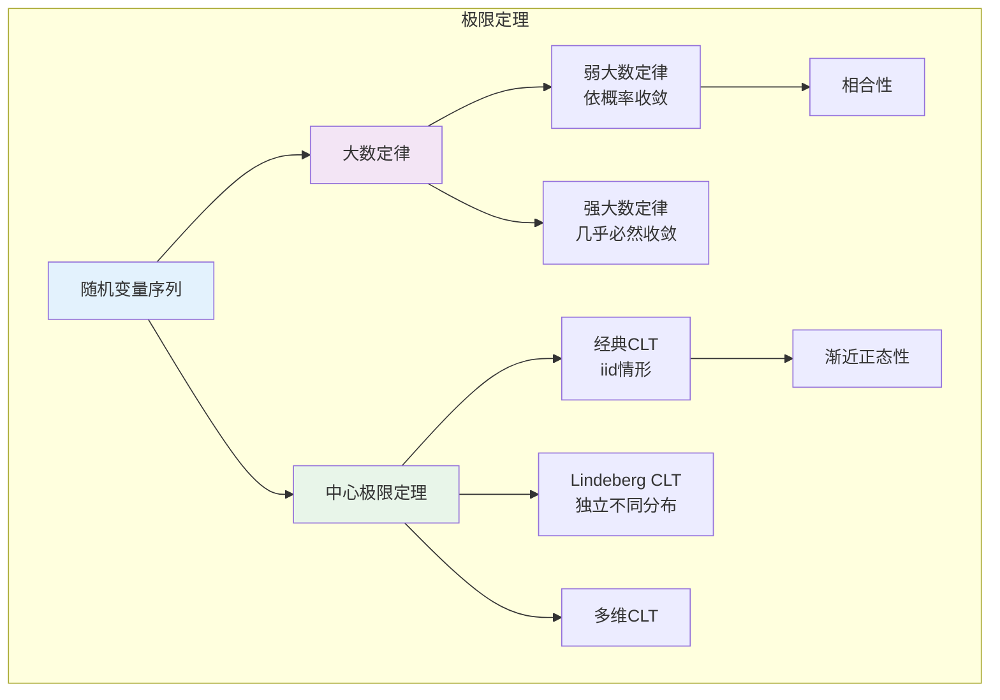

# 9.2.4 大数定律与中心极限定理

---

📌 **内容摘要**

本文档提供大数定律与中心极限定理的严格形式化证明和推导过程。内容涵盖概率论基础领域的主要知识点，包括概率分布, 概率论, 随机变量等关键主题。适合具备相关基础的学习者进行深入研究。

**关键词**: 概率分布, 概率论, 随机变量, 概率论基础

📚 **学习目标**

- 深入理解大数定律与中心极限定理的理论体系和形式化方法
- 能够进行相关定理的形式化证明
- 建立该领域的系统性知识框架

🎯 **难度级别**: 高级

⏱️ **预计阅读时间**: 15分钟

**前置知识**: 该领域的中级知识, 形式化方法基础, 微积分基础

---


## 9.2.4.1 引言

大数定律（Law of Large Numbers, LLN）和中心极限定理（Central Limit Theorem, CLT）是概率论的两大基石。
LLN说明样本均值收敛于总体期望，CLT描述样本均值的渐近分布。
本章给出这些基本定理的严格陈述和证明。



---

## 9.2.4.2 收敛模式

**定义 9.2.4.1**（随机变量序列的收敛）

设 $\{X_n\}$ 和 $X$ 为随机变量：

1. **几乎必然收敛**（Convergence Almost Surely）：
   $$X_n \stackrel{a.s.}{\to} X \iff P\left(\lim_{n \to \infty} X_n = X\right) = 1$$

2. **依概率收敛**（Convergence in Probability）：
   $$X_n \stackrel{P}{\to} X \iff \forall \varepsilon > 0, \lim_{n \to \infty} P(|X_n - X| > \varepsilon) = 0$$

3. **依分布收敛**（Convergence in Distribution）：
   $$X_n \stackrel{d}{\to} X \iff \lim_{n \to \infty} F_{X_n}(x) = F_X(x), \forall \text{连续点 } x$$

4. **$L^p$收敛**（Convergence in $L^p$）：
   $$X_n \stackrel{L^p}{\to} X \iff \lim_{n \to \infty} E[|X_n - X|^p] = 0$$

**定理 9.2.4.1**（收敛模式的蕴含关系）

$$\begin{aligned}
X_n \stackrel{a.s.}{\to} X \Rightarrow X_n &\stackrel{P}{\to} X \\
X_n \stackrel{L^p}{\to} X \Rightarrow X_n &\stackrel{P}{\to} X \\
X_n \stackrel{P}{\to} X \Rightarrow X_n &\stackrel{d}{\to} X
\end{aligned}$$

反向一般不成立。

---

## 9.2.4.3 大数定律

### 9.2.4.3.1 弱大数定律

**定理 9.2.4.2**（弱大数定律，Weak Law of Large Numbers, WLLN）

设 $\{X_n\}$ 为 i.i.d. 随机变量序列，$E[X_1] = \mu$，$\text{Var}(X_1) = \sigma^2 < \infty$。令 $\bar{X}_n = \frac{1}{n}\sum_{i=1}^{n} X_i$，则：

$$\bar{X}_n \stackrel{P}{\to} \mu$$

即：$\forall \varepsilon > 0, \lim_{n \to \infty} P(|\bar{X}_n - \mu| > \varepsilon) = 0$

**证明：**（使用切比雪夫不等式）

$$E[\bar{X}_n] = \mu, \quad \text{Var}(\bar{X}_n) = \frac{\sigma^2}{n}$$

由切比雪夫不等式：

$$P(|\bar{X}_n - \mu| > \varepsilon) \leq \frac{\text{Var}(\bar{X}_n)}{\varepsilon^2} = \frac{\sigma^2}{n\varepsilon^2} \to 0$$

**证毕。**

**定理 9.2.4.3**（WLLN的更强形式 - Khintchine）

仅需 $E[|X_1|] < \infty$（无需有限方差），WLLN 仍成立。

### 9.2.4.3.2 强大数定律

**定理 9.2.4.4**（强大数定律，Strong Law of Large Numbers, SLLN）

设 $\{X_n\}$ 为 i.i.d. 随机变量序列，$E[X_1] = \mu$，则：

$$\bar{X}_n \stackrel{a.s.}{\to} \mu$$

即：$P\left(\lim_{n \to \infty} \bar{X}_n = \mu\right) = 1$

**证明思路：**（Etemadi的证明 - 仅需两两独立同分布）

1. 截断：令 $Y_n = X_n \mathbf{1}_{\{|X_n| \leq n\}}$
2. 证明 $\sum_{n=1}^{\infty} P(X_n \neq Y_n) < \infty$，由Borel-Cantelli，$X_n = Y_n$ 最终a.s.
3. 证明 $\sum_{n=1}^{\infty} \text{Var}(Y_n)/n^2 < \infty$
4. 应用Kolmogorov三级数定理或Kolmogorov强大数定律于 $\{Y_n\}$

**详细证明：**

**引理**：$\sum_{n=1}^{\infty} P(|X| > n) \leq E|X| < \infty$

因此 $\sum_{n=1}^{\infty} P(X_n \neq Y_n) = \sum_{n=1}^{\infty} P(|X| > n) < \infty$

由Borel-Cantelli引理：$P(X_n \neq Y_n \text{ i.o.}) = 0$，即a.s.最终 $X_n = Y_n$。

**引理**：$E[Y_n] \to E[X]$（由控制收敛定理）

**引理**：$\sum_{n=1}^{\infty} \frac{\text{Var}(Y_n)}{n^2} < \infty$

由Kolmogorov收敛准则，$\sum_{n=1}^{\infty} \frac{Y_n - E[Y_n]}{n}$ a.s.收敛。

由Kronecker引理：

$$\frac{1}{n}\sum_{k=1}^{n} (Y_k - E[Y_k]) \to 0 \text{ a.s.}$$

由于 $E[Y_n] \to E[X]$，有 $\frac{1}{n}\sum_{k=1}^{n} E[Y_k] \to E[X]$。

因此 $\frac{1}{n}\sum_{k=1}^{n} Y_k \to E[X]$ a.s.

结合截断论证，$\bar{X}_n \to E[X]$ a.s.

**证毕。**

**定理 9.2.4.5**（Kolmogorov强大数定律）

设 $\{X_n\}$ 独立，$E[X_n] = \mu_n$，$\text{Var}(X_n) = \sigma_n^2$。若 $\sum_{n=1}^{\infty} \sigma_n^2/n^2 < \infty$，则：

$$\frac{1}{n}\sum_{k=1}^{n} (X_k - \mu_k) \to 0 \text{ a.s.}$$

---

## 9.2.4.4 中心极限定理

### 9.2.4.4.1 经典中心极限定理

**定理 9.2.4.6**（Lindeberg-Lévy中心极限定理）

设 $\{X_n\}$ 为 i.i.d. 随机变量序列，$E[X_1] = \mu$，$\text{Var}(X_1) = \sigma^2 < \infty$。则：

$$\frac{\bar{X}_n - \mu}{\sigma/\sqrt{n}} = \frac{\sum_{i=1}^{n} (X_i - \mu)}{\sqrt{n}\sigma} \stackrel{d}{\to} N(0, 1)$$

即对任意 $x \in \mathbb{R}$：

$$\lim_{n \to \infty} P\left(\frac{\bar{X}_n - \mu}{\sigma/\sqrt{n}} \leq x\right) = \Phi(x)$$

**证明：**（使用特征函数）

设 $Y_i = (X_i - \mu)/\sigma$，则 $E[Y_i] = 0$，$\text{Var}(Y_i) = 1$。

需证 $\frac{1}{\sqrt{n}}\sum_{i=1}^{n} Y_i \stackrel{d}{\to} N(0, 1)$。

令 $S_n = \frac{1}{\sqrt{n}}\sum_{i=1}^{n} Y_i$，特征函数：

$$\varphi_{S_n}(t) = E[e^{itS_n}] = \left(E[e^{itY_1/\sqrt{n}}]\right)^n = \left(\varphi_{Y_1}(t/\sqrt{n})\right)^n$$

由泰勒展开（由于 $E[Y_1] = 0$，$E[Y_1^2] = 1$）：

$$\varphi_{Y_1}(u) = 1 + iuE[Y_1] - \frac{u^2}{2}E[Y_1^2] + o(u^2) = 1 - \frac{u^2}{2} + o(u^2)$$

因此：

$$\varphi_{Y_1}(t/\sqrt{n}) = 1 - \frac{t^2}{2n} + o(1/n)$$

$$\varphi_{S_n}(t) = \left(1 - \frac{t^2}{2n} + o(1/n)\right)^n \to e^{-t^2/2}$$

这正是 $N(0, 1)$ 的特征函数。由连续性定理，$S_n \stackrel{d}{\to} N(0, 1)$。

**证毕。**

### 9.2.4.4.2 Lindeberg中心极限定理

**定理 9.2.4.7**（Lindeberg CLT）

设 $\{X_{nk}\}_{k=1}^{n}$ 为独立随机变量行（$n = 1, 2, \ldots$），$E[X_{nk}] = 0$，$\sigma_{nk}^2 = \text{Var}(X_{nk})$，$s_n^2 = \sum_{k=1}^{n} \sigma_{nk}^2$。

**Lindeberg条件**：对所有 $\varepsilon > 0$：

$$\lim_{n \to \infty} \frac{1}{s_n^2} \sum_{k=1}^{n} E[X_{nk}^2 \mathbf{1}_{\{|X_{nk}| > \varepsilon s_n\}}] = 0$$

则：

$$\frac{\sum_{k=1}^{n} X_{nk}}{s_n} \stackrel{d}{\to} N(0, 1)$$

**证明思路：**（Lyapunov方法）

验证特征函数收敛。Lindeberg条件确保没有单个 $X_{nk}$ 对和的贡献过大。

### 9.2.4.4.3 Lyapunov中心极限定理

**定理 9.2.4.8**（Lyapunov CLT）

设 $\{X_n\}$ 独立，$E[X_n] = \mu_n$，$\text{Var}(X_n) = \sigma_n^2 < \infty$。令 $s_n^2 = \sum_{i=1}^{n} \sigma_i^2$。

若存在 $\delta > 0$ 使得：

$$\lim_{n \to \infty} \frac{1}{s_n^{2+\delta}} \sum_{i=1}^{n} E[|X_i - \mu_i|^{2+\delta}] = 0$$

则：

$$\frac{\sum_{i=1}^{n} (X_i - \mu_i)}{s_n} \stackrel{d}{\to} N(0, 1)$$

**注**：Lyapunov条件蕴含Lindeberg条件。

---

## 9.2.4.5 其他极限定理

### 9.2.4.5.1 Delta方法

**定理 9.2.4.9**（Delta方法）

设 $\sqrt{n}(X_n - \mu) \stackrel{d}{\to} N(0, \sigma^2)$，$g$ 在 $\mu$ 处可导，$g'(\mu) \neq 0$，则：

$$\sqrt{n}(g(X_n) - g(\mu)) \stackrel{d}{\to} N(0, [g'(\mu)]^2\sigma^2)$$

**证明：**（一阶泰勒展开）

$$g(X_n) = g(\mu) + g'(\mu)(X_n - \mu) + o_p(|X_n - \mu|)$$

$$\sqrt{n}(g(X_n) - g(\mu)) = g'(\mu) \cdot \sqrt{n}(X_n - \mu) + o_p(1) \stackrel{d}{\to} N(0, [g'(\mu)]^2\sigma^2)$$

**证毕。**

### 9.2.4.5.2 Slutsky定理

**定理 9.2.4.10**（Slutsky定理）

若 $X_n \stackrel{d}{\to} X$，$Y_n \stackrel{P}{\to} c$（常数），则：

1. $X_n + Y_n \stackrel{d}{\to} X + c$
2. $X_n Y_n \stackrel{d}{\to} cX$
3. $X_n / Y_n \stackrel{d}{\to} X / c$（若 $c \neq 0$）

---

## 9.2.4.6 代码实现

### 9.2.4.6.1 Python实现

```python
import numpy as np
from scipy import stats
import matplotlib.pyplot as plt
from typing import Callable, Tuple, List

class LimitTheorems:
    """大数定律与中心极限定理的数值验证"""

    def __init__(self, random_state: int = 42):
        self.rng = np.random.default_rng(random_state)

    # ========== 大数定律验证 ==========

    def verify_wlln(self, distribution: Callable, mu: float,
                   sample_sizes: np.ndarray, n_trials: int = 1000) -> dict:
        """
        验证弱大数定律

        Returns:
            各样本量下样本均值与mu偏差超过epsilon的比例
        """
        epsilon = 0.1
        violation_probs = []

        for n in sample_sizes:
            violations = 0
            for _ in range(n_trials):
                sample = distribution(n)
                sample_mean = np.mean(sample)
                if abs(sample_mean - mu) > epsilon:
                    violations += 1
            violation_probs.append(violations / n_trials)

        return {
            'sample_sizes': sample_sizes,
            'violation_probs': np.array(violation_probs),
            'epsilon': epsilon
        }

    def verify_slln_trajectory(self, distribution: Callable, mu: float,
                              max_n: int = 10000) -> np.ndarray:
        """
        验证强大数定律：展示样本均值序列的收敛轨迹
        """
        samples = distribution(max_n)
        cumulative_means = np.cumsum(samples) / np.arange(1, max_n + 1)
        return cumulative_means

    # ========== 中心极限定理验证 ==========

    def verify_clt(self, distribution: Callable, mu: float, sigma: float,
                  n: int, n_samples: int = 10000) -> dict:
        """
        验证中心极限定理

        Args:
            distribution: 生成n个iid样本的函数
            mu, sigma: 总体均值和标准差
            n: 样本量
            n_samples: 重复采样次数

        Returns:
            标准化样本均值的分布统计
        """
        standardized_means = []

        for _ in range(n_samples):
            sample = distribution(n)
            sample_mean = np.mean(sample)
            standardized = (sample_mean - mu) / (sigma / np.sqrt(n))
            standardized_means.append(standardized)

        standardized_means = np.array(standardized_means)

        # 统计检验
        shapiro_stat, shapiro_p = stats.shapiro(standardized_means[:5000])  # Shapiro限制样本量
        ks_stat, ks_p = stats.kstest(standardized_means, 'norm')

        return {
            'standardized_means': standardized_means,
            'mean': np.mean(standardized_means),
            'std': np.std(standardized_means, ddof=1),
            'skewness': stats.skew(standardized_means),
            'kurtosis': stats.kurtosis(standardized_means),
            'ks_test': {'statistic': ks_stat, 'p_value': ks_p},
            'shapiro_test': {'statistic': shapiro_stat, 'p_value': shapiro_p}
        }

    def demonstrate_clt_convergence(self, distribution: Callable,
                                   mu: float, sigma: float,
                                   sample_sizes: List[int]) -> dict:
        """
        展示CLT随样本量的收敛过程
        """
        results = {}

        for n in sample_sizes:
            result = self.verify_clt(distribution, mu, sigma, n, n_samples=5000)
            results[n] = {
                'mean_bias': abs(result['mean']),
                'std_deviation': abs(result['std'] - 1),
                'ks_pvalue': result['ks_test']['p_value']
            }

        return results


# 分布生成器
class DistributionGenerators:
    """各种分布的生成器"""

    def __init__(self, random_state: int = 42):
        self.rng = np.random.default_rng(random_state)

    def bernoulli(self, p: float = 0.5):
        """伯努利分布生成器"""
        return lambda n: self.rng.random(n) < p

    def uniform(self, a: float = 0, b: float = 1):
        """均匀分布生成器"""
        return lambda n: self.rng.uniform(a, b, n)

    def exponential(self, lam: float = 1):
        """指数分布生成器"""
        return lambda n: self.rng.exponential(1/lam, n)

    def gamma(self, shape: float = 2, scale: float = 1):
        """伽马分布生成器"""
        return lambda n: self.rng.gamma(shape, scale, n)

    def poisson(self, lam: float = 3):
        """泊松分布生成器"""
        return lambda n: self.rng.poisson(lam, n)

    def beta(self, a: float = 2, b: float = 5):
        """贝塔分布生成器"""
        return lambda n: self.rng.beta(a, b, n)


# 使用示例
if __name__ == "__main__":
    print("=" * 70)
    print("大数定律与中心极限定理数值验证")
    print("=" * 70)

    lt = LimitTheorems(random_state=42)
    dg = DistributionGenerators(random_state=42)

    # ===== 大数定律验证 =====
    print("\n1. 弱大数定律验证 - 均匀分布 U(0, 1)")
    print("-" * 50)

    uniform_gen = dg.uniform(0, 1)
    sample_sizes = np.array([10, 50, 100, 500, 1000, 5000])
    wlln_result = lt.verify_wlln(uniform_gen, mu=0.5, sample_sizes=sample_sizes)

    print(f"ε = {wlln_result['epsilon']}")
    print("样本量 n | P(|X̄ - μ| > ε)")
    print("-" * 30)
    for n, prob in zip(wlln_result['sample_sizes'], wlln_result['violation_probs']):
        print(f"{n:8d} | {prob:.4f}")

    # ===== 中心极限定理验证 =====
    print("\n2. 中心极限定理验证")
    print("-" * 50)

    distributions = [
        ("均匀 U(0,1)", dg.uniform(0, 1), 0.5, np.sqrt(1/12)),
        ("指数 Exp(1)", dg.exponential(1), 1, 1),
        ("泊松 Poisson(4)", dg.poisson(4), 4, 2),
        ("贝塔 Beta(2,5)", dg.beta(2, 5), 2/7, np.sqrt(10/441)),
    ]

    n = 30  # CLT样本量

    for name, dist_gen, mu, sigma in distributions:
        print(f"\n{name}:")
        clt_result = lt.verify_clt(dist_gen, mu, sigma, n, n_samples=10000)

        print(f"  标准化样本均值统计:")
        print(f"    均值: {clt_result['mean']:.4f} (理论: 0)")
        print(f"    标准差: {clt_result['std']:.4f} (理论: 1)")
        print(f"    偏度: {clt_result['skewness']:.4f} (理论: 0)")
        print(f"    超值峰度: {clt_result['kurtosis']:.4f} (理论: 0)")
        print(f"    KS检验p值: {clt_result['ks_test']['p_value']:.4f}")

    # ===== CLT收敛速度 =====
    print("\n3. CLT收敛速度 - 指数分布")
    print("-" * 50)

    exp_gen = dg.exponential(1)
    sample_sizes = [5, 10, 30, 50, 100]
    convergence = lt.demonstrate_clt_convergence(exp_gen, 1, 1, sample_sizes)

    print("样本量 n | |E[Z]| | |SD[Z]-1| | KS p值")
    print("-" * 50)
    for n in sample_sizes:
        r = convergence[n]
        print(f"{n:8d} | {r['mean_bias']:.4f}   | {r['std_deviation']:.4f}    | {r['ks_pvalue']:.4f}")

    # ===== Delta方法演示 =====
    print("\n4. Delta方法演示")
    print("-" * 50)

    # g(x) = log(x), 应用于指数分布的样本均值
    n = 100
    transformed_means = []

    for _ in range(5000):
        sample = dg.exponential(1)(n)
        x_bar = np.mean(sample)
        transformed_means.append(np.log(x_bar))

    transformed_means = np.array(transformed_means)
    g_mu = np.log(1)  # g(mu) = log(1) = 0
    g_prime_mu = 1    # g'(mu) = 1/mu = 1
    theoretical_var = (g_prime_mu ** 2) * (1 / n)  # [g'(μ)]²σ²/n

    print(f"g(x) = log(x), 应用于 Exp(1) 样本均值")
    print(f"  g(μ) = {g_mu:.4f}")
    print(f"  g'(μ) = {g_prime_mu:.4f}")
    print(f"  理论渐近方差: {theoretical_var:.6f}")
    print(f"  模拟方差: {np.var(transformed_means, ddof=1):.6f}")
    print(f"  模拟均值: {np.mean(transformed_means):.4f}")
---

## 📚 延伸阅读

- [9.2.2 随机变量](02.2_随机变量.md)
- [5.2 概率论公理](../../01_数学基础/05_概率论与测度论/05.2_概率论公理.md)
- [5.2 概率论基础](../../01_数学基础/05_概率论与测度论/05.2_概率论基础.md)
