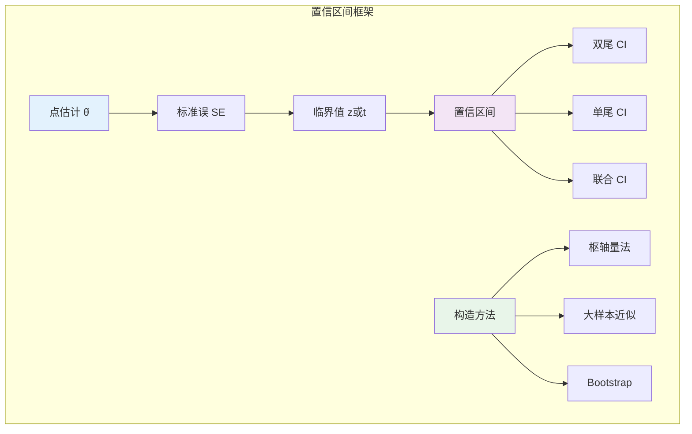

# 9.3.2 区间估计

---

📌 **内容摘要**

本文档深入探讨区间估计的核心原理和关键方法。内容涵盖推断统计领域的主要知识点，包括相关理论、方法及应用。适合有一定基础的学习者系统学习。

**关键词**: 推断统计

📚 **学习目标**

- 掌握区间估计的核心概念和主要方法
- 理解相关理论的应用场景
- 建立该领域的系统性知识框架

🎯 **难度级别**: 中级

⏱️ **预计阅读时间**: 15分钟

**前置知识**: 相关领域的基础概念, 微积分基础

---


## 9.3.2.1 引言

**区间估计**（Interval Estimation）提供比点估计更丰富的信息：不仅给出参数估计值，还提供不确定性的量化。
**置信区间**（Confidence Interval, CI）是区间估计的核心概念，它给出了以特定概率包含真实参数的随机区间。



---

## 9.3.2.2 置信区间的基本概念

### 9.3.2.2.1 定义与解释

**定义 9.3.2.1**（置信区间）

设 $\mathbf{X} = (X_1, \ldots, X_n)$ 为来自 $P_\theta$ 的样本，统计量 $L(\mathbf{X})$ 和 $U(\mathbf{X})$ 满足 $L \leq U$。若：

$$P_\theta(L(\mathbf{X}) \leq \theta \leq U(\mathbf{X})) = 1 - \alpha, \quad \forall \theta \in \Theta$$

则 $[L(\mathbf{X}), U(\mathbf{X})]$ 称为参数 $\theta$ 的 **$100(1-\alpha)\%$ 置信区间**，$1-\alpha$ 称为**置信水平**（Confidence Level）。

**正确解释**：若重复抽样多次，大约 $100(1-\alpha)\%$ 的区间会包含真实参数。

**常见错误**："参数 $\theta$ 落在区间内的概率是 $1-\alpha$" — 这是错误的，参数是固定的，区间是随机的。

### 9.3.2.2.2 枢轴量方法

**定义 9.3.2.2**（枢轴量，Pivotal Quantity）

统计量 $Q(\mathbf{X}, \theta)$ 称为**枢轴量**，如果：

1. $Q$ 依赖于样本和参数 $\theta$
2. $Q$ 的分布不依赖于 $\theta$

**定理 9.3.2.1**（枢轴量法构造CI）

设 $Q(\mathbf{X}, \theta)$ 为枢轴量，其CDF为 $F_Q$。给定 $\alpha$，选择 $a, b$ 使得 $F_Q(b) - F_Q(a) = 1 - \alpha$。

若 $Q$ 关于 $\theta$ 单调，解 $a \leq Q(\mathbf{X}, \theta) \leq b$ 可得CI $[L(\mathbf{X}), U(\mathbf{X})]$。

---

## 9.3.2.3 常见参数的置信区间

### 9.3.2.3.1 正态总体均值

**定理 9.3.2.2**（正态均值CI：方差已知）

设 $X_1, \ldots, X_n \stackrel{iid}{\sim} N(\mu, \sigma^2)$，$\sigma^2$ 已知。则 $\mu$ 的 $100(1-\alpha)\%$ CI：

$$\bar{X} \pm z_{\alpha/2} \cdot \frac{\sigma}{\sqrt{n}}$$

其中 $z_{\alpha/2}$ 是标准正态的上 $\alpha/2$ 分位数，$\Phi(z_{\alpha/2}) = 1 - \alpha/2$。

**证明：**

枢轴量：$Z = \frac{\bar{X} - \mu}{\sigma/\sqrt{n}} \sim N(0, 1)$

$$P(-z_{\alpha/2} \leq Z \leq z_{\alpha/2}) = 1 - \alpha$$

解不等式：
$$-z_{\alpha/2} \leq \frac{\bar{X} - \mu}{\sigma/\sqrt{n}} \leq z_{\alpha/2}$$

$$\bar{X} - z_{\alpha/2}\frac{\sigma}{\sqrt{n}} \leq \mu \leq \bar{X} + z_{\alpha/2}\frac{\sigma}{\sqrt{n}}$$

**证毕。**

**定理 9.3.2.3**（正态均值CI：方差未知）

设 $X_1, \ldots, X_n \stackrel{iid}{\sim} N(\mu, \sigma^2)$，$\sigma^2$ 未知。则 $\mu$ 的 $100(1-\alpha)\%$ CI：

$$\bar{X} \pm t_{\alpha/2, n-1} \cdot \frac{s}{\sqrt{n}}$$

其中 $s^2 = \frac{1}{n-1}\sum(X_i - \bar{X})^2$，$t_{\alpha/2, n-1}$ 是自由度为 $n-1$ 的 $t$ 分布的上 $\alpha/2$ 分位数。

**证明：**

枢轴量：$T = \frac{\bar{X} - \mu}{s/\sqrt{n}} \sim t(n-1)$

（由Cochran定理，$\bar{X}$ 与 $s^2$ 独立，且 $(n-1)s^2/\sigma^2 \sim \chi^2(n-1)$）

$$T = \frac{(\bar{X} - \mu)/(\sigma/\sqrt{n})}{\sqrt{(n-1)s^2/\sigma^2 / (n-1)}} = \frac{Z}{\sqrt{V/(n-1)}} \sim t(n-1)$$

其中 $Z \sim N(0, 1)$，$V \sim \chi^2(n-1)$，且独立。

**证毕。**

### 9.3.2.3.2 正态总体方差

**定理 9.3.2.4**（正态方差CI）

设 $X_1, \ldots, X_n \stackrel{iid}{\sim} N(\mu, \sigma^2)$。则 $\sigma^2$ 的 $100(1-\alpha)\%$ CI：

$$\left(\frac{(n-1)s^2}{\chi^2_{\alpha/2, n-1}}, \frac{(n-1)s^2}{\chi^2_{1-\alpha/2, n-1}}\right)$$

**证明：**

枢轴量：$\frac{(n-1)s^2}{\sigma^2} \sim \chi^2(n-1)$

$$P\left(\chi^2_{1-\alpha/2, n-1} \leq \frac{(n-1)s^2}{\sigma^2} \leq \chi^2_{\alpha/2, n-1}\right) = 1 - \alpha$$

解关于 $\sigma^2$ 的不等式即得。

**证毕。**

### 9.3.2.3.3 两样本问题

**定理 9.3.2.5**（两独立正态总体均值差CI）

设 $X_1, \ldots, X_{n_1} \stackrel{iid}{\sim} N(\mu_1, \sigma^2)$，$Y_1, \ldots, Y_{n_2} \stackrel{iid}{\sim} N(\mu_2, \sigma^2)$，独立，方差相等但未知。

**合并方差估计**：
$$s_p^2 = \frac{(n_1-1)s_1^2 + (n_2-1)s_2^2}{n_1 + n_2 - 2}$$

则 $\mu_1 - \mu_2$ 的 $100(1-\alpha)\%$ CI：

$$(\bar{X} - \bar{Y}) \pm t_{\alpha/2, n_1+n_2-2} \cdot s_p \sqrt{\frac{1}{n_1} + \frac{1}{n_2}}$$

---

## 9.3.2.4 大样本置信区间

### 9.3.2.4.1 基于MLE的近似CI

**定理 9.3.2.6**（MLE的渐近CI）

在正则条件下，$\hat{\theta}_{MLE} \stackrel{a}{\sim} N(\theta, I_n(\hat{\theta})^{-1})$，其中 $I_n(\theta) = nI(\theta)$。

则 $\theta$ 的近似 $100(1-\alpha)\%$ CI：

$$\hat{\theta} \pm z_{\alpha/2} \cdot \frac{1}{\sqrt{nI(\hat{\theta})}}$$

或观测信息版本：

$$\hat{\theta} \pm z_{\alpha/2} \cdot \frac{1}{\sqrt{-\ell''(\hat{\theta})}}$$

### 9.3.2.4.2 比例的置信区间

**定理 9.3.2.7**（比例的Wald CI）

设 $\hat{p} = X/n$，其中 $X \sim \text{Binomial}(n, p)$。大样本下：

$$\hat{p} \pm z_{\alpha/2} \sqrt{\frac{\hat{p}(1-\hat{p})}{n}}$$

**Agresti-Coull区间**（改进的小样本表现）：

令 $\tilde{n} = n + z_{\alpha/2}^2$，$\tilde{p} = (X + z_{\alpha/2}^2/2)/\tilde{n}$，则：

$$\tilde{p} \pm z_{\alpha/2} \sqrt{\frac{\tilde{p}(1-\tilde{p})}{\tilde{n}}}$$

---

## 9.3.2.5 Bootstrap置信区间

### 9.3.2.5.1 Bootstrap原理

**定义 9.3.2.3**（Bootstrap分布）

设 $\mathbf{X} = (X_1, \ldots, X_n)$ 为样本，经验分布 $\hat{F}_n$ 在每个 $X_i$ 处赋予质量 $1/n$。

**Bootstrap样本**：从 $\hat{F}_n$ 有放回抽取 $n$ 次得到 $\mathbf{X}^* = (X_1^*, \ldots, X_n^*)$。

**Bootstrap估计量的分布**：通过重复生成Bootstrap样本估计 $\hat{\theta}^* = T(\mathbf{X}^*)$ 的分布。

### 9.3.2.5.2 Bootstrap CI方法

**Bootstrap百分位区间**：

生成 $B$ 个Bootstrap估计量 $\hat{\theta}^*_1, \ldots, \hat{\theta}^*_B$，取 $\alpha/2$ 和 $1-\alpha/2$ 分位数：

$$[\hat{\theta}^*_{(\alpha/2)}, \hat{\theta}^*_{(1-\alpha/2)}]$$

**Bootstrap-t区间**：

使用标准化枢轴量 $t^* = \frac{\hat{\theta}^* - \hat{\theta}}{\widehat{SE}^*}$，其中 $\widehat{SE}^*$ 为Bootstrap标准误。

---

## 9.3.2.6 代码实现

```python
import numpy as np
from scipy import stats
from typing import Tuple, Optional, Callable
import warnings

class IntervalEstimation:
    """区间估计：置信区间构造"""

    def __init__(self, data: np.ndarray):
        self.data = np.asarray(data)
        self.n = len(data)

    # ========== 正态总体 ==========

    def normal_mean_ci(self, sigma: Optional[float] = None,
                       alpha: float = 0.05) -> Tuple[float, float, float]:
        """
        正态总体均值的置信区间

        Args:
            sigma: 已知总体标准差（None表示未知）
            alpha: 显著性水平

        Returns:
            (下限, 上限, 点估计)
        """
        x_bar = np.mean(self.data)

        if sigma is not None:
            # 方差已知：使用z分布
            z_crit = stats.norm.ppf(1 - alpha/2)
            margin = z_crit * sigma / np.sqrt(self.n)
            method = "z-interval (σ known)"
        else:
            # 方差未知：使用t分布
            s = np.std(self.data, ddof=1)
            t_crit = stats.t.ppf(1 - alpha/2, self.n - 1)
            margin = t_crit * s / np.sqrt(self.n)
            method = "t-interval (σ unknown)"

        ci_lower = x_bar - margin
        ci_upper = x_bar + margin

        return ci_lower, ci_upper, x_bar

    def normal_variance_ci(self, alpha: float = 0.05) -> Tuple[float, float, float]:
        """
        正态总体方差的置信区间

        Returns:
            (下限, 上限, 点估计)
        """
        s2 = np.var(self.data, ddof=1)
        df = self.n - 1

        chi2_lower = stats.chi2.ppf(alpha/2, df)
        chi2_upper = stats.chi2.ppf(1 - alpha/2, df)

        ci_lower = df * s2 / chi2_upper
        ci_upper = df * s2 / chi2_lower

        return ci_lower, ci_upper, s2

    # ========== 比例 ==========

    def proportion_ci(self, alpha: float = 0.05,
                     method: str = 'wald') -> Tuple[float, float, float]:
        """
        比例的置信区间

        Args:
            alpha: 显著性水平
            method: 'wald', 'agresti-coull', 'wilson'
        """
        x = np.sum(self.data)
        n = len(self.data)
        p_hat = x / n
        z_crit = stats.norm.ppf(1 - alpha/2)

        if method == 'wald':
            if n * p_hat < 5 or n * (1 - p_hat) < 5:
                warnings.warn("小样本警告：Wald区间可能不准确")

            se = np.sqrt(p_hat * (1 - p_hat) / n)
            margin = z_crit * se
            ci_lower = max(0, p_hat - margin)
            ci_upper = min(1, p_hat + margin)

        elif method == 'agresti-coull':
            # Agresti-Coull区间
            n_tilde = n + z_crit**2
            p_tilde = (x + z_crit**2/2) / n_tilde
            se_tilde = np.sqrt(p_tilde * (1 - p_tilde) / n_tilde)
            margin = z_crit * se_tilde
            ci_lower = max(0, p_tilde - margin)
            ci_upper = min(1, p_tilde + margin)

        elif method == 'wilson':
            # Wilson区间
            denominator = 1 + z_crit**2 / n
            centre = (p_hat + z_crit**2 / (2*n)) / denominator
            margin = z_crit * np.sqrt(p_hat*(1-p_hat)/n + z_crit**2/(4*n**2)) / denominator
            ci_lower = max(0, centre - margin)
            ci_upper = min(1, centre + margin)

        else:
            raise ValueError(f"Unknown method: {method}")

        return ci_lower, ci_upper, p_hat

    # ========== Bootstrap方法 ==========

    def bootstrap_ci(self, statistic_func: Callable,
                     alpha: float = 0.05,
                     n_bootstrap: int = 10000,
                     method: str = 'percentile') -> Tuple[float, float, float]:
        """
        Bootstrap置信区间

        Args:
            statistic_func: 统计量函数，接收数组返回标量
            alpha: 显著性水平
            n_bootstrap: Bootstrap重采样次数
            method: 'percentile', 'basic', 'bc' (bias-corrected)
        """
        # 原始统计量
        theta_hat = statistic_func(self.data)

        # Bootstrap重采样
        bootstrap_stats = []
        for _ in range(n_bootstrap):
            bootstrap_sample = np.random.choice(self.data, size=self.n, replace=True)
            bootstrap_stats.append(statistic_func(bootstrap_sample))

        bootstrap_stats = np.array(bootstrap_stats)

        if method == 'percentile':
            # 百分位方法
            ci_lower = np.percentile(bootstrap_stats, 100 * alpha/2)
            ci_upper = np.percentile(bootstrap_stats, 100 * (1 - alpha/2))

        elif method == 'basic':
            # 基本Bootstrap (reverse percentile)
            ci_lower = 2 * theta_hat - np.percentile(bootstrap_stats, 100 * (1 - alpha/2))
            ci_upper = 2 * theta_hat - np.percentile(bootstrap_stats, 100 * alpha/2)

        elif method == 'bc':
            # Bias-corrected
            z0 = stats.norm.ppf(np.mean(bootstrap_stats < theta_hat))
            z_alpha = stats.norm.ppf(alpha/2)
            z_1_alpha = stats.norm.ppf(1 - alpha/2)

            p_lower = stats.norm.cdf(2*z0 + z_alpha)
            p_upper = stats.norm.cdf(2*z0 + z_1_alpha)

            ci_lower = np.percentile(bootstrap_stats, 100 * p_lower)
            ci_upper = np.percentile(bootstrap_stats, 100 * p_upper)

        else:
            raise ValueError(f"Unknown method: {method}")

        return ci_lower, ci_upper, theta_hat


class TwoSampleIntervalEstimation:
    """两样本区间估计"""

    def __init__(self, data1: np.ndarray, data2: np.ndarray):
        self.data1 = np.asarray(data1)
        self.data2 = np.asarray(data2)
        self.n1 = len(data1)
        self.n2 = len(data2)

    def mean_diff_ci_equal_var(self, alpha: float = 0.05) -> Tuple[float, float, float]:
        """
        两独立样本均值差CI（方差相等假设）
        """
        x1_bar = np.mean(self.data1)
        x2_bar = np.mean(self.data2)

        s1_sq = np.var(self.data1, ddof=1)
        s2_sq = np.var(self.data2, ddof=1)

        # 合并方差
        s_p_sq = ((self.n1 - 1) * s1_sq + (self.n2 - 1) * s2_sq) / (self.n1 + self.n2 - 2)
        s_p = np.sqrt(s_p_sq)

        # 标准误
        se = s_p * np.sqrt(1/self.n1 + 1/self.n2)

        # t临界值
        df = self.n1 + self.n2 - 2
        t_crit = stats.t.ppf(1 - alpha/2, df)

        diff = x1_bar - x2_bar
        margin = t_crit * se

        return diff - margin, diff + margin, diff

    def mean_diff_ci_welch(self, alpha: float = 0.05) -> Tuple[float, float, float]:
        """
        Welch's t-interval（不假设方差相等）
        """
        x1_bar = np.mean(self.data1)
        x2_bar = np.mean(self.data2)

        s1_sq = np.var(self.data1, ddof=1)
        s2_sq = np.var(self.data2, ddof=1)

        # Welch-Satterthwaite自由度
        se1_sq = s1_sq / self.n1
        se2_sq = s2_sq / self.n2

        se = np.sqrt(se1_sq + se2_sq)

        df = (se1_sq + se2_sq)**2 / (se1_sq**2/(self.n1-1) + se2_sq**2/(self.n2-1))

        t_crit = stats.t.ppf(1 - alpha/2, df)

        diff = x1_bar - x2_bar
        margin = t_crit * se

        return diff - margin, diff + margin, diff


# 使用示例
if __name__ == "__main__":
    print("=" * 60)
    print("区间估计示例")
    print("=" * 60)

    np.random.seed(42)

    # 1. 正态总体均值CI
    print("\n1. 正态总体均值置信区间")
    print("-" * 40)
    normal_data = np.random.normal(100, 15, 50)
    ie = IntervalEstimation(normal_data)

    # 方差未知（更常见）
    ci_lower, ci_upper, estimate = ie.normal_mean_ci(sigma=None, alpha=0.05)
    print(f"   样本均值: {estimate:.2f}")
    print(f"   95% CI: [{ci_lower:.2f}, {ci_upper:.2f}]")
    print(f"   区间宽度: {ci_upper - ci_lower:.2f}")

    # 2. 正态总体方差CI
    print("\n2. 正态总体方差置信区间")
    print("-" * 40)
    ci_lower, ci_upper, estimate = ie.normal_variance_ci(alpha=0.05)
    print(f"   样本方差: {estimate:.2f}")
    print(f"   95% CI: [{ci_lower:.2f}, {ci_upper:.2f}]")

    # 3. 比例CI
    print("\n3. 比例置信区间")
    print("-" * 40)
    # 模拟100次试验，成功30次
    binomial_data = np.array([1]*30 + [0]*70)
    np.random.shuffle(binomial_data)
    ie_prop = IntervalEstimation(binomial_data)

    for method in ['wald', 'agresti-coull', 'wilson']:
        ci_lower, ci_upper, p_hat = ie_prop.proportion_ci(alpha=0.05, method=method)
        print(f"   {method:15s}: [{ci_lower:.3f}, {ci_upper:.3f}] (p̂={p_hat:.3f})")

    # 4. Bootstrap CI
    print("\n4. Bootstrap置信区间（中位数）")
    print("-" * 40)
    skewed_data = np.random.exponential(2, 100)
    ie_skew = IntervalEstimation(skewed_data)

    ci_lower, ci_upper, median_est = ie_skew.bootstrap_ci(
        statistic_func=np.median,
        alpha=0.05,
        n_bootstrap=5000,
        method='percentile'
    )
    print(f"   样本中位数: {median_est:.3f}")
    print(f"   Bootstrap 95% CI: [{ci_lower:.3f}, {ci_upper:.3f}]")

    # 5. 两样本均值差
    print("\n5. 两样本均值差置信区间")
    print("-" * 40)
    data1 = np.random.normal(100, 15, 30)
    data2 = np.random.normal(95, 15, 30)

    ts_ie = TwoSampleIntervalEstimation(data1, data2)

    ci_lower, ci_upper, diff = ts_ie.mean_diff_ci_equal_var()
    print(f"   等方差假设: [{ci_lower:.2f}, {ci_upper:.2f}] (差={diff:.2f})")

    ci_lower, ci_upper, diff = ts_ie.mean_diff_ci_welch()
    print(f"   Welch方法:  [{ci_lower:.2f}, {ci_upper:.2f}] (差={diff:.2f})")
```

---

## 9.3.2.7 交叉引用

| 引用目标 | 章节 | 关系 |
|---------|------|------|
| 点估计 | 9.3.1 | CI基于点估计构造 |
| 假设检验 | 9.3.3 | 对偶关系：CI与检验 |
| t分布 | 9.2.3 | 小样本CI |
| Bootstrap | 9.6.2 | 非参数CI方法 |

---

## 9.3.2.8 参考文献

1. Casella, G., & Berger, R. L. (2002). _Statistical Inference_ (2nd ed.). Duxbury. (Ch. 9)
2. Efron, B., & Hastie, T. (2016). _Computer Age Statistical Inference_. Cambridge.
3. Carpenter, J., & Bithell, J. (2000). Bootstrap confidence intervals. _Statistics in Medicine_, 19(9), 1141-1164.

---

## 9.3.2.9 练习

**练习 9.3.2.1** 证明对于正态总体，$\bar{X} \pm t_{\alpha/2, n-1} \cdot s/\sqrt{n}$ 是精确的 $1-\alpha$ 置信区间。

**练习 9.3.2.2** 推导两个独立正态总体方差比 $\sigma_1^2/\sigma_2^2$ 的置信区间。

**练习 9.3.2.3** 解释为什么Bootstrap百分位区间在小样本时可能有偏差。
---

## 📚 延伸阅读

- [9.3.3 假设检验](./09_统计学/03_推断统计/03.3_假设检验.md)
- [9.3.1 点估计](./09_统计学/03_推断统计/03.1_点估计.md)
- [03_推断统计 - Statistical Inference](./09_统计学/03_推断统计.md)
- [9.6.2 重采样方法](./09_统计学/06_统计计算/06.2_重采样方法.md)
