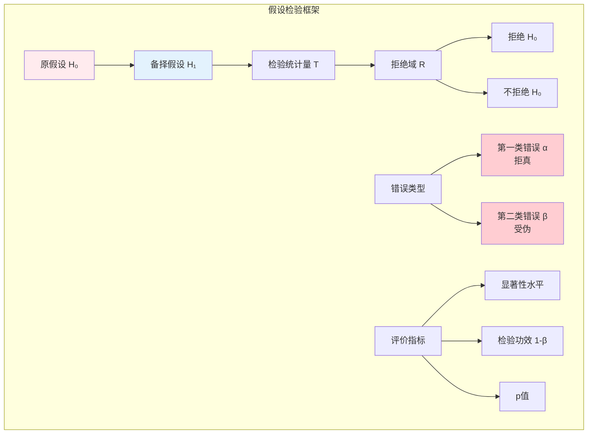

# 9.3.3 假设检验

---

📌 **内容摘要**

本文档深入探讨假设检验的核心原理和关键方法。内容涵盖推断统计领域的主要知识点，包括相关理论、方法及应用。适合有一定基础的学习者系统学习。

**关键词**: 推断统计

📚 **学习目标**

- 掌握假设检验的核心概念和主要方法
- 理解相关理论的应用场景
- 建立该领域的系统性知识框架

🎯 **难度级别**: 中级

⏱️ **预计阅读时间**: 15分钟

**前置知识**: 相关领域的基础概念, 微积分基础

---


## 9.3.3.1 引言

**假设检验**（Hypothesis Testing）是统计推断的核心工具，用于根据样本数据判断关于总体参数的陈述是否成立。
Neyman-Pearson框架提供了假设检验的形式化基础，包括第一类错误、第二类错误、检验功效等核心概念。



---

## 9.3.3.2 Neyman-Pearson框架

### 9.3.3.2.1 假设的定义

**定义 9.3.3.1**（统计假设）

设 $\Theta$ 为参数空间，**原假设**（Null Hypothesis）和**备择假设**（Alternative Hypothesis）定义为：

$$H_0: \theta \in \Theta_0 \quad \text{vs} \quad H_1: \theta \in \Theta_1$$

其中 $\Theta_0 \cap \Theta_1 = \emptyset$，$\Theta_0 \cup \Theta_1 \subseteq \Theta$。

**简单假设**：$\Theta_i$ 为单点集
**复合假设**：$\Theta_i$ 包含多于一个元素

### 9.3.3.2.2 检验函数与拒绝域

**定义 9.3.3.2**（检验函数）

**检验函数** $\phi: \mathcal{X}^n \to \{0, 1\}$：

- $\phi(\mathbf{x}) = 1$：拒绝 $H_0$
- $\phi(\mathbf{x}) = 0$：不拒绝 $H_0$

**拒绝域** $R = \{\mathbf{x} : \phi(\mathbf{x}) = 1\}$

### 9.3.3.2.3 两类错误

| 决策 \ 真实 | $H_0$ 为真 | $H_1$ 为真 |
|------------|-----------|-----------|
| 拒绝 $H_0$ | **第一类错误** (Type I) | 正确 |
| 不拒绝 $H_0$ | 正确 | **第二类错误** (Type II) |

**定义 9.3.3.3**（错误概率）

**第一类错误概率**（显著性水平）：
$$\alpha(\theta) = P_\theta(\text{拒绝 } H_0 | H_0 \text{ 为真}) = P_\theta(\mathbf{X} \in R), \quad \theta \in \Theta_0$$

**第二类错误概率**：
$$\beta(\theta) = P_\theta(\text{不拒绝 } H_0 | H_1 \text{ 为真}) = P_\theta(\mathbf{X} \notin R), \quad \theta \in \Theta_1$$

**功效函数**（Power Function）：
$$\pi(\theta) = P_\theta(\mathbf{X} \in R)$$

- $\theta \in \Theta_0$：$\pi(\theta) = \alpha(\theta)$
- $\theta \in \Theta_1$：$\pi(\theta) = 1 - \beta(\theta)$

---

## 9.3.3.3 最优检验

### 9.3.3.3.1 最优势检验

**定义 9.3.3.4**（水平 $\alpha$ 检验）

检验 $\phi$ 称为**水平 $\alpha$ 检验**，如果：
$$\sup_{\theta \in \Theta_0} \pi(\theta) \leq \alpha$$

若等号成立，称为**精确水平 $\alpha$ 检验**。

**定义 9.3.3.5**（UMP检验）

检验 $\phi^*$ 称为**一致最优势**（Uniformly Most Powerful, UMP）水平 $\alpha$ 检验，如果对任意水平 $\alpha$ 检验 $\phi$：
$$\pi_{\phi^*}(\theta) \geq \pi_{\phi}(\theta), \quad \forall \theta \in \Theta_1$$

### 9.3.3.3.2 Neyman-Pearson引理

**定理 9.3.3.1**（Neyman-Pearson引理）

考虑简单假设检验：$H_0: \theta = \theta_0$ vs $H_1: \theta = \theta_1$。

似然比检验（Likelihood Ratio Test, LRT）：
$$\Lambda(\mathbf{x}) = \frac{L(\theta_0 | \mathbf{x})}{L(\theta_1 | \mathbf{x})}$$

拒绝域 $R = \{\mathbf{x} : \Lambda(\mathbf{x}) \leq c\}$ 是水平 $\alpha$ 的UMP检验，其中 $c$ 满足 $P_{\theta_0}(\Lambda \leq c) = \alpha$。

**证明思路：**

设 $\phi$ 为任意水平 $\alpha$ 检验，需证 $\pi_{\phi^*}(\theta_1) \geq \pi_{\phi}(\theta_1)$。

考虑差值：
$$\int (\phi^* - \phi)(L(\theta_1) - cL(\theta_0)) d\mu$$

在 $R$ 上 $\phi^* - \phi \geq 0$ 且 $L(\theta_1) - cL(\theta_0) \geq 0$（由拒绝域定义）。
在 $R^c$ 上 $\phi^* - \phi \leq 0$ 且 $L(\theta_1) - cL(\theta_0) < 0$。

因此积分非负，且：
$$\int (\phi^* - \phi)L(\theta_1) d\mu \geq c \int (\phi^* - \phi)L(\theta_0) d\mu = c(\alpha - \alpha) = 0$$

即 $\pi_{\phi^*}(\theta_1) \geq \pi_{\phi}(\theta_1)$。

**证毕。**

---

## 9.3.3.4 常用检验方法

### 9.3.3.4.1 正态总体均值检验

**定理 9.3.3.2**（单样本Z检验）

设 $X_1, \ldots, X_n \stackrel{iid}{\sim} N(\mu, \sigma^2)$，$\sigma^2$ 已知。

$H_0: \mu = \mu_0$ vs $H_1: \mu \neq \mu_0$（双侧）

检验统计量：$Z = \frac{\bar{X} - \mu_0}{\sigma/\sqrt{n}} \sim N(0, 1)$ under $H_0$

拒绝域：$|Z| > z_{\alpha/2}$

**定理 9.3.3.3**（单样本t检验）

$\sigma^2$ 未知时，检验统计量：
$$T = \frac{\bar{X} - \mu_0}{s/\sqrt{n}} \sim t(n-1) \text{ under } H_0$$

拒绝域：$|T| > t_{\alpha/2, n-1}$

### 9.3.3.4.2 似然比检验

**定义 9.3.3.6**（广义似然比）

对于复合假设，**广义似然比统计量**：
$$\lambda(\mathbf{x}) = \frac{\sup_{\theta \in \Theta_0} L(\theta | \mathbf{x})}{\sup_{\theta \in \Theta} L(\theta | \mathbf{x})} = \frac{L(\hat{\theta}_0)}{L(\hat{\theta})}$$

其中 $\hat{\theta}_0$ 为 $H_0$ 下的MLE，$\hat{\theta}$ 为无约束MLE。

拒绝域：$\lambda(\mathbf{x}) \leq c$

**定理 9.3.3.4**（Wilks定理）

在正则条件下，$-2\ln\lambda(\mathbf{X}) \stackrel{d}{\to} \chi^2_k$ under $H_0$，其中 $k = \dim(\Theta) - \dim(\Theta_0)$。

---

## 9.3.3.5 p值

**定义 9.3.3.7**（p值，p-value）

**p值**是拒绝 $H_0$ 的最小显著性水平：
$$p(\mathbf{x}) = \inf\{\alpha : \mathbf{x} \in R_\alpha\}$$

等价地，$p$ 值是观测到与样本一样或更极端结果的概率（在 $H_0$ 下）。

**解释**：

- $p < 0.05$：拒绝 $H_0$，结果"显著"
- $p \geq 0.05$：不拒绝 $H_0$

**注意**：p值不是 $H_0$ 为真的概率！

---

## 9.3.3.6 代码实现

```python
import numpy as np
from scipy import stats
from typing import Tuple, Optional, Dict, Literal
import warnings

class HypothesisTesting:
    """假设检验实现"""

    def __init__(self, data: np.ndarray):
        self.data = np.asarray(data)
        self.n = len(data)

    # ========== 正态总体均值检验 ==========

    def one_sample_z_test(self, mu0: float, sigma: float,
                         alternative: Literal['two-sided', 'less', 'greater'] = 'two-sided') -> Dict:
        """
        单样本Z检验（方差已知）

        H0: μ = μ0
        """
        x_bar = np.mean(self.data)
        se = sigma / np.sqrt(self.n)
        z_stat = (x_bar - mu0) / se

        if alternative == 'two-sided':
            p_value = 2 * (1 - stats.norm.cdf(abs(z_stat)))
            ci = (x_bar - 1.96 * se, x_bar + 1.96 * se)
        elif alternative == 'less':
            p_value = stats.norm.cdf(z_stat)
            ci = (float('-inf'), x_bar + 1.645 * se)
        else:  # greater
            p_value = 1 - stats.norm.cdf(z_stat)
            ci = (x_bar - 1.645 * se, float('inf'))

        return {
            'statistic': z_stat,
            'p_value': p_value,
            'reject_005': p_value < 0.05,
            'ci_95': ci,
            'effect_size': (x_bar - mu0) / sigma  # Cohen's d
        }

    def one_sample_t_test(self, mu0: float,
                         alternative: Literal['two-sided', 'less', 'greater'] = 'two-sided') -> Dict:
        """
        单样本t检验（方差未知）
        """
        x_bar = np.mean(self.data)
        s = np.std(self.data, ddof=1)
        se = s / np.sqrt(self.n)
        t_stat = (x_bar - mu0) / se
        df = self.n - 1

        if alternative == 'two-sided':
            p_value = 2 * (1 - stats.t.cdf(abs(t_stat), df))
        elif alternative == 'less':
            p_value = stats.t.cdf(t_stat, df)
        else:
            p_value = 1 - stats.t.cdf(t_stat, df)

        return {
            'statistic': t_stat,
            'df': df,
            'p_value': p_value,
            'reject_005': p_value < 0.05,
            'mean': x_bar,
            'std': s,
            'se': se
        }

    # ========== 比例检验 ==========

    def one_proportion_z_test(self, p0: float,
                             alternative: Literal['two-sided', 'less', 'greater'] = 'two-sided') -> Dict:
        """
        单比例Z检验

        H0: p = p0
        """
        x = np.sum(self.data)
        p_hat = x / self.n

        # 检验统计量
        se = np.sqrt(p0 * (1 - p0) / self.n)
        z_stat = (p_hat - p0) / se

        if alternative == 'two-sided':
            p_value = 2 * (1 - stats.norm.cdf(abs(z_stat)))
        elif alternative == 'less':
            p_value = stats.norm.cdf(z_stat)
        else:
            p_value = 1 - stats.norm.cdf(z_stat)

        return {
            'statistic': z_stat,
            'p_value': p_value,
            'p_hat': p_hat,
            'reject_005': p_value < 0.05
        }


class TwoSampleTests:
    """两样本检验"""

    def __init__(self, data1: np.ndarray, data2: np.ndarray):
        self.data1 = np.asarray(data1)
        self.data2 = np.asarray(data2)
        self.n1 = len(data1)
        self.n2 = len(data2)

    def two_sample_t_test(self, equal_var: bool = True,
                         alternative: Literal['two-sided', 'less', 'greater'] = 'two-sided') -> Dict:
        """
        两独立样本t检验

        H0: μ1 = μ2
        """
        x1_bar = np.mean(self.data1)
        x2_bar = np.mean(self.data2)

        s1_sq = np.var(self.data1, ddof=1)
        s2_sq = np.var(self.data2, ddof=1)

        if equal_var:
            # 合并方差
            s_p_sq = ((self.n1 - 1) * s1_sq + (self.n2 - 1) * s2_sq) / (self.n1 + self.n2 - 2)
            se = np.sqrt(s_p_sq * (1/self.n1 + 1/self.n2))
            df = self.n1 + self.n2 - 2
        else:
            # Welch检验
            se1_sq = s1_sq / self.n1
            se2_sq = s2_sq / self.n2
            se = np.sqrt(se1_sq + se2_sq)
            # Welch-Satterthwaite自由度
            df = (se1_sq + se2_sq)**2 / (se1_sq**2/(self.n1-1) + se2_sq**2/(self.n2-1))

        t_stat = (x1_bar - x2_bar) / se

        if alternative == 'two-sided':
            p_value = 2 * (1 - stats.t.cdf(abs(t_stat), df))
        elif alternative == 'less':
            p_value = stats.t.cdf(t_stat, df)
        else:
            p_value = 1 - stats.t.cdf(t_stat, df)

        # Cohen's d效应量
        if equal_var:
            pooled_std = np.sqrt(s_p_sq)
            cohens_d = (x1_bar - x2_bar) / pooled_std
        else:
            cohens_d = (x1_bar - x2_bar) / np.sqrt((s1_sq + s2_sq) / 2)

        return {
            'statistic': t_stat,
            'df': df,
            'p_value': p_value,
            'reject_005': p_value < 0.05,
            'mean_diff': x1_bar - x2_bar,
            'cohens_d': cohens_d,
            'effect_interpretation': self._interpret_cohens_d(abs(cohens_d))
        }

    def _interpret_cohens_d(self, d: float) -> str:
        """解释Cohen's d效应量"""
        if d < 0.2:
            return "可忽略"
        elif d < 0.5:
            return "小"
        elif d < 0.8:
            return "中"
        else:
            return "大"

    def mann_whitney_u_test(self, alternative: Literal['two-sided', 'less', 'greater'] = 'two-sided') -> Dict:
        """
        Mann-Whitney U检验（非参数，两独立样本）
        """
        from scipy.stats import mannwhitneyu

        statistic, p_value = mannwhitneyu(self.data1, self.data2, alternative=alternative)

        return {
            'statistic': statistic,
            'p_value': p_value,
            'reject_005': p_value < 0.05
        }


# 使用示例
if __name__ == "__main__":
    print("=" * 60)
    print("假设检验示例")
    print("=" * 60)

    np.random.seed(42)

    # 1. 单样本t检验
    print("\n1. 单样本t检验")
    print("-" * 40)
    data = np.random.normal(105, 15, 50)  # 真实均值105
    ht = HypothesisTesting(data)

    result = ht.one_sample_t_test(mu0=100)  # 检验H0: μ = 100
    print(f"   H0: μ = 100")
    print(f"   t统计量: {result['statistic']:.3f}")
    print(f"   p值: {result['p_value']:.4f}")
    print(f"   在α=0.05水平{'拒绝' if result['reject_005'] else '不拒绝'}H0")
    print(f"   样本均值: {result['mean']:.2f} ± {result['se']:.2f}")

    # 2. 两样本t检验
    print("\n2. 两独立样本t检验")
    print("-" * 40)
    group1 = np.random.normal(100, 15, 40)
    group2 = np.random.normal(95, 15, 40)

    tst = TwoSampleTests(group1, group2)
    result = tst.two_sample_t_test(equal_var=False)

    print(f"   H0: μ1 = μ2")
    print(f"   均值差: {result['mean_diff']:.2f}")
    print(f"   t统计量: {result['statistic']:.3f}")
    print(f"   p值: {result['p_value']:.4f}")
    print(f"   Cohen's d: {result['cohens_d']:.3f} ({result['effect_interpretation']})")
    print(f"   在α=0.05水平{'拒绝' if result['reject_005'] else '不拒绝'}H0")
```

---

## 9.3.3.7 交叉引用

| 引用目标 | 章节 | 关系 |
|---------|------|------|
| 区间估计 | 9.3.2 | 对偶关系 |
| Neyman-Pearson引理 | 9.5.1 | 最优检验理论 |
| 方差分析 | 9.3.4 | 多组均值检验 |
| 贝叶斯假设检验 | 9.4.3 | 替代框架 |

---

## 9.3.3.8 参考文献

1. Lehmann, E. L., & Romano, J. P. (2005). _Testing Statistical Hypotheses_ (3rd ed.). Springer.
2. Casella, G., & Berger, R. L. (2002). _Statistical Inference_ (2nd ed.). Duxbury. (Ch. 8)
3. Wasserman, L. (2004). _All of Statistics_. Springer. (Ch. 10)

---

## 9.3.3.9 练习

**练习 9.3.3.1** 证明对于正态总体，单样本t检验是UMP无偏检验。

**练习 9.3.3.2** 计算两样本t检验在特定备择值下的功效函数。

**练习 9.3.3.3** 解释为什么p值不是 $H_0$ 为真的概率。
---

## 📚 延伸阅读

- [9.3.4 方差分析](./09_统计学/03_推断统计/03.4_方差分析.md)
- [9.3.2 区间估计](./09_统计学/03_推断统计/03.2_区间估计.md)
