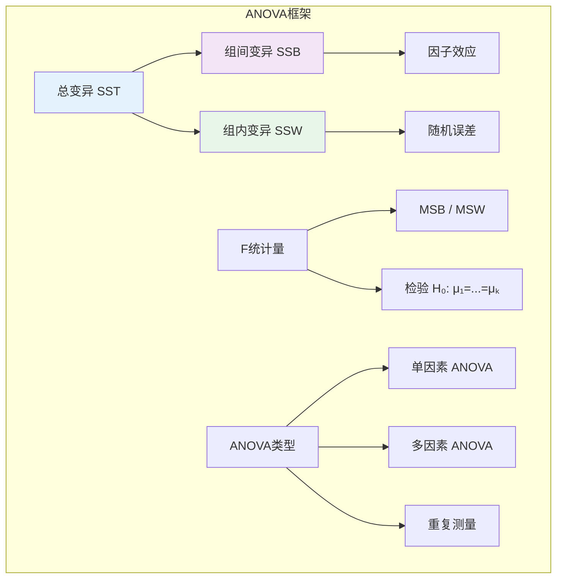

# 9.3.4 方差分析

---

📌 **内容摘要**

本文档深入探讨方差分析的核心原理和关键方法。内容涵盖推断统计领域的主要知识点，包括相关理论、方法及应用。适合具备相关基础的学习者进行深入研究。

**关键词**: 推断统计

📚 **学习目标**

- 深入理解方差分析的理论体系和形式化方法
- 能够进行相关定理的形式化证明
- 建立该领域的系统性知识框架

🎯 **难度级别**: 高级

⏱️ **预计阅读时间**: 15分钟

**前置知识**: 该领域的中级知识, 形式化方法基础, 微积分基础

---


## 9.3.4.1 引言

**方差分析**（Analysis of Variance, ANOVA）是一类用于比较多个总体均值是否相等的统计方法。
尽管名字中包含"方差"，ANOVA的核心目的是检验均值差异，通过分解总变异为不同来源实现。



---

## 9.3.4.2 单因素方差分析

### 9.3.4.2.1 模型设定

**定义 9.3.4.1**（单因素ANOVA模型）

设因子有 $k$ 个水平，第 $i$ 水平有 $n_i$ 个观测：

$$X_{ij} = \mu_i + \varepsilon_{ij}, \quad i = 1, \ldots, k, \quad j = 1, \ldots, n_i$$

其中 $\varepsilon_{ij} \stackrel{iid}{\sim} N(0, \sigma^2)$。

**等价形式**（效应模型）：

$$X_{ij} = \mu + \alpha_i + \varepsilon_{ij}$$

其中 $\mu = \frac{1}{k}\sum_{i=1}^{k}\mu_i$ 为总均值，$\alpha_i = \mu_i - \mu$ 为第 $i$ 组效应，约束 $\sum_{i=1}^{k}\alpha_i = 0$。

**假设检验**：
$$H_0: \mu_1 = \mu_2 = \cdots = \mu_k \quad \text{vs} \quad H_1: \text{至少一对不等}$$

等价于 $H_0: \alpha_1 = \alpha_2 = \cdots = \alpha_k = 0$。

### 9.3.4.2.2 平方和分解

**定义 9.3.4.2**（总平方和）

$$SST = \sum_{i=1}^{k}\sum_{j=1}^{n_i}(X_{ij} - \bar{X}_{..})^2$$

其中 $\bar{X}_{..} = \frac{1}{N}\sum_{i,j}X_{ij}$ 为总均值，$N = \sum_{i=1}^{k}n_i$。

**定义 9.3.4.3**（组间平方和与组内平方和）

**组间平方和**（Between-group SS）：
$$SSB = \sum_{i=1}^{k}n_i(\bar{X}_{i.} - \bar{X}_{..})^2$$

**组内平方和**（Within-group SS）：
$$SSW = \sum_{i=1}^{k}\sum_{j=1}^{n_i}(X_{ij} - \bar{X}_{i.})^2$$

其中 $\bar{X}_{i.} = \frac{1}{n_i}\sum_{j=1}^{n_i}X_{ij}$ 为第 $i$ 组样本均值。

**定理 9.3.4.1**（平方和分解）

$$SST = SSB + SSW$$

**证明：**

$$X_{ij} - \bar{X}_{..} = (X_{ij} - \bar{X}_{i.}) + (\bar{X}_{i.} - \bar{X}_{..})$$

两边平方求和：
$$\sum_{i,j}(X_{ij} - \bar{X}_{..})^2 = \sum_{i,j}(X_{ij} - \bar{X}_{i.})^2 + \sum_{i,j}(\bar{X}_{i.} - \bar{X}_{..})^2 + 2\sum_{i,j}(X_{ij} - \bar{X}_{i.})(\bar{X}_{i.} - \bar{X}_{..})$$

交叉项为零：
$$\sum_{j=1}^{n_i}(X_{ij} - \bar{X}_{i.}) = n_i\bar{X}_{i.} - n_i\bar{X}_{i.} = 0$$

**证毕。**

### 9.3.4.2.3 F检验

**定义 9.3.4.4**（均方）

**组间均方**：$MSB = \frac{SSB}{k-1}$

**组内均方**：$MSW = \frac{SSW}{N-k}$

**定理 9.3.4.2**（F统计量的分布）

在 $H_0$ 下：
$$F = \frac{MSB}{MSW} \sim F(k-1, N-k)$$

**证明思路：**

- $SSW/\sigma^2 \sim \chi^2(N-k)$
- $SSB/\sigma^2 \sim \chi^2(k-1)$ under $H_0$
- $SSW$ 与 $SSB$ 独立（Cochran定理）
- F分布定义：$\frac{\chi^2_{d_1}/d_1}{\chi^2_{d_2}/d_2} \sim F(d_1, d_2)$

**证毕。**

---

## 9.3.4.3 双因素方差分析

### 9.3.4.3.1 无交互效应模型

**定义 9.3.4.5**（双因素ANOVA模型）

因子A有 $a$ 水平，因子B有 $b$ 水平，每单元格1个观测：

$$X_{ij} = \mu + \alpha_i + \beta_j + \varepsilon_{ij}$$

其中：

- $\sum_{i=1}^{a}\alpha_i = 0$，$\sum_{j=1}^{b}\beta_j = 0$
- $\varepsilon_{ij} \stackrel{iid}{\sim} N(0, \sigma^2)$

### 9.3.4.3.2 带交互效应模型

每单元格有 $n$ 个重复：

$$X_{ijk} = \mu + \alpha_i + \beta_j + (\alpha\beta)_{ij} + \varepsilon_{ijk}$$

约束：$\sum_i(\alpha\beta)_{ij} = \sum_j(\alpha\beta)_{ij} = 0$

**平方和分解**：
$$SST = SSA + SSB + SSAB + SSE$$

---

## 9.3.4.4 代码实现

```python
import numpy as np
from scipy import stats
from typing import List, Dict, Tuple, Optional
import pandas as pd

class OneWayANOVA:
    """单因素方差分析"""

    def __init__(self, groups: List[np.ndarray]):
        """
        Args:
            groups: k个组的观测值列表
        """
        self.groups = [np.asarray(g) for g in groups]
        self.k = len(groups)
        self.n_per_group = [len(g) for g in self.groups]
        self.N = sum(self.n_per_group)

        # 计算基本统计量
        self.group_means = [np.mean(g) for g in self.groups]
        self.group_vars = [np.var(g, ddof=1) for g in self.groups]
        self.all_data = np.concatenate(self.groups)
        self.grand_mean = np.mean(self.all_data)

    def calculate_anova_table(self) -> Dict:
        """
        计算ANOVA表

        Returns:
            ANOVA表字典
        """
        # 组间平方和
        SSB = sum(n_i * (mean_i - self.grand_mean)**2
                  for n_i, mean_i in zip(self.n_per_group, self.group_means))
        df_B = self.k - 1
        MSB = SSB / df_B

        # 组内平方和
        SSW = sum(np.sum((g - mean_i)**2)
                  for g, mean_i in zip(self.groups, self.group_means))
        df_W = self.N - self.k
        MSW = SSW / df_W

        # 总平方和
        SST = np.sum((self.all_data - self.grand_mean)**2)

        # F统计量
        F_stat = MSB / MSW
        p_value = 1 - stats.f.cdf(F_stat, df_B, df_W)

        return {
            'source': ['Between Groups', 'Within Groups', 'Total'],
            'SS': [SSB, SSW, SST],
            'df': [df_B, df_W, self.N - 1],
            'MS': [MSB, MSW, np.nan],
            'F': [F_stat, np.nan, np.nan],
            'p_value': [p_value, np.nan, np.nan]
        }

    def effect_size_eta_squared(self) -> float:
        """η²效应量（解释方差比例）"""
        anova_table = self.calculate_anova_table()
        SSB = anova_table['SS'][0]
        SST = anova_table['SS'][2]
        return SSB / SST

    def effect_size_omega_squared(self) -> float:
        """ω²（调整后的效应量）"""
        anova_table = self.calculate_anova_table()
        SSB = anova_table['SS'][0]
        df_B = anova_table['df'][0]
        MSW = anova_table['MS'][1]
        SST = anova_table['SS'][2]

        return (SSB - (df_B * MSW)) / (SST + MSW)

    def tukey_hsd(self, alpha: float = 0.05) -> pd.DataFrame:
        """
        Tukey's HSD事后检验

        所有组间两两比较
        """
        anova_table = self.calculate_anova_table()
        MSW = anova_table['MS'][1]
        df_W = anova_table['df'][1]

        # Tukey临界值
        q_crit = stats.studentized_range.ppf(1 - alpha, self.k, df_W)

        results = []
        for i in range(self.k):
            for j in range(i + 1, self.k):
                mean_diff = self.group_means[i] - self.group_means[j]
                se = np.sqrt(MSW * (1/self.n_per_group[i] + 1/self.n_per_group[j]) / 2)

                # Tukey HSD统计量
                q_stat = abs(mean_diff) / se

                # 置信区间
                margin = q_crit * se * np.sqrt(2)
                ci_lower = mean_diff - margin
                ci_upper = mean_diff + margin

                results.append({
                    'Group_1': i,
                    'Group_2': j,
                    'Mean_1': self.group_means[i],
                    'Mean_2': self.group_means[j],
                    'Difference': mean_diff,
                    'SE': se,
                    'q_statistic': q_stat,
                    'CI_lower': ci_lower,
                    'CI_upper': ci_upper,
                    'Significant': abs(q_stat) > q_crit
                })

        return pd.DataFrame(results)

    def summary(self) -> None:
        """打印ANOVA汇总"""
        print("=" * 70)
        print("单因素方差分析")
        print("=" * 70)

        # 基本统计量
        print("\n描述统计:")
        print("-" * 40)
        print(f"{'组':>8s} {'n':>6s} {'均值':>10s} {'标准差':>10s}")
        for i, (n, mean, std) in enumerate(zip(self.n_per_group, self.group_means,
                                                [np.sqrt(v) for v in self.group_vars])):
            print(f"{i+1:>8d} {n:>6d} {mean:>10.3f} {std:>10.3f}")
        print(f"{'总计':>8s} {self.N:>6d} {self.grand_mean:>10.3f}")

        # ANOVA表
        print("\nANOVA表:")
        print("-" * 70)
        anova = self.calculate_anova_table()
        print(f"{'来源':>15s} {'SS':>12s} {'df':>6s} {'MS':>12s} {'F':>10s} {'p值':>10s}")
        print("-" * 70)
        for i in range(2):  # 只打印Between和Within
            print(f"{anova['source'][i]:>15s} {anova['SS'][i]:>12.3f} {anova['df'][i]:>6d} "
                  f"{anova['MS'][i]:>12.3f} {anova['F'][i] if not np.isnan(anova['F'][i]) else '':>10s} "
                  f"{anova['p_value'][i] if not np.isnan(anova['p_value'][i]) else '':>10.4f}")
        print(f"{'Total':>15s} {anova['SS'][2]:>12.3f} {anova['df'][2]:>6d}")

        # 效应量
        eta_sq = self.effect_size_eta_squared()
        omega_sq = self.effect_size_omega_squared()
        print(f"\n效应量:")
        print(f"  η² = {eta_sq:.4f}")
        print(f"  ω² = {omega_sq:.4f}")


# 使用示例
if __name__ == "__main__":
    print("=" * 70)
    print("方差分析示例")
    print("=" * 70)

    np.random.seed(42)

    # 创建三组数据
    group1 = np.random.normal(100, 10, 30)  # 均值100
    group2 = np.random.normal(105, 10, 30)  # 均值105（略有差异）
    group3 = np.random.normal(110, 10, 30)  # 均值110

    # 单因素ANOVA
    print("\n单因素ANOVA: 比较三组均值")
    print("-" * 50)

    anova = OneWayANOVA([group1, group2, group3])
    anova.summary()

    # 事后检验
    print("\nTukey HSD 事后检验:")
    print("-" * 70)
    tukey_results = anova.tukey_hsd(alpha=0.05)
    print(tukey_results.to_string(index=False))
```

---

## 9.3.4.5 交叉引用

| 引用目标 | 章节 | 关系 |
|---------|------|------|
| 假设检验 | 9.3.3 | F检验的基础 |
| F分布 | 9.2.3 | ANOVA检验统计量 |
| 多重比较 | 9.5.1 | 事后检验理论 |
| 回归分析 | 9.3.3 | ANOVA是回归特例 |

---

## 9.3.4.6 参考文献

1. Scheffé, H. (1959). _The Analysis of Variance_. Wiley.
2. Casella, G., & Berger, R. L. (2002). _Statistical Inference_ (2nd ed.). Duxbury. (Ch. 11)
3. Maxwell, S. E., & Delaney, H. D. (2004). _Designing Experiments and Analyzing Data_ (2nd ed.). Lawrence Erlbaum.

---

## 9.3.4.7 练习

**练习 9.3.4.1** 证明在单因素ANOVA中，$E[MSB] = \sigma^2 + \frac{\sum n_i\alpha_i^2}{k-1}$，$E[MSW] = \sigma^2$。

**练习 9.3.4.2** 推导双因素ANOVA中各平方和的计算公式。

**练习 9.3.4.3** 解释为什么ANOVA需要方差齐性假设，并说明如何检验。
---

## 📚 延伸阅读

- [9.3.3 假设检验](./09_统计学/03_推断统计/03.3_假设检验.md)
- [9.1.1 集中趋势与离散度](./09_统计学/01_描述统计/01.1_集中趋势与离散度.md)
- [01_描述统计 - Descriptive Statistics](./09_统计学/01_描述统计.md)
