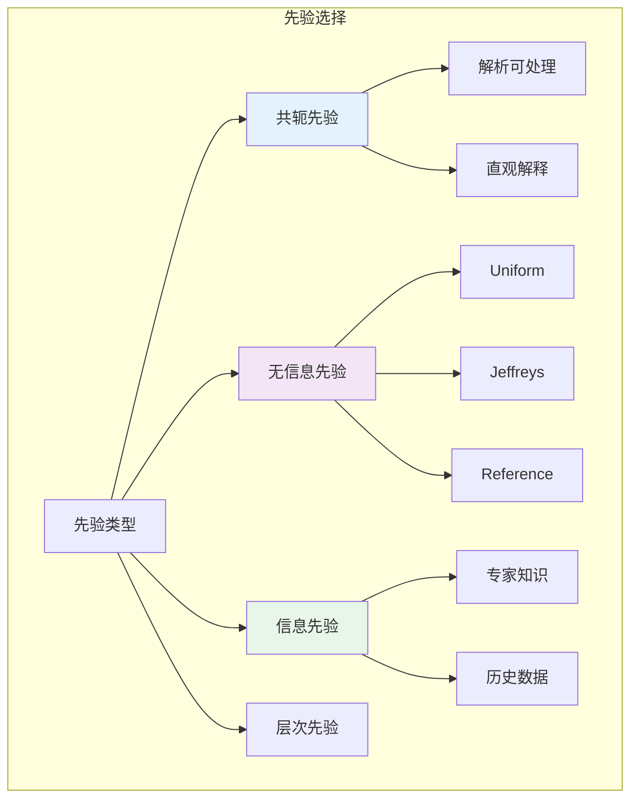

# 9.4.2 先验与后验分布

---

📌 **内容摘要**

本文档深入探讨先验与后验分布的核心原理和关键方法。内容涵盖贝叶斯统计领域的主要知识点，包括后验, 先验等关键主题。适合具备相关基础的学习者进行深入研究。

**关键词**: 贝叶斯统计, 后验, 先验

📚 **学习目标**

- 深入理解先验与后验分布的理论体系和形式化方法
- 能够进行相关定理的形式化证明
- 建立该领域的系统性知识框架

🎯 **难度级别**: 高级

⏱️ **预计阅读时间**: 15分钟

**前置知识**: 该领域的中级知识, 形式化方法基础, 微积分基础

---


## 9.4.2.1 引言

先验分布的选择是贝叶斯分析的关键步骤。本章介绍共轭先验、无信息先验（包括Jeffreys先验）和层次先验的形式化理论，以及后验分布的性质。



---

## 9.4.2.2 共轭先验

### 9.4.2.2.1 共轭先验的定义

**定义 9.4.2.1**（共轭先验，Conjugate Prior）

先验分布族 $\mathcal{F}$ 对于似然函数 $f(x | \theta)$ 是**共轭**的，如果对于任意先验 $\pi \in \mathcal{F}$，后验 $\pi(\theta | x) \in \mathcal{F}$。

**定理 9.4.2.1**（共轭后验的形式）

若先验 $\pi(\theta) \in \mathcal{F}$ 与似然 $f(x | \theta)$ 共轭，则后验具有与先验相同的形式，只是参数被数据更新。

### 9.4.2.2.2 常见共轭族

| 似然 | 共轭先验 | 后验 |
|-----|---------|-----|
| Bernoulli/二项 | Beta | Beta |
| 泊松 | Gamma | Gamma |
| 正态（方差已知） | 正态 | 正态 |
| 正态（均值已知） | Inverse-Gamma | Inverse-Gamma |
| 多项 | Dirichlet | Dirichlet |
| 指数 | Gamma | Gamma |

**示例 9.4.2.1**（泊松-伽马共轭）

- 先验：$\lambda \sim \text{Gamma}(\alpha, \beta)$，$\pi(\lambda) \propto \lambda^{\alpha-1}e^{-\beta\lambda}$
- 似然：$x_i \sim \text{Poisson}(\lambda)$，$L(\lambda) \propto \lambda^{\sum x_i}e^{-n\lambda}$
- 后验：$\lambda | \mathbf{x} \sim \text{Gamma}(\alpha + \sum x_i, \beta + n)$

**证明：**
$$\pi(\lambda | \mathbf{x}) \propto \lambda^{\sum x_i}e^{-n\lambda} \cdot \lambda^{\alpha-1}e^{-\beta\lambda} = \lambda^{\alpha + \sum x_i - 1}e^{-(eta + n)\lambda}$$
这是 $\text{Gamma}(\alpha + \sum x_i, \beta + n)$ 的核。

**证毕。**

---

## 9.4.2.3 无信息先验

### 9.4.2.3.1 均匀先验

**定义 9.4.2.2**（均匀先验）

**均匀先验**（Uniform Prior）：
$$\pi(\theta) \propto 1, \quad \theta \in \Theta$$

**限制**：仅在有界参数空间 $\Theta$ 上可积。

### 9.4.2.3.2 Jeffreys先验

**定义 9.4.2.3**（Jeffreys先验）

**Jeffreys先验**定义为：
$$\pi_J(\theta) \propto \sqrt{I(\theta)}$$

其中 $I(\theta)$ 是**Fisher信息量**：
$$I(\theta) = -E\left[\frac{\partial^2 \ln f(X | \theta)}{\partial \theta^2}\right] = E\left[\left(\frac{\partial \ln f(X | \theta)}{\partial \theta}\right)^2\right]$$

**定理 9.4.2.2**（Jeffreys先验的重参数化不变性）

设 $\phi = g(\theta)$ 为一一变换，则：
$$\pi_J(\phi) = \pi_J(\theta) \left|\frac{d\theta}{d\phi}\right|$$

即Jeffreys先验在重参数化下保持形式不变。

**证明：**

Fisher信息量的变换：
$$I(\phi) = I(\theta) \left(\frac{d\theta}{d\phi}\right)^2$$

因此：
$$\pi_J(\phi) = \sqrt{I(\phi)} = \sqrt{I(\theta)} \left|\frac{d\theta}{d\phi}\right| = \pi_J(\theta) \left|\frac{d\theta}{d\phi}\right|$$

**证毕。**

**示例 9.4.2.2**（常见分布的Jeffreys先验）

| 分布 | Jeffreys先验 |
|-----|--------------|
| Bernoulli($\theta$) | $\pi(\theta) \propto \theta^{-1/2}(1-\theta)^{-1/2} \sim \text{Beta}(1/2, 1/2)$ |
| Poisson($\lambda$) | $\pi(\lambda) \propto \lambda^{-1/2}$ |
| Normal($\mu$, $\sigma^2$) ($\sigma$已知) | $\pi(\mu) \propto 1$ |
| Normal($\mu$, $\sigma^2$) ($\mu$已知) | $\pi(\sigma) \propto \sigma^{-1}$ |
| Normal($\mu$, $\sigma^2$) (均未知) | $\pi(\mu, \sigma) \propto \sigma^{-2}$ |

---

## 9.4.2.4 后验分布的性质

### 9.4.2.4.1 后验一致性

**定义 9.4.2.4**（后验一致性）

设 $\theta_0$ 为真实参数值，先验 $\pi$ 满足 $\pi(\theta_0) > 0$。后验称为**一致的**，如果：
$$\pi(\theta \in U | X^n) \to 1 \text{ a.s.}$$
对于 $\theta_0$ 的任意邻域 $U$。

**定理 9.4.2.3**（Doob定理）

在 mild 条件下，后验几乎必然一致：$P_{\theta_0}(\text{后验一致}) = 1$ for $\pi$-almost all $\theta_0$。

### 9.4.2.4.2 Bernstein-von Mises定理

**定理 9.4.2.4**（Bernstein-von Mises）

在正则条件下，当 $n \to \infty$：
$$\sqrt{n}(\theta - \hat{\theta}_{MLE}) | X^n \stackrel{d}{\to} N(0, I(\theta_0)^{-1})$$

即后验分布渐近正态，均值为MLE，方差为Fisher信息逆。

**意义**：大样本下，贝叶斯与频率学派结果一致。

---

## 9.4.2.5 代码实现

```python
import numpy as np
from scipy import stats
from scipy.special import psi, polygamma
from typing import Tuple, Callable, Dict

class PriorDistributions:
    """常用先验分布"""

    @staticmethod
    def jeffreys_bernoulli(theta: float) -> float:
        """Bernoulli的Jeffreys先验: Beta(0.5, 0.5)"""
        if theta <= 0 or theta >= 1:
            return 0
        return 1 / (np.pi * np.sqrt(theta * (1 - theta)))

    @staticmethod
    def jeffreys_poisson(lam: float) -> float:
        """泊松的Jeffreys先验"""
        if lam <= 0:
            return 0
        return 1 / np.sqrt(lam)

    @staticmethod
    def jeffreys_normal_mean(sigma: float) -> float:
        """正态均值（方差已知）的Jeffreys先验: 常数"""
        return 1.0

    @staticmethod
    def jeffreys_normal_sigma(mu: float) -> float:
        """正态标准差（均值已知）的Jeffreys先验"""
        def prior(sigma):
            return 1 / sigma if sigma > 0 else 0
        return prior


class ConjugatePriors:
    """共轭先验-后验更新"""

    @staticmethod
    def beta_binomial_update(alpha: float, beta: float,
                            successes: int, trials: int) -> Tuple[float, float]:
        """
        Beta-Binomial共轭更新

        Returns:
            (alpha_posterior, beta_posterior)
        """
        return alpha + successes, beta + trials - successes

    @staticmethod
    def gamma_poisson_update(alpha: float, beta: float,
                            data: np.ndarray) -> Tuple[float, float]:
        """
        Gamma-Poisson共轭更新

        先验: Gamma(alpha, rate=beta)
        后验: Gamma(alpha + sum(x), beta + n)
        """
        n = len(data)
        sum_x = np.sum(data)
        return alpha + sum_x, beta + n

    @staticmethod
    def normal_normal_update(mu0: float, tau0_sq: float, sigma_sq: float,
                           data: np.ndarray) -> Dict:
        """
        正态-正态共轭更新（方差已知）

        Returns:
            后验参数字典
        """
        n = len(data)
        x_bar = np.mean(data)

        # 后验方差
        tau_n_sq = 1 / (1/tau0_sq + n/sigma_sq)

        # 后验均值
        mu_n = tau_n_sq * (mu0/tau0_sq + n*x_bar/sigma_sq)

        return {
            'mu_n': mu_n,
            'tau_n_sq': tau_n_sq,
            'precision_n': 1/tau_n_sq
        }

    @staticmethod
    def normal_inverse_gamma_update(mu: float, lambda_: float, alpha: float, beta: float,
                                    data: np.ndarray) -> Dict:
        """
        正态-Inverse-Gamma共轭更新（均值、方差均未知）

        这是正态分布的联合共轭先验
        """
        n = len(data)
        x_bar = np.mean(data)
        s_sq = np.var(data, ddof=0)

        # 后验参数
        lambda_n = lambda_ + n
        mu_n = (lambda_ * mu + n * x_bar) / lambda_n
        alpha_n = alpha + n / 2
        beta_n = beta + 0.5 * n * s_sq + (lambda_ * n * (x_bar - mu)**2) / (2 * lambda_n)

        return {
            'mu_n': mu_n,
            'lambda_n': lambda_n,
            'alpha_n': alpha_n,
            'beta_n': beta_n
        }


class PriorSensitivityAnalysis:
    """先验敏感性分析"""

    def __init__(self, likelihood_func: Callable, data: np.ndarray,
                 theta_range: Tuple[float, float]):
        self.likelihood = likelihood_func
        self.data = data
        self.theta_range = theta_range

    def compare_posteriors(self, priors: Dict[str, Callable],
                          n_points: int = 500) -> Dict:
        """
        比较不同先验的后验

        Returns:
            各先验的后验均值和95%CI
        """
        theta_grid = np.linspace(self.theta_range[0], self.theta_range[1], n_points)
        results = {}

        for name, prior_func in priors.items():
            # 计算后验
            unnormalized_posterior = []
            for theta in theta_grid:
                like = self.likelihood(self.data, theta)
                prior = prior_func(theta)
                unnormalized_posterior.append(like * prior)

            unnormalized_posterior = np.array(unnormalized_posterior)
            posterior = unnormalized_posterior / np.trapz(unnormalized_posterior, theta_grid)

            # 后验均值
            post_mean = np.trapz(theta_grid * posterior, theta_grid)

            # 后验CI（近似）
            cdf = np.cumsum(posterior) / np.sum(posterior)
            ci_lower = theta_grid[np.searchsorted(cdf, 0.025)]
            ci_upper = theta_grid[np.searchsorted(cdf, 0.975)]

            results[name] = {
                'posterior_mean': post_mean,
                'ci_95': (ci_lower, ci_upper),
                'posterior': posterior
            }

        return results


# 使用示例
if __name__ == "__main__":
    print("=" * 60)
    print("先验与后验分布示例")
    print("=" * 60)

    np.random.seed(42)

    # 1. 共轭先验示例：Gamma-Poisson
    print("\n1. Gamma-Poisson共轭模型")
    print("-" * 40)

    # 生成泊松数据（真实lambda=3）
    poisson_data = np.random.poisson(3, 100)

    # 不同先验
    priors = [
        (0.1, 0.1, "弱先验 Gamma(0.1, 0.1)"),
        (1, 1, "标准 Gamma(1, 1)"),
        (3, 1, "信息先验 Gamma(3, 1)"),
    ]

    for alpha_prior, beta_prior, desc in priors:
        alpha_post, beta_post = ConjugatePriors.gamma_poisson_update(
            alpha_prior, beta_prior, poisson_data
        )
        post_mean = alpha_post / beta_post
        print(f"   {desc}:")
        print(f"      后验: Gamma({alpha_post:.1f}, {beta_post:.1f})")
        print(f"      后验均值: {post_mean:.3f}")

    # MLE
    print(f"   MLE: {np.mean(poisson_data):.3f}")

    # 2. Jeffreys先验
    print("\n2. Jeffreys先验示例")
    print("-" * 40)

    # 伯努利数据
    bernoulli_data = np.array([1]*30 + [0]*20)
    np.random.shuffle(bernoulli_data)

    # 比较均匀先验和Jeffreys先验
    # 均匀先验 Beta(1, 1)
    alpha_uniform = 1 + 30
    beta_uniform = 1 + 20
    mean_uniform = alpha_uniform / (alpha_uniform + beta_uniform)

    # Jeffreys先验 Beta(0.5, 0.5)
    alpha_jeffreys = 0.5 + 30
    beta_jeffreys = 0.5 + 20
    mean_jeffreys = alpha_jeffreys / (alpha_jeffreys + beta_jeffreys)

    print(f"   数据: 30成功 / 50试验")
    print(f"   均匀先验后验均值: {mean_uniform:.4f}")
    print(f"   Jeffreys先验后验均值: {mean_jeffreys:.4f}")
    print(f"   MLE: {30/50:.4f}")

    # 3. 正态-正态共轭
    print("\n3. 正态-正态共轭模型")
    print("-" * 40)

    normal_data = np.random.normal(100, 15, 50)

    # 不同先验强度
    prior_configs = [
        (90, 10000, "弱先验 (τ²=10000)"),
        (90, 100, "中等先验 (τ²=100)"),
        (90, 10, "强先验 (τ²=10)"),
    ]

    for mu0, tau0_sq, desc in prior_configs:
        result = ConjugatePriors.normal_normal_update(mu0, tau0_sq, 225, normal_data)
        print(f"   {desc}:")
        print(f"      后验均值: {result['mu_n']:.2f}")
        print(f"      后验标准差: {np.sqrt(result['tau_n_sq']):.2f}")
