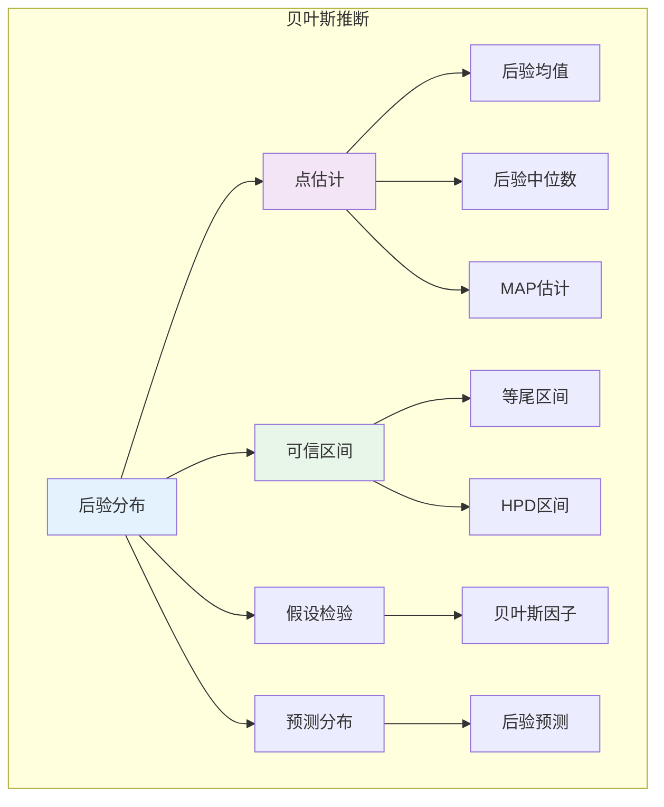

# 9.4.3 贝叶斯推断

## 9.4.3.1 引言

贝叶斯推断提供了完整的参数不确定性量化。与频率学派只关注点估计和置信区间不同，贝叶斯方法通过后验分布给出参数的全部信息。本章介绍贝叶斯点估计、区间估计、假设检验和预测的形式化理论。



---

## 9.4.3.2 贝叶斯点估计

### 9.4.3.2.1 损失函数框架

**定义 9.4.3.1**（贝叶斯估计）

给定损失函数 $L(\theta, \hat{\theta})$，**贝叶斯估计量**最小化后验期望损失：

$$\hat{\theta}_{Bayes} = \arg\min_{\hat{\theta}} E[L(\theta, \hat{\theta}) | x] = \arg\min_{\hat{\theta}} \int L(\theta, \hat{\theta}) \pi(\theta | x) d\theta$$

**定理 9.4.3.1**（常见损失函数下的贝叶斯估计）

1. **平方损失** $L(\theta, \hat{\theta}) = (\theta - \hat{\theta})^2$：**后验均值**
   $$\hat{\theta} = E[\theta | x]$$

2. **绝对值损失** $L(\theta, \hat{\theta}) = |\theta - \hat{\theta}|$：**后验中位数**
   $$\hat{\theta} = \text{median}(\pi(\theta | x))$$

3. **0-1损失** $L(\theta, \hat{\theta}) = \mathbf{1}_{\{\theta \neq \hat{\theta}\}}$：**后验众数（MAP）**
   $$\hat{\theta} = \arg\max_{\theta} \pi(\theta | x)$$

**证明（平方损失）：**

$$E[(\theta - \hat{\theta})^2 | x] = E[\theta^2 | x] - 2\hat{\theta}E[\theta | x] + \hat{\theta}^2$$

对 $\hat{\theta}$ 求导并令为零：
$$-2E[\theta | x] + 2\hat{\theta} = 0 \Rightarrow \hat{\theta} = E[\theta | x]$$

**证毕。**

### 9.4.3.2.2 MAP估计

**定义 9.4.3.2**（最大后验估计，MAP）

$$\hat{\theta}_{MAP} = \arg\max_{\theta} \pi(\theta | x) = \arg\max_{\theta} f(x | \theta) \pi(\theta)$$

**注**：当样本量 $n \to \infty$，$\hat{\theta}_{MAP} \to \hat{\theta}_{MLE}$（若先验非退化）。

---

## 9.4.3.3 贝叶斯区间估计

### 9.4.3.3.1 可信区间

**定义 9.4.3.3**（可信区间，Credible Interval）

区间 $[L(x), U(x)]$ 称为参数 $\theta$ 的 $100(1-\alpha)\%$ **可信区间**，如果：

$$P(L(x) \leq \theta \leq U(x) | x) = 1 - \alpha$$

**与置信区间的区别**：

- 可信区间：给定数据，参数有 $1-\alpha$ 概率落在区间内（参数随机）
- 置信区间：重复抽样，$1-\alpha$ 比例的区间包含参数（区间随机）

### 9.4.3.3.2 最高后验密度区间

**定义 9.4.3.4**（HPD区间）

**最高后验密度**（Highest Posterior Density, HPD）区间 $C$ 满足：

1. $P(\theta \in C | x) = 1 - \alpha$
2. 若 $\theta_1 \in C$，$\theta_2 \notin C$，则 $\pi(\theta_1 | x) \geq \pi(\theta_2 | x)$

**定理 9.4.3.2**（HPD区间的性质）

HPD区间是长度最短的可信区间（对于单峰后验）。

---

## 9.4.3.4 贝叶斯假设检验

### 9.4.3.4.1 贝叶斯因子

**定义 9.4.3.5**（贝叶斯因子，Bayes Factor）

对于假设 $H_0$ vs $H_1$，**贝叶斯因子**定义为边际似然比：

$$BF_{10} = \frac{m(x | H_1)}{m(x | H_0)} = \frac{\int f(x | \theta, H_1) \pi(\theta | H_1) d\theta}{\int f(x | \theta, H_0) \pi(\theta | H_0) d\theta}$$

**解释**：

| $BF_{10}$ | 证据强度 |
|-----------|---------|
| 1-3 | 微弱 |
| 3-20 | 中等 |
| 20-150 | 强 |
| >150 | 很强 |

**后验概率与贝叶斯因子关系**：
$$\frac{P(H_1 | x)}{P(H_0 | x)} = BF_{10} \cdot \frac{P(H_1)}{P(H_0)}$$

---

## 9.4.3.5 贝叶斯预测

### 9.4.3.5.1 后验预测分布

**定义 9.4.3.6**（后验预测分布）

新观测 $\tilde{x}$ 的**后验预测分布**：

$$p(\tilde{x} | x) = \int p(\tilde{x} | \theta) \pi(\theta | x) d\theta$$

**定理 9.4.3.3**（后验预测的期望）

$$E[\tilde{x} | x] = E_\theta[E[\tilde{x} | \theta] | x]$$

**解释**：预测期望是先验-后验平均的期望。

### 9.4.3.5.2 共轭先验的预测分布

**示例 9.4.3.1**（Beta-Binomial的预测分布）

设 $\theta \sim \text{Beta}(\alpha, \beta)$，$X \sim \text{Binomial}(n, \theta)$。

$\tilde{X}$（新 $m$ 次试验的成功次数）的预测分布：

$$p(\tilde{x} | x) = \binom{m}{\tilde{x}} \frac{B(\alpha + k + \tilde{x}, \beta + n - k + m - \tilde{x})}{B(\alpha + k, \beta + n - k)}$$

这是**Beta-Binomial分布**。

---

## 9.4.3.6 代码实现

```python
import numpy as np
from scipy import stats
from scipy.optimize import minimize_scalar
from scipy.integrate import quad
from typing import Tuple, Callable, Dict, Optional

class BayesianEstimation:
    """贝叶斯估计方法"""

    def __init__(self, posterior_func: Callable):
        """
        Args:
            posterior_func: 后验密度函数 pi(theta | x)
        """
        self.posterior = posterior_func

    def posterior_mean_numerical(self, lower: float, upper: float) -> float:
        """数值计算后验均值"""
        numerator, _ = quad(lambda theta: theta * self.posterior(theta), lower, upper)
        denominator, _ = quad(self.posterior, lower, upper)
        return numerator / denominator

    def posterior_mode_numerical(self, lower: float, upper: float) -> float:
        """数值计算后验众数（MAP）"""
        result = minimize_scalar(lambda theta: -self.posterior(theta),
                                bounds=(lower, upper), method='bounded')
        return result.x

    def credible_interval(self, lower: float, upper: float,
                         alpha: float = 0.05,
                         method: str = 'eti') -> Tuple[float, float]:
        """
        计算可信区间

        Args:
            method: 'eti' (等尾区间) 或 'hpd' (最高后验密度)
        """
        if method == 'eti':
            # 等尾区间
            def cdf(theta):
                result, _ = quad(self.posterior, lower, theta)
                return result

            # 数值求分位数
            from scipy.optimize import brentq

            cdf_lower = brentq(lambda t: cdf(t) - alpha/2, lower, upper)
            cdf_upper = brentq(lambda t: cdf(t) - (1-alpha/2), lower, upper)

            return cdf_lower, cdf_upper

        elif method == 'hpd':
            # HPD区间（数值近似）
            theta_grid = np.linspace(lower, upper, 10000)
            posterior_vals = np.array([self.posterior(t) for t in theta_grid])
            posterior_vals = posterior_vals / np.sum(posterior_vals)

            # 排序找到最高密度区域
            sorted_indices = np.argsort(posterior_vals)[::-1]
            cumsum = np.cumsum(posterior_vals[sorted_indices])
            hpd_indices = sorted_indices[cumsum <= (1 - alpha)]

            return theta_grid[min(hpd_indices)], theta_grid[max(hpd_indices)]

        else:
            raise ValueError(f"Unknown method: {method}")


class BayesianHypothesisTesting:
    """贝叶斯假设检验"""

    @staticmethod
    def bayes_factor_beta_binomial(k: int, n: int,
                                   alpha0: float, beta0: float,
                                   alpha1: float, beta1: float) -> float:
        """
        Beta-Binomial模型的贝叶斯因子

        H0: θ ~ Beta(alpha0, beta0)
        H1: θ ~ Beta(alpha1, beta1)
        """
        # 边际似然 = Beta-Binomial的归一化常数
        from scipy.special import beta as beta_func, comb

        # 边际似然 B(α + k, β + n - k) / B(α, β)
        marginal_h0 = beta_func(alpha0 + k, beta0 + n - k) / beta_func(alpha0, beta0)
        marginal_h1 = beta_func(alpha1 + k, beta1 + n - k) / beta_func(alpha1, beta1)

        return marginal_h1 / marginal_h0

    @staticmethod
    def interpret_bayes_factor(bf: float) -> str:
        """解释贝叶斯因子"""
        if bf < 1:
            return f"支持H0 (1/BF = {1/bf:.2f})"
        elif bf < 3:
            return "微弱支持H1"
        elif bf < 20:
            return "中等支持H1"
        elif bf < 150:
            return "强支持H1"
        else:
            return "很强支持H1"


class PosteriorPredictive:
    """后验预测分布"""

    @staticmethod
    def beta_binomial_predictive(k_obs: int, n_obs: int,
                                 alpha_prior: float, beta_prior: float,
                                 n_pred: int) -> np.ndarray:
        """
        Beta-Binomial的后验预测分布

        Returns:
            预测概率质量函数
        """
        alpha_post = alpha_prior + k_obs
        beta_post = beta_prior + n_obs - k_obs

        # Beta-Binomial分布
        from scipy.special import beta as beta_func, comb

        pmf = np.zeros(n_pred + 1)
        for k in range(n_pred + 1):
            pmf[k] = comb(n_pred, k) * beta_func(alpha_post + k, beta_post + n_pred - k) / beta_func(alpha_post, beta_post)

        return pmf

    @staticmethod
    def normal_normal_predictive(data: np.ndarray, sigma_sq: float,
                                 mu0: float, tau0_sq: float,
                                 x_grid: np.ndarray) -> np.ndarray:
        """
        正态-正态模型的后验预测分布密度
        """
        n = len(data)
        x_bar = np.mean(data)

        # 后验参数
        tau_n_sq = 1 / (1/tau0_sq + n/sigma_sq)
        mu_n = tau_n_sq * (mu0/tau0_sq + n*x_bar/sigma_sq)

        # 预测分布 N(mu_n, sigma_sq + tau_n_sq)
        pred_var = sigma_sq + tau_n_sq
        return stats.norm.pdf(x_grid, mu_n, np.sqrt(pred_var))


# 使用示例
if __name__ == "__main__":
    print("=" * 60)
    print("贝叶斯推断示例")
    print("=" * 60)

    np.random.seed(42)

    # 1. Beta后验的点估计
    print("\n1. Beta后验的点估计")
    print("-" * 40)

    # 观测: 30次成功, 50次试验
    k, n = 30, 50
    alpha_post, beta_post = 1 + k, 1 + n - k  # 均匀先验

    print(f"   数据: {k}/{n} 成功")
    print(f"   后验: Beta({alpha_post}, {beta_post})")
    print(f"   后验均值: {alpha_post/(alpha_post+beta_post):.4f}")
    print(f"   后验众数: {(alpha_post-1)/(alpha_post+beta_post-2):.4f}")
    print(f"   后验中位数: {stats.beta.median(alpha_post, beta_post):.4f}")

    # 2. 可信区间
    print("\n2. 可信区间比较")
    print("-" * 40)

    ci_eti = (stats.beta.ppf(0.025, alpha_post, beta_post),
              stats.beta.ppf(0.975, alpha_post, beta_post))

    print(f"   95% 等尾区间: [{ci_eti[0]:.4f}, {ci_eti[1]:.4f}]")
    print(f"   区间宽度: {ci_eti[1] - ci_eti[0]:.4f}")

    # 3. 贝叶斯因子
    print("\n3. 贝叶斯因子")
    print("-" * 40)

    # 检验硬币是否公平
    # H0: θ ~ Beta(10, 10) [集中在0.5附近]
    # H1: θ ~ Beta(1, 1) [均匀，非信息]
    bf = BayesianHypothesisTesting.bayes_factor_beta_binomial(
        k, n, alpha0=10, beta0=10, alpha1=1, beta1=1
    )

    print(f"   数据: {k}/{n} 成功")
    print(f"   H0: Beta(10, 10) [偏向公平]")
    print(f"   H1: Beta(1, 1) [均匀]")
    print(f"   BF_10 = {bf:.4f}")
    print(f"   解释: {BayesianHypothesisTesting.interpret_bayes_factor(bf)}")

    # 4. 后验预测
    print("\n4. 后验预测分布")
    print("-" * 40)

    # 预测接下来10次试验的成功次数
    n_pred = 10
    pred_pmf = PosteriorPredictive.beta_binomial_predictive(
        k, n, alpha_prior=1, beta_prior=1, n_pred=n_pred
    )

    print(f"   观测: {k}/{n} 成功")
    print(f"   预测接下来{n_pred}次试验的成功次数分布:")
    print(f"   预测期望: {np.sum(np.arange(n_pred+1) * pred_pmf):.2f}")
    print(f"   最可能结果: {np.argmax(pred_pmf)} 次成功")
