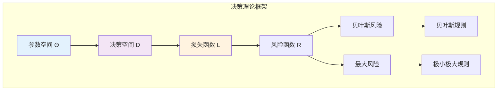

# 9.5.1 统计决策理论

## 9.5.1.1 引言

**统计决策理论**（Statistical Decision Theory）由Wald在20世纪50年代发展，提供了一个统一的框架来评估和比较统计程序。
该理论将统计推断视为在不确定性下的决策问题，使用损失函数和风险的概念进行形式化分析。



---

## 9.5.1.2 基本要素

### 9.5.1.2.1 决策问题的组成部分

**定义 9.5.1.1**（统计决策问题）

统计决策问题由以下要素组成：

1. **样本空间** $\mathcal{X}$：观测数据的可能取值
2. **参数空间** $\Theta$：未知参数的可能取值
3. **决策空间** $\mathcal{D}$：可能的决策/行动集合
4. **损失函数** $L: \Theta \times \mathcal{D} \to [0, \infty)$：评估决策质量的函数

### 9.5.1.2.2 决策规则

**定义 9.5.1.2**（决策规则，Decision Rule）

**非随机化决策规则**是函数 $\delta: \mathcal{X} \to \mathcal{D}$，将观测映射到决策。

**随机化决策规则**是转移概率 $\delta: \mathcal{X} \times \mathcal{D} \to [0, 1]$，满足 $\int_{\mathcal{D}} \delta(x, d) d\nu(d) = 1$。

---

## 9.5.1.3 风险函数

### 9.5.1.3.1 定义与解释

**定义 9.5.1.3**（风险函数，Risk Function）

决策规则 $\delta$ 的**风险函数**：

$$R(\theta, \delta) = E_\theta[L(\theta, \delta(X))] = \int_{\mathcal{X}} L(\theta, \delta(x)) f(x | \theta) dx$$

风险是损失关于样本分布的期望，表示使用规则 $\delta$ 时参数为 $\theta$ 的平均损失。

### 9.5.1.3.2 风险比较

**定义 9.5.1.4**（容许性，Admissibility）

决策规则 $\delta$ 是**容许的**（Admissible），如果不存在其他规则 $\delta'$ 使得：

- $R(\theta, \delta') \leq R(\theta, \delta)$，$\forall \theta \in \Theta$
- 对某些 $\theta$，$R(\theta, \delta') < R(\theta, \delta)$

**定义 9.5.1.5**（支配，Dominance）

若上述条件满足，称 $\delta'$ **支配** $\delta$。

---

## 9.5.1.4 最优决策规则

### 9.5.1.4.1 极小极大准则

**定义 9.5.1.6**（极小极大风险）

决策规则 $\delta$ 的**最大风险**：
$$M(\delta) = \sup_{\theta \in \Theta} R(\theta, \delta)$$

**定义 9.5.1.7**（极小极大规则）

**极小极大规则**最小化最大风险：
$$\delta_{minimax} = \arg\min_{\delta} \sup_{\theta \in \Theta} R(\theta, \delta)$$

### 9.5.1.4.2 贝叶斯准则

**定义 9.5.1.8**（贝叶斯风险）

关于先验 $\pi$ 的**贝叶斯风险**：
$$r(\pi, \delta) = \int_{\Theta} R(\theta, \delta) \pi(\theta) d\theta = E_\pi[R(\theta, \delta)]$$

**定义 9.5.1.9**（贝叶斯规则）

**贝叶斯规则**最小化贝叶斯风险：
$$\delta_{Bayes} = \arg\min_{\delta} r(\pi, \delta)$$

**定理 9.5.1.1**（贝叶斯规则与后验期望损失）

贝叶斯规则在每点 $x$ 最小化后验期望损失：
$$\delta_{Bayes}(x) = \arg\min_{d \in \mathcal{D}} E[L(\theta, d) | X = x]$$

---

## 9.5.1.5 常用损失函数

### 9.5.1.5.1 平方损失

**定义 9.5.1.10**（平方损失）

$$L(\theta, d) = (\theta - d)^2$$

**最优决策**：后验均值

### 9.5.1.5.2 绝对值损失

**定义 9.5.1.11**（绝对值损失）

$$L(\theta, d) = |\theta - d|$$

**最优决策**：后验中位数

### 9.5.1.5.3 0-1损失

**定义 9.5.1.12**（0-1损失）

$$L(\theta, d) = \mathbf{1}_{\{\theta \neq d\}}$$

**最优决策**：后验众数（MAP）

### 9.5.1.5.4 LINEX损失

**定义 9.5.1.13**（LINEX损失）

$$L(\theta, d) = e^{a(d - \theta)} - a(d - \theta) - 1$$

适用于非对称损失情形。

---

## 9.5.1.6 极小极大定理

**定理 9.5.1.2**（极小极大定理）

在一定正则条件下：

$$\inf_{\delta} \sup_{\theta} R(\theta, \delta) = \sup_{\pi} \inf_{\delta} r(\pi, \delta)$$

若等号成立且可达，则：

1. 存在最小最大规则
2. 存在最小最大先验（Least Favorable Prior）

---

## 9.5.1.7 代码实现

```python
import numpy as np
from scipy import stats
from scipy.optimize import minimize_scalar
from typing import Callable, Dict, List, Tuple

class DecisionTheory:
    """统计决策理论实现"""

    @staticmethod
    def squared_loss(theta: float, d: float) -> float:
        """平方损失"""
        return (theta - d)**2

    @staticmethod
    def absolute_loss(theta: float, d: float) -> float:
        """绝对值损失"""
        return abs(theta - d)

    @staticmethod
    def zero_one_loss(theta: float, d: float, epsilon: float = 0.01) -> float:
        """0-1损失（近似）"""
        return 0.0 if abs(theta - d) < epsilon else 1.0

    @staticmethod
    def linex_loss(theta: float, d: float, a: float = 1.0) -> float:
        """LINEX损失"""
        return np.exp(a * (d - theta)) - a * (d - theta) - 1


class BayesianDecision:
    """贝叶斯决策分析"""

    def __init__(self, posterior_samples: np.ndarray):
        """
        Args:
            posterior_samples: 后验分布样本
        """
        self.samples = posterior_samples

    def optimal_decision(self, loss_func: Callable) -> Tuple[float, float]:
        """
        找到最小化后验期望损失的决策

        Returns:
            (最优决策, 后验期望损失)
        """
        def expected_loss(d):
            losses = [loss_func(theta, d) for theta in self.samples]
            return np.mean(losses)

        # 优化
        result = minimize_scalar(expected_loss)

        return result.x, result.fun

    def decisions_for_common_losses(self) -> Dict:
        """
        计算常见损失函数下的最优决策
        """
        results = {}

        # 平方损失 -> 后验均值
        results['squared_loss'] = {
            'optimal_decision': np.mean(self.samples),
            'posterior_expected_loss': np.var(self.samples),
            'type': 'mean'
        }

        # 绝对值损失 -> 后验中位数
        results['absolute_loss'] = {
            'optimal_decision': np.median(self.samples),
            'posterior_expected_loss': np.mean(np.abs(self.samples - np.median(self.samples))),
            'type': 'median'
        }

        # 0-1损失 -> 后验众数（使用直方图近似）
        hist, bin_edges = np.histogram(self.samples, bins=50)
        mode_bin = np.argmax(hist)
        mode_value = (bin_edges[mode_bin] + bin_edges[mode_bin + 1]) / 2
        results['zero_one_loss'] = {
            'optimal_decision': mode_value,
            'type': 'mode'
        }

        return results


class RiskAnalysis:
    """风险分析"""

    def __init__(self, theta_grid: np.ndarray, sample_generator: Callable):
        """
        Args:
            theta_grid: 参数网格
            sample_generator: 给定theta生成样本的函数
        """
        self.theta_grid = theta_grid
        self.sample_generator = sample_generator

    def compute_risk(self, decision_rule: Callable,
                    loss_func: Callable, n_monte_carlo: int = 1000) -> np.ndarray:
        """
        蒙特卡洛估计风险函数

        Returns:
            各参数值的风险
        """
        risks = []

        for theta in self.theta_grid:
            losses = []
            for _ in range(n_monte_carlo):
                sample = self.sample_generator(theta)
                decision = decision_rule(sample)
                loss = loss_func(theta, decision)
                losses.append(loss)
            risks.append(np.mean(losses))

        return np.array(risks)

    def max_risk(self, decision_rule: Callable, loss_func: Callable) -> Tuple[float, float]:
        """
        计算最大风险及其位置

        Returns:
            (最大风险值, 对应参数值)
        """
        risks = self.compute_risk(decision_rule, loss_func)
        max_idx = np.argmax(risks)
        return risks[max_idx], self.theta_grid[max_idx]


# 使用示例
if __name__ == "__main__":
    print("=" * 60)
    print("统计决策理论示例")
    print("=" * 60)

    np.random.seed(42)

    # 1. 贝叶斯决策
    print("\n1. 贝叶斯决策 - 正态后验 N(100, 25)")
    print("-" * 40)

    posterior_samples = np.random.normal(100, 5, 10000)
    bayes_decision = BayesianDecision(posterior_samples)

    decisions = bayes_decision.decisions_for_common_losses()

    for loss_type, info in decisions.items():
        print(f"   {loss_type}:")
        print(f"      最优决策: {info['optimal_decision']:.4f}")
        if 'posterior_expected_loss' in info:
            print(f"      后验期望损失: {info['posterior_expected_loss']:.4f}")
        print(f"      类型: {info['type']}")

    # 2. 风险比较
    print("\n2. 估计量的风险比较")
    print("-" * 40)

    # 场景: 估计正态分布均值，方差已知=1
    theta_grid = np.linspace(-3, 3, 50)

    def sample_generator(theta, n=10):
        return np.random.normal(theta, 1, n)

    risk_analysis = RiskAnalysis(theta_grid, sample_generator)

    # 定义不同的决策规则
    def sample_mean_rule(sample):
        return np.mean(sample)

    def sample_median_rule(sample):
        return np.median(sample)

    def trimmed_mean_rule(sample, alpha=0.1):
        n = len(sample)
        k = int(n * alpha)
        sorted_sample = np.sort(sample)
        return np.mean(sorted_sample[k:n-k])

    # 计算风险
    risk_mean = risk_analysis.compute_risk(sample_mean_rule,
                                           DecisionTheory.squared_loss)
    risk_median = risk_analysis.compute_risk(sample_median_rule,
                                             DecisionTheory.squared_loss)

    print(f"   样本均值的最大风险: {np.max(risk_mean):.4f}")
    print(f"   样本中位数的最大风险: {np.max(risk_median):.4f}")
    print(f"   样本均值的风险积分: {np.mean(risk_mean):.4f}")
    print(f"   样本中位数的风险积分: {np.mean(risk_median):.4f}")
