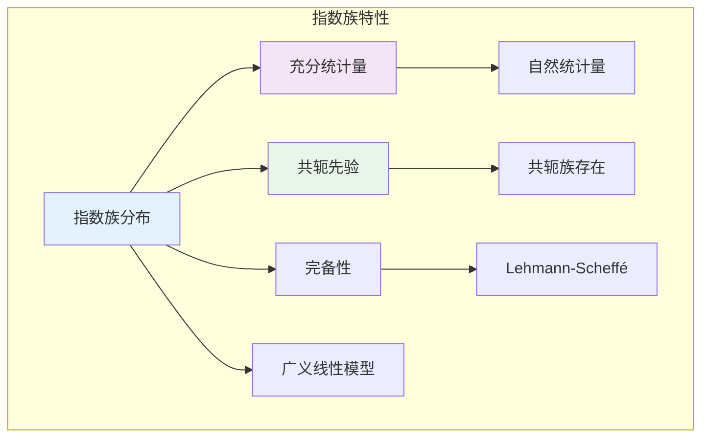

# 9.5.3 指数族

## 9.5.3.1 引言

**指数族**（Exponential Family）是统计中最重要的分布类之一，包含了正态、泊松、二项、指数、伽马等常见分布。指数族具有良好的数学性质，如充分统计量的存在性和共轭先验的便利性。



---

## 9.5.3.2 指数族的定义

### 9.5.3.2.1 标准形式

**定义 9.5.3.1**（指数族，Exponential Family）

概率密度/质量函数可表示为以下形式的分布族称为**指数族**：

$$f(x | \theta) = h(x) \exp\left(\sum_{i=1}^{k} \eta_i(\theta) T_i(x) - A(\theta)\right)$$

或等价地：

$$f(x | \eta) = h(x) \exp\left(\eta^T T(x) - A(\eta)\right)$$

其中：

- $T(x) = (T_1(x), \ldots, T_k(x))$：**充分统计量/自然统计量**
- $\eta = (\eta_1, \ldots, \eta_k)$：**自然参数**
- $h(x)$：基础测度
- $A(\eta)$：**对数配分函数**（Log Partition Function），确保归一化

### 9.5.3.2.2 自然形式

**定义 9.5.3.2**（自然指数族）

当 $\eta_i(\theta) = \theta_i$ 时，称为**自然形式**或**标准形式**：

$$f(x | \theta) = h(x) \exp\left(\theta^T T(x) - A(\theta)\right)$$

---

## 9.5.3.3 指数族的性质

### 9.5.3.3.1 矩生成

**定理 9.5.3.3**（矩生成性质）

对于自然指数族：

$$E[T(X)] = \nabla A(\theta)$$
$$\text{Cov}(T(X)) = \nabla^2 A(\theta)$$

即 $A(\theta)$ 的一阶导给出期望，二阶导给出协方差。

**证明：**

由归一化条件：
$$\int h(x) \exp(\theta^T T(x) - A(\theta)) dx = 1$$

对 $\theta$ 求导：
$$\int T(x) h(x) \exp(\theta^T T(x) - A(\theta)) dx - \nabla A(\theta) \int h(x) \exp(\theta^T T(x) - A(\theta)) dx = 0$$

即 $E[T(X)] - \nabla A(\theta) = 0$。

二阶导类似可得协方差。

**证毕。**

### 9.5.3.3.2 充分性与完备性

**定理 9.5.3.4**（指数族的充分完备统计量）

对于来自指数族的 i.i.d. 样本 $X_1, \ldots, X_n$，统计量：

$$\sum_{j=1}^{n} T(X_j)$$

是**充分且完备**的（在自然参数空间有内点的情况下）。

---

## 9.5.3.4 常见指数族分布

### 9.5.3.4.1 正态分布

**正态分布** $N(\mu, \sigma^2)$ 是双参数指数族：

$$f(x | \mu, \sigma^2) = \frac{1}{\sqrt{2\pi\sigma^2}} \exp\left(-\frac{(x-\mu)^2}{2\sigma^2}\right)$$

重写为指数族形式：
$$= \exp\left(\frac{\mu}{\sigma^2}x - \frac{1}{2\sigma^2}x^2 - \frac{\mu^2}{2\sigma^2} - \frac{1}{2}\ln(2\pi\sigma^2)\right)$$

- 自然统计量：$(X, X^2)$
- 自然参数：$(\mu/\sigma^2, -1/(2\sigma^2))$
- 对数配分函数：$A(\eta) = -\frac{\eta_1^2}{4\eta_2} - \frac{1}{2}\ln(-2\eta_2) - \frac{1}{2}\ln(2\pi)$

### 9.5.3.4.2 泊松分布

**泊松分布**：
$$f(x | \lambda) = \frac{e^{-\lambda} \lambda^x}{x!} = \frac{1}{x!} \exp(x \ln\lambda - \lambda)$$

- 自然统计量：$X$
- 自然参数：$\eta = \ln\lambda$
- 对数配分函数：$A(\eta) = e^{\eta}$

验证：$E[X] = A'(\eta) = e^{\eta} = \lambda$

### 9.5.3.4.3 二项分布

**二项分布**：
$$f(x | p) = \binom{n}{x} p^x (1-p)^{n-x} = \binom{n}{x} \exp\left(x \ln\frac{p}{1-p} + n \ln(1-p)\right)$$

- 自然统计量：$X$
- 自然参数：$\eta = \ln\frac{p}{1-p}$（logit函数）
- 对数配分函数：$A(\eta) = n \ln(1 + e^{\eta})$

---

## 9.5.3.5 广义线性模型

**定义 9.5.3.5**（广义线性模型，GLM）

GLM由三部分组成：

1. **随机成分**：$Y_i \sim$ 指数族分布
2. **系统成分**：线性预测器 $\eta_i = X_i^T \beta$
3. **连接函数**：$g(\mu_i) = \eta_i$，其中 $\mu_i = E[Y_i]$

**定理 9.5.3.6**（典型连接函数）

对于指数族，**典型连接** $g$ 使得 $\eta = \theta$（自然参数）：

| 分布 | 典型连接 | 名称 |
|-----|---------|-----|
| 正态 | $g(\mu) = \mu$ | 恒等 |
| 泊松 | $g(\mu) = \ln\mu$ | 对数 |
| 二项 | $g(\mu) = \ln\frac{\mu}{1-\mu}$ | Logit |
| 伽马 | $g(\mu) = -\frac{1}{\mu}$ | 倒数 |

---

## 9.5.3.6 代码实现

```python
import numpy as np
from scipy import stats
from scipy.special import logsumexp, digamma, polygamma
from typing import Tuple, Callable, Dict

class ExponentialFamily:
    """指数族分布工具"""

    @staticmethod
    def normal_in_exponential_form(x: np.ndarray, mu: float, sigma: float) -> Dict:
        """
        正态分布的指数族形式

        f(x) = exp(η₁T₁ + η₂T₂ - A(η)) · h(x)
        """
        # 自然参数
        eta_1 = mu / (sigma**2)
        eta_2 = -1 / (2 * sigma**2)

        # 充分统计量
        T_1 = x
        T_2 = x**2

        # 对数配分函数
        A_eta = (eta_1**2) / (-4 * eta_2) + 0.5 * np.log(-np.pi / eta_2)

        # 基础测度
        h_x = 1 / np.sqrt(2 * np.pi)

        return {
            'natural_parameters': (eta_1, eta_2),
            'sufficient_statistics': (T_1, T_2),
            'log_partition': A_eta,
            'base_measure': h_x
        }

    @staticmethod
    def poisson_in_exponential_form(x: int, lam: float) -> Dict:
        """
        泊松分布的指数族形式

        f(x) = exp(ηT(x) - A(η)) · h(x)
        """
        eta = np.log(lam)  # 自然参数
        T_x = x  # 充分统计量
        A_eta = np.exp(eta)  # 对数配分函数 = λ
        h_x = 1 / np.math.factorial(x)  # 基础测度

        return {
            'natural_parameter': eta,
            'sufficient_statistic': T_x,
            'log_partition': A_eta,
            'base_measure': h_x
        }

    @staticmethod
    def binomial_in_exponential_form(x: int, n: int, p: float) -> Dict:
        """
        二项分布的指数族形式
        """
        eta = np.log(p / (1 - p))  # logit
        T_x = x
        A_eta = n * np.log(1 + np.exp(eta))
        h_x = comb(n, x, exact=True)

        return {
            'natural_parameter': eta,
            'sufficient_statistic': T_x,
            'log_partition': A_eta,
            'base_measure': h_x
        }

    @staticmethod
    def compute_moments_from_log_partition(log_partition: Callable,
                                           eta: float,
                                           h: float = 1e-5) -> Tuple[float, float]:
        """
        数值计算对数配分函数的导数（矩）

        Returns:
            (均值, 方差)
        """
        # 一阶导数（均值）
        A_plus = log_partition(eta + h)
        A_minus = log_partition(eta - h)
        mean = (A_plus - A_minus) / (2 * h)

        # 二阶导数（方差）
        A_2plus = log_partition(eta + h)
        A_center = log_partition(eta)
        A_2minus = log_partition(eta - h)
        variance = (A_2plus - 2*A_center + A_2minus) / (h**2)

        return mean, variance


class GeneralizedLinearModel:
    """广义线性模型基础"""

    @staticmethod
    def canonical_link(family: str) -> Callable:
        """
        返回典型连接函数及其逆函数

        Returns:
            (g, g_inverse)
        """
        if family == 'gaussian':
            return lambda mu: mu, lambda eta: eta

        elif family == 'poisson':
            return lambda mu: np.log(mu), lambda eta: np.exp(eta)

        elif family == 'binomial':
            # logit
            g = lambda mu: np.log(mu / (1 - mu))
            g_inv = lambda eta: 1 / (1 + np.exp(-eta))
            return g, g_inv

        elif family == 'gamma':
            # reciprocal
            return lambda mu: -1/mu, lambda eta: -1/eta

        else:
            raise ValueError(f"Unknown family: {family}")

    @staticmethod
    def variance_function(family: str, mu: float) -> float:
        """
        方差函数 V(μ)
        """
        if family == 'gaussian':
            return 1
        elif family == 'poisson':
            return mu
        elif family == 'binomial':
            return mu * (1 - mu)
        elif family == 'gamma':
            return mu**2
        else:
            raise ValueError(f"Unknown family: {family}")


# 使用示例
if __name__ == "__main__":
    print("=" * 60)
    print("指数族示例")
    print("=" * 60)

    np.random.seed(42)

    # 1. 正态分布的指数族形式
    print("\n1. 正态分布的指数族表示")
    print("-" * 40)

    x = np.array([1.5])
    mu, sigma = 0, 1

    ef_normal = ExponentialFamily.normal_in_exponential_form(x, mu, sigma)
    print(f"   自然参数: η₁ = {ef_normal['natural_parameters'][0]:.2f}, "
          f"η₂ = {ef_normal['natural_parameters'][1]:.4f}")
    print(f"   充分统计量: T₁ = x, T₂ = x²")
    print(f"   对数配分函数: A(η) = {ef_normal['log_partition']:.4f}")

    # 2. 泊松分布
    print("\n2. 泊松分布的指数族表示")
    print("-" * 40)

    lam = 3.5
    ef_pois = ExponentialFamily.poisson_in_exponential_form(5, lam)

    print(f"   λ = {lam}")
    print(f"   自然参数: η = ln(λ) = {ef_pois['natural_parameter']:.4f}")
    print(f"   充分统计量: T(X) = X")
    print(f"   对数配分函数: A(η) = e^η = {ef_pois['log_partition']:.4f}")

    # 验证矩
    def poisson_log_partition(eta):
        return np.exp(eta)

    mean_est, var_est = ExponentialFamily.compute_moments_from_log_partition(
        poisson_log_partition, np.log(lam)
    )
    print(f"   数值计算 E[X] ≈ {mean_est:.4f} (理论: {lam})")
    print(f"   数值计算 Var(X) ≈ {var_est:.4f} (理论: {lam})")

    # 3. 二项分布与Logit
    print("\n3. 二项分布与Logit连接")
    print("-" * 40)

    n, p, x = 10, 0.3, 3
    ef_binom = ExponentialFamily.binomial_in_exponential_form(x, n, p)

    print(f"   n = {n}, p = {p}")
    print(f"   自然参数: η = logit(p) = ln(p/(1-p)) = {ef_binom['natural_parameter']:.4f}")
    print(f"   充分统计量: T(X) = X")
    print(f"   对数配分函数: A(η) = n·ln(1+e^η) = {ef_binom['log_partition']:.4f}")

    # 4. 广义线性模型的连接函数
    print("\n4. 典型连接函数")
    print("-" * 40)

    families = ['gaussian', 'poisson', 'binomial', 'gamma']
    test_mu = 0.7

    for family in families:
        g, g_inv = GeneralizedLinearModel.canonical_link(family)
        eta = g(test_mu)
        mu_back = g_inv(eta)

        print(f"   {family:10s}: g({test_mu}) = {eta:.4f}, g⁻¹({eta:.4f}) = {mu_back:.4f}")
