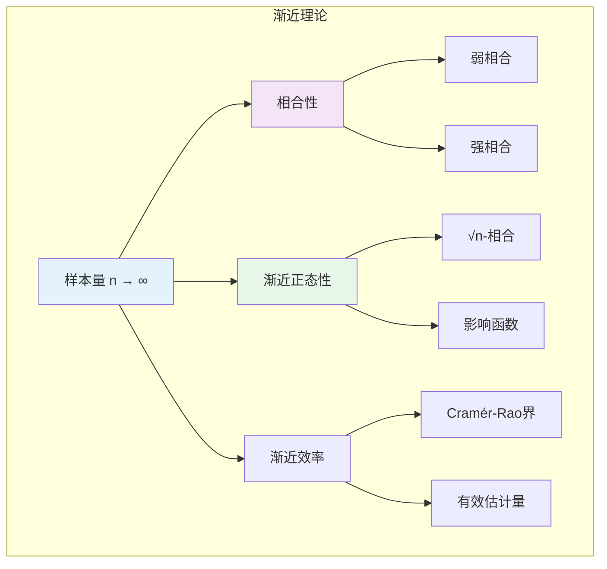

# 9.5.4 渐近理论

## 9.5.4.1 引言

**渐近理论**（Asymptotic Theory）研究当样本量趋于无穷时统计量的极限行为。
它为统计推断提供了理论基础，特别是在有限样本理论难以处理的情况下。
本章介绍相合性、渐近正态性和渐近效率的形式化理论。



---

## 9.5.4.2 相合性

### 9.5.4.2.1 相合性的定义

**定义 9.5.4.1**（相合性，Consistency）

估计量序列 $\{\hat{\theta}_n\}$ 称为**相合的**，如果：

$$\hat{\theta}_n \stackrel{P}{\to} \theta_0, \quad n \to \infty$$

即对于任意 $\varepsilon > 0$：
$$\lim_{n \to \infty} P(|\hat{\theta}_n - \theta_0| > \varepsilon) = 0$$

若几乎必然收敛，称为**强相合**：$\hat{\theta}_n \stackrel{a.s.}{\to} \theta_0$。

### 9.5.4.2.2 相合性的充分条件

**定理 9.5.4.2**（MSE相合性）

若 $\lim_{n \to \infty} \text{MSE}(\hat{\theta}_n) = 0$，则 $\hat{\theta}_n$ 弱相合。

**证明：**

由切比雪夫不等式：
$$P(|\hat{\theta}_n - \theta_0| > \varepsilon) \leq \frac{E[(\hat{\theta}_n - \theta_0)^2]}{\varepsilon^2} = \frac{\text{MSE}(\hat{\theta}_n)}{\varepsilon^2} \to 0$$

**证毕。**

**定理 9.5.4.3**（连续映射定理）

若 $\hat{\theta}_n \stackrel{P}{\to} \theta$，$g$ 在 $\theta$ 处连续，则：
$$g(\hat{\theta}_n) \stackrel{P}{\to} g(\theta)$$

---

## 9.5.4.3 渐近正态性

### 9.5.4.3.1 定义

**定义 9.5.4.4**（渐近正态性，Asymptotic Normality）

估计量 $\hat{\theta}_n$ 称为**渐近正态的**，如果存在序列 $\{V_n\}$（通常 $V_n = \sqrt{n}$）使得：

$$V_n(\hat{\theta}_n - \theta_0) \stackrel{d}{\to} N(0, \Sigma)$$

对于标量情形：$\sqrt{n}(\hat{\theta}_n - \theta_0) \stackrel{d}{\to} N(0, \sigma^2)$

### 9.5.4.3.2 MLE的渐近正态性

**定理 9.5.4.5**（MLE的渐近正态性）

在正则条件下，MLE $\hat{\theta}_n$ 满足：

$$\sqrt{n}(\hat{\theta}_n - \theta_0) \stackrel{d}{\to} N(0, I(\theta_0)^{-1})$$

其中 $I(\theta_0)$ 是Fisher信息矩阵。

**证明思路：**

1. 泰勒展开得分函数在 $\hat{\theta}_n$ 处：
   $$0 = U_n(\hat{\theta}_n) \approx U_n(\theta_0) + U_n'(\theta_0)(\hat{\theta}_n - \theta_0)$$

2. 其中 $U_n(\theta) = \frac{1}{n}\sum_{i=1}^{n} \frac{\partial \ln f(X_i | \theta)}{\partial \theta}$

3. 由CLT：$\sqrt{n} U_n(\theta_0) \stackrel{d}{\to} N(0, I(\theta_0))$

4. 由大数定律：$-U_n'(\theta_0) \stackrel{P}{\to} I(\theta_0)$

5. 由Slutsky定理：
   $$\sqrt{n}(\hat{\theta}_n - \theta_0) \approx \sqrt{n} U_n(\theta_0) / (-U_n'(\theta_0)) \stackrel{d}{\to} N(0, I(\theta_0)^{-1})$$

**证毕。**

---

## 9.5.4.4 渐近效率

### 9.5.4.4.1 Cramér-Rao下界

**定理 9.5.4.6**（Cramér-Rao不等式）

在正则条件下，任何无偏估计量 $\hat{\theta}$ 满足：

$$\text{Var}(\hat{\theta}) \geq \frac{1}{n I(\theta)}$$

**定义 9.5.4.7**（渐近效率）

渐近正态估计量 $\hat{\theta}_n$ 称为**渐近有效的**，如果：

$$\sqrt{n}(\hat{\theta}_n - \theta_0) \stackrel{d}{\to} N(0, I(\theta_0)^{-1})$$

即达到Cramér-Rao下界。

### 9.5.4.4.2 渐近相对效率

**定义 9.5.4.8**（渐近相对效率，ARE）

设 $\hat{\theta}_n^{(1)}$ 和 $\hat{\theta}_n^{(2)}$ 都是渐近正态的：
$$\sqrt{n}(\hat{\theta}_n^{(i)} - \theta) \stackrel{d}{\to} N(0, \sigma_i^2)$$

则 $\hat{\theta}^{(1)}$ 相对于 $\hat{\theta}^{(2)}$ 的**渐近相对效率**为：
$$\text{ARE}(\hat{\theta}^{(1)}, \hat{\theta}^{(2)}) = \frac{\sigma_2^2}{\sigma_1^2}$$

---

## 9.5.4.5 Delta方法

**定理 9.5.4.9**（Delta方法）

设 $\sqrt{n}(\hat{\theta}_n - \theta_0) \stackrel{d}{\to} N(0, \sigma^2)$，$g$ 在 $\theta_0$ 处可导，$g'(\theta_0) \neq 0$，则：

$$\sqrt{n}(g(\hat{\theta}_n) - g(\theta_0)) \stackrel{d}{\to} N(0, [g'(\theta_0)]^2 \sigma^2)$$

**证明：**

泰勒展开：
$$g(\hat{\theta}_n) = g(\theta_0) + g'(\theta_0)(\hat{\theta}_n - \theta_0) + o_p(|\hat{\theta}_n - \theta_0|)$$

乘以 $\sqrt{n}$：
$$\sqrt{n}(g(\hat{\theta}_n) - g(\theta_0)) = g'(\theta_0)\sqrt{n}(\hat{\theta}_n - \theta_0) + o_p(1)$$

由Slutsky定理即得结论。

**证毕。**

---

## 9.5.4.6 代码实现

```python
import numpy as np
from scipy import stats
from typing import Callable, Tuple, Dict

class AsymptoticTheory:
    """渐近理论数值验证"""

    @staticmethod
    def demonstrate_consistency(true_param: float,
                                estimator_func: Callable,
                                sample_sizes: np.ndarray,
                                n_replications: int = 1000) -> Dict:
        """
        验证估计量的相合性

        Returns:
            各样本量下的偏差和MSE
        """
        results = {'n': [], 'bias': [], 'mse': [], 'std': []}

        for n in sample_sizes:
            estimates = []
            for _ in range(n_replications):
                # 生成样本（这里假设正态分布）
                sample = np.random.normal(true_param, 1, n)
                est = estimator_func(sample)
                estimates.append(est)

            estimates = np.array(estimates)
            results['n'].append(n)
            results['bias'].append(np.mean(estimates) - true_param)
            results['mse'].append(np.mean((estimates - true_param)**2))
            results['std'].append(np.std(estimates))

        return results

    @staticmethod
    def demonstrate_asymptotic_normality(true_param: float,
                                         estimator_func: Callable,
                                         n: int,
                                         n_replications: int = 5000) -> Dict:
        """
        验证渐近正态性

        Returns:
            标准化估计量的统计量
        """
        standardized_estimates = []

        for _ in range(n_replications):
            sample = np.random.normal(true_param, 1, n)
            est = estimator_func(sample)
            # 对于样本均值，标准化因子是 √n
            standardized = np.sqrt(n) * (est - true_param)
            standardized_estimates.append(standardized)

        standardized_estimates = np.array(standardized_estimates)

        # 正态性检验
        shapiro_stat, shapiro_p = stats.shapiro(standardized_estimates[:min(5000, n_replications)])

        return {
            'mean': np.mean(standardized_estimates),
            'std': np.std(standardized_estimates),
            'skewness': stats.skew(standardized_estimates),
            'kurtosis': stats.kurtosis(standardized_estimates),
            'shapiro_pvalue': shapiro_p
        }

    @staticmethod
    def delta_method_demo(g: Callable, g_prime: Callable,
                          theta0: float, sigma: float,
                          n: int, n_replications: int = 5000) -> Dict:
        """
        Delta方法验证

        比较变换后估计量的经验方差与理论渐近方差
        """
        g_estimates = []

        for _ in range(n_replications):
            sample = np.random.normal(theta0, sigma, n)
            theta_hat = np.mean(sample)
            g_estimates.append(g(theta_hat))

        g_estimates = np.array(g_estimates)

        # 经验方差（乘以n转换为渐近方差）
        empirical_asymptotic_var = n * np.var(g_estimates, ddof=1)

        # 理论渐近方差
        theoretical_asymptotic_var = (g_prime(theta0)**2) * (sigma**2)

        return {
            'empirical_var_n': empirical_asymptotic_var,
            'theoretical_var': theoretical_asymptotic_var,
            'ratio': empirical_asymptotic_var / theoretical_asymptotic_var,
            'g_theta0': g(theta0),
            'mean_g_estimate': np.mean(g_estimates)
        }


class EfficiencyComparison:
    """效率比较"""

    @staticmethod
    def compare_estimators(estimators: Dict[str, Callable],
                          true_param: float,
                          n: int,
                          n_replications: int = 1000) -> Dict:
        """
        比较多个估计量的渐近效率
        """
        results = {}

        for name, estimator in estimators.items():
            estimates = []
            for _ in range(n_replications):
                sample = np.random.normal(true_param, 1, n)
                est = estimator(sample)
                estimates.append(est)

            estimates = np.array(estimates)
            asymptotic_var = n * np.var(estimates, ddof=1)

            results[name] = {
                'asymptotic_variance': asymptotic_var,
                'mle_efficiency': 1 / asymptotic_var  # MLE的渐近方差为1
            }

        # 计算相对效率
        baseline_var = results[list(estimators.keys())[0]]['asymptotic_variance']
        for name in results:
            results[name]['relative_efficiency'] = baseline_var / results[name]['asymptotic_variance']

        return results


# 使用示例
if __name__ == "__main__":
    print("=" * 60)
    print("渐近理论示例")
    print("=" * 60)

    np.random.seed(42)
    at = AsymptoticTheory()

    # 1. 相合性验证
    print("\n1. 样本均值的相合性")
    print("-" * 40)

    true_mu = 5
    sample_sizes = [10, 50, 100, 500, 1000]

    consistency_results = at.demonstrate_consistency(
        true_mu, np.mean, sample_sizes
    )

    print(f"   真实参数: μ = {true_mu}")
    print(f"   {'n':>8s} {'偏差':>10s} {'MSE':>10s}")
    for n, bias, mse in zip(consistency_results['n'],
                            consistency_results['bias'],
                            consistency_results['mse']):
        print(f"   {n:>8d} {bias:>10.4f} {mse:>10.4f}")

    # 2. 渐近正态性验证
    print("\n2. 样本均值的渐近正态性 (n=100)")
    print("-" * 40)

    normality_results = at.demonstrate_asymptotic_normality(
        true_mu, np.mean, n=100
    )

    print(f"   标准化估计量统计:")
    print(f"   均值: {normality_results['mean']:.4f} (理论: 0)")
    print(f"   标准差: {normality_results['std']:.4f} (理论: 1)")
    print(f"   偏度: {normality_results['skewness']:.4f} (理论: 0)")
    print(f"   Shapiro检验p值: {normality_results['shapiro_pvalue']:.4f}")

    # 3. Delta方法
    print("\n3. Delta方法验证")
    print("-" * 40)

    # g(x) = exp(x), 应用于正态均值
    g = np.exp
    g_prime = np.exp

    delta_results = at.delta_method_demo(g, g_prime, theta0=0, sigma=1, n=100)

    print(f"   g(θ) = exp(θ), θ₀ = 0")
    print(f"   理论渐近方差: [g'(θ₀)]²σ² = {delta_results['theoretical_var']:.4f}")
    print(f"   经验渐近方差: {delta_results['empirical_var_n']:.4f}")
    print(f"   比值: {delta_results['ratio']:.4f}")

    # 4. 效率比较
    print("\n4. 估计量效率比较")
    print("-" * 40)

    # 定义不同估计量
    estimators = {
        'sample_mean': np.mean,
        'sample_median': np.median,
        'trimmed_mean_10': lambda x: stats.trim_mean(x, 0.1),
        'trimmed_mean_25': lambda x: stats.trim_mean(x, 0.25),
    }

    efficiency_results = EfficiencyComparison.compare_estimators(
        estimators, true_mu, n=100
    )

    print(f"   {'估计量':>20s} {'渐近方差':>12s} {'相对效率':>12s}")
    for name, result in efficiency_results.items():
        print(f"   {name:>20s} {result['asymptotic_variance']:>12.4f} "
              f"{result['relative_efficiency']:>12.4f}")
