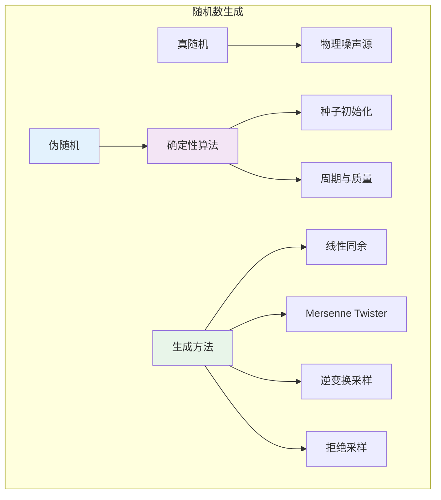

# 9.6.1 随机数生成

## 9.6.1.1 引言

**随机数生成**是统计计算的基石。现代统计方法，特别是蒙特卡洛模拟和贝叶斯计算，依赖于高质量的伪随机数。本章介绍伪随机数生成器的原理、常见算法和统计检验方法。



---

## 9.6.1.2 伪随机数生成器

### 9.6.1.2.1 定义与性质

**定义 9.6.1.1**（伪随机数生成器，PRNG）

**伪随机数生成器**是确定性算法 $f: S \to S$，将状态 $s_n$ 映射到新状态 $s_{n+1}$，输出 $u_n = g(s_n) \in [0, 1]$。

**良好PRNG的性质**：

1. **长周期**：避免序列重复
2. **均匀性**：输出近似Uniform(0,1)
3. **独立性**：输出近似独立
4. **高效性**：计算快速
5. **可重复性**：给定种子可重现

### 9.6.1.2.2 线性同余生成器

**定义 9.6.1.2**（线性同余生成器，LCG）

$$X_{n+1} = (a X_n + c) \mod m$$
$$U_n = X_n / m$$

其中：

- $m$：模数（通常 $2^{31}-1$ 或 $2^{32}$）
- $a$：乘数
- $c$：增量
- $X_0$：种子

**Hull-Dobell定理**：LCG达到满周期 $m$ 当且仅当：

1. $c$ 与 $m$ 互质
2. $a - 1$ 被 $m$ 的所有质因子整除
3. 若 $4 | m$，则 $4 | (a - 1)$

### 9.6.1.2.3 Mersenne Twister

**定义 9.6.1.3**（Mersenne Twister）

Mersenne Twister（MT19937）是目前最广泛使用的PRNG，周期为 $2^{19937} - 1$（梅森素数），具有良好的统计性质。

**特点**：

- 623维均匀分布
- 周期极长
- 计算效率高
- 被广泛测试和采用

---

## 9.6.1.3 随机变量采样方法

### 9.6.1.3.1 逆变换采样

**定理 9.6.1.4**（逆变换采样）

设 $U \sim \text{Uniform}(0, 1)$，$F$ 为任意CDF，则 $X = F^{-1}(U)$ 的CDF为 $F$。

**证明：**
$$P(X \leq x) = P(F^{-1}(U) \leq x) = P(U \leq F(x)) = F(x)$$

**证毕。**

**适用分布**：指数、均匀、Logistic、柯西等有闭式逆CDF的分布。

### 9.6.1.3.2 拒绝采样

**算法 9.6.1.5**（拒绝采样）

目标：从 $f(x)$ 采样，已知提议分布 $g(x)$ 且 $f(x) \leq M g(x)$

1. 从 $g(x)$ 生成 $Y$
2. 从 Uniform(0,1) 生成 $U$
3. 若 $U \leq f(Y) / (M g(Y))$，接受 $X = Y$；否则返回步骤1

**定理 9.6.1.6**（拒绝采样的正确性）

拒绝采样生成的样本服从 $f(x)$。

**接受率**：$1/M$

---

## 9.6.1.4 蒙特卡洛方法

### 9.6.1.4.1 蒙特卡洛积分

**定理 9.6.1.7**（蒙特卡洛积分）

设 $X_1, \ldots, X_n \stackrel{iid}{\sim} f$，则：

$$\hat{I}_n = \frac{1}{n} \sum_{i=1}^{n} h(X_i) \stackrel{a.s.}{\to} \int h(x) f(x) dx = I$$

**误差分析**：$\text{Var}(\hat{I}_n) = \frac{1}{n}\text{Var}(h(X))$，RMSE $= O(n^{-1/2})$

### 9.6.1.4.2 方差缩减技术

**对偶变量法**：
若 $U$ 和 $1-U$ 负相关，则 $\frac{h(U) + h(1-U)}{2}$ 方差更小。

**重要性采样**：
$$\int h(x) f(x) dx = \int h(x) \frac{f(x)}{g(x)} g(x) dx$$
从 $g(x)$ 采样，加权 $w(x) = f(x)/g(x)$。

---

## 9.6.1.5 随机数检验

### 9.6.1.5.1 统计检验

**卡方拟合优度检验**：
将 $[0, 1]$ 分为 $k$ 个区间，检验观测频数与期望频数（$n/k$）的差异。

**游程检验**（Runs Test）：
检验序列中单调递增/递减子序列的长度分布。

**间隔检验**（Gap Test）：
检验特定数字出现间隔的分布。

---

## 9.6.1.6 代码实现

```python
import numpy as np
from scipy import stats
from scipy.special import gammainc
import matplotlib.pyplot as plt
from typing import Callable, Tuple

class PRNG:
    """伪随机数生成器实现"""

    def __init__(self, seed: int = 42):
        self.seed = seed
        self.state = seed

    def lcg(self, a: int = 1664525, c: int = 1013904223,
            m: int = 2**32, n: int = 1000) -> np.ndarray:
        """
        线性同余生成器

        默认参数来自Numerical Recipes
        """
        numbers = []
        x = self.state

        for _ in range(n):
            x = (a * x + c) % m
            numbers.append(x / m)

        self.state = x
        return np.array(numbers)

    def mid_square(self, n_digits: int = 4, n: int = 100) -> np.ndarray:
        """
        平方取中法（Von Neumann）
        历史意义，实际不推荐
        """
        numbers = []
        x = self.seed

        for _ in range(n):
            x_squared = x ** 2
            x_str = str(x_squared).zfill(2 * n_digits)
            mid = len(x_str) // 2 - n_digits // 2
            x = int(x_str[mid:mid + n_digits])
            numbers.append(x / (10 ** n_digits))

        return np.array(numbers)


class RandomVariableSampling:
    """随机变量采样方法"""

    @staticmethod
    def inverse_transform(cdf_inv: Callable, n: int = 1000,
                         seed: int = 42) -> np.ndarray:
        """
        逆变换采样

        Args:
            cdf_inv: 逆CDF函数
        """
        rng = np.random.default_rng(seed)
        u = rng.random(n)
        return cdf_inv(u)

    @staticmethod
    def exponential_sampling(lam: float, n: int = 1000, seed: int = 42) -> np.ndarray:
        """
        指数分布采样（逆变换）

        F(x) = 1 - e^(-λx)
        F^(-1)(u) = -ln(1-u)/λ
        """
        def cdf_inv(u):
            return -np.log(1 - u) / lam

        return RandomVariableSampling.inverse_transform(cdf_inv, n, seed)

    @staticmethod
    def cauchy_sampling(loc: float = 0, scale: float = 1,
                       n: int = 1000, seed: int = 42) -> np.ndarray:
        """
        柯西分布采样（逆变换）

        F(x) = 1/2 + arctan((x-loc)/scale)/π
        F^(-1)(u) = loc + scale·tan(π(u-1/2))
        """
        def cdf_inv(u):
            return loc + scale * np.tan(np.pi * (u - 0.5))

        return RandomVariableSampling.inverse_transform(cdf_inv, n, seed)

    @staticmethod
    def rejection_sampling(target_pdf: Callable, proposal_pdf: Callable,
                          proposal_sampler: Callable, M: float,
                          n: int = 1000, seed: int = 42) -> np.ndarray:
        """
        拒绝采样

        Args:
            target_pdf: 目标密度
            proposal_pdf: 提议密度
            proposal_sampler: 提议分布采样函数
            M: 上界常数，target_pdf(x) <= M * proposal_pdf(x)
        """
        rng = np.random.default_rng(seed)
        samples = []

        while len(samples) < n:
            y = proposal_sampler()
            u = rng.random()

            if u <= target_pdf(y) / (M * proposal_pdf(y)):
                samples.append(y)

        return np.array(samples)

    @staticmethod
    def box_muller(n: int = 1000, seed: int = 42) -> Tuple[np.ndarray, np.ndarray]:
        """
        Box-Muller变换生成标准正态分布

        若 U₁, U₂ ~ Uniform(0,1) 独立，则:
        Z₁ = √(-2lnU₁) · cos(2πU₂)
        Z₂ = √(-2lnU₁) · sin(2πU₂)
        为独立标准正态
        """
        rng = np.random.default_rng(seed)

        # 需要偶数个样本
        n_pairs = n // 2

        u1 = rng.random(n_pairs)
        u2 = rng.random(n_pairs)

        r = np.sqrt(-2 * np.log(u1))
        theta = 2 * np.pi * u2

        z1 = r * np.cos(theta)
        z2 = r * np.sin(theta)

        return np.concatenate([z1, z2])[:n]


class MonteCarloIntegration:
    """蒙特卡洛积分"""

    @staticmethod
    def basic_mc_integrate(func: Callable, a: float, b: float,
                          n: int = 10000, seed: int = 42) -> Tuple[float, float]:
        """
        基本蒙特卡洛积分

        ∫[a,b] f(x) dx ≈ (b-a)/n · Σf(Xᵢ)

        Returns:
            (估计值, 标准误)
        """
        rng = np.random.default_rng(seed)
        x = rng.uniform(a, b, n)

        values = func(x)
        estimate = (b - a) * np.mean(values)
        se = (b - a) * np.std(values, ddof=1) / np.sqrt(n)

        return estimate, se

    @staticmethod
    def importance_sampling(func: Callable, target_pdf: Callable,
                           proposal_pdf: Callable, proposal_sampler: Callable,
                           n: int = 10000, seed: int = 42) -> Tuple[float, float]:
        """
        重要性采样

        ∫f(x)p(x)dx = ∫f(x)[p(x)/q(x)]q(x)dx
        """
        rng = np.random.default_rng(seed)
        x = proposal_sampler(n)

        weights = target_pdf(x) / proposal_pdf(x)
        weighted_values = func(x) * weights

        estimate = np.mean(weighted_values)
        se = np.std(weighted_values, ddof=1) / np.sqrt(n)

        return estimate, se


class RandomnessTests:
    """随机性检验"""

    @staticmethod
    def chi_square_uniformity_test(samples: np.ndarray, n_bins: int = 10) -> Tuple[float, float]:
        """
        卡方均匀性检验

        Returns:
            (统计量, p值)
        """
        observed, _ = np.histogram(samples, bins=n_bins, range=(0, 1))
        expected = len(samples) / n_bins

        chi2_stat = np.sum((observed - expected)**2 / expected)
        df = n_bins - 1
        p_value = 1 - stats.chi2.cdf(chi2_stat, df)

        return chi2_stat, p_value

    @staticmethod
    def runs_test(samples: np.ndarray) -> Tuple[float, float]:
        """
        游程检验（简单版本）

        检验序列的随机性
        """
        # 转换为二元序列（相对于中位数）
        median = np.median(samples)
        binary = (samples > median).astype(int)

        # 计算游程数
        runs = 1
        for i in range(1, len(binary)):
            if binary[i] != binary[i-1]:
                runs += 1

        n1 = np.sum(binary)
        n2 = len(binary) - n1

        # 期望游程数和方差
        expected_runs = (2 * n1 * n2) / (n1 + n2) + 1
        var_runs = (2 * n1 * n2 * (2 * n1 * n2 - n1 - n2)) / \
                   ((n1 + n2)**2 * (n1 + n2 - 1))

        # Z统计量
        z_stat = (runs - expected_runs) / np.sqrt(var_runs)
        p_value = 2 * (1 - stats.norm.cdf(abs(z_stat)))

        return z_stat, p_value


# 使用示例
if __name__ == "__main__":
    print("=" * 60)
    print("随机数生成示例")
    print("=" * 60)

    np.random.seed(42)

    # 1. LCG
    print("\n1. 线性同余生成器")
    print("-" * 40)

    prng = PRNG(seed=12345)
    lcg_samples = prng.lcg(n=1000)

    print(f"   生成1000个Uniform(0,1)")
    print(f"   样本均值: {np.mean(lcg_samples):.4f} (理论: 0.5)")
    print(f"   样本方差: {np.var(lcg_samples):.4f} (理论: 1/12 ≈ 0.083)")

    # 均匀性检验
    chi2_stat, p_val = RandomnessTests.chi_square_uniformity_test(lcg_samples)
    print(f"   卡方均匀性检验: χ² = {chi2_stat:.4f}, p = {p_val:.4f}")

    # 2. 逆变换采样
    print("\n2. 指数分布采样（逆变换）")
    print("-" * 40)

    exp_samples = RandomVariableSampling.exponential_sampling(lam=2, n=10000)
    print(f"   λ = 2, n = 10000")
    print(f"   样本均值: {np.mean(exp_samples):.4f} (理论: 0.5)")
    print(f"   样本标准差: {np.std(exp_samples):.4f} (理论: 0.5)")

    # 3. Box-Muller
    print("\n3. Box-Muller变换（标准正态）")
    print("-" * 40)

    normal_samples = RandomVariableSampling.box_muller(n=10000)
    print(f"   样本均值: {np.mean(normal_samples):.4f} (理论: 0)")
    print(f"   样本标准差: {np.std(normal_samples):.4f} (理论: 1)")
    print(f"   偏度: {stats.skew(normal_samples):.4f} (理论: 0)")
    print(f"   峰度: {stats.kurtosis(normal_samples):.4f} (理论: 0)")

    # 4. 蒙特卡洛积分
    print("\n4. 蒙特卡洛积分")
    print("-" * 40)

    # 积分: ∫[0,1] x^2 dx = 1/3
    def f(x):
        return x**2

    estimate, se = MonteCarloIntegration.basic_mc_integrate(f, 0, 1, n=100000)
    print(f"   ∫[0,1] x² dx")
    print(f"   MC估计: {estimate:.6f} (理论: 0.333333)")
    print(f"   标准误: {se:.6f}")

    # 积分: ∫[0,1] e^x dx = e - 1
    def g(x):
        return np.exp(x)

    estimate, se = MonteCarloIntegration.basic_mc_integrate(g, 0, 1, n=100000)
    print(f"   ∫[0,1] e^x dx")
    print(f"   MC估计: {estimate:.6f} (理论: {np.e - 1:.6f})")
    print(f"   标准误: {se:.6f}")
