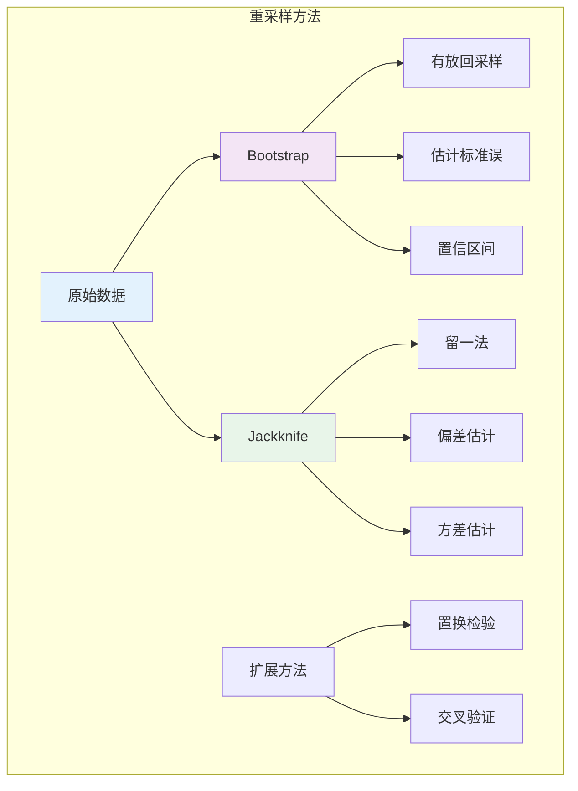

# 9.6.2 重采样方法

---

📌 **内容摘要**

本文档深入探讨重采样方法的核心原理和关键方法。内容涵盖统计计算领域的主要知识点，包括相关理论、方法及应用。适合有一定基础的学习者系统学习。

**关键词**: 统计计算

📚 **学习目标**

- 掌握重采样方法的核心概念和主要方法
- 理解相关理论的应用场景
- 建立该领域的系统性知识框架

🎯 **难度级别**: 中级

⏱️ **预计阅读时间**: 15分钟

**前置知识**: 相关领域的基础概念, 微积分基础

---


## 9.6.2.1 引言

**重采样方法**（Resampling Methods）是现代统计计算的重要工具，包括Bootstrap和Jackknife等方法。这些方法不依赖于渐近理论或参数假设，而是通过数据本身的重复采样来估计统计量的变异性。



---

## 9.6.2.2 Bootstrap方法

### 9.6.2.2.1 Bootstrap原理

**定义 9.6.2.1**（Bootstrap）

设 $\mathbf{x} = (x_1, \ldots, x_n)$ 为观测样本，**Bootstrap样本** $\mathbf{x}^*$ 是从 $\mathbf{x}$ 中有放回地抽取 $n$ 次得到的样本。

**Bootstrap分布**：统计量 $T(\mathbf{x}^*)$ 在重复Bootstrap采样下的分布。

### 9.6.2.2.2 Bootstrap标准误估计

**算法 9.6.2.2**（Bootstrap标准误）

1. 生成 $B$ 个Bootstrap样本 $\mathbf{x}^{*1}, \ldots, \mathbf{x}^{*B}$
2. 计算每个样本的统计量 $T^{*b} = T(\mathbf{x}^{*b})$
3. Bootstrap标准误估计：
$$\widehat{SE}_{boot} = \sqrt{\frac{1}{B-1}\sum_{b=1}^{B}(T^{*b} - \bar{T}^*)^2}$$

**定理 9.6.2.3**（Bootstrap的一致性）

在一定正则条件下，Bootstrap估计量收敛到真实标准误：
$$\widehat{SE}_{boot} \stackrel{P}{\to} SE(T), \quad B \to \infty$$

### 9.6.2.2.3 Bootstrap置信区间

**Bootstrap百分位区间**：
$$[T^{*}_{(\alpha/2)}, T^{*}_{(1-\alpha/2)}]$$

其中 $T^{*}_{(p)}$ 是Bootstrap分布的第 $p$ 分位数。

**Bootstrap-t区间**（更准确）：
$$T \pm t^{*}_{1-\alpha/2} \cdot \widehat{SE}_{boot}$$

其中 $t^{*}_{1-\alpha/2}$ 是Bootstrap化的t统计量的分位数。

---

## 9.6.2.3 Jackknife方法

### 9.6.2.3.1 Jackknife原理

**定义 9.6.2.4**（Jackknife）

**Jackknife样本** $\mathbf{x}_{(i)}$ 是删除第 $i$ 个观测后的样本，样本量为 $n-1$。

**Jackknife复制**：$T_{(i)} = T(\mathbf{x}_{(i)})$，$i = 1, \ldots, n$

### 9.6.2.3.2 Jackknife估计

**偏差估计**：
$$\widehat{\text{Bias}}_{jack} = (n-1)(\bar{T}_{(\cdot)} - T)$$

其中 $\bar{T}_{(\cdot)} = \frac{1}{n}\sum_{i=1}^{n} T_{(i)}$

**方差估计**：
$$\widehat{\text{Var}}_{jack} = \frac{n-1}{n}\sum_{i=1}^{n}(T_{(i)} - \bar{T}_{(\cdot)})^2$$

**定理 9.6.2.5**（Jackknife与Bootstrap的关系）

对于光滑统计量，Jackknife方差估计是Bootstrap方差估计的一阶近似。

---

## 9.6.2.4 置换检验

**定义 9.6.2.6**（置换检验，Permutation Test）

置换检验是一种非参数检验方法，通过置换数据标签来构造检验统计量的零分布。

**算法**：

1. 计算原始样本的检验统计量 $T_{obs}$
2. 随机置换组标签 $M$ 次
3. 对每个置换计算统计量 $T_1, \ldots, T_M$
4. p值 = 更极端统计量的比例

---

## 9.6.2.5 代码实现

```python
import numpy as np
from scipy import stats
from typing import Callable, Tuple, Dict, Optional

class Bootstrap:
    """Bootstrap方法实现"""

    def __init__(self, data: np.ndarray, random_state: int = 42):
        self.data = np.asarray(data)
        self.n = len(data)
        self.rng = np.random.default_rng(random_state)

    def bootstrap_sample(self) -> np.ndarray:
        """生成一个Bootstrap样本"""
        indices = self.rng.integers(0, self.n, size=self.n)
        return self.data[indices]

    def bootstrap_statistic(self, statistic_func: Callable,
                           n_bootstrap: int = 1000) -> np.ndarray:
        """
        计算Bootstrap统计量分布

        Returns:
            Bootstrap统计量数组
        """
        bootstrap_stats = []

        for _ in range(n_bootstrap):
            boot_sample = self.bootstrap_sample()
            stat = statistic_func(boot_sample)
            bootstrap_stats.append(stat)

        return np.array(bootstrap_stats)

    def standard_error(self, statistic_func: Callable,
                      n_bootstrap: int = 1000) -> float:
        """Bootstrap标准误估计"""
        boot_stats = self.bootstrap_statistic(statistic_func, n_bootstrap)
        return np.std(boot_stats, ddof=1)

    def confidence_interval(self, statistic_func: Callable,
                           n_bootstrap: int = 1000,
                           alpha: float = 0.05,
                           method: str = 'percentile') -> Tuple[float, float]:
        """
        Bootstrap置信区间

        Args:
            method: 'percentile', 'basic', 'bc' (bias-corrected)
        """
        boot_stats = self.bootstrap_statistic(statistic_func, n_bootstrap)

        if method == 'percentile':
            # 百分位方法
            ci_lower = np.percentile(boot_stats, 100 * alpha / 2)
            ci_upper = np.percentile(boot_stats, 100 * (1 - alpha / 2))

        elif method == 'basic':
            # 基本Bootstrap
            theta_hat = statistic_func(self.data)
            ci_lower = 2 * theta_hat - np.percentile(boot_stats, 100 * (1 - alpha / 2))
            ci_upper = 2 * theta_hat - np.percentile(boot_stats, 100 * alpha / 2)

        elif method == 'bc':
            # Bias-corrected
            theta_hat = statistic_func(self.data)
            z0 = stats.norm.ppf(np.mean(boot_stats < theta_hat))
            z_alpha = stats.norm.ppf(alpha / 2)
            z_1_alpha = stats.norm.ppf(1 - alpha / 2)

            p_lower = stats.norm.cdf(2 * z0 + z_alpha)
            p_upper = stats.norm.cdf(2 * z0 + z_1_alpha)

            ci_lower = np.percentile(boot_stats, 100 * p_lower)
            ci_upper = np.percentile(boot_stats, 100 * p_upper)

        else:
            raise ValueError(f"Unknown method: {method}")

        return ci_lower, ci_upper

    def bias_estimate(self, statistic_func: Callable,
                     n_bootstrap: int = 1000) -> float:
        """Bootstrap偏差估计"""
        boot_stats = self.bootstrap_statistic(statistic_func, n_bootstrap)
        theta_hat = statistic_func(self.data)
        return np.mean(boot_stats) - theta_hat


class Jackknife:
    """Jackknife方法实现"""

    def __init__(self, data: np.ndarray):
        self.data = np.asarray(data)
        self.n = len(data)

    def jackknife_sample(self, i: int) -> np.ndarray:
        """生成第i个Jackknife样本（删除第i个观测）"""
        return np.delete(self.data, i)

    def jackknife_statistics(self, statistic_func: Callable) -> np.ndarray:
        """计算所有Jackknife复制"""
        jack_stats = []

        for i in range(self.n):
            jack_sample = self.jackknife_sample(i)
            stat = statistic_func(jack_sample)
            jack_stats.append(stat)

        return np.array(jack_stats)

    def variance_estimate(self, statistic_func: Callable) -> float:
        """Jackknife方差估计"""
        jack_stats = self.jackknife_statistics(statistic_func)
        jack_mean = np.mean(jack_stats)

        variance = ((self.n - 1) / self.n) * np.sum((jack_stats - jack_mean)**2)
        return variance

    def standard_error(self, statistic_func: Callable) -> float:
        """Jackknife标准误"""
        return np.sqrt(self.variance_estimate(statistic_func))

    def bias_estimate(self, statistic_func: Callable) -> float:
        """Jackknife偏差估计"""
        jack_stats = self.jackknife_statistics(statistic_func)
        jack_mean = np.mean(jack_stats)
        theta_hat = statistic_func(self.data)

        return (self.n - 1) * (jack_mean - theta_hat)

    def bias_corrected_estimate(self, statistic_func: Callable) -> float:
        """偏差校正估计量"""
        theta_hat = statistic_func(self.data)
        bias = self.bias_estimate(statistic_func)
        return theta_hat - bias


class PermutationTest:
    """置换检验"""

    def __init__(self, group1: np.ndarray, group2: np.ndarray, random_state: int = 42):
        self.group1 = np.asarray(group1)
        self.group2 = np.asarray(group2)
        self.rng = np.random.default_rng(random_state)

    def difference_in_means(self, g1: np.ndarray, g2: np.ndarray) -> float:
        """均值差统计量"""
        return np.mean(g1) - np.mean(g2)

    def test(self, n_permutations: int = 10000) -> Dict:
        """
        置换检验

        H0: 两组来自相同分布
        """
        # 合并数据
        pooled = np.concatenate([self.group1, self.group2])
        n1 = len(self.group1)

        # 观测统计量
        observed_stat = self.difference_in_means(self.group1, self.group2)

        # 置换分布
        permuted_stats = []

        for _ in range(n_permutations):
            # 随机置换
            permuted = self.rng.permutation(pooled)
            perm_g1 = permuted[:n1]
            perm_g2 = permuted[n1:]

            perm_stat = self.difference_in_means(perm_g1, perm_g2)
            permuted_stats.append(perm_stat)

        permuted_stats = np.array(permuted_stats)

        # 计算p值（双侧）
        p_value = np.mean(np.abs(permuted_stats) >= np.abs(observed_stat))

        return {
            'observed_statistic': observed_stat,
            'p_value': p_value,
            'n_permutations': n_permutations,
            'permuted_statistics': permuted_stats
        }


# 使用示例
if __name__ == "__main__":
    print("=" * 60)
    print("重采样方法示例")
    print("=" * 60)

    np.random.seed(42)

    # 生成数据
    data = np.random.exponential(2, 100)  # 指数分布，均值2

    # 1. Bootstrap
    print("\n1. Bootstrap估计")
    print("-" * 40)

    boot = Bootstrap(data, random_state=42)

    # 中位数的Bootstrap
    median_se = boot.standard_error(np.median, n_bootstrap=5000)
    median_ci = boot.confidence_interval(np.median, n_bootstrap=5000, method='percentile')

    print(f"   数据: 指数分布(λ=0.5), n={len(data)}")
    print(f"   样本中位数: {np.median(data):.4f}")
    print(f"   Bootstrap标准误: {median_se:.4f}")
    print(f"   95% Bootstrap CI: [{median_ci[0]:.4f}, {median_ci[1]:.4f}]")

    # 2. Jackknife
    print("\n2. Jackknife估计")
    print("-" * 40)

    jack = Jackknife(data)

    jack_se = jack.standard_error(np.median)
    jack_bias = jack.bias_estimate(np.median)

    print(f"   样本中位数: {np.median(data):.4f}")
    print(f"   Jackknife标准误: {jack_se:.4f}")
    print(f"   Jackknife偏差估计: {jack_bias:.4f}")
    print(f"   偏差校正估计: {np.median(data) - jack_bias:.4f}")

    # 3. 置换检验
    print("\n3. 置换检验")
    print("-" * 40)

    # 生成两组数据
    group1 = np.random.normal(100, 15, 30)
    group2 = np.random.normal(108, 15, 30)  # 略有差异

    perm_test = PermutationTest(group1, group2, random_state=42)
    result = perm_test.test(n_permutations=10000)

    print(f"   组1均值: {np.mean(group1):.2f}")
    print(f"   组2均值: {np.mean(group2):.2f}")
    print(f"   观测均值差: {result['observed_statistic']:.4f}")
    print(f"   置换检验p值: {result['p_value']:.4f}")
    print(f"   置换次数: {result['n_permutations']}")
---

## 📚 延伸阅读

- [9.5.4 渐近理论](../05_数理统计/05.4_渐近理论.md)
