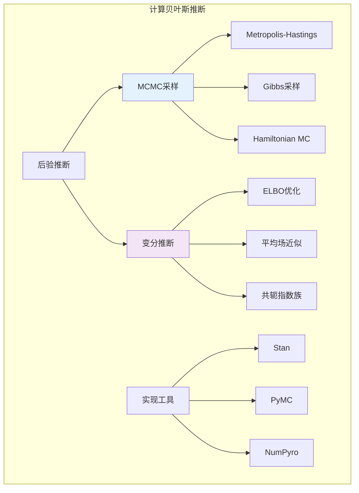

# 9.6.3 计算贝叶斯方法

## 9.6.3.1 引言

现代贝叶斯统计依赖于计算方法进行后验推断。当解析解不可得时，**变分推断**（Variational Inference, VI）和**马尔可夫链蒙特卡洛**（MCMC）是两种主要的近似推断方法。本章介绍这些方法的原理和实现。



---

## 9.6.3.2 变分推断

### 9.6.3.2.1 变分推断原理

**定义 9.6.3.1**（变分推断）

变分推断将后验推断转化为优化问题。目标是找到变分分布族 $q(\theta | \phi)$ 中最接近真实后验 $p(\theta | x)$ 的分布。

**KL散度**：
$$KL(q || p) = \int q(\theta) \ln\frac{q(\theta)}{p(\theta | x)} d\theta$$

**证据下界**（ELBO）：
$$\mathcal{L}(\phi) = E_q[\ln p(x, \theta)] - E_q[\ln q(\theta)] = \ln p(x) - KL(q || p)$$

最大化ELBO等价于最小化KL散度。

### 9.6.3.2.2 平均场近似

**定义 9.6.3.2**（平均场近似）

**平均场变分族**假设参数独立：
$$q(\theta) = \prod_{j=1}^{m} q_j(\theta_j)$$

**坐标上升变分推断**（CAVI）迭代更新每个因子：
$$\ln q_j^*(\theta_j) = E_{-j}[\ln p(\theta, x)] + \text{const}$$

---

## 9.6.3.3 MCMC高级方法

### 9.6.3.3.1 Hamiltonian蒙特卡洛

**定义 9.6.3.3**（Hamiltonian Monte Carlo, HMC）

HMC利用梯度信息指导采样，通过引入动量变量 $r$ 和哈密顿量：

$$H(\theta, r) = -\ln p(\theta | x) + \frac{1}{2}r^T M^{-1} r$$

模拟哈密顿动力学，然后Metropolis接受。

**优势**：在高维空间中混合更快，减少随机游走行为。

### 9.6.3.3.2 No-U-Turn采样器

**定义 9.6.3.4**（No-U-Turn Sampler, NUTS）

NUTS是HMC的自适应变体，自动确定轨迹长度，消除HMC的手动调参。

---

## 9.6.3.4 拉普拉斯近似

**定义 9.6.3.5**（拉普拉斯近似）

用后验众数（MAP）处的高斯分布近似后验：

$$p(\theta | x) \approx N(\hat{\theta}_{MAP}, H^{-1})$$

其中 $H = -\nabla^2 \ln p(\hat{\theta}_{MAP} | x)$ 是Hessian矩阵。

**证据近似**：
$$p(x) \approx p(x | \hat{\theta}_{MAP}) p(\hat{\theta}_{MAP}) (2\pi)^{d/2} |H|^{-1/2}$$

---

## 9.6.3.5 代码实现

```python
import numpy as np
from scipy import stats
from scipy.optimize import minimize
from scipy.special import digamma, gammaln
from typing import Callable, Tuple, Dict, Optional

class LaplaceApproximation:
    """拉普拉斯近似"""

    def __init__(self, log_posterior: Callable, initial_guess: np.ndarray):
        self.log_posterior = log_posterior
        self.initial = initial_guess

    def fit(self) -> Dict:
        """
        计算拉普拉斯近似

        Returns:
            包含MAP估计、协方差和近似证据的字典
        """
        # 最小化负对数后验（即最大化后验）
        def neg_log_posterior(theta):
            return -self.log_posterior(theta)

        result = minimize(neg_log_posterior, self.initial, method='BFGS')

        map_estimate = result.x

        # 计算Hessian的逆作为协方差估计
        # BFGS的近似Hessian
        hessian_inv = result.hess_inv

        # 近似证据（Laplace方法）
        log_evidence_approx = (
            self.log_posterior(map_estimate) +
            0.5 * len(map_estimate) * np.log(2 * np.pi) -
            0.5 * np.log(np.linalg.det(hessian_inv))
        )

        return {
            'map_estimate': map_estimate,
            'covariance': hessian_inv,
            'log_evidence_approx': log_evidence_approx,
            'success': result.success
        }


class MeanFieldVI:
    """
    平均场变分推断

    以Beta-Bernoulli为例
    """

    def __init__(self, data: np.ndarray):
        """
        Args:
            data: 二值数据
        """
        self.data = np.asarray(data)
        self.n = len(data)
        self.sum_x = np.sum(data)

    def cavi_update(self, alpha_prior: float = 1, beta_prior: float = 1,
                   max_iter: int = 100, tol: float = 1e-6) -> Dict:
        """
        坐标上升变分推断（CAVI）

        对于Beta-Bernoulli，变分分布为 q(θ) = Beta(α', β')
        """
        # 初始化变分参数
        alpha_vi = alpha_prior + self.sum_x
        beta_vi = beta_prior + self.n - self.sum_x

        elbos = []

        for iteration in range(max_iter):
            # 对于Beta-Bernoulli，有解析解
            # E[ln θ] = ψ(α') - ψ(α' + β')
            # E[ln(1-θ)] = ψ(β') - ψ(α' + β')

            # 计算ELBO
            # ELBO = E_q[ln p(x, θ)] - E_q[ln q(θ)]

            # 期望充分统计量
            e_log_theta = digamma(alpha_vi) - digamma(alpha_vi + beta_vi)
            e_log_1_minus_theta = digamma(beta_vi) - digamma(alpha_vi + beta_vi)

            # E_q[ln p(x|θ)]
            expected_log_likelihood = self.sum_x * e_log_theta + (self.n - self.sum_x) * e_log_1_minus_theta

            # E_q[ln p(θ)]
            expected_log_prior = ((alpha_prior - 1) * e_log_theta +
                                 (beta_prior - 1) * e_log_1_minus_theta -
                                 gammaln(alpha_prior) - gammaln(beta_prior) +
                                 gammaln(alpha_prior + beta_prior))

            # -E_q[ln q(θ)] (熵)
            entropy = (gammaln(alpha_vi) + gammaln(beta_vi) -
                      gammaln(alpha_vi + beta_vi) -
                      (alpha_vi - 1) * e_log_theta -
                      (beta_vi - 1) * e_log_1_minus_theta)

            elbo = expected_log_likelihood + expected_log_prior + entropy
            elbos.append(elbo)

            # 对于Beta-Bernoulli，CAVI更新有闭式解
            # 实际上不需要迭代，这里展示框架
            new_alpha = alpha_prior + self.sum_x
            new_beta = beta_prior + self.n - self.sum_x

            if abs(new_alpha - alpha_vi) < tol and abs(new_beta - beta_vi) < tol:
                break

            alpha_vi, beta_vi = new_alpha, new_beta

        return {
            'alpha_vi': alpha_vi,
            'beta_vi': beta_vi,
            'elbos': elbos,
            'n_iterations': len(elbos)
        }


class SimpleHMC:
    """简化版Hamiltonian Monte Carlo"""

    def __init__(self, log_posterior: Callable, grad_log_posterior: Callable):
        self.log_posterior = log_posterior
        self.grad_log_posterior = grad_log_posterior

    def leapfrog(self, theta: np.ndarray, r: np.ndarray,
                epsilon: float, L: int) -> Tuple[np.ndarray, np.ndarray]:
        """
        Leapfrog积分

        Args:
            theta: 位置
            r: 动量
            epsilon: 步长
            L: 步数
        """
        theta = theta.copy()
        r = r.copy()

        # 半步动量更新
        r = r + 0.5 * epsilon * self.grad_log_posterior(theta)

        # L-1步完整更新
        for _ in range(L - 1):
            theta = theta + epsilon * r
            r = r + epsilon * self.grad_log_posterior(theta)

        # 最后半步
        theta = theta + epsilon * r
        r = r + 0.5 * epsilon * self.grad_log_posterior(theta)

        # 翻转动量（对称性）
        r = -r

        return theta, r

    def sample(self, initial_theta: np.ndarray, n_samples: int = 1000,
              epsilon: float = 0.1, L: int = 10,
              burn_in: int = 500, random_state: int = 42) -> np.ndarray:
        """
        HMC采样
        """
        rng = np.random.default_rng(random_state)

        theta = initial_theta.copy()
        samples = []
        n_accepted = 0

        for i in range(burn_in + n_samples):
            # 采样动量
            r = rng.standard_normal(len(theta))

            # 当前哈密顿量
            current_H = -self.log_posterior(theta) + 0.5 * np.dot(r, r)

            # Leapfrog
            theta_new, r_new = self.leapfrog(theta, r, epsilon, L)

            # 新哈密顿量
            new_H = -self.log_posterior(theta_new) + 0.5 * np.dot(r_new, r_new)

            # Metropolis接受
            log_accept_prob = min(0, current_H - new_H)

            if np.log(rng.random()) < log_accept_prob:
                theta = theta_new
                n_accepted += 1

            if i >= burn_in:
                samples.append(theta.copy())

        samples = np.array(samples)

        return {
            'samples': samples,
            'acceptance_rate': n_accepted / (burn_in + n_samples)
        }


# 使用示例
if __name__ == "__main__":
    print("=" * 60)
    print("计算贝叶斯方法示例")
    print("=" * 60)

    np.random.seed(42)

    # 1. 拉普拉斯近似
    print("\n1. 拉普拉斯近似")
    print("-" * 40)

    # 数据: 观测到20次成功，30次试验
    k, n = 20, 30

    # 对数后验 (Beta(1,1)先验)
    def log_posterior(theta):
        if theta[0] <= 0 or theta[0] >= 1:
            return -np.inf
        return (k - 1) * np.log(theta[0]) + (n - k - 1) * np.log(1 - theta[0])

    laplace = LaplaceApproximation(log_posterior, initial_guess=np.array([0.5]))
    result = laplace.fit()

    print(f"   数据: {k}次成功 / {n}次试验")
    print(f"   MAP估计: {result['map_estimate'][0]:.4f}")
    print(f"   后验方差: {result['covariance'][0, 0]:.6f}")
    print(f"   95%近似CI: [{result['map_estimate'][0] - 1.96*np.sqrt(result['covariance'][0,0]):.4f}, "
          f"{result['map_estimate'][0] + 1.96*np.sqrt(result['covariance'][0,0]):.4f}]")

    # 与精确后验 Beta(21, 11) 比较
    exact_mean = 21 / 32
    exact_var = (21 * 11) / (32**2 * 33)
    print(f"\n   精确后验 Beta(21, 11):")
    print(f"   均值: {exact_mean:.4f}")
    print(f"   方差: {exact_var:.6f}")

    # 2. 变分推断
    print("\n2. 平均场变分推断 (Beta-Bernoulli)")
    print("-" * 40)

    # 生成伯努利数据
    data = np.array([1]*k + [0]*(n-k))
    np.random.shuffle(data)

    mfv = MeanFieldVI(data)
    vi_result = mfv.cavi_update()

    print(f"   变分后验: Beta({vi_result['alpha_vi']:.1f}, {vi_result['beta_vi']:.1f})")
    print(f"   变分后验均值: {vi_result['alpha_vi']/(vi_result['alpha_vi']+vi_result['beta_vi']):.4f}")
    print(f"   CAVI迭代次数: {vi_result['n_iterations']}")

    # 3. HMC采样（简化版）
    print("\n3. Hamiltonian Monte Carlo")
    print("-" * 40)

    # 使用logit变换到无约束空间
    def log_posterior_logit(z):
        theta = 1 / (1 + np.exp(-z))
        if theta <= 0 or theta >= 1:
            return -np.inf
        # Jacobian
        log_jac = np.log(theta) + np.log(1 - theta)
        return (k - 1) * np.log(theta) + (n - k - 1) * np.log(1 - theta) + log_jac

    def grad_log_posterior_logit(z):
        # 梯度计算
        theta = 1 / (1 + np.exp(-z))
        return (k - 1) * (1 - theta) - (n - k - 1) * theta + 1 - 2*theta

    hmc = SimpleHMC(log_posterior_logit, grad_log_posterior_logit)
    hmc_result = hmc.sample(initial_theta=np.array([0.0]),
                           n_samples=2000,
                           epsilon=0.1, L=20,
                           burn_in=500)

    # 转换回theta空间
    z_samples = hmc_result['samples'].flatten()
    theta_samples = 1 / (1 + np.exp(-z_samples))

    print(f"   HMC样本均值: {np.mean(theta_samples):.4f}")
    print(f"   HMC样本标准差: {np.std(theta_samples):.4f}")
    print(f"   接受率: {hmc_result['acceptance_rate']:.3f}")
    print(f"   95% HPD区间: [{np.percentile(theta_samples, 2.5):.4f}, "
          f"{np.percentile(theta_samples, 97.5):.4f}]")
