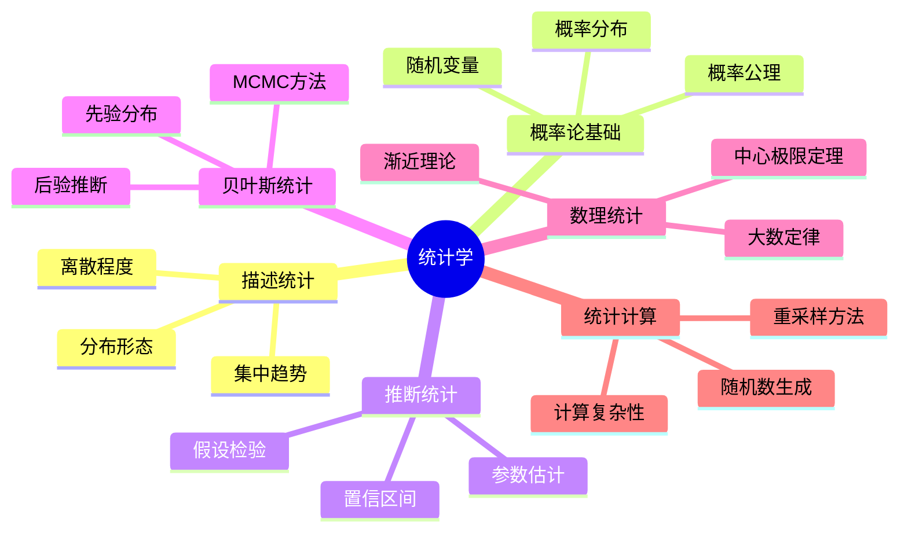
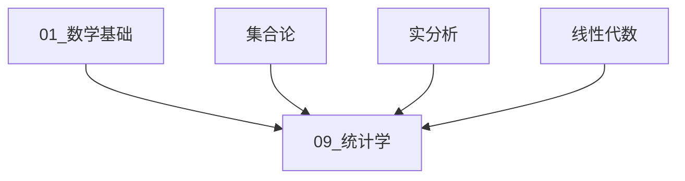
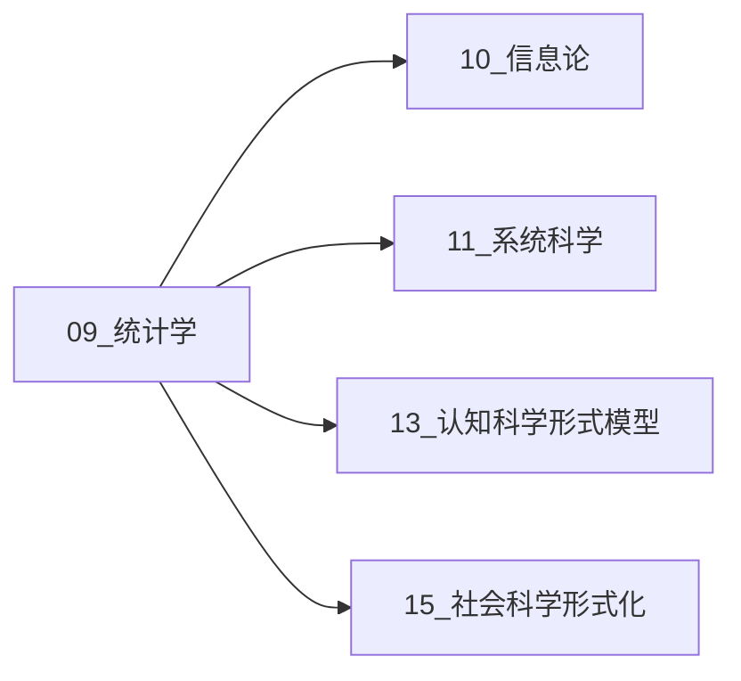

# 09_统计学 - 统计科学形式化

> **形式科学分支** | **模块编号**: 09 | **版本**: v1.0

---

## 模块概述

统计学是研究数据收集、分析、解释和呈现的科学，为不确定性下的决策提供数学基础。
本模块从形式化视角系统阐述统计理论，涵盖从描述统计到统计计算的完整理论体系。

### 核心定位



### 形式化特征

| 特征 | 描述 | 数学基础 |
|------|------|----------|
| **测度论框架** | 概率的严格数学基础 | $(\Omega, \mathcal{F}, P)$ |
| **统计泛函** | 从分布到参数的映射 | $T: \mathcal{P} \to \Theta$ |
| **决策理论** | 统计推断的博弈论视角 | $(\mathcal{X}, \Theta, \mathcal{A}, L)$ |
| **计算方法** | 统计推断的算法实现 | MCMC、Bootstrap、EM |

---

## 模块结构

```
09_统计学/
├── README.md                    # 本文件 - 模块概述
├── 00_目录与导航.md             # 完整目录树与导航
├── 01_描述统计.md               # 集中趋势、离散程度、分布形态
├── 02_概率论基础.md             # 概率公理、随机变量、分布
├── 03_推断统计.md               # 估计理论、假设检验、置信区间
├── 04_贝叶斯统计.md             # 先验/后验、贝叶斯推断、MCMC
├── 05_数理统计.md               # 大数定律、中心极限定理、收敛性
└── 06_统计计算.md               # 数值方法、采样算法、计算复杂性
```

---

## 知识地图

### 前置依赖



- **01_数学基础**: 集合论、实分析、线性代数
- **分析学基础**: 测度论、积分论、泛函分析
- **计算基础**: 数值分析、算法复杂性

### 后继连接



- **10_信息论**: 统计推断与信息度量
- **11_系统科学**: 随机系统与统计物理
- **13_认知科学**: 贝叶斯认知模型
- **15_社会科学**: 计量经济学、社会统计学

---

## 核心概念索引

| 概念 | 定义 | 所在文档 |
|------|------|----------|
| **概率空间** | $(\Omega, \mathcal{F}, P)$ | 02_概率论基础.md |
| **随机变量** | $X: \Omega \to \mathbb{R}$ | 02_概率论基础.md |
| **期望** | $E[X] = \int X dP$ | 02_概率论基础.md |
| **方差** | $\text{Var}(X) = E[(X-\mu)^2]$ | 01_描述统计.md |
| **充分统计量** | $T(X)$ 包含全部信息 | 05_数理统计.md |
| **一致估计** | $\hat{\theta}_n \xrightarrow{P} \theta$ | 03_推断统计.md |
| **后验分布** | $p(\theta|x) \propto p(x|\theta)p(\theta)$ | 04_贝叶斯统计.md |
| **MCMC** | 马尔可夫链蒙特卡洛采样 | 04_贝叶斯统计.md |

---

## 形式化记号系统

### 基本记号

| 记号 | 含义 | 示例 |
|------|------|------|
| $P(A)$ | 事件A的概率 | $P(X > 0) = 0.5$ |
| $E[X]$ | 随机变量期望 | $E[X] = \sum x_i p_i$ |
| $\text{Var}(X)$ | 方差 | $\text{Var}(X) = \sigma^2$ |
| $\hat{\theta}$ | 参数估计 | $\hat{\theta}_{MLE}$ |
| $H_0, H_1$ | 原假设与备择假设 | $H_0: \mu = 0$ |
| $\mathcal{L}(\theta; x)$ | 似然函数 | $\mathcal{L}(\theta) = \prod f(x_i;\theta)$ |

### 分布记号

| 记号 | 分布 | 密度/质量函数 |
|------|------|---------------|
| $\mathcal{N}(\mu, \sigma^2)$ | 正态分布 | $\frac{1}{\sqrt{2\pi}\sigma}e^{-\frac{(x-\mu)^2}{2\sigma^2}}$ |
| $\text{Bin}(n, p)$ | 二项分布 | $\binom{n}{k}p^k(1-p)^{n-k}$ |
| $\text{Pois}(\lambda)$ | 泊松分布 | $\frac{\lambda^k e^{-\lambda}}{k!}$ |
| $\text{Exp}(\lambda)$ | 指数分布 | $\lambda e^{-\lambda x}$ |
| $\text{Gamma}(\alpha, \beta)$ | Gamma分布 | $\frac{\beta^\alpha}{\Gamma(\alpha)}x^{\alpha-1}e^{-\beta x}$ |
| $\text{Beta}(\alpha, \beta)$ | Beta分布 | $\frac{x^{\alpha-1}(1-x)^{\beta-1}}{B(\alpha,\beta)}$ |

---

## 关键定理速查

### 概率论核心

| 定理 | 陈述 | 重要性 |
|------|------|--------|
| **大数定律 (LLN)** | $\frac{1}{n}\sum X_i \xrightarrow{a.s.} E[X]$ | 频率收敛于概率 |
| **中心极限定理 (CLT)** | $\sqrt{n}(\bar{X}-\mu) \xrightarrow{d} \mathcal{N}(0,\sigma^2)$ | 正态近似基础 |
| **Slutsky定理** | 收敛序列的运算保持收敛性 | 渐近推断 |
| **连续映射定理** | $g(X_n) \xrightarrow{d} g(X)$ | 函数保持收敛 |

### 统计推断

| 定理 | 陈述 | 应用 |
|------|------|------|
| **Rao-Blackwell定理** | 条件期望减小方差 | 改进估计量 |
| **Cramér-Rao下界** | $\text{Var}(\hat{\theta}) \geq \frac{1}{nI(\theta)}$ | 估计效率下界 |
| **Neyman-Pearson引理** | 最优检验形式 | 假设检验理论 |
| **Bernstein-von Mises** | 后验渐近正态性 | 贝叶斯渐近理论 |

---

## 与其他模块的交叉引用

### 引用本模块的模块

```
10_信息论.md     → 统计推断与熵的关系
11_系统科学.md   → 随机系统与统计物理
12_决策与博弈论 → 统计决策理论
13_认知科学.md   → 贝叶斯认知模型
15_社会科学.md   → 计量经济学方法
```

### 本模块引用的模块

```
01_数学基础.md   → 测度论、实分析基础
02_形式语言.md   → 概率编程语言
07_交叉视角.md   → 统计与逻辑的融合
```

---

## 学习路径建议

### 初级路径 (入门)

```
01_描述统计.md → 02_概率论基础.md → 03_推断统计.md (基础部分)
```

### 中级路径 (进阶)

```
03_推断统计.md → 04_贝叶斯统计.md → 06_统计计算.md
```

### 高级路径 (研究)

```
05_数理统计.md → 04_贝叶斯统计.md → 相关研究论文
```

---

## 版本信息

- **版本**: v1.0
- **创建日期**: 2026-04-12
- **最后更新**: 2026-04-12
- **状态**: 完整实现
- **审核**: 待审核

---

## 参考资源

### 经典教材

1. **Casella & Berger** (2002). _Statistical Inference_, 2nd Ed.
2. **Wasserman** (2004). _All of Statistics: A Concise Course in Statistical Inference_
3. **Gelman et al.** (2013). _Bayesian Data Analysis_, 3rd Ed.
4. **Lehmann & Casella** (1998). _Theory of Point Estimation_, 2nd Ed.
5. **Billingsley** (1995). _Probability and Measure_, 3rd Ed.

### 在线资源

- [Statistical Rethinking](https://xcelab.net/rm/statistical-rethinking/) - 贝叶斯统计
- [Seeing Theory](https://seeing-theory.brown.edu/) - 可视化概率统计
- [Cross Validated](https://stats.stackexchange.com/) - 统计学问答

---

```
╔═══════════════════════════════════════════════════════════════╗
║                   09_统计学 模块                              ║
║                                                               ║
║   "在不确定性中寻找规律，在随机中发现秩序"                      ║
║                                                               ║
╚═══════════════════════════════════════════════════════════════╝
```

---

## 📚 延伸阅读

- [9.6.2 重采样方法](./06_统计计算/06.2_重采样方法.md)
- [9.2.2 随机变量](./02_概率论基础/02.2_随机变量.md)
- [2.2 线性代数](../01_数学基础/02_代数学/02.2_线性代数.md)
- [2.3 线性代数](../01_数学基础/02_代数学/02.3_线性代数.md)
- [9.4.4 马尔可夫链蒙特卡洛](./04_贝叶斯统计/04.4_马尔可夫链蒙特卡洛.md)
