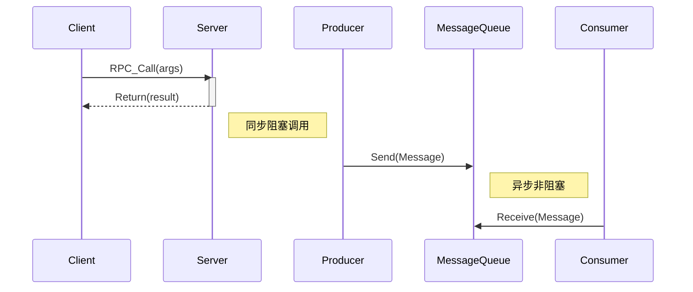

# 06.2 分布式通信 (Distributed Communication)

## 目录

- [06.2 分布式通信 (Distributed Communication)](#062-分布式通信-distributed-communication)
  - [目录](#目录)
  - [1. 定义与背景](#1-定义与背景)
  - [2. 批判性分析](#2-批判性分析)
  - [3. 核心通信模式](#3-核心通信模式)
  - [4. 形式化表达](#4-形式化表达)
  - [5. 交叉引用](#5-交叉引用)
  - [6. 参考文献](#6-参考文献)

---

## 1. 定义与背景

分布式通信是分布式系统的血脉，它定义了系统中分离的组件如何交换信息。与单机内的函数调用不同，分布式通信必须处理网络延迟、不可靠性和异构性等问题。

---

## 2. 批判性分析

- **挑战**: 通信的可靠性、效率、安全性是核心挑战。选择同步还是异步，点对点还是多播，都会对系统架构产生深远影响。
- **权衡**: 设计时需要在性能（低延迟、高吞吐）和可靠性（消息保证、重试机制）之间进行权衡。

---

## 3. 核心通信模式

- **远程过程调用 (Remote Procedure Call, RPC)**:
  - **描述**: 使客户端能够像调用本地函数一样调用远程服务器上的过程。它隐藏了底层的网络通信细节。
  - **优点**: 简单，符合程序员的直觉。
  - **缺点**: 同步阻塞可能导致性能问题；紧耦合。
  - **代表技术**: gRPC, Apache Thrift.
- **消息队列 (Message Queuing, MQ)**:
  - **描述**: 基于异步消息传递的中间件。发送者将消息放入队列，接收者在方便时取出处理。
  - **优点**: 解耦、异步、削峰填谷。
  - **缺点**: 增加了系统复杂度和延迟。
  - **代表技术**: RabbitMQ, Apache Kafka.
- **发布/订阅 (Publish/Subscribe)**:
  - **描述**: 消息队列的一种变体，发布者将消息发送到特定主题（Topic），多个订阅者可以订阅该主题以接收消息。
  - **优点**: 实现了发送者和接收者在时间、空间和同步性上的完全解耦。
- **组通信 (Group Communication)**:
  - **描述**: 消息被发送到进程组，组中的所有成员都会收到该消息。常用于实现容错和复制。
  - **核心属性**: 原子性（消息要么所有成员都收到，要么都没有）和有序性（所有成员以相同顺序接收消息）。

---

## 4. 形式化表达

**RPC vs MQ 模型**:

---

## 5. 交叉引用

- [分布式系统总览](./README.md)
- [共识与协作](./06.3_Consensus_and_Coordination.md)
- [计算机网络理论](../11_Computer_Network_Theory/README.md)

---

## 6. 参考文献

1. Birman, Kenneth P. *Guide to Reliable Distributed Systems*. 2012.
2. Tanenbaum, Andrew S., and Van Steen, Maarten. *Distributed Systems*. 2017.
