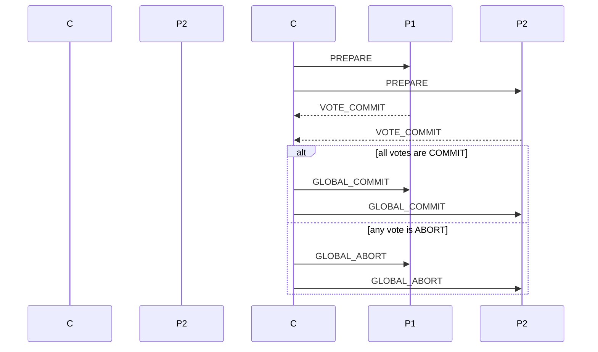

# 06.5 分布式事务与存储 (Distributed Transactions and Storage)

## 目录

- [06.5 分布式事务与存储 (Distributed Transactions and Storage)](#065-分布式事务与存储-distributed-transactions-and-storage)
  - [目录](#目录)
  - [1. 定义与背景](#1-定义与背景)
  - [2. 批判性分析](#2-批判性分析)
  - [3. 核心概念](#3-核心概念)
  - [4. 形式化表达](#4-形式化表达)
  - [5. 交叉引用](#5-交叉引用)
  - [6. 参考文献](#6-参考文献)

---

## 1. 定义与背景

**分布式事务**指的是跨越多个独立计算节点（或存储节点）的事务。为了维护数据的完整性，分布式事务需要保证ACID属性，特别是原子性（Atomicity）和一致性（Consistency）。**分布式存储**则是指将数据分散存储在多个物理节点上的技术。

---

## 2. 批判性分析

- **挑战**: 在可能出现网络分区和节点故障的环境下，保证事务的原子性（即所有参与者要么全部提交，要么全部中止）是极其困难的。传统的强ACID事务在分布式环境下往往性能低下。
- **权衡**: 许多现代分布式数据库（NoSQL）放宽了对ACID的严格要求，转向BASE（Basically Available, Soft state, Eventually consistent）模型，以换取更高的性能和可用性。

---

## 3. 核心概念

- **两阶段提交 (Two-Phase Commit, 2PC)**:
  - **描述**: 一个经典的分布式原子提交协议。
    - **阶段一 (投票阶段)**: 协调者向所有参与者询问是否可以提交。参与者将Undo/Redo日志写入磁盘后，向协调者投票"Yes"或"No"。
    - **阶段二 (提交/中止阶段)**: 如果协调者收到所有"Yes"，则向所有参与者发送"Commit"消息；否则发送"Abort"消息。
  - **缺点**: 同步阻塞；协调者单点故障；脑裂问题。
- **三阶段提交 (Three-Phase Commit, 3PC)**:
  - **描述**: 2PC的改进，通过引入一个"CanCommit"阶段来减少阻塞时间，并在协调者和参与者同时故障时避免脑裂。
  - **缺点**: 依然无法完全解决网络分区问题，且协议更复杂。
- **分布式存储技术**:
  - **哈希分区 (Hash Partitioning)**: 根据数据键的哈希值来决定存储节点。
  - **范围分区 (Range Partitioning)**: 根据数据键的范围来划分存储节点。
  - **一致性哈希 (Consistent Hashing)**: 哈希分区的一种变体，当增删节点时，只需移动少量数据。

---

## 4. 形式化表达

**两阶段提交 (2PC) 流程**:

---

## 5. 交叉引用

- [分布式系统总览](README.md)
- [共识与协作](06.3_Consensus_and_Coordination.md)
- [数据库理论](README.md)

---

## 6. 参考文献

1. Gray, Jim. "Notes on data base operating systems." *Lecture notes in computer science*, 1978.
2. Bernstein, Philip A., Hadzilacos, Vassos, and Goodman, Nathan. *Concurrency control and recovery in database systems*. 1987.

## 批判性分析

- 本节内容待补充：请从多元理论视角、局限性、争议点、应用前景等方面进行批判性分析。
