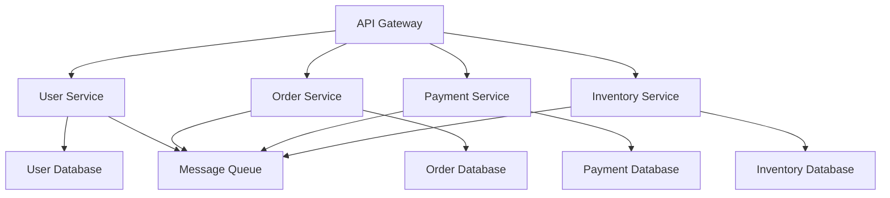

# 软件工程应用实例 (Software Engineering Application Examples)

## 目录

1. [引言](#引言)
2. [软件架构设计](#软件架构设计)
3. [设计模式应用](#设计模式应用)
4. [软件测试策略](#软件测试策略)
5. [质量保证体系](#质量保证体系)
6. [项目管理实践](#项目管理实践)
7. [总结](#总结)

## 交叉引用与关联

### 相关理论领域

- **[软件工程理论](01_Software_Engineering_Theory.md)**：基础理论框架
- **[系统设计理论](02_系统设计理论.md)**：系统设计方法
- **[验证理论](03_验证理论.md)**：形式化验证技术

### 基础依赖关系

- **[类型理论](../02_Type_Theory/01_Basic_Type_Theory.md)**：类型系统设计
- **[控制理论](../03_Control_Theory/01_Classical_Control_Theory.md)**：系统控制
- **[分布式系统](../04_Distributed_Systems/01_Consensus_Theory.md)**：分布式架构

## 引言

本章节展示软件工程理论在实际项目中的应用。从架构设计到质量保证，从项目管理到技术实现，软件工程为构建高质量软件系统提供了系统性的方法论。

## 软件架构设计

### 2.1 微服务架构设计

**架构概述**：
微服务架构将单体应用拆分为多个独立的服务，每个服务负责特定的业务功能。

**架构模式**：



**服务设计原则**：

```java
// 用户服务接口设计
public interface UserService {
    /**
     * 用户注册
     * @param user 用户信息
     * @return 注册结果
     */
    CompletableFuture<RegistrationResult> register(User user);
    
    /**
     * 用户认证
     * @param credentials 认证信息
     * @return 认证结果
     */
    CompletableFuture<AuthenticationResult> authenticate(Credentials credentials);
    
    /**
     * 获取用户信息
     * @param userId 用户ID
     * @return 用户信息
     */
    CompletableFuture<Optional<User>> getUserById(String userId);
}

// 服务实现
@Service
public class UserServiceImpl implements UserService {
    private final UserRepository userRepository;
    private final PasswordEncoder passwordEncoder;
    private final EventPublisher eventPublisher;
    
    @Override
    public CompletableFuture<RegistrationResult> register(User user) {
        return CompletableFuture.supplyAsync(() -> {
            // 验证用户信息
            validateUser(user);
            
            // 加密密码
            user.setPassword(passwordEncoder.encode(user.getPassword()));
            
            // 保存用户
            User savedUser = userRepository.save(user);
            
            // 发布用户注册事件
            eventPublisher.publish(new UserRegisteredEvent(savedUser));
            
            return new RegistrationResult(true, savedUser.getId());
        });
    }
}
```

**定理 2.1.1 (微服务一致性定理)**

对于微服务系统 $S = \{s_1, s_2, ..., s_n\}$，如果每个服务 $s_i$ 满足：
1. 服务独立性：$s_i$ 不直接依赖其他服务的内部状态
2. 接口稳定性：$s_i$ 的公共接口保持向后兼容
3. 数据一致性：$s_i$ 的数据操作满足ACID或最终一致性

则系统 $S$ 满足分布式一致性。

**证明**：
- 服务独立性确保故障隔离
- 接口稳定性确保系统演进
- 数据一致性确保业务正确性

### 2.2 事件驱动架构

**架构模式**：

```java
// 事件定义
public abstract class DomainEvent {
    private final String eventId;
    private final String aggregateId;
    private final long timestamp;
    
    public DomainEvent(String aggregateId) {
        this.eventId = UUID.randomUUID().toString();
        this.aggregateId = aggregateId;
        this.timestamp = System.currentTimeMillis();
    }
}

// 具体事件
public class OrderCreatedEvent extends DomainEvent {
    private final Order order;
    
    public OrderCreatedEvent(Order order) {
        super(order.getId());
        this.order = order;
    }
}

// 事件处理器
@Component
public class OrderEventHandler {
    
    @EventListener
    public void handleOrderCreated(OrderCreatedEvent event) {
        // 更新库存
        inventoryService.decreaseStock(event.getOrder().getItems());
        
        // 发送通知
        notificationService.sendOrderConfirmation(event.getOrder());
        
        // 更新统计
        analyticsService.recordOrderCreated(event.getOrder());
    }
}
```

## 设计模式应用

### 3.1 策略模式

**模式定义**：
策略模式定义一系列算法，将每个算法封装起来，并使它们可以互换。

```java
// 策略接口
public interface PaymentStrategy {
    PaymentResult processPayment(PaymentRequest request);
}

// 具体策略
public class CreditCardPaymentStrategy implements PaymentStrategy {
    @Override
    public PaymentResult processPayment(PaymentRequest request) {
        // 信用卡支付逻辑
        return processCreditCardPayment(request);
    }
}

public class PayPalPaymentStrategy implements PaymentStrategy {
    @Override
    public PaymentResult processPayment(PaymentRequest request) {
        // PayPal支付逻辑
        return processPayPalPayment(request);
    }
}

// 上下文
public class PaymentProcessor {
    private PaymentStrategy strategy;
    
    public void setStrategy(PaymentStrategy strategy) {
        this.strategy = strategy;
    }
    
    public PaymentResult processPayment(PaymentRequest request) {
        return strategy.processPayment(request);
    }
}
```

### 3.2 观察者模式

**模式实现**：

```java
// 观察者接口
public interface Observer {
    void update(String message);
}

// 具体观察者
public class EmailNotifier implements Observer {
    @Override
    public void update(String message) {
        sendEmail(message);
    }
}

public class SMSNotifier implements Observer {
    @Override
    public void update(String message) {
        sendSMS(message);
    }
}

// 主题
public class OrderSubject {
    private List<Observer> observers = new ArrayList<>();
    
    public void attach(Observer observer) {
        observers.add(observer);
    }
    
    public void detach(Observer observer) {
        observers.remove(observer);
    }
    
    public void notifyObservers(String message) {
        for (Observer observer : observers) {
            observer.update(message);
        }
    }
}
```

## 软件测试策略

### 4.1 单元测试

**测试框架**：

```java
@ExtendWith(MockitoExtension.class)
class UserServiceTest {
    
    @Mock
    private UserRepository userRepository;
    
    @Mock
    private PasswordEncoder passwordEncoder;
    
    @InjectMocks
    private UserServiceImpl userService;
    
    @Test
    @DisplayName("用户注册成功")
    void testUserRegistrationSuccess() {
        // Given
        User user = new User("test@example.com", "password");
        User savedUser = new User("test@example.com", "encoded_password");
        
        when(passwordEncoder.encode("password")).thenReturn("encoded_password");
        when(userRepository.save(any(User.class))).thenReturn(savedUser);
        
        // When
        RegistrationResult result = userService.register(user).join();
        
        // Then
        assertTrue(result.isSuccess());
        assertNotNull(result.getUserId());
        verify(userRepository).save(any(User.class));
    }
    
    @Test
    @DisplayName("用户注册失败 - 邮箱已存在")
    void testUserRegistrationFailure_DuplicateEmail() {
        // Given
        User user = new User("existing@example.com", "password");
        when(userRepository.findByEmail("existing@example.com"))
            .thenReturn(Optional.of(new User()));
        
        // When & Then
        assertThrows(DuplicateEmailException.class, () -> {
            userService.register(user).join();
        });
    }
}
```

### 4.2 集成测试

```java
@SpringBootTest
@AutoConfigureTestDatabase
class UserServiceIntegrationTest {
    
    @Autowired
    private UserService userService;
    
    @Autowired
    private UserRepository userRepository;
    
    @Test
    @Transactional
    void testUserRegistrationIntegration() {
        // Given
        User user = new User("integration@example.com", "password");
        
        // When
        RegistrationResult result = userService.register(user).join();
        
        // Then
        assertTrue(result.isSuccess());
        
        Optional<User> savedUser = userRepository.findById(result.getUserId());
        assertTrue(savedUser.isPresent());
        assertEquals("integration@example.com", savedUser.get().getEmail());
    }
}
```

## 质量保证体系

### 5.1 代码质量检查

**SonarQube配置**：

```yaml
# sonar-project.properties
sonar.projectKey=my-software-project
sonar.projectName=My Software Project
sonar.projectVersion=1.0

sonar.sources=src/main/java
sonar.tests=src/test/java
sonar.java.binaries=target/classes
sonar.java.test.binaries=target/test-classes

# 质量门限
sonar.qualitygate.wait=true
```

**质量指标**：

```java
// 代码覆盖率检查
@RunWith(CoberturaRunner.class)
@CoberturaRunner.Cobertura(
    includeClasses = "com.example.service.*",
    excludeClasses = "com.example.service.internal.*"
)
public class ServiceTestSuite {
    // 测试用例
}

// 复杂度检查
public class ComplexityAnalyzer {
    public int calculateCyclomaticComplexity(Method method) {
        int complexity = 1; // 基础复杂度
        
        // 计算条件分支
        for (Statement statement : method.getStatements()) {
            if (statement instanceof IfStatement ||
                statement instanceof WhileStatement ||
                statement instanceof ForStatement) {
                complexity++;
            }
        }
        
        return complexity;
    }
}
```

### 5.2 性能测试

```java
@SpringBootTest
class PerformanceTest {
    
    @Autowired
    private UserService userService;
    
    @Test
    @Timeout(value = 5, unit = TimeUnit.SECONDS)
    void testUserRegistrationPerformance() {
        // 性能基准测试
        long startTime = System.currentTimeMillis();
        
        for (int i = 0; i < 1000; i++) {
            User user = new User("test" + i + "@example.com", "password");
            userService.register(user).join();
        }
        
        long endTime = System.currentTimeMillis();
        long duration = endTime - startTime;
        
        // 断言：1000个用户注册应在5秒内完成
        assertTrue(duration < 5000, "Performance test failed: " + duration + "ms");
    }
}
```

## 项目管理实践

### 6.1 敏捷开发流程

**Sprint规划**：

```java
// Sprint计划
public class SprintPlan {
    private String sprintId;
    private LocalDate startDate;
    private LocalDate endDate;
    private List<UserStory> userStories;
    private int velocity;
    
    public void addUserStory(UserStory story) {
        if (getTotalStoryPoints() + story.getStoryPoints() <= velocity) {
            userStories.add(story);
        } else {
            throw new SprintCapacityExceededException();
        }
    }
    
    public int getTotalStoryPoints() {
        return userStories.stream()
            .mapToInt(UserStory::getStoryPoints)
            .sum();
    }
}

// 用户故事
public class UserStory {
    private String id;
    private String title;
    private String description;
    private int storyPoints;
    private StoryStatus status;
    private List<Task> tasks;
    
    public enum StoryStatus {
        TODO, IN_PROGRESS, IN_REVIEW, DONE
    }
}
```

### 6.2 持续集成/持续部署

**CI/CD流水线**：

```yaml
# .github/workflows/ci-cd.yml
name: CI/CD Pipeline

on:
  push:
    branches: [ main, develop ]
  pull_request:
    branches: [ main ]

jobs:
  test:
    runs-on: ubuntu-latest
    
    steps:
    - uses: actions/checkout@v2
    
    - name: Set up JDK 11
      uses: actions/setup-java@v2
      with:
        java-version: '11'
        distribution: 'adopt'
    
    - name: Run tests
      run: mvn test
    
    - name: Run integration tests
      run: mvn verify
    
    - name: Generate coverage report
      run: mvn jacoco:report
    
    - name: Upload coverage to Codecov
      uses: codecov/codecov-action@v1
      with:
        file: ./target/site/jacoco/jacoco.xml

  build:
    needs: test
    runs-on: ubuntu-latest
    if: github.ref == 'refs/heads/main'
    
    steps:
    - uses: actions/checkout@v2
    
    - name: Build application
      run: mvn clean package
    
    - name: Build Docker image
      run: docker build -t my-app:${{ github.sha }} .
    
    - name: Push to registry
      run: |
        docker tag my-app:${{ github.sha }} my-registry/my-app:${{ github.sha }}
        docker push my-registry/my-app:${{ github.sha }}
```

## 总结

本章节展示了软件工程理论在实际项目中的综合应用：

### 7.1 主要应用领域

1. **架构设计**：微服务架构、事件驱动架构
2. **设计模式**：策略模式、观察者模式
3. **测试策略**：单元测试、集成测试
4. **质量保证**：代码质量检查、性能测试
5. **项目管理**：敏捷开发、CI/CD

### 7.2 实践价值

- **可维护性**：通过良好的架构设计提高系统可维护性
- **可扩展性**：通过模块化设计支持系统扩展
- **可测试性**：通过测试策略保证代码质量
- **可部署性**：通过CI/CD实现自动化部署

### 7.3 理论指导

软件工程理论为实际项目提供了：
- 系统性的方法论
- 标准化的流程
- 质量保证机制
- 最佳实践指导

---

**文档版本**：v1.0  
**最后更新**：2024年12月19日  
**维护者**：形式科学理论体系重构团队 