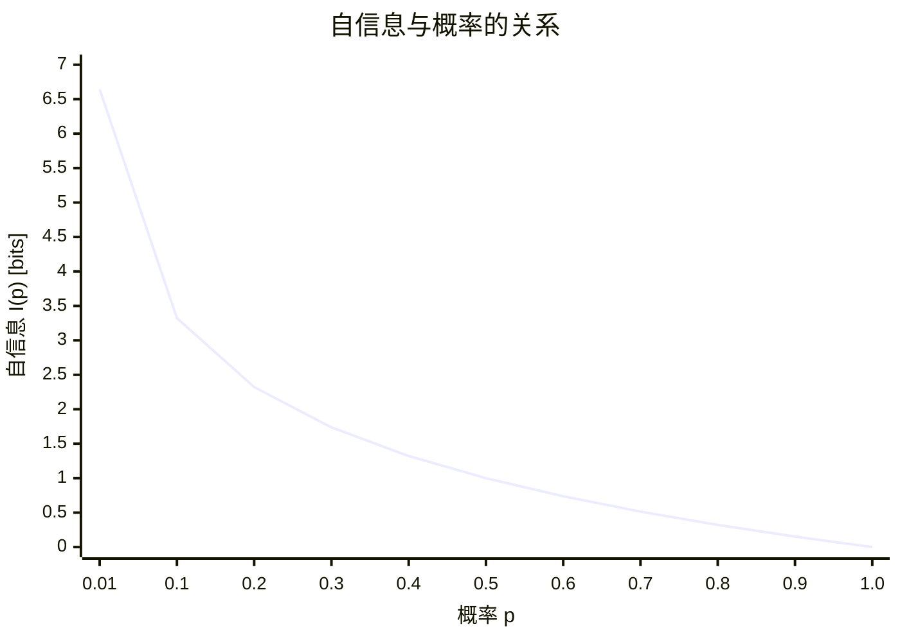

# 10.1.1 信息的度量

---

📌 **内容摘要**

本文档深入探讨信息的度量的核心原理和关键方法。内容涵盖香农信息论领域的主要知识点，包括信息论, 熵, 互信息等关键主题。适合初学者建立基础知识体系。

**关键词**: 信息论, 熵, 香农信息论, 互信息

📚 **学习目标**

- 理解信息的度量的基本概念和核心原理
- 掌握相关术语和符号表示
- 建立该领域的系统性知识框架

🎯 **难度级别**: 初级

⏱️ **预计阅读时间**: 15分钟

**前置知识**: 基础数学知识

---


> 基于 Shannon (1948) "A Mathematical Theory of Communication" 和 Cover & Thomas (2006) "Elements of Information Theory"

## 10.1.1.1 引言

信息论（Information Theory）由克劳德·香农（Claude E. Shannon）于1948年创立，其核心问题是如何量化信息。
在香农的开创性论文《通信的数学理论》中，他提出了信息的数学度量方法，奠定了现代信息科学的基础。

### 信息的直观概念

信息可以理解为不确定性减少的量度。
当我们接收到一个消息时，如果这个消息消除了我们对某一事件的不确定性，那么这个消息就携带了信息。

**例 10.1.1.1**：考虑以下两个消息：

- 消息A："明天太阳将从东方升起"
- 消息B："明天将发生日全食"

消息A几乎不提供信息（概率接近1），而消息B提供大量信息（概率很小）。
这说明信息量与事件发生的概率有关。

## 10.1.1.2 自信息的公理化基础

### 信息量化的公理

设 $I(p)$ 表示发生概率为 $p$ 的事件所携带的信息量。香农提出了信息量应满足以下公理：

**公理 10.1.1.1**（非负性）：$I(p) \geq 0$，对所有 $p \in (0, 1]$ 成立。

**公理 10.1.1.2**（单调性）：$I(p)$ 是关于 $p$ 的单调递减函数。即若 $p_1 > p_2$，则 $I(p_1) < I(p_2)$。

**公理 10.1.1.3**（可加性）：对于独立事件 $A$ 和 $B$，有
$$I(P(A \cap B)) = I(P(A)) + I(P(B))$$

**公理 10.1.1.4**（连续性）：$I(p)$ 是关于 $p$ 的连续函数。

### 定理 10.1.1.1（自信息的唯一性）

满足上述四条公理的函数 $I(p)$ 必具有如下形式：
$$I(p) = -c \log_a p = c \log_a \frac{1}{p}$$
其中 $c > 0$ 为常数，$a > 1$ 为对数的底。

**证明**：

由公理 10.1.1.3（可加性），对于独立事件有：
$$I(p_1 \cdot p_2) = I(p_1) + I(p_2)$$

这是函数方程的柯西形式。结合公理 10.1.1.4（连续性），其解必为对数函数形式。

令 $f(x) = I(e^{-x})$，其中 $x = -\ln p > 0$，则：
$$f(x_1 + x_2) = I(e^{-(x_1+x_2)}) = I(e^{-x_1} \cdot e^{-x_2}) = I(e^{-x_1}) + I(e^{-x_2}) = f(x_1) + f(x_2)$$

由柯西函数方程的连续解，$f(x) = cx$，因此：
$$I(p) = f(-\ln p) = c(-\ln p) = c\ln\frac{1}{p}$$

对于一般的底 $a$，有 $\ln p = \ln a \cdot \log_a p$，所以：
$$I(p) = c \ln a \cdot \log_a \frac{1}{p}$$

令 $c' = c \ln a$，则 $I(p) = c' \log_a \frac{1}{p}$。

**证毕**。

## 10.1.1.3 自信息的定义

### 定义 10.1.1.1（自信息）

设离散随机变量 $X$ 取值为 $x$ 的概率为 $P(X=x) = p(x)$，则事件 $\{X=x\}$ 的**自信息**（Self-Information）定义为：
$$I(x) = \log \frac{1}{p(x)} = -\log p(x)$$

当对数底为 2 时，单位为**比特**（bit, binary unit）；
当对数底为 $e$ 时，单位为**奈特**（nat, natural unit）；
当对数底为 10 时，单位为**哈特利**（Hartley）。

**换算关系**：$1 \text{ Hartley} = \log_2 10 \approx 3.322 \text{ bits}$，$1 \text{ nat} = \log_2 e \approx 1.443 \text{ bits}$。

### 自信息的性质

**性质 10.1.1.1**：$I(x) \geq 0$，等号当且仅当 $p(x) = 1$ 时成立。

**性质 10.1.1.2**：若 $p(x) \to 0$，则 $I(x) \to +\infty$。

**性质 10.1.1.3**：对于独立事件 $x$ 和 $y$：
$$I(x, y) = I(x) + I(y)$$

## 10.1.1.4 信息量的解释

### 惊奇度解释

自信息可以理解为事件的"惊奇度"（Surprisal）：

- 高概率事件：不惊奇，信息量小
- 低概率事件：非常惊奇，信息量大



### 编码长度解释

自信息也表示最优编码该事件所需的最小比特数。根据香农无噪声编码定理，概率为 $p$ 的符号至少需要 $-\log_2 p$ 比特来编码。

## 10.1.1.5 示例与计算

### 例 10.1.1.2（公平硬币）

抛掷一枚公平硬币，出现正面的自信息：
$$I(\text{正面}) = -\log_2 \frac{1}{2} = 1 \text{ bit}$$

### 例 10.1.1.3（不公平硬币）

设硬币正面概率为 $p = 0.9$，则：
$$I(\text{正面}) = -\log_2 0.9 \approx 0.152 \text{ bits}$$
$$I(\text{反面}) = -\log_2 0.1 \approx 3.322 \text{ bits}$$

### 例 10.1.1.4（掷骰子）

掷一个公平的六面骰子：
$$I(\text{任意结果}) = -\log_2 \frac{1}{6} = \log_2 6 \approx 2.585 \text{ bits}$$

## 10.1.1.6 代码实现

### Python 实现

```python
import math
from typing import Union, List

def self_information(p: float, base: float = 2) -> float:
    """
    计算自信息 I(p) = -log_b(p)

    Args:
        p: 事件概率，0 < p <= 1
        base: 对数的底，默认为2（比特）

    Returns:
        自信息值
    """
    if not 0 < p <= 1:
        raise ValueError("概率必须在 (0, 1] 区间内")

    if p == 1:
        return 0.0

    return -math.log(p, base)

# 示例计算
print("=== 自信息计算示例 ===")

# 公平硬币
p_fair = 0.5
print(f"公平硬币正面: I = {self_information(p_fair):.4f} bits")

# 不公平硬币
p_bias_head = 0.9
p_bias_tail = 0.1
print(f"不公平硬币正面(0.9): I = {self_information(p_bias_head):.4f} bits")
print(f"不公平硬币反面(0.1): I = {self_information(p_bias_tail):.4f} bits")

# 六面骰子
p_die = 1/6
print(f"六面骰子: I = {self_information(p_die):.4f} bits")

# 罕见事件
p_rare = 0.001
print(f"罕见事件(0.001): I = {self_information(p_rare):.4f} bits")

# 单位换算
print("\n=== 单位换算 ===")
p = 0.5
print(f"p = {p}:")
print(f"  比特 (base=2): {self_information(p, 2):.4f}")
print(f"  奈特 (base=e): {self_information(p, math.e):.4f}")
print(f"  哈特利 (base=10): {self_information(p, 10):.4f}")

def expected_information(probabilities: List[float]) -> float:
    """计算期望信息量（熵）"""
    return sum(p * self_information(p) for p in probabilities if p > 0)

# 验证可加性
print("\n=== 独立事件可加性验证 ===")
p1, p2 = 0.5, 0.5
i1 = self_information(p1)
i2 = self_information(p2)
i_combined = self_information(p1 * p2)
print(f"I({p1}) + I({p2}) = {i1:.4f} + {i2:.4f} = {i1+i2:.4f}")
print(f"I({p1}×{p2}) = {i_combined:.4f}")
print(f"相等: {math.isclose(i1+i2, i_combined)}")
```

### Lean 4 形式化定义

```lean4
import Mathlib

open Real

/-- 自信息的定义：I(p) = -log(p) -/
def selfInformation (p : ℝ) (hp : 0 < p ∧ p ≤ 1) : ℝ :=
  -log p

/-- 自信息非负性定理 -/
theorem selfInformation_nonneg {p : ℝ} (hp : 0 < p ∧ p ≤ 1) :
    selfInformation p hp ≥ 0 := by
  unfold selfInformation
  have h1 : log p ≤ 0 := by
    apply log_nonpos
    · linarith [hp.left]
    · linarith [hp.right]
  linarith

/-- 自信息为零当且仅当p=1 -/
theorem selfInformation_zero_iff {p : ℝ} (hp : 0 < p ∧ p ≤ 1) :
    selfInformation p hp = 0 ↔ p = 1 := by
  unfold selfInformation
  constructor
  · intro h
    have : log p = 0 := by linarith
    rw [log_eq_zero] at this
    rcases this with (r | r | r)
    · linarith
    · linarith
    · linarith
  · intro hp1
    rw [hp1]
    simp

/-- 独立事件的自信息可加性 -/
theorem selfInformation_independent {p q : ℝ}
    (hp : 0 < p ∧ p ≤ 1) (hq : 0 < q ∧ q ≤ 1) :
    selfInformation (p * q) (by constructor <;> nlinarith) =
    selfInformation p hp + selfInformation q hq := by
  unfold selfInformation
  rw [log_mul (by linarith) (by linarith)]
  ring

/-- 自信息的单调递减性：若 p > q，则 I(p) < I(q) -/
theorem selfInformation_antitone {p q : ℝ}
    (hp : 0 < p ∧ p ≤ 1) (hq : 0 < q ∧ q ≤ 1) (h : p > q) :
    selfInformation p hp < selfInformation q hq := by
  unfold selfInformation
  have hlog : log p > log q := by
    apply Real.log_lt_log
    · linarith
    · linarith
  linarith
```

## 10.1.1.7 总结

```mermaid
flowchart TD
    A[信息的度量] --> B[公理化基础]
    A --> C[自信息定义]
    A --> D[实际应用]

    B --> B1[非负性]
    B --> B2[单调性]
    B --> B3[可加性]
    B --> B4[连续性]

    C --> C1[I(p) = -log p]
    C --> C2[单位：bits/nats]

    D --> D1[编码长度]
    D --> D2[惊奇度]
    D --> D3[不确定性]
```

**核心结论**：

1. 自信息 $I(x) = -\log p(x)$ 是信息的基本度量单位
2. 信息量与概率成反比，小概率事件携带大量信息
3. 独立事件的信息量具有可加性
4. 自信息为后续定义熵、互信息等概念奠定了基础

**参考**：

- Shannon, C. E. (1948). A mathematical theory of communication. _Bell System Technical Journal_, 27(3), 379-423.
- Cover, T. M., & Thomas, J. A. (2006). _Elements of information theory_ (2nd ed.). Wiley-Interscience.

---

## 📚 延伸阅读

- [10.1.2 熵的定义与性质](01.2_熵的定义与性质.md)
- [9.2.2 随机变量](../../09_统计学/02_概率论基础/02.2_随机变量.md)
- [10.1.4 互信息与相对熵](01.4_互信息与相对熵.md)
