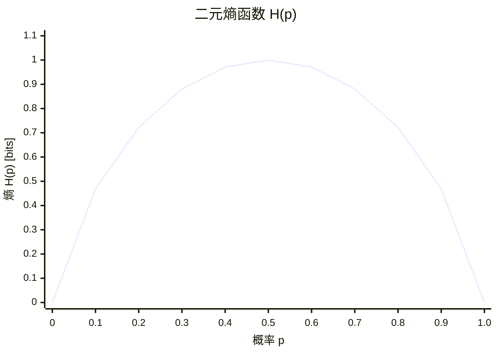

# 10.1.2 熵的定义与性质

> 基于 Shannon (1948) "A Mathematical Theory of Communication" 和 Cover & Thomas (2006) "Elements of Information Theory"

## 10.1.2.1 引言

**熵**（Entropy）是信息论中最核心的概念之一，它量化了随机变量的平均不确定性或平均信息量。
熵的概念由香农从热力学中借用并赋予新的数学定义，成为度量信息源不确定性的基本工具。

## 10.1.2.2 Shannon熵的形式化定义

### 定义 10.1.2.1（Shannon熵）

设离散随机变量 $X$ 的取值空间为 $\mathcal{X} = \{x_1, x_2, \ldots, x_n\}$，概率质量函数为 $P(X=x_i) = p(x_i)$，则 $X$ 的**熵**定义为：

$$H(X) = -\sum_{x \in \mathcal{X}} p(x) \log p(x) = \sum_{x \in \mathcal{X}} p(x) \log \frac{1}{p(x)}$$

约定：$0 \log 0 = 0$（由连续性 $\lim_{p \to 0^+} p \log p = 0$ 确定）。

### 熵的另一种解释

熵也可以表示为自信息的期望：
$$H(X) = \mathbb{E}[I(X)] = \mathbb{E}\left[\log \frac{1}{p(X)}\right]$$

## 10.1.2.3 熵的公理化推导

### 熵的公理体系（Shannon, 1948）

设 $H(p_1, p_2, \ldots, p_n)$ 是概率分布 $(p_1, \ldots, p_n)$ 的连续函数，满足：

**公理 10.1.2.1**（连续性）：$H$ 是其参数的连续函数。

**公理 10.1.2.2**（对称性）：$H$ 关于其参数对称，即：
$$H(p_1, p_2, \ldots, p_n) = H(p_{\pi(1)}, p_{\pi(2)}, \ldots, p_{\pi(n)})$$
对任意排列 $\pi$ 成立。

**公理 10.1.2.3**（极值性）：当所有结果等概率时，熵达到最大值：
$$H\left(\frac{1}{n}, \frac{1}{n}, \ldots, \frac{1}{n}\right) \geq H(p_1, p_2, \ldots, p_n)$$

**公理 10.1.2.4**（可加性）：若一个选择被分解为两个连续选择，则原熵等于各步熵的加权和：
$$H(p_1, \ldots, p_m, q_1, \ldots, q_n) = H(p, 1-p) + p \cdot H\left(\frac{p_1}{p}, \ldots, \frac{p_m}{p}\right) + (1-p) \cdot H\left(\frac{q_1}{1-p}, \ldots, \frac{q_n}{1-p}\right)$$
其中 $p = \sum_{i=1}^m p_i$，$1-p = \sum_{j=1}^n q_j$。

### 定理 10.1.2.1（熵的唯一性）

满足上述四条公理的函数 $H$ 必具有如下形式：
$$H(p_1, \ldots, p_n) = -K \sum_{i=1}^n p_i \log p_i$$
其中 $K$ 为正常数。

**证明概要**：

1. 首先证明 $H(1/n, \ldots, 1/n) = K \log n$（利用可加性和归纳法）
2. 利用有理数逼近，证明对任意概率分布成立
3. 由连续性，推广到实数概率

## 10.1.2.4 熵的基本性质

### 定理 10.1.2.2（非负性）

$$H(X) \geq 0$$
等号当且仅当 $X$ 为确定性变量（存在 $x$ 使 $p(x) = 1$）时成立。

**证明**：
由于 $0 \leq p(x) \leq 1$，有 $\log(1/p(x)) \geq 0$，因此每项 $p(x)\log(1/p(x)) \geq 0$。
等号成立当且仅当对所有 $p(x) > 0$ 有 $\log(1/p(x)) = 0$，即 $p(x) = 1$。

### 定理 10.1.2.3（有界性）

若 $|\mathcal{X}| = n$，则：
$$0 \leq H(X) \leq \log n$$

上界等号当且仅当 $X$ 服从均匀分布 $p(x) = 1/n$ 对所有 $x \in \mathcal{X}$ 成立。

**证明**：

上界证明使用Jensen不等式。由于 $\log x$ 是凹函数：
$$H(X) = \sum_{i=1}^n p(x_i) \log \frac{1}{p(x_i)} \leq \log \sum_{i=1}^n p(x_i) \cdot \frac{1}{p(x_i)} = \log n$$

等号成立当且仅当所有 $1/p(x_i)$ 相等，即所有 $p(x_i)$ 相等。

### 定理 10.1.2.4（链式法则的熵形式）

$$H(X) = -\sum_{x} p(x) \log p(x)$$

这是熵的最基本形式，也是后续条件熵、互信息定义的起点。

## 10.1.2.5 常见分布的熵

### 伯努利分布（二元熵函数）

设 $X \sim \text{Bernoulli}(p)$，则：
$$H(X) = H(p) = -p \log p - (1-p) \log(1-p)$$

二元熵函数 $H(p)$ 是关于 $p = 1/2$ 对称的，在 $p = 1/2$ 处达到最大值 1 bit。



### 均匀分布

若 $X$ 在 $n$ 个元素上均匀分布：
$$H(X) = \sum_{i=1}^n \frac{1}{n} \log n = \log n$$

### 确定性分布

若 $X$ 以概率 1 取某个值：
$$H(X) = 0$$

## 10.1.2.6 熵的凹性

### 定理 10.1.2.5（熵的凹性）

熵 $H(p)$ 是概率分布 $p$ 的凹函数。即对于任意两个概率分布 $p$ 和 $q$，以及 $\lambda \in [0, 1]$：
$$H(\lambda p + (1-\lambda)q) \geq \lambda H(p) + (1-\lambda) H(q)$$

**证明**：
由 $\log x$ 的凹性和Jensen不等式可得。

## 10.1.2.7 代码实现

### Python 实现

```python
import math
import numpy as np
from typing import List, Dict, Union
import matplotlib.pyplot as plt

def entropy(prob_dist: Union[List[float], Dict[str, float]], base: float = 2) -> float:
    """
    计算离散随机变量的熵

    Args:
        prob_dist: 概率分布（列表或字典）
        base: 对数的底，默认为2（比特）

    Returns:
        熵值
    """
    if isinstance(prob_dist, dict):
        probs = list(prob_dist.values())
    else:
        probs = prob_dist

    # 归一化检查
    total = sum(probs)
    if not math.isclose(total, 1.0, rel_tol=1e-9):
        probs = [p / total for p in probs]

    H = 0.0
    for p in probs:
        if p > 0:  # 避免 log(0)
            H -= p * math.log(p, base)

    return H

def binary_entropy(p: float, base: float = 2) -> float:
    """
    计算二元熵函数 H(p) = -p*log(p) - (1-p)*log(1-p)
    """
    if p <= 0 or p >= 1:
        return 0.0
    q = 1 - p
    return -(p * math.log(p, base) + q * math.log(q, base))

# 示例计算
print("=== 熵的计算示例 ===")

# 均匀分布
uniform_4 = [0.25, 0.25, 0.25, 0.25]
print(f"4元均匀分布: H = {entropy(uniform_4):.4f} bits (理论值: 2.0)")

# 确定性分布
deterministic = [1.0, 0.0, 0.0, 0.0]
print(f"确定性分布: H = {entropy(deterministic):.4f} bits (理论值: 0.0)")

# 伯努利分布
print(f"\n二元熵函数 H(0.5) = {binary_entropy(0.5):.4f} bits")
print(f"二元熵函数 H(0.1) = {binary_entropy(0.1):.4f} bits")
print(f"二元熵函数 H(0.9) = {binary_entropy(0.9):.4f} bits")

# 非均匀分布
skewed = [0.9, 0.05, 0.03, 0.02]
print(f"\n偏斜分布: H = {entropy(skewed):.4f} bits")

# 验证有界性
print("\n=== 验证熵的有界性 ===")
for n in [2, 4, 8, 16, 32]:
    uniform_n = [1/n] * n
    h = entropy(uniform_n)
    print(f"n={n}: H = {h:.4f}, log2(n) = {math.log2(n):.4f}")

# 单位换算
print("\n=== 单位换算示例 ===")
p_dist = [0.5, 0.25, 0.125, 0.125]
print(f"分布 {p_dist}:")
print(f"  bits (base=2): {entropy(p_dist, 2):.4f}")
print(f"  nats (base=e): {entropy(p_dist, math.e):.4f}")
print(f"  Hartley (base=10): {entropy(p_dist, 10):.4f}")

# 可视化二元熵函数
p_values = np.linspace(0.001, 0.999, 1000)
h_values = [binary_entropy(p) for p in p_values]

plt.figure(figsize=(10, 6))
plt.plot(p_values, h_values, 'b-', linewidth=2, label='H(p)')
plt.axhline(y=1, color='r', linestyle='--', alpha=0.5, label='Maximum = 1')
plt.axvline(x=0.5, color='g', linestyle='--', alpha=0.5, label='p = 0.5')
plt.xlabel('p', fontsize=12)
plt.ylabel('H(p) [bits]', fontsize=12)
plt.title('Binary Entropy Function', fontsize=14)
plt.grid(True, alpha=0.3)
plt.legend()
plt.tight_layout()
plt.savefig('binary_entropy.png', dpi=150)
print("\n二元熵函数图已保存为 binary_entropy.png")
```

### Lean 4 形式化

```lean4
import Mathlib

open Real BigOperators

/-- Shannon熵的定义 -/
def shannonEntropy {n : ℕ} (p : Fin n → ℝ) (hp : ∀ i, 0 ≤ p i ∧ p i ≤ 1)
    (hsum : ∑ i, p i = 1) : ℝ :=
  -∑ i, p i * log (p i)

/-- 熵非负性定理 -/
theorem entropy_nonneg {n : ℕ} (p : Fin n → ℝ) (hp : ∀ i, 0 ≤ p i ∧ p i ≤ 1)
    (hsum : ∑ i, p i = 1) :
    shannonEntropy p hp hsum ≥ 0 := by
  unfold shannonEntropy
  have h1 : ∀ i, p i * log (p i) ≤ 0 := by
    intro i
    by_cases h : p i = 0
    · simp [h]
    · have hp_pos : 0 < p i := by
        have := (hp i).left
        linarith
      have hlog : log (p i) ≤ 0 := by
        apply log_nonpos
        · linarith
        · linarith [(hp i).right]
      nlinarith
  have h2 : ∑ i, p i * log (p i) ≤ 0 := by
    apply Finset.sum_nonpos
    intro i hi
    exact h1 i
  linarith

/-- 均匀分布的熵 -/
theorem entropy_uniform {n : ℕ} (hn : n > 0) :
    let p := fun (_ : Fin n) => 1 / n
    have hp : ∀ i, 0 ≤ p i ∧ p i ≤ 1 := by
      intro i
      constructor
      · positivity
      · have h : 1 / (n : ℝ) ≤ 1 := by
          apply (div_le_iff₀ (by positivity)).mpr
          linarith
        linarith
    have hsum : ∑ i, p i = 1 := by
      simp [Finset.sum_const, Finset.card_univ, hn]
      field_simp
    shannonEntropy p hp hsum = log n := by
  unfold shannonEntropy
  simp [Finset.sum_const, Finset.card_univ]
  field_simp
  <;> ring_nf
  <;> simp [log_div, log_one]
  <;> ring

/-- 二元熵函数定义 -/
def binaryEntropy (p : ℝ) (hp : 0 ≤ p ∧ p ≤ 1) : ℝ :=
  -(p * log p + (1 - p) * log (1 - p))

/-- 二元熵在p=0.5处取得最大值 -/
theorem binaryEntropy_max_at_half :
    let p := (1 / 2 : ℝ)
    have hp : 0 ≤ p ∧ p ≤ 1 := ⟨by norm_num, by norm_num⟩
    binaryEntropy p hp = log 2 := by
  unfold binaryEntropy
  have h1 : log (1 / 2 : ℝ) = -log 2 := by
    rw [log_div (by norm_num) (by norm_num)]
    simp
  norm_num [h1]
  ring_nf
  simp [h1]
  ring
```

## 10.1.2.8 熵的直观理解

```mermaid
flowchart TB
    A[熵 H(X)] --> B[不确定性度量]
    A --> C[平均信息量]
    A --> D[最优编码长度]

    B --> B1[高熵 = 高不确定性]
    B --> B2[低熵 = 低不确定性]

    C --> C1[自信息的期望]
    C --> C2[E[log(1/p(X)]]

    D --> D1[无损压缩极限]
    D --> D2[香农编码定理]

    E[熵的范围] --> F[0 ≤ H(X) ≤ log|X|]
    F --> G[H=0: 确定]
    F --> H[H=log|X|: 均匀]
```

## 10.1.2.9 小结

**核心定理回顾**：

| 定理 | 陈述 | 等号条件 |
|------|------|----------|
| 非负性 | $H(X) \geq 0$ | $X$ 确定 |
| 有界性 | $H(X) \leq \log |\mathcal{X}|$ | $X$ 均匀分布 |
| 凹性 | $H(\lambda p + (1-\lambda)q) \geq \lambda H(p) + (1-\lambda)H(q)$ | $p = q$ |

**关键概念**：

- 熵是随机变量平均不确定性的度量
- 熵也是描述该随机变量所需的最小平均比特数
- 均匀分布具有最大熵
- 确定性分布具有最小熵（零熵）

**参考**：

- Shannon, C. E. (1948). A mathematical theory of communication. _Bell System Technical Journal_, 27(3), 379-423.
- Cover, T. M., & Thomas, J. A. (2006). _Elements of information theory_ (2nd ed.). Wiley-Interscience.
