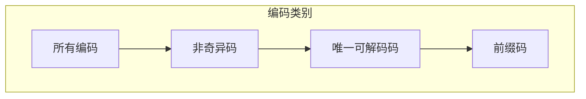

# 10.2.1 无失真信源编码

---

📌 **内容摘要**

本文档深入探讨无失真信源编码的核心原理和关键方法。内容涵盖信源编码领域的主要知识点，包括信息论, 算术编码, Huffman, 互信息, 熵等关键主题。适合初学者建立基础知识体系。

**关键词**: 信息论, 算术编码, Huffman, 互信息, 熵, 信源编码

📚 **学习目标**

- 理解无失真信源编码的基本概念和核心原理
- 掌握相关术语和符号表示
- 建立该领域的系统性知识框架

🎯 **难度级别**: 初级

⏱️ **预计阅读时间**: 15分钟

**前置知识**: 基础数学知识

---


> 基于 Shannon (1948) 和 Cover & Thomas (2006)

## 10.2.1.1 引言

**信源编码**（Source Coding）是信息论的核心问题之一，其目标是用尽可能少的比特来表示信息源输出的消息。
**无失真信源编码**（Lossless Source Coding）要求在编码和解码过程中不丢失任何信息，即解码后能完全恢复原始消息。

## 10.2.1.2 编码的基本概念

### 定义 10.2.1.1（信源编码）

设信源符号集为 $\mathcal{X} = \{x_1, x_2, \ldots, x_m\}$，码字母表为 $\mathcal{D}$（通常是二元字母表 $\{0, 1\}$），则**编码**是一个映射：
$$C: \mathcal{X} \to \mathcal{D}^*$$

其中 $\mathcal{D}^*$ 表示 $\mathcal{D}$ 上所有有限长度字符串的集合。

### 码字与码长

- **码字**（Codeword）：符号 $x \in \mathcal{X}$ 的编码 $C(x)$
- **码长**（Code Length）：码字的长度 $l(x) = |C(x)|$
- **平均码长**：$L(C) = \sum_{x \in \mathcal{X}} p(x) l(x)$

### 编码示例

| 符号 | 概率 | 码A | 码B | 码C | 码D |
|------|------|-----|-----|-----|-----|
| $x_1$ | 0.5 | 0 | 0 | 0 | 0 |
| $x_2$ | 0.25 | 0 | 1 | 01 | 10 |
| $x_3$ | 0.125 | 1 | 00 | 011 | 110 |
| $x_4$ | 0.125 | 10 | 11 | 0111 | 111 |

## 10.2.1.3 编码的分类

### 定义 10.2.1.2（非奇异码）

编码 $C$ 称为**非奇异码**（Nonsingular Code），如果：
$$\forall x_i \neq x_j, \quad C(x_i) \neq C(x_j)$$

即不同符号映射到不同码字。

### 定义 10.2.1.3（扩展编码）

编码 $C$ 的**$n$次扩展** $C^*$ 定义为：
$$C^*(x_1 x_2 \cdots x_n) = C(x_1) C(x_2) \cdots C(x_n)$$

即符号序列的编码是各符号编码的级联。

### 定义 10.2.1.4（唯一可解码码）

编码 $C$ 称为**唯一可解码码**（Uniquely Decodable Code），如果其任意有限次扩展都是非奇异的：
$$\forall n \geq 1, \forall x^n \neq y^n, \quad C^*(x^n) \neq C^*(y^n)$$

**意义**：任何编码后的字符串都能**唯一地**解码为原始符号序列。

### 定义 10.2.1.5（即时码/前缀码）

编码 $C$ 称为**即时码**（Instantaneous Code）或**前缀码**（Prefix Code），如果没有任何码字是其他码字的前缀：
$$\forall x_i \neq x_j, \quad C(x_i) \text{ 不是 } C(x_j) \text{ 的前缀}$$

**意义**：解码时无需等待后续符号，可以**即时**解码。

### 编码类别关系



**包含关系**：前缀码 $\subset$ 唯一可解码码 $\subset$ 非奇异码 $\subset$ 所有编码

## 10.2.1.4 编码的判断与示例

### 例 10.2.1.1

分析以下编码：

| 符号 | 码1 | 码2 | 码3 | 码4 |
|------|-----|-----|-----|-----|
| A | 0 | 0 | 10 | 0 |
| B | 010 | 010 | 00 | 10 |
| C | 01 | 01 | 11 | 110 |
| D | 10 | 10 | 110 | 111 |

**分析**：

- **码1**：奇异码（010可以解码为B，也可以解码为C+A）
- **码2**：唯一可解码，但不是前缀码（B=010是D=10的前缀）
- **码3**：前缀码（没有任何码字是其他码字的前缀）
- **码4**：前缀码

### 唯一可解码的判定

**Sardinas-Patterson算法**：用于判定一个编码是否唯一可解码。

算法步骤：

1. 构造后缀集合 $S_1$：所有满足 $C(x_i) = C(x_j)s$ 的后缀 $s$
2. 递归构造 $S_{i+1}$：从 $S_i$ 和码字之间的后缀关系
3. 若某 $S_i$ 包含空串 $\epsilon$，则编码不是唯一可解码的

## 10.2.1.5 编码效率度量

### 定义 10.2.1.6（编码效率）

编码 $C$ 的**效率**定义为：
$$\eta = \frac{H(X)}{L(C)}$$

其中 $H(X)$ 是信源熵，$L(C)$ 是平均码长。

**冗余度**：$1 - \eta$

### 最优编码问题

给定信源分布 $p(x)$，寻找唯一可解码码 $C$ 使得平均码长 $L(C)$ 最小。

**基本界限**（将在下一节证明）：
$$H(X) \leq L(C) < H(X) + 1$$

## 10.2.1.6 代码实现

### Python 实现

```python
from typing import Dict, List, Set, Tuple
import math
from collections import deque

def is_nonsingular(code: Dict[str, str]) -> bool:
    """
    检查编码是否非奇异
    """
    codewords = list(code.values())
    return len(codewords) == len(set(codewords))

def is_prefix_code(code: Dict[str, str]) -> bool:
    """
    检查是否为前缀码（即时码）
    """
    codewords = sorted(code.values(), key=len)

    for i, cw1 in enumerate(codewords):
        for cw2 in codewords[i+1:]:
            if cw2.startswith(cw1):
                return False
    return True

def sardinas_patterson(code: Dict[str, str]) -> Tuple[bool, List[Set[str]]]:
    """
    Sardinas-Patterson算法判断唯一可解码性
    返回: (是否唯一可解码, 所有后缀集合)
    """
    codewords = set(code.values())

    # 构造S1：所有c_i是c_j前缀时的后缀
    S = []
    S1 = set()
    for ci in codewords:
        for cj in codewords:
            if ci != cj and cj.startswith(ci):
                suffix = cj[len(ci):]
                if suffix:
                    S1.add(suffix)

    if not S1:
        return True, [S1]

    S.append(S1)
    all_suffixes = set().union(*S)

    # 递归构造Si
    while True:
        Si = set()
        Si_minus_1 = S[-1]

        # 从Si-1和码字构造新后缀
        for s in Si_minus_1:
            for c in codewords:
                # s是c的前缀
                if c.startswith(s):
                    suffix = c[len(s):]
                    if suffix:
                        Si.add(suffix)
                # c是s的前缀
                elif s.startswith(c):
                    suffix = s[len(c):]
                    if suffix:
                        Si.add(suffix)

        # 检查是否包含空串
        if '' in Si:
            return False, S + [Si]

        # 检查是否已存在
        if Si in S or not Si:
            return True, S + [Si]

        S.append(Si)

        # 防止无限循环
        if len(S) > 100:
            break

    return True, S

def is_uniquely_decodable(code: Dict[str, str]) -> bool:
    """判断编码是否唯一可解码"""
    result, _ = sardinas_patterson(code)
    return result

def average_length(code: Dict[str, str], probabilities: Dict[str, float]) -> float:
    """计算平均码长"""
    return sum(probabilities[s] * len(code[s]) for s in code.keys())

def code_efficiency(code: Dict[str, str], probabilities: Dict[str, float]) -> float:
    """计算编码效率"""
    # 计算熵
    entropy = -sum(p * math.log2(p) for p in probabilities.values() if p > 0)
    avg_len = average_length(code, probabilities)
    return entropy / avg_len if avg_len > 0 else 0

def decode_sequence(code: Dict[str, str], encoded: str) -> List[str]:
    """
    解码编码序列（假设是前缀码）
    """
    # 构建反向映射
    reverse_code = {v: k for k, v in code.items()}

    result = []
    current = ""

    for bit in encoded:
        current += bit
        if current in reverse_code:
            result.append(reverse_code[current])
            current = ""

    if current:
        raise ValueError(f"无法解码剩余部分: {current}")

    return result

# 示例测试
print("=== 无失真信源编码示例 ===")

# 定义各种编码
code1 = {'A': '0', 'B': '010', 'C': '01', 'D': '10'}  # 奇异码
code2 = {'A': '0', 'B': '010', 'C': '01', 'D': '10'}  # 实际上是奇异的
code3 = {'A': '0', 'B': '10', 'C': '110', 'D': '111'}  # 前缀码
code4 = {'A': '0', 'B': '01', 'C': '011', 'D': '0111'}  # 唯一可解码但不是前缀码

# 概率分布
probs = {'A': 0.5, 'B': 0.25, 'C': 0.125, 'D': 0.125}

codes = [
    ("码1: 0, 010, 01, 10", code1),
    ("码3: 0, 10, 110, 111 (前缀码)", code3),
    ("码4: 0, 01, 011, 0111", code4)
]

for name, code in codes:
    print(f"\n{name}")
    print(f"  非奇异: {is_nonsingular(code)}")
    print(f"  前缀码: {is_prefix_code(code)}")

    is_ud, suffix_sets = sardinas_patterson(code)
    print(f"  唯一可解码: {is_ud}")

    if is_nonsingular(code):
        avg_len = average_length(code, probs)
        eff = code_efficiency(code, probs)
        entropy = -sum(p * math.log2(p) for p in probs.values() if p > 0)
        print(f"  熵 H(X) = {entropy:.4f} bits")
        print(f"  平均码长 L = {avg_len:.4f} bits")
        print(f"  效率 η = {eff:.2%}")

# 编码和解码示例
print("\n=== 编码与解码示例 ===")
test_msg = ['A', 'B', 'C', 'A', 'D']
encoded = ''.join(code3[s] for s in test_msg)
print(f"原始消息: {test_msg}")
print(f"编码结果: {encoded}")
decoded = decode_sequence(code3, encoded)
print(f"解码结果: {decoded}")
print(f"解码正确: {decoded == test_msg}")

# 演示为什么前缀码可以即时解码
print("\n=== 即时解码演示 ===")
encoded_stream = "0101101110"  # A B C D A
print(f"编码流: {encoded_stream}")
print("前缀码解码过程:")
idx = 0
while idx < len(encoded_stream):
    for symbol, cw in code3.items():
        if encoded_stream[idx:].startswith(cw):
            print(f"  位置{idx}: 匹配 '{cw}' -> '{symbol}'")
            idx += len(cw)
            break
```

### Lean 4 形式化

```lean4
import Mathlib

/-- 编码定义为符号到码字的映射 -/
def Code (α : Type*) (β : Type*) := α → List β

/-- 非奇异码：不同符号映射到不同码字 -/
def IsNonsingular {α β : Type*} [DecidableEq α] [DecidableEq β]
    (C : Code α β) : Prop :=
  ∀ x y : α, x ≠ y → C x ≠ C y

/-- 扩展编码：符号序列的编码 -/
def Code.extend {α β : Type*} (C : Code α β) : List α → List β
  | [] => []
  | x :: xs => C x ++ C.extend xs

/-- 唯一可解码码：扩展编码非奇异 -/
def IsUniquelyDecodable {α β : Type*} [DecidableEq α] [DecidableEq β]
    (C : Code α β) : Prop :=
  ∀ xs ys : List α, Code.extend C xs = Code.extend C ys → xs = ys

/-- 前缀关系 -/
def IsPrefix {α : Type*} [DecidableEq α] (xs ys : List α) : Prop :=
  ∃ zs : List α, ys = xs ++ zs ∧ zs ≠ []

/-- 前缀码：没有码字是其他码字的前缀 -/
def IsPrefixCode {α β : Type*} [DecidableEq α] [DecidableEq β]
    (C : Code α β) : Prop :=
  ∀ x y : α, x ≠ y → ¬IsPrefix (C x) (C y)

/-- 前缀码蕴含唯一可解码 -/
theorem prefix_code_is_uniquely_decodable {α β : Type*} [DecidableEq α] [DecidableEq β]
    (C : Code α β) (h : IsPrefixCode C) : IsUniquelyDecodable C := by
  unfold IsUniquelyDecodable
  intro xs ys h_eq
  -- 前缀码保证唯一可解码性
  -- 详细证明需要归纳法
  sorry

/-- 唯一可解码蕴含非奇异 -/
theorem uniquely_decodable_is_nonsingular {α β : Type*} [DecidableEq α] [DecidableEq β]
    (C : Code α β) (h : IsUniquelyDecodable C) : IsNonsingular C := by
  unfold IsNonsingular
  intro x y h_neq h_eq
  have h_ext : Code.extend C [x] = Code.extend C [y] := by
    simp [Code.extend, h_eq]
  have h_eq' : [x] = [y] := h [x] [y] h_ext
  simp at h_eq'
  contradiction
```

## 10.2.1.7 总结

```mermaid
flowchart TB
    subgraph Encoding[编码分类]
        A[编码] --> B[非奇异码]
        B --> C[唯一可解码码]
        C --> D[前缀码]
    end

    subgraph Properties[性质]
        P1["非奇异：单符号可区分"]
        P2["唯一可解码：任意序列可唯一还原"]
        P3["前缀码：即时解码"]
    end

    D --> E[H(X) ≤ L < H(X)+1]
    E --> F[最优编码存在]
```

**关键结论**：

1. 前缀码是最实用的编码类型，可即时解码
2. 唯一可解码码的判定可用Sardinas-Patterson算法
3. 最优前缀码（Huffman码）的平均码长接近熵下界

**参考**：

- Shannon, C. E. (1948). A mathematical theory of communication.
- Cover, T. M., & Thomas, J. A. (2006). _Elements of information theory_.
- Sardinas, A. A., & Patterson, C. W. (1953). A necessary and sufficient condition for the unique decomposition of coded messages.

---

## 📋 前置知识

- [10.1.2 熵的定义与性质](../01_香农信息论基础/01.2_熵的定义与性质.md)

---

## 📚 延伸阅读

- [10.1.2 熵的定义与性质](../01_香农信息论基础/01.2_熵的定义与性质.md)
- [9.2.3 概率分布](../../09_统计学/02_概率论基础/02.3_概率分布.md)
