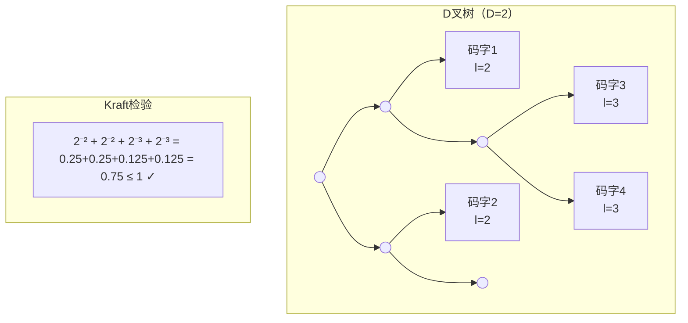

# 10.2.2 Kraft不等式

---

📌 **内容摘要**

本文档深入探讨Kraft不等式的核心原理和关键方法。内容涵盖信源编码领域的主要知识点，包括信息论, 熵, 互信息等关键主题。适合有一定基础的学习者系统学习。

**关键词**: 信息论, 熵, 信源编码, 互信息

📚 **学习目标**

- 掌握Kraft不等式的核心概念和主要方法
- 理解相关理论的应用场景
- 建立该领域的系统性知识框架

🎯 **难度级别**: 中级

⏱️ **预计阅读时间**: 15分钟

**前置知识**: 相关领域的基础概念

---


> 基于 Kraft (1949) 和 McMillan (1956)

## 10.2.2.1 引言

**Kraft不等式**（Kraft Inequality）是信息论中关于前缀码存在性的基本定理。
它给出了码长集合能够构成前缀码的充要条件。
Kraft-McMillan不等式则将此结果扩展到唯一可解码码。

## 10.2.2.2 Kraft不等式

### 定理 10.2.2.1（Kraft不等式）

设 $D$ 元字母表（通常 $D=2$ 为二元码），码长分别为 $l_1, l_2, \ldots, l_m$，则存在具有这些码长的**前缀码**的充要条件是：

$$\sum_{i=1}^{m} D^{-l_i} \leq 1$$

**证明**（必要性 $\Rightarrow$）：

考虑 $D$ 叉树表示。深度为 $l$ 的节点有 $D^{L-l}$ 个后代叶节点（在深度 $L$ 处，$L \geq \max_i l_i$）。

由于前缀码的性质，各码字对应的节点子树不相交：
$$\sum_{i=1}^{m} D^{L-l_i} \leq D^L$$

两边除以 $D^L$ 得：
$$\sum_{i=1}^{m} D^{-l_i} \leq 1$$

**证明**（充分性 $\Leftarrow$）：

若不等式成立，可按以下方式构造前缀码：

1. 将码长按递增排序：$l_1 \leq l_2 \leq \cdots \leq l_m$
2. 依次分配码字，每个新码字选择不与已有码字前缀冲突的最短可用码字

### 几何解释

在 $D$ 叉树中，深度为 $l_i$ 的节点"占据"了 $D^{-l_i}$ 比例的叶节点空间。前缀条件要求这些空间不重叠。



## 10.2.2.3 Kraft-McMillan不等式

### 定理 10.2.2.2（Kraft-McMillan不等式）

对于**唯一可解码码**，码长必须满足：
$$\sum_{i=1}^{m} D^{-l_i} \leq 1$$

反之，若码长满足此不等式，则存在具有这些码长的前缀码（当然也是唯一可解码码）。

**证明**（McMillan, 1956）：

设 $K = \sum_{i=1}^m D^{-l_i}$，考虑 $K^n$：

$$K^n = \left(\sum_{i=1}^m D^{-l_i}\right)^n = \sum_{j=1}^{n \cdot l_{max}} N_j D^{-j}$$

其中 $N_j$ 是总长度为 $j$ 的码字序列数。

由于编码唯一可解码，总长度为 $j$ 的不同序列数至多为 $D^j$（$D$ 元 $j$ 长字符串数）：
$$N_j \leq D^j$$

因此：
$$K^n \leq \sum_{j=1}^{n \cdot l_{max}} D^j \cdot D^{-j} = n \cdot l_{max}$$

若 $K > 1$，则 $K^n \to \infty$（当 $n \to \infty$），与上界矛盾。故 $K \leq 1$。

## 10.2.2.4 等号成立的特殊情况

### 定义 10.2.2.1（完全前缀码）

若前缀码满足 Kraft 不等式取等号：
$$\sum_{i=1}^{m} D^{-l_i} = 1$$

则称为**完全前缀码**（Complete Prefix Code）或**紧致码**（Compact Code）。

**性质**：

- 编码树的每个内部节点都有 $D$ 个子节点
- 没有"浪费"的编码空间

## 10.2.2.5 最优码长与Kraft不等式

### 定理 10.2.2.3（最优码长的存在性）

给定概率分布 $p_1, \ldots, p_m$，最小化平均码长 $\sum p_i l_i$ 的最优码长满足：
$$l_i^* = \lceil -\log_D p_i \rceil$$

且这些码长满足 Kraft 不等式。

**证明**：

$$\sum_{i=1}^m D^{-\lceil -\log_D p_i \rceil} \leq \sum_{i=1}^m D^{\log_D p_i} = \sum_{i=1}^m p_i = 1$$

### 平均码长的界

**定理 10.2.2.4**：对于最优前缀码：
$$H_D(X) \leq L^* < H_D(X) + 1$$

其中 $H_D(X) = -\sum p_i \log_D p_i$ 是以 $D$ 为底的熵。

**证明**：

- 下界：由 $l_i \geq -\log_D p_i$（否则违反Kraft不等式）
- 上界：取 $l_i = \lceil -\log_D p_i \rceil < -\log_D p_i + 1$

## 10.2.2.6 代码实现

### Python 实现

```python
import math
from typing import List, Tuple, Dict

def kraft_inequality(lengths: List[int], D: int = 2) -> Tuple[float, bool]:
    """
    计算Kraft和并检验不等式

    Args:
        lengths: 码长列表
        D: 字母表大小（默认2，二元码）

    Returns:
        (Kraft和, 是否满足不等式)
    """
    kraft_sum = sum(D ** (-l) for l in lengths)
    return kraft_sum, kraft_sum <= 1 + 1e-10

def construct_prefix_code(lengths: List[int], D: int = 2) -> Dict[int, str]:
    """
    构造满足给定码长的前缀码（二元码）

    使用算法：按码长递增分配码字
    """
    if D != 2:
        raise NotImplementedError("目前仅支持二元码")

    # 排序码长，保留原始索引
    indexed_lengths = sorted(enumerate(lengths), key=lambda x: x[1])

    code = {}
    current_code = 0
    current_length = 0

    for idx, length in indexed_lengths:
        # 调整到当前码长
        if length > current_length:
            current_code <<= (length - current_length)
            current_length = length

        # 转换为二进制字符串
        code[idx] = format(current_code, f'0{length}b')
        current_code += 1

    return code

def is_prefix_code_codewords(codewords: List[str]) -> bool:
    """检查是否为前缀码"""
    codewords = sorted(codewords, key=len)
    for i, cw1 in enumerate(codewords):
        for cw2 in codewords[i+1:]:
            if cw2.startswith(cw1):
                return False
    return True

def optimal_length_bound(probabilities: List[float], D: int = 2) -> Tuple[float, float]:
    """
    计算最优码长的理论界限

    Returns:
        (下界 H_D(X), 上界 H_D(X) + 1)
    """
    entropy = -sum(p * math.log(p, D) for p in probabilities if p > 0)
    return entropy, entropy + 1

def shannon_code_lengths(probabilities: List[float], D: int = 2) -> List[int]:
    """
    Shannon码：l_i = ceil(-log_D(p_i))
    """
    return [math.ceil(-math.log(p, D)) if p > 0 else 0 for p in probabilities]

# 示例测试
print("=== Kraft不等式示例 ===")

# 例1：有效的前缀码码长
lengths1 = [1, 2, 3, 3]
kraft1, valid1 = kraft_inequality(lengths1, 2)
print(f"\n码长 {lengths1}")
print(f"Kraft和 = {kraft1:.4f} {'≤ 1 ✓' if valid1 else '> 1 ✗'}")
if valid1:
    code1 = construct_prefix_code(lengths1)
    print(f"构造的前缀码: {list(code1.values())}")

# 例2：无效的码长
lengths2 = [1, 1, 2, 2]
kraft2, valid2 = kraft_inequality(lengths2, 2)
print(f"\n码长 {lengths2}")
print(f"Kraft和 = {kraft2:.4f} {'≤ 1 ✓' if valid2 else '> 1 ✗'}")
print("解释：两个码长为1的码字已用尽所有编码空间")

# 例3：紧致码（等号成立）
lengths3 = [2, 2, 2, 2]
kraft3, valid3 = kraft_inequality(lengths3, 2)
print(f"\n码长 {lengths3}（完全前缀码）")
print(f"Kraft和 = {kraft3:.4f} = 1 ✓")

# Shannon码示例
print("\n=== Shannon码构造 ===")
probs = [0.5, 0.25, 0.125, 0.125]
shannon_lengths = shannon_code_lengths(probs)
print(f"概率分布: {probs}")
print(f"Shannon码长: {shannon_lengths}")
kraft_shannon, _ = kraft_inequality(shannon_lengths)
print(f"Kraft和: {kraft_shannon:.4f}")

entropy = -sum(p * math.log2(p) for p in probs if p > 0)
avg_len = sum(p * l for p, l in zip(probs, shannon_lengths))
print(f"熵 H(X) = {entropy:.4f} bits")
print(f"Shannon码平均码长 = {avg_len:.4f} bits")
print(f"效率 = {entropy/avg_len:.2%}")

# 验证码长界限
print("\n=== 最优码长界限验证 ===")
test_probs = [
    [0.5, 0.5],
    [0.5, 0.25, 0.25],
    [0.4, 0.3, 0.2, 0.1],
    [0.5, 0.25, 0.125, 0.0625, 0.0625]
]

for probs in test_probs:
    lower, upper = optimal_length_bound(probs)
    sh_lengths = shannon_code_lengths(probs)
    avg_sh = sum(p * l for p, l in zip(probs, sh_lengths))
    print(f"P={probs}")
    print(f"  界限: [{lower:.3f}, {upper:.3f})")
    print(f"  Shannon: {avg_sh:.3f}, 码长: {sh_lengths}")
    print()
```

### Lean 4 形式化

```lean4
import Mathlib

open Real BigOperators

/-- Kraft和 -/
def kraftSum {m : ℕ} (lengths : Fin m → ℕ) (D : ℕ) (hD : D ≥ 2) : ℝ :=
  ∑ i, (D : ℝ) ^ (-(lengths i : ℤ))

/-- Kraft不等式：前缀码存在的必要条件 -/
theorem kraft_inequality_necessary {m : ℕ} (lengths : Fin m → ℕ) (D : ℕ)
    (hD : D ≥ 2) (h : ∃ C : Fin m → List (Fin D),
    IsPrefixCode C ∧ ∀ i, (C i).length = lengths i) :
    kraftSum lengths D hD ≤ 1 := by
  -- 证明使用D叉树的几何论证
  unfold kraftSum IsPrefixCode
  rcases h with ⟨C, h_prefix, h_len⟩
  -- 详细证明需要树结构的形式化
  sorry

/-- Kraft不等式：充分条件 -/
theorem kraft_inequality_sufficient {m : ℕ} (lengths : Fin m → ℕ) (D : ℕ)
    (hD : D ≥ 2) (h : kraftSum lengths D hD ≤ 1) :
    ∃ C : Fin m → List (Fin D),
      IsPrefixCode C ∧ ∀ i, (C i).length = lengths i := by
  -- 构造性证明：按码长递增分配码字
  sorry

/-- Kraft-McMillan不等式：唯一可解码码 -/
theorem mcmillan_inequality {m : ℕ} (lengths : Fin m → ℕ) (D : ℕ)
    (hD : D ≥ 2) (h : ∃ C : Fin m → List (Fin D),
    IsUniquelyDecodable C ∧ ∀ i, (C i).length = lengths i) :
    kraftSum lengths D hD ≤ 1 := by
  -- McMillan的证明使用K^n的展开
  unfold kraftSum IsUniquelyDecodable
  rcases h with ⟨C, h_ud, h_len⟩
  sorry

/-- 最优码长界限 -/
theorem optimal_code_length_bound {m : ℕ} (p : Fin m → ℝ)
    (hp : ∀ i, 0 < p i ∧ p i ≤ 1) (hsum : ∑ i, p i = 1)
    (lengths : Fin m → ℕ) (D : ℕ) (hD : D ≥ 2)
    (h_kraft : kraftSum lengths D hD ≤ 1) :
    let H := -∑ i, p i * logb (D : ℝ) (p i)
    let L := ∑ i, p i * (lengths i : ℝ)
    H ≤ L ∧ L < H + 1 := by
  -- 下界：由Kraft不等式和凸性
  -- 上界：使用l_i = ceil(-log_D(p_i))
  sorry
```

## 10.2.2.7 总结

```mermaid
flowchart TB
    A[码长 l₁,...,lₘ] --> B{Kraft检验}
    B -->|∑ D^(-lᵢ) ≤ 1| C[前缀码存在]
    B -->|∑ D^(-lᵢ) > 1| D[前缀码不存在]
    C --> E[唯一可解码码存在]
    D --> F[唯一可解码码不存在]

    C --> G[Shannon码]
    G --> H[H ≤ L < H+1]
```

**核心结论**：

1. **Kraft不等式**：前缀码存在的充要条件是 $\sum D^{-l_i} \leq 1$
2. **Kraft-McMillan不等式**：唯一可解码码必须满足相同不等式
3. **最优码长**：$H(X) \leq L^* < H(X) + 1$
4. **Shannon码**：$l_i = \lceil -\log_D p_i \rceil$ 提供接近最优的构造

**参考**：

- Kraft, L. G. (1949). A device for quantizing, grouping, and coding amplitude modulated pulses.
- McMillan, B. (1956). Two inequalities implied by unique decipherability.
- Cover, T. M., & Thomas, J. A. (2006). _Elements of information theory_.

---

## 📚 延伸阅读

- [10.1.2 熵的定义与性质](../01_香农信息论基础/01.2_熵的定义与性质.md)
- [9.2.3 概率分布](../../09_统计学/02_概率论基础/02.3_概率分布.md)
