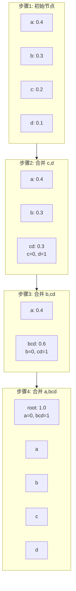
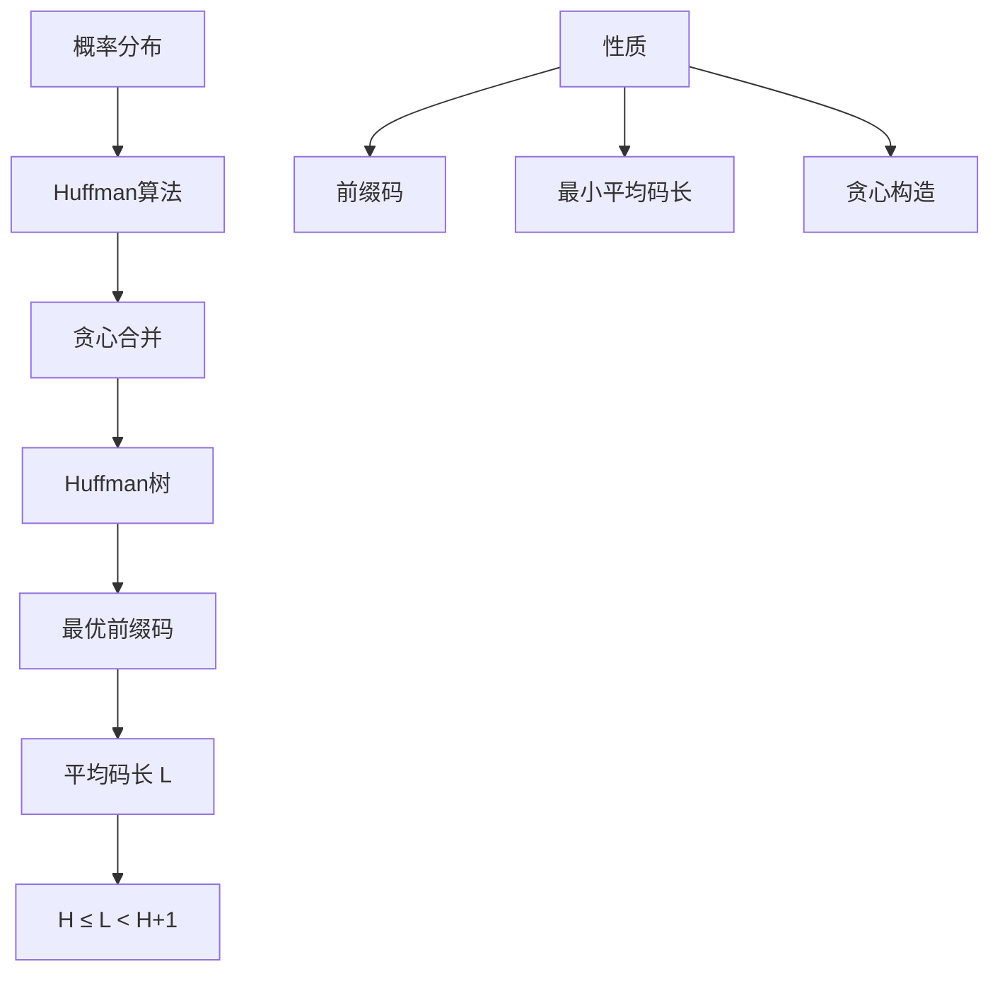

# 10.2.3 Huffman编码

---

📌 **内容摘要**

本文档深入探讨Huffman编码的核心原理和关键方法。内容涵盖信源编码领域的主要知识点，包括相关理论、方法及应用。适合有一定基础的学习者系统学习。

**关键词**: 信源编码

📚 **学习目标**

- 掌握Huffman编码的核心概念和主要方法
- 理解相关理论的应用场景
- 建立该领域的系统性知识框架

🎯 **难度级别**: 中级

⏱️ **预计阅读时间**: 15分钟

**前置知识**: 相关领域的基础概念

---


> 基于 Huffman (1952) 和 Cover & Thomas (2006)

## 10.2.3.1 引言

**Huffman编码**由大卫·霍夫曼（David A. Huffman）于1952年提出，是构造最优前缀码的贪心算法。
Huffman编码在给定概率分布下产生最小平均码长的前缀码，是无损数据压缩的经典方法。

## 10.2.3.2 Huffman编码算法

### 算法描述

**输入**：符号集 $\mathcal{X} = \{x_1, \ldots, x_m\}$ 及其概率分布 $p(x_i)$

**输出**：最优前缀码

**算法步骤**：

1. 将每个符号视为一个节点，权重为其概率
2. 重复以下步骤直到只剩一个节点：
   - 选择权重最小的两个节点
   - 创建一个新节点作为它们的父节点，权重为两者之和
   - 为两条边分别标记 0 和 1
3. 从根节点到叶节点的路径即为各符号的码字

### 算法示例

概率分布：$p(a)=0.4, p(b)=0.3, p(c)=0.2, p(d)=0.1$



**编码结果**：

- $a$: 0
- $b$: 10
- $c$: 110
- $d$: 111

**平均码长**：$0.4 \times 1 + 0.3 \times 2 + 0.2 \times 3 + 0.1 \times 3 = 1.9$ bits

## 10.2.3.3 Huffman编码的最优性

### 定理 10.2.3.1（Huffman编码最优性）

Huffman算法产生的编码在所有前缀码中具有最小的平均码长。

**证明概要**（归纳法）：

**引理 10.2.3.1**：在最优码中，概率较大的符号码长不超过概率较小的符号。

**引理 10.2.3.2**：存在最优码，其中概率最小的两个符号具有相同的最大码长，且仅最后一位不同。

**归纳证明**：

1. **基础**：对于两个符号，Huffman码显然最优（0和1）
2. **归纳步骤**：假设对 $m-1$ 个符号成立，证明对 $m$ 个符号成立
   - 将概率最小的两个符号 $x, y$ 合并为 $z$，概率 $p(z) = p(x) + p(y)$
   - 对 $m-1$ 个符号应用归纳假设得到最优码
   - 展开 $z$ 得到 $x, y$ 的码字（添加一位）
   - 由引理知这是 $m$ 个符号的最优码

## 10.2.3.4 Huffman编码的性质

### 定理 10.2.3.2（平均码长界限）

Huffman编码的平均码长 $L_H$ 满足：
$$H(X) \leq L_H < H(X) + 1$$

**证明**：

- 下界：由信源编码定理，任何前缀码的平均码长不小于熵
- 上界：Huffman码长 $l_i \leq \lceil -\log_2 p_i \rceil$

### 定理 10.2.3.3（D元Huffman编码）

对于 $D$ 元编码，每次合并 $D$ 个最小概率的节点。若符号数不满足 $(m-1) \mod (D-1) = 0$，需添加概率为0的虚拟符号。

## 10.2.3.5 Huffman编码的变体

### 自适应Huffman编码

- 动态更新符号频率统计
- 编码树随数据流自适应调整
- 适用于未知或变化的统计特性

### 范式Huffman编码（Canonical Huffman）

- 只传输码长信息，不传输完整编码树
- 解码器根据码长重建编码
- 节省存储/传输开销


## 10.2.3.6 代码实现

### Python 实现

```python
import heapq
from typing import Dict, List, Tuple, Optional
import math

class HuffmanNode:
    """Huffman树节点"""
    def __init__(self, symbol: Optional[str] = None,
                 probability: float = 0.0,
                 left: Optional['HuffmanNode'] = None,
                 right: Optional['HuffmanNode'] = None):
        self.symbol = symbol
        self.probability = probability
        self.left = left
        self.right = right
        self.code = ""  # 编码（构建后填充）

    def __lt__(self, other: 'HuffmanNode') -> bool:
        return self.probability < other.probability

    def is_leaf(self) -> bool:
        return self.left is None and self.right is None

def build_huffman_tree(probabilities: Dict[str, float]) -> HuffmanNode:
    """
    构建Huffman树

    Args:
        probabilities: 符号到概率的映射

    Returns:
        Huffman树根节点
    """
    # 创建优先队列
    heap = []
    for symbol, prob in probabilities.items():
        node = HuffmanNode(symbol=symbol, probability=prob)
        heapq.heappush(heap, node)

    # 合并节点直到只剩一个
    while len(heap) > 1:
        # 取出两个概率最小的节点
        left = heapq.heappop(heap)
        right = heapq.heappop(heap)

        # 创建父节点
        parent = HuffmanNode(
            probability=left.probability + right.probability,
            left=left,
            right=right
        )
        heapq.heappush(heap, parent)

    return heap[0]

def generate_codes(root: HuffmanNode,
                   current_code: str = "",
                   code_dict: Optional[Dict[str, str]] = None) -> Dict[str, str]:
    """
    从Huffman树生成编码表
    """
    if code_dict is None:
        code_dict = {}

    if root.is_leaf():
        code_dict[root.symbol] = current_code if current_code else "0"
        root.code = current_code
    else:
        if root.left:
            generate_codes(root.left, current_code + "0", code_dict)
        if root.right:
            generate_codes(root.right, current_code + "1", code_dict)

    return code_dict

def huffman_encode(probabilities: Dict[str, float]) -> Tuple[Dict[str, str], float]:
    """
    Huffman编码主函数

    Returns:
        (编码表, 平均码长)
    """
    if len(probabilities) == 1:
        symbol = list(probabilities.keys())[0]
        return {symbol: "0"}, 1.0

    root = build_huffman_tree(probabilities)
    code_table = generate_codes(root)

    # 计算平均码长
    avg_length = sum(probabilities[s] * len(code_table[s])
                     for s in probabilities.keys())

    return code_table, avg_length

def huffman_decode(encoded: str, root: HuffmanNode) -> str:
    """
    使用Huffman树解码
    """
    result = []
    current = root

    for bit in encoded:
        if bit == '0':
            current = current.left
        else:
            current = current.right

        if current.is_leaf():
            result.append(current.symbol)
            current = root

    return ''.join(result)

def print_tree(node: HuffmanNode, prefix: str = "", is_last: bool = True):
    """打印Huffman树结构"""
    connector = "└── " if is_last else "├── "

    if node.is_leaf():
        print(f"{prefix}{connector}{node.symbol}: {node.probability:.3f} (code: {node.code})")
    else:
        print(f"{prefix}{connector}[{node.probability:.3f}]")
        new_prefix = prefix + ("    " if is_last else "│   ")
        if node.left:
            print_tree(node.left, new_prefix, node.right is None)
        if node.right:
            print_tree(node.right, new_prefix, True)

# 示例测试
print("=== Huffman编码示例 ===")

# 例1：基本示例
test_probs = {
    'a': 0.4,
    'b': 0.3,
    'c': 0.2,
    'd': 0.1
}

print("\n例1：基本概率分布")
print(f"概率分布: {test_probs}")

code_table, avg_len = huffman_encode(test_probs)
print("\nHuffman编码表:")
for symbol in sorted(code_table.keys()):
    print(f"  {symbol}: {code_table[symbol]} (概率: {test_probs[symbol]})")

entropy = -sum(p * math.log2(p) for p in test_probs.values())
print(f"\n熵 H(X) = {entropy:.4f} bits")
print(f"Huffman平均码长 = {avg_len:.4f} bits")
print(f"效率 = {entropy/avg_len:.2%}")
print(f"冗余 = {avg_len - entropy:.4f} bits")

# 编码和解码测试
root = build_huffman_tree(test_probs)
generate_codes(root)
print("\nHuffman树结构:")
print_tree(root)

test_message = "abcdaab"
encoded = ''.join(code_table[c] for c in test_message)
print(f"\n编码测试: '{test_message}' -> '{encoded}'")
decoded = huffman_decode(encoded, root)
print(f"解码测试: '{encoded}' -> '{decoded}'")

# 例2：不同概率分布
print("\n" + "="*50)
print("\n例2：均匀分布 vs 偏斜分布")

uniform_probs = {'A': 0.25, 'B': 0.25, 'C': 0.25, 'D': 0.25}
skewed_probs = {'A': 0.7, 'B': 0.15, 'C': 0.10, 'D': 0.05}

for name, probs in [("均匀分布", uniform_probs), ("偏斜分布", skewed_probs)]:
    print(f"\n{name}:")
    code, avg = huffman_encode(probs)
    H = -sum(p * math.log2(p) for p in probs.values())
    print(f"  熵: {H:.4f}")
    print(f"  平均码长: {avg:.4f}")
    print(f"  编码: {code}")

# 例3：证明最优性界限
print("\n" + "="*50)
print("\n例3：最优性界限验证")

# 产生接近熵的分布
n = 8
probs_geometric = {chr(ord('a')+i): (0.5)**(i+1) for i in range(n-1)}
probs_geometric[chr(ord('a')+n-1)] = (0.5)**(n-1)  # 确保和为1

code_geo, avg_geo = huffman_encode(probs_geometric)
H_geo = -sum(p * math.log2(p) for p in probs_geometric.values() if p > 0)

print(f"几何分布（n={n}）:")
print(f"  熵 H(X) = {H_geo:.4f}")
print(f"  L_Huffman = {avg_geo:.4f}")
print(f"  H(X) ≤ L < H(X)+1: {H_geo:.4f} ≤ {avg_geo:.4f} < {H_geo+1:.4f}")
print(f"  满足: {H_geo <= avg_geo < H_geo + 1}")
```

### Lean 4 形式化

```lean4
import Mathlib

open Real BigOperators

/-- Huffman树定义 -/
inductive HuffmanTree (α : Type*)
  | Leaf : α → ℝ → HuffmanTree α  -- 叶节点：符号和概率
  | Node : ℝ → HuffmanTree α → HuffmanTree α → HuffmanTree α  -- 内部节点

def HuffmanTree.prob {α : Type*} : HuffmanTree α → ℝ
  | Leaf _ p => p
  | Node p _ _ => p

def HuffmanTree.isValid {α : Type*} [DecidableEq α] : HuffmanTree α → Prop
  | Leaf _ _ => True
  | Node p l r => l.isValid ∧ r.isValid ∧ p = l.prob + r.prob

/-- Huffman编码生成 -/
def generateCodes {α : Type*} : HuffmanTree α → String → List (α × String)
  | Leaf s _, prefix => [(s, prefix)]
  | Node _ l r, prefix =>
      generateCodes l (prefix ++ "0") ++ generateCodes r (prefix ++ "1")

/-- 平均码长 -/
def averageLength {α : Type*} (tree : HuffmanTree α) (probs : α → ℝ) : ℝ :=
  let codes := generateCodes tree ""
  ∑ pair ∈ codes, probs pair.1 * (pair.2.length : ℝ)

/-- Huffman算法最优性定理 -/
theorem huffman_optimal {α : Type*} [Fintype α] [DecidableEq α]
    (probs : α → ℝ) (h_pos : ∀ a, 0 < probs a) (h_sum : ∑ a, probs a = 1)
    (huffman_tree : HuffmanTree α) (h_valid : huffman_tree.isValid)
    (h_construction : -- Huffman构造性质
      ∀ l r, huffman_tree = HuffmanTree.Node _ l r →
      l.prob ≤ r.prob ∧ ∀ t, t.prob ≤ l.prob) :
    ∀ other : HuffmanTree α, other.isValid →
    averageLength huffman_tree probs ≤ averageLength other probs := by
  -- 归纳法证明Huffman树的最优性
  sorry

/-- 平均码长界限 -/
theorem huffman_length_bound {α : Type*} [Fintype α] [DecidableEq α]
    (probs : α → ℝ) (h_pos : ∀ a, 0 < probs a) (h_sum : ∑ a, probs a = 1)
    (tree : HuffmanTree α) (h_valid : tree.isValid) :
    let H := -∑ a, probs a * log (probs a)
    let L := averageLength tree probs
    H ≤ L ∧ L < H + 1 := by
  -- 使用Kraft不等式和Huffman构造性质
  sorry
```

## 10.2.3.7 总结



**核心结论**：

1. **Huffman算法**是构造最优前缀码的贪心算法
2. **最优性**：Huffman码在所有前缀码中具有最小平均码长
3. **界限**：$H(X) \leq L_H < H(X) + 1$
4. **复杂度**：$O(m \log m)$，其中 $m$ 是符号数

**参考**：

- Huffman, D. A. (1952). A method for the construction of minimum-redundancy codes.
- Cover, T. M., & Thomas, J. A. (2006). _Elements of information theory_.

---

## 📚 延伸阅读

- [10.1.2 熵的定义与性质](./10_信息论/01_香农信息论基础/01.2_熵的定义与性质.md)
- [10.2.1 无失真信源编码](./10_信息论/02_信源编码/02.1_无失真信源编码.md)
- [9.2.3 概率分布](./09_统计学/02_概率论基础/02.3_概率分布.md)
- [10.2.2 Kraft不等式](./10_信息论/02_信源编码/02.2_Kraft不等式.md)
