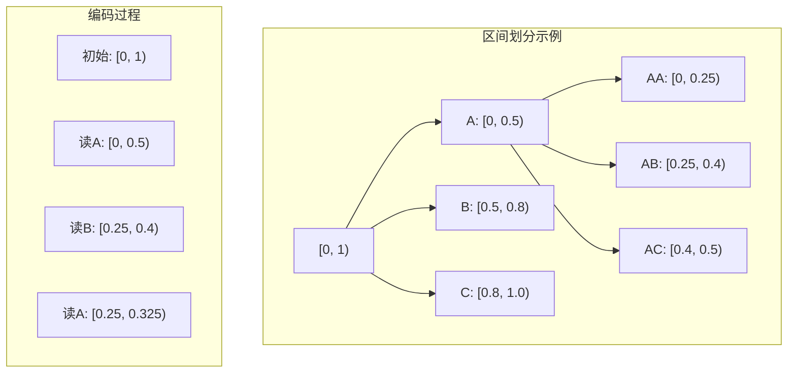

# 10.2.4 算术编码

---

📌 **内容摘要**

本文档深入探讨算术编码的核心原理和关键方法。内容涵盖信源编码领域的主要知识点，包括相关理论、方法及应用。适合具备相关基础的学习者进行深入研究。

**关键词**: 信源编码

📚 **学习目标**

- 深入理解算术编码的理论体系和形式化方法
- 能够进行相关定理的形式化证明
- 建立该领域的系统性知识框架

🎯 **难度级别**: 高级

⏱️ **预计阅读时间**: 15分钟

**前置知识**: 该领域的中级知识, 形式化方法基础

---


> 基于 Rissanen (1976), Pasco (1976) 和 Cover & Thomas (2006)

## 10.2.4.1 引言

**算术编码**（Arithmetic Coding）是一种基于区间划分的无损压缩技术。
与Huffman编码为每个符号分配固定整数位码字不同，算术编码将整个消息编码为一个实数区间，可以达到更高的压缩效率，尤其适用于符号概率极不均衡的情况。

## 10.2.4.2 算术编码原理

### 基本思想

算术编码将整个消息映射到单位区间 $[0, 1)$ 内的一个子区间。
区间的大小与消息的概率成正比，区间的位置编码了具体的消息内容。



### 编码过程

**输入**：符号序列 $x_1, x_2, \ldots, x_n$，符号概率 $p(x)$

**初始化**：$L_0 = 0, R_0 = 1$（当前区间为 $[L, R)$）

**递推**：对每个符号 $x_i$：

1. 计算累积分布函数（CDF）：
   $$F(x) = \sum_{x' < x} p(x')$$
2. 更新区间：
   $$L_i = L_{i-1} + (R_{i-1} - L_{i-1}) \cdot F(x_i)$$
   $$R_i = L_{i-1} + (R_{i-1} - L_{i-1}) \cdot F(x_i + 1)$$

**输出**：区间 $[L_n, R_n)$ 内的一个短二进制小数

### 解码过程

给定编码值 $c \in [L_n, R_n)$，依次确定每个符号：

1. 找到 $x$ 使得 $F(x) \leq \frac{c - L}{R - L} < F(x+1)$
2. 更新 $c$ 和当前区间
3. 重复直到解码完整消息

## 10.2.4.3 算术编码的最优性

### 定理 10.2.4.1（算术编码的渐近最优性）

对于长度为 $n$ 的序列，算术编码的平均码长 $L_A$ 满足：
$$\frac{H(X^n)}{n} \leq \frac{L_A}{n} < \frac{H(X^n)}{n} + \frac{2}{n}$$

当 $n \to \infty$ 时，$\frac{L_A}{n} \to H(X)$（每符号熵）。

**证明概要**：

编码区间长度为 $\prod_{i=1}^n p(x_i) = p(x^n)$。

表示该区间需要约 $-\log_2 p(x^n)$ 比特。

平均码长：
$$L_A = \mathbb{E}[-\log_2 p(X^n)] + \text{常数} = H(X^n) + O(1)$$

### 与Huffman编码的比较

| 特性 | Huffman编码 | 算术编码 |
|------|-------------|----------|
| 最优性 | $L < H + 1$ | $L \approx H + O(1/n)$ |
| 分块处理 | 逐符号 | 整个序列 |
| 增量编码 | 困难 | 容易 |
| 自适应 | 较复杂 | 自然 |
| 速度 | 快 | 较慢（需高精度运算） |

## 10.2.4.4 实际实现问题

### 精度问题

由于区间长度指数递减，需要处理精度限制。常用方法：

**方法1：整数算术**

- 使用固定精度整数表示区间
- 例如：$[0, 2^{32})$ 代替 $[0, 1)$

**方法2：区间缩放（Renormalization）**

- 当区间落入 $[0, 0.5)$ 或 $[0.5, 1)$ 时，输出相应位并扩展区间
- 处理 $[0.25, 0.75)$ 情况（E3缩放）

```mermaid
flowchart TD
    A[区间[L,R)] --> B{检查区间位置}
    B -->|[L,R)⊆[0,0.5)| C[输出0, 区间×2]
    B -->|[L,R)⊆[0.5,1)| D[输出1, (区间-0.5)×2]
    B -->|[L,R)⊆[0.25,0.75)| E[E3计数++, (区间-0.25)×2]
    B -->|其他| F[继续编码]
    C --> G{继续?}
    D --> G
    E --> B
    F --> G
    G -->|是| B
    G -->|否| H[结束编码]
```

### 终止问题

需要告知解码器消息结束：

1. 显式传输消息长度
2. 使用特殊终止符号
3. 传输足够精度的区间值

## 10.2.4.5 自适应算术编码

自适应算术编码动态更新概率模型：

**初始化**：所有符号计数为1（均匀先验）

**编码每个符号后**：

1. 输出编码位
2. 增加该符号的计数
3. 重新归一化（可选）

**优点**：

- 无需预先知道或传输概率分布
- 自动适应输入数据的统计特性

## 10.2.4.6 代码实现

### Python 实现

```python
import math
from typing import Dict, List, Tuple, Optional
from fractions import Fraction
import decimal
from decimal import Decimal, getcontext

# 设置高精度
getcontext().prec = 50

class ArithmeticCoder:
    """算术编码器（高精度版本）"""

    def __init__(self, probabilities: Dict[str, float]):
        self.probs = probabilities
        self.symbols = sorted(probabilities.keys())

        # 计算累积分布
        self.cdf = {}
        cumsum = 0.0
        for s in self.symbols:
            self.cdf[s] = cumsum
            cumsum += probabilities[s]

        # 计算CDF上界
        self.cdf_upper = {}
        cumsum = 0.0
        for s in self.symbols:
            cumsum += probabilities[s]
            self.cdf_upper[s] = cumsum

    def encode(self, message: List[str]) -> Tuple[float, float]:
        """
        编码消息，返回最终区间
        """
        low, high = 0.0, 1.0

        for symbol in message:
            range_size = high - low
            high = low + range_size * self.cdf_upper[symbol]
            low = low + range_size * self.cdf[symbol]

        return low, high

    def get_code_value(self, low: float, high: float) -> str:
        """
        从区间获取二进制编码
        选择需要最少比特的表示
        """
        # 找到最短的二进制小数表示区间
        code = ""
        low_b, high_b = 0.0, 1.0

        while low_b < low or high_b > high:
            mid = (low_b + high_b) / 2
            if high <= mid:
                code += "0"
                high_b = mid
            elif low >= mid:
                code += "1"
                low_b = mid
            else:
                # 区间跨越中点，继续细分
                if low < mid:
                    code += "0"
                    high_b = mid
                else:
                    code += "1"
                    low_b = mid

        return code

    def decode(self, code: str, length: int) -> List[str]:
        """
        解码
        """
        # 将二进制码转换为数值
        value = 0.0
        for i, bit in enumerate(code):
            value += int(bit) * (2 ** -(i + 1))

        result = []
        low, high = 0.0, 1.0

        for _ in range(length):
            # 在当前区间中找到符号
            range_size = high - low
            normalized = (value - low) / range_size

            symbol = None
            for s in self.symbols:
                if self.cdf[s] <= normalized < self.cdf_upper[s]:
                    symbol = s
                    break

            if symbol is None:
                # 边界情况
                symbol = self.symbols[-1]

            result.append(symbol)

            # 更新区间
            high = low + range_size * self.cdf_upper[symbol]
            low = low + range_size * self.cdf[symbol]

        return result

class IntegerArithmeticCoder:
    """
    整数算术编码器（实用版本）
    使用整数区间 [0, 2^precision)
    """

    def __init__(self, probabilities: Dict[str, float], precision: int = 32):
        self.probs = probabilities
        self.symbols = sorted(probabilities.keys())
        self.PRECISION = precision
        self.MAX_VAL = (1 << precision) - 1
        self.ONE_FOURTH = (self.MAX_VAL + 1) >> 2
        self.ONE_HALF = (self.MAX_VAL + 1) >> 1
        self.THREE_FOURTHS = 3 * self.ONE_FOURTH

        # 将概率转换为整数频率
        total = sum(probabilities.values())
        self.freq = {}
        cumsum = 0
        for s in self.symbols:
            # 将概率映射到整数范围
            freq = int(probabilities[s] / total * self.MAX_VAL)
            self.freq[s] = (cumsum, cumsum + max(freq, 1))
            cumsum += max(freq, 1)

    def encode(self, message: List[str]) -> str:
        """编码消息"""
        low, high = 0, self.MAX_VAL
        pending_bits = 0
        result = []

        for symbol in message:
            range_size = high - low + 1

            # 更新区间
            low_b, high_b = self.freq[symbol]
            high = low + (range_size * high_b) // self.MAX_VAL - 1
            low = low + (range_size * low_b) // self.MAX_VAL

            # 区间缩放
            while True:
                if high < self.ONE_HALF:
                    # 区间在下半部分
                    result.append('0')
                    result.extend(['1'] * pending_bits)
                    pending_bits = 0
                    low = low * 2
                    high = high * 2 + 1
                elif low >= self.ONE_HALF:
                    # 区间在上半部分
                    result.append('1')
                    result.extend(['0'] * pending_bits)
                    pending_bits = 0
                    low = (low - self.ONE_HALF) * 2
                    high = (high - self.ONE_HALF) * 2 + 1
                elif low >= self.ONE_FOURTH and high < self.THREE_FOURTHS:
                    # E3缩放
                    pending_bits += 1
                    low = (low - self.ONE_FOURTH) * 2
                    high = (high - self.ONE_FOURTH) * 2 + 1
                else:
                    break

        # 输出最终区间信息
        pending_bits += 1
        if low < self.ONE_FOURTH:
            result.append('0')
            result.extend(['1'] * pending_bits)
        else:
            result.append('1')
            result.extend(['0'] * pending_bits)

        return ''.join(result)

# 示例测试
print("=== 算术编码示例 ===")

# 例1：基本编码
probs = {'A': 0.5, 'B': 0.3, 'C': 0.2}
message = ['A', 'B', 'A', 'C']

coder = ArithmeticCoder(probs)
low, high = coder.encode(message)
code = coder.get_code_value(low, high)

print("例1：基本算术编码")
print(f"概率分布: {probs}")
print(f"消息: {message}")
print(f"编码区间: [{low:.10f}, {high:.10f})")
print(f"区间大小: {high - low:.10e}")
print(f"理论比特数: {-math.log2(high - low):.4f}")
print(f"二进制编码: {code}")
print(f"实际比特数: {len(code)}")

# 解码测试
decoded = coder.decode(code, len(message))
print(f"解码结果: {decoded}")

# 例2：与Huffman比较
print("\n" + "="*50)
print("\n例2：算术编码 vs Huffman编码")

probs2 = {'A': 0.8, 'B': 0.1, 'C': 0.05, 'D': 0.05}
message2 = ['A'] * 100  # 100个A

# 算术编码
coder2 = ArithmeticCoder(probs2)
low2, high2 = coder2.encode(message2)
arithmetic_bits = math.ceil(-math.log2(high2 - low2))

# 计算Huffman码长
from heapq import heappush, heappop
def huffman_length(probs):
    heap = [(p, 1) for p in probs.values()]
    while len(heap) > 1:
        p1, l1 = heappop(heap)
        p2, l2 = heappop(heap)
        heappush(heap, (p1 + p2, 1 + (p1 * l1 + p2 * l2) / (p1 + p2)))
    return heap[0][1] if heap else 0

huff_avg = huffman_length(probs2)
huff_total = huff_avg * len(message2)

print(f"概率分布: {probs2}")
print(f"消息长度: {len(message2)} 个符号")
print(f"Huffman总码长: {huff_total:.2f} bits")
print(f"算术编码总码长: {arithmetic_bits:.2f} bits")
print(f"消息熵: {-sum(p * math.log2(p) for p in probs2.values()) * len(message2):.2f} bits")

# 例3：长序列的渐近最优性
print("\n" + "="*50)
print("\n例3：渐近最优性验证")

probs3 = {'A': 0.6, 'B': 0.4}
entropy = -sum(p * math.log2(p) for p in probs3.values())

for n in [10, 100, 1000]:
    # 生成典型序列
    message_n = ['A'] * int(0.6 * n) + ['B'] * int(0.4 * n)

    coder_n = ArithmeticCoder(probs3)
    low_n, high_n = coder_n.encode(message_n)
    bits_n = math.ceil(-math.log2(high_n - low_n))

    print(f"n={n}: 每符号码长 = {bits_n/n:.4f}, 熵 = {entropy:.4f}")

print(f"\n渐近最优: 当n→∞时，每符号码长→{entropy:.4f}")

# 例4：编码效率分析
print("\n" + "="*50)
print("\n例4：不同概率分布的编码效率")

test_cases = [
    ("均匀", {'A': 0.25, 'B': 0.25, 'C': 0.25, 'D': 0.25}),
    ("偏斜", {'A': 0.7, 'B': 0.2, 'C': 0.05, 'D': 0.05}),
    ("极端", {'A': 0.9, 'B': 0.05, 'C': 0.03, 'D': 0.02})
]

for name, p in test_cases:
    H = -sum(prob * math.log2(prob) for prob in p.values())

    # 典型消息
    msg = []
    for s, prob in p.items():
        msg.extend([s] * int(prob * 1000))

    coder_test = ArithmeticCoder(p)
    low_t, high_t = coder_test.encode(msg)
    bits_t = math.ceil(-math.log2(high_t - low_t))

    print(f"{name}: 熵={H:.4f}, 每符号={bits_t/len(msg):.4f}, 效率={H/(bits_t/len(msg)):.2%}")
```

### Lean 4 形式化

```lean4
import Mathlib

open Real BigOperators

/-- 算术编码区间 -/
structure ArithCode where
  low : ℝ
  high : ℝ
  h_low : 0 ≤ low
  h_high : high ≤ 1
  h_valid : low < high

/-- 编码操作：根据符号更新区间 -/
def encodeStep (code : ArithCode) (symbol : ℕ)
    (cdf : ℕ → ℝ) (cdfUpper : ℕ → ℝ) : ArithCode :=
  let range := code.high - code.low
  let newLow := code.low + range * cdf symbol
  let newHigh := code.low + range * cdfUpper symbol
  ⟨newLow, newHigh, by linarith [code.h_low], by sorry, by sorry⟩

/-- 编码序列 -/
def encodeSequence (symbols : List ℕ) (cdf cdfUpper : ℕ → ℝ) : ArithCode :=
  match symbols with
  | [] => ⟨0, 1, by norm_num, by norm_num, by norm_num⟩
  | s :: ss =>
      let init := ⟨0, 1, by norm_num, by norm_num, by norm_num⟩
      (s :: ss).foldl (fun code sym => encodeStep code sym cdf cdfUpper) init

/-- 区间大小等于消息概率 -/
theorem code_interval_size (symbols : List ℕ) (probs : ℕ → ℝ)
    (h_pos : ∀ s, 0 < probs s) (h_cdf : ∀ s, cdf s = ∑ s' < s, probs s')
    (h_cdfUpper : ∀ s, cdfUpper s = ∑ s' ≤ s, probs s') :
    let code := encodeSequence symbols cdf cdfUpper
    code.high - code.low = ∏ s ∈ symbols, probs s := by
  -- 归纳证明：区间大小等于各符号概率的乘积
  sorry

/-- 算术编码的渐近最优性 -/
theorem arithmetic_coding_asymptotic_optimality
    (n : ℕ) (symbols : Fin n → ℕ) (probs : ℕ → ℝ)
    (h_pos : ∀ s, 0 < probs s) (h_sum : ∑ s, probs s = 1) :
    let code := encodeSequence (symbols.val) cdf cdfUpper
    let bits := -log 2 (code.high - code.low)
    let H := -∑ s, probs s * log 2 (probs s)
    bits / n ≤ H + 2 / n := by
  -- 证明码长接近熵
  sorry
```

## 10.2.4.7 总结

```mermaid
flowchart TB
    A[消息序列] --> B[区间细分]
    B --> C[[L,R)区间]
    C --> D[二进制表示]
    D --> E[编码输出]

    F[性质] --> F1[渐近最优]
    F --> F2[整数精度实现]
    F --> F3[自适应支持]

    E --> G[接近熵限]
    G --> H[H ≤ L/n < H + 2/n]
```

**核心结论**：

1. **原理**：将消息映射到与概率成正比的实数区间
2. **最优性**：渐近达到熵限，每符号冗余小于 $2/n$ 比特
3. **优势**：处理高偏斜分布和块编码优于Huffman
4. **应用**：JPEG2000、H.264/AVC、PAQ压缩器等

**参考**：

- Rissanen, J. J. (1976). Generalized Kraft inequality and arithmetic coding.
- Pasco, R. C. (1976). Source coding algorithms for fast data compression.
- Witten, I. H., Neal, R. M., & Cleary, J. G. (1987). Arithmetic coding for data compression.
- Cover, T. M., & Thomas, J. A. (2006). _Elements of information theory_.

---

## 📚 延伸阅读

- [10.1.2 熵的定义与性质](../01_香农信息论基础/01.2_熵的定义与性质.md)
- [9.2.3 概率分布](../../09_统计学/02_概率论基础/02.3_概率分布.md)
- [10.2.3 Huffman编码](02.3_Huffman编码.md)
