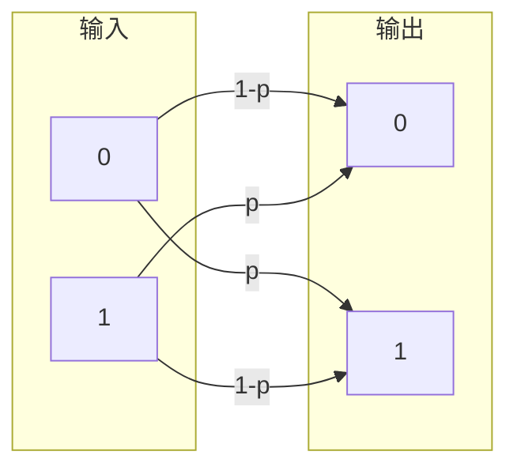
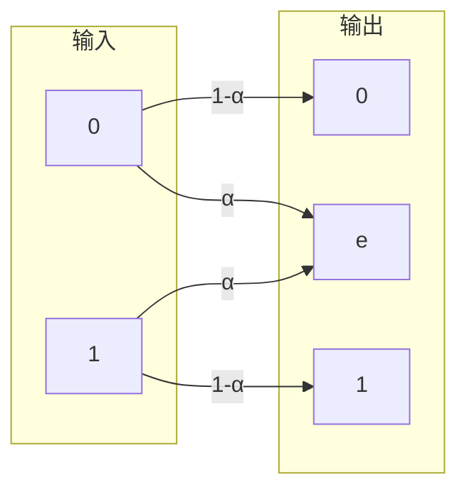

# 10.3.1 信道容量

---

📌 **内容摘要**

本文档深入探讨信道容量的核心原理和关键方法。内容涵盖信道编码领域的主要知识点，包括信息论, 互信息, 纠错码, 熵等关键主题。适合有一定基础的学习者系统学习。

**关键词**: 信息论, 信道编码, 互信息, 纠错码, 熵, 汉明码

📚 **学习目标**

- 掌握信道容量的核心概念和主要方法
- 理解相关理论的应用场景
- 建立该领域的系统性知识框架

🎯 **难度级别**: 中级

⏱️ **预计阅读时间**: 15分钟

**前置知识**: 相关领域的基础概念

---


> 基于 Shannon (1948) 和 Cover & Thomas (2006)

## 10.3.1.1 引言

**信道编码**（Channel Coding）研究如何在有噪声的信道上可靠地传输信息。
**信道容量**（Channel Capacity）是信息论的核心概念，由香农于1948年提出，表示信道能够传输的最大可靠信息速率。

## 10.3.1.2 离散无记忆信道

### 定义 10.3.1.1（离散无记忆信道）

**离散无记忆信道**（Discrete Memoryless Channel, DMC）由以下要素定义：

- 输入字母表 $\mathcal{X}$
- 输出字母表 $\mathcal{Y}$
- 转移概率 $p(y|x)$，满足：
  $$p(y^n|x^n) = \prod_{i=1}^n p(y_i|x_i)$$

**无记忆性**：当前输出仅依赖于当前输入，与历史无关。

### 信道转移矩阵

信道可用**转移概率矩阵** $P$ 表示，其中 $P_{ij} = p(y_j|x_i)$：

$$P = \begin{bmatrix} p(y_1|x_1) & p(y_2|x_1) & \cdots & p(y_{|Y|}|x_1) \\ p(y_1|x_2) & p(y_2|x_2) & \cdots & p(y_{|Y|}|x_2) \\ \vdots & \vdots & \ddots & \vdots \\ p(y_1|x_{|X|}) & p(y_2|x_{|X|}) & \cdots & p(y_{|Y|}|x_{|X|}) \end{bmatrix}$$

### 常见信道模型

**1. 二元对称信道（BSC）**



转移矩阵：
$$P = \begin{bmatrix} 1-p & p \\ p & 1-p \end{bmatrix}$$

其中 $p$ 为错误概率（翻转概率）。

**2. 二元擦除信道（BEC）**



转移矩阵：
$$P = \begin{bmatrix} 1-\alpha & \alpha & 0 \\ 0 & \alpha & 1-\alpha \end{bmatrix}$$

其中 $\alpha$ 为擦除概率，$e$ 表示擦除符号。

**3. 无噪声信道**

$$p(y|x) = \begin{cases} 1 & y = x \\ 0 & y \neq x \end{cases}$$

## 10.3.1.3 信道容量的定义

### 定义 10.3.1.2（信道容量）

信道容量定义为输入输出之间的**最大互信息**：
$$C = \max_{p(x)} I(X; Y) = \max_{p(x)} \left[ H(Y) - H(Y|X) \right]$$

其中最大值取遍所有可能的输入分布 $p(x)$。

### 信道容量的解释

- $I(X;Y)$：通过信道传输的信息量
- 最大化：选择最优输入分布以最大化传输率
- $C$：信道能够支持的最大可靠传输速率（比特/信道使用）

## 10.3.1.4 常见信道的容量

### 定理 10.3.1.1（BSC的容量）

二元对称信道的容量为：
$$C_{BSC} = 1 - H_2(p) = 1 + p\log_2 p + (1-p)\log_2(1-p)$$

其中 $H_2(p)$ 是二元熵函数。

**证明**：

设输入分布为 $P(X=0) = \pi$，$P(X=1) = 1-\pi$。

则输出分布：
$$P(Y=0) = \pi(1-p) + (1-\pi)p = p + \pi(1-2p)$$

由对称性，当 $\pi = 1/2$ 时 $H(Y)$ 最大（为1）。

条件熵：
$$H(Y|X) = H(Y|X=0)P(X=0) + H(Y|X=1)P(X=1) = H_2(p)$$

因此：
$$C = \max_\pi I(X;Y) = 1 - H_2(p)$$

### 定理 10.3.1.2（BEC的容量）

二元擦除信道的容量为：
$$C_{BEC} = 1 - \alpha$$

**证明**：

当输入均匀分布时达到容量。

$H(Y|X) = H(\alpha)$（仅与擦除概率有关）。

输出 $Y$ 有三种可能：0, 1, e。

$P(Y=e) = \alpha$，$P(Y=0) = P(Y=1) = (1-\alpha)/2$。

$$H(Y) = H_2(\alpha) + (1-\alpha)$$

因此：
$$C = H(Y) - H(Y|X) = 1 - \alpha$$

```mermaid
xychart-beta
    title "常见信道容量比较"
    x-axis "错误/擦除概率" [0, 0.1, 0.2, 0.3, 0.4, 0.5, 0.6, 0.7, 0.8, 0.9, 1.0]
    y-axis "容量" 0 --> 1
    line [1, 0.531, 0.278, 0.119, 0.029, 0, 0, 0, 0, 0, 0]  # BSC
    line [1, 0.9, 0.8, 0.7, 0.6, 0.5, 0.4, 0.3, 0.2, 0.1, 0]  # BEC
```

## 10.3.1.5 信道容量的性质

### 定理 10.3.1.3（容量的基本性质）

1. **非负性**：$C \geq 0$
2. **上界**：$C \leq \min\{\log|\mathcal{X}|, \log|\mathcal{Y}|\}$
3. **独立信道**：若 $C_1$ 和 $C_2$ 独立，则联合容量 $C = C_1 + C_2$
4. **凸性**：$I(X;Y)$ 是关于 $p(x)$ 的凹函数

### 定理 10.3.1.4（容量的可达性）

香农信道编码定理：对于任意 $R < C$，存在码率为 $R$ 的编码方案，使得错误概率任意小。

（详细证明见下一节）

## 10.3.1.6 代码实现

### Python 实现

```python
import math
import numpy as np
from typing import Tuple, Callable
from scipy.optimize import minimize_scalar, minimize

def binary_entropy(p: float) -> float:
    """二元熵函数 H₂(p) = -p*log(p) - (1-p)*log(1-p)"""
    if p <= 0 or p >= 1:
        return 0.0
    return -(p * math.log2(p) + (1 - p) * math.log2(1 - p))

def bsc_capacity(p: float) -> float:
    """
    二元对称信道容量
    C = 1 - H₂(p)
    """
    if p < 0 or p > 1:
        raise ValueError("p must be in [0, 1]")
    return 1 - binary_entropy(p)

def bec_capacity(alpha: float) -> float:
    """
    二元擦除信道容量
    C = 1 - α
    """
    if alpha < 0 or alpha > 1:
        raise ValueError("alpha must be in [0, 1]")
    return 1 - alpha

def mutual_information_dmc(channel_matrix: np.ndarray,
                          input_dist: np.ndarray) -> float:
    """
    计算离散无记忆信道的互信息 I(X;Y)

    Args:
        channel_matrix: |X| × |Y| 转移概率矩阵
        input_dist: |X| 维输入分布

    Returns:
        互信息值（比特）
    """
    # 输出分布
    output_dist = input_dist @ channel_matrix

    # H(Y)
    H_Y = -sum(p * math.log2(p) for p in output_dist if p > 0)

    # H(Y|X)
    H_Y_given_X = 0.0
    for i, px in enumerate(input_dist):
        if px > 0:
            row_entropy = -sum(p * math.log2(p)
                             for p in channel_matrix[i] if p > 0)
            H_Y_given_X += px * row_entropy

    return H_Y - H_Y_given_X

def capacity_dmc(channel_matrix: np.ndarray) -> Tuple[float, np.ndarray]:
    """
    计算离散无记忆信道的容量和最优输入分布

    Returns:
        (容量, 最优输入分布)
    """
    n_inputs = channel_matrix.shape[0]

    # 目标函数：负互信息（最小化）
    def objective(pi):
        pi = np.maximum(pi, 1e-10)  # 避免log(0)
        pi = pi / pi.sum()  # 归一化
        return -mutual_information_dmc(channel_matrix, pi)

    # 约束：概率和为1
    constraints = {'type': 'eq', 'fun': lambda pi: pi.sum() - 1}
    bounds = [(0, 1) for _ in range(n_inputs)]

    # 初始猜测
    x0 = np.ones(n_inputs) / n_inputs

    result = minimize(objective, x0, method='SLSQP',
                     bounds=bounds, constraints=constraints)

    optimal_dist = result.x / result.x.sum()
    capacity = -result.fun

    return capacity, optimal_dist

# 示例测试
print("=== 信道容量计算 ===")

# 例1：BSC容量
print("\n例1：二元对称信道(BSC)")
p_values = [0, 0.1, 0.2, 0.3, 0.5]
for p in p_values:
    cap = bsc_capacity(p)
    print(f"  p = {p:.1f}: C = {cap:.4f} bits/channel use")

# 例2：BEC容量
print("\n例2：二元擦除信道(BEC)")
alpha_values = [0, 0.1, 0.2, 0.3, 0.5]
for alpha in alpha_values:
    cap = bec_capacity(alpha)
    print(f"  α = {alpha:.1f}: C = {cap:.4f} bits/channel use")

# 例3：自定义DMC
print("\n例3：自定义离散无记忆信道")
# 3输入2输出信道
P = np.array([
    [0.9, 0.1],
    [0.5, 0.5],
    [0.1, 0.9]
])
print("转移矩阵:")
print(P)
cap, opt_dist = capacity_dmc(P)
print(f"容量: {cap:.4f} bits/channel use")
print(f"最优输入分布: {opt_dist}")

# 验证互信息计算
mi_check = mutual_information_dmc(P, opt_dist)
print(f"验证互信息: {mi_check:.4f}")

# 例4：不同输入分布的互信息比较
print("\n例4：不同输入分布对互信息的影响")
test_dists = [
    np.array([0.33, 0.33, 0.34]),
    np.array([0.5, 0.3, 0.2]),
    np.array([0.6, 0.3, 0.1]),
    np.array([0.8, 0.1, 0.1]),
]
for dist in test_dists:
    mi = mutual_information_dmc(P, dist)
    print(f"  分布 {dist}: I(X;Y) = {mi:.4f}")
print(f"  最优: I(X;Y) = {cap:.4f}")

# 例5：容量与可靠通信
print("\n" + "="*50)
print("\n例5：信道编码定理的启示")

# 高SNR情况下的容量近似
print("\nBSC信道可靠传输分析:")
for p in [0.01, 0.05, 0.1, 0.2]:
    cap = bsc_capacity(p)
    max_rate = cap
    print(f"  p = {p}: 最大可靠码率 = {max_rate:.4f}")
    print(f"       即每 {1/max_rate:.2f} 信道比特可传输1信息比特")

# 可视化
import matplotlib.pyplot as plt

p_range = np.linspace(0, 1, 100)
cap_bsc = [bsc_capacity(p) for p in p_range]
cap_bec = [bec_capacity(p) for p in p_range]

plt.figure(figsize=(10, 6))
plt.plot(p_range, cap_bsc, 'b-', linewidth=2, label='BSC: C = 1-H₂(p)')
plt.plot(p_range, cap_bec, 'r-', linewidth=2, label='BEC: C = 1-α')
plt.xlabel('Error/Erasure Probability', fontsize=12)
plt.ylabel('Channel Capacity (bits/channel use)', fontsize=12)
plt.title('Channel Capacity Comparison', fontsize=14)
plt.legend(fontsize=11)
plt.grid(True, alpha=0.3)
plt.xlim(0, 1)
plt.ylim(0, 1)
plt.tight_layout()
plt.savefig('channel_capacity.png', dpi=150)
print("\n信道容量图已保存为 channel_capacity.png")
```

### Lean 4 形式化

```lean4
import Mathlib

open Real BigOperators

/-- 离散无记忆信道 -/
structure DMC (X Y : Type*) [Fintype X] [Fintype Y] where
  transition : X → Y → ℝ  -- p(y|x)
  h_nonneg : ∀ x y, 0 ≤ transition x y
  h_sum : ∀ x, ∑ y, transition x y = 1

/-- 互信息 I(X;Y) -/
def mutualInformation {X Y : Type*} [Fintype X] [Fintype Y]
    (p : X → ℝ) (W : DMC X Y) (h_pos : ∀ x, 0 < p x)
    (h_sum : ∑ x, p x = 1) : ℝ :=
  let pY y := ∑ x, p x * W.transition x y
  let H_Y := -∑ y, pY y * log (pY y)
  let H_Y_given_X := -∑ x, p x * ∑ y, W.transition x y * log (W.transition x y)
  H_Y - H_Y_given_X

/-- 信道容量 -/
def channelCapacity {X Y : Type*} [Fintype X] [Fintype Y]
    (W : DMC X Y) : ℝ :=
  ⨆ p : X → ℝ,
    ⨆ (_ : (∀ x, 0 < p x) ∧ (∑ x, p x = 1)),
    mutualInformation p W (by sorry) (by sorry)

/-- BSC容量定理 -/
theorem bsc_capacity (p : ℝ) (hp : 0 ≤ p ∧ p ≤ 1) :
    let W : DMC (Fin 2) (Fin 2) := {
      transition := fun x y => if x = y then 1 - p else p
      h_nonneg := by sorry
      h_sum := by simp
    }
    channelCapacity W = 1 - binaryEntropy p := by
  -- 证明最优输入分布是均匀的
  sorry

/-- BEC容量定理 -/
theorem bec_capacity (α : ℝ) (hα : 0 ≤ α ∧ α ≤ 1) :
    let W : DMC (Fin 2) (Fin 3) := {
      transition := fun x y =>
        match y with
        | 0 => if x = 0 then 1 - α else 0
        | 1 => α
        | 2 => if x = 1 then 1 - α else 0
        | _ => 0
      h_nonneg := by sorry
      h_sum := by sorry
    }
    channelCapacity W = 1 - α := by
  sorry

/-- 信道容量非负 -/
theorem capacity_nonneg {X Y : Type*} [Fintype X] [Fintype Y]
    (W : DMC X Y) : 0 ≤ channelCapacity W := by
  -- 互信息非负
  sorry

/-- 信道容量上界 -/
theorem capacity_bound {X Y : Type*} [Fintype X] [Fintype Y]
    (W : DMC X Y) :
    channelCapacity W ≤ min (log (Fintype.card X)) (log (Fintype.card Y)) := by
  sorry
```

## 10.3.1.7 总结

```mermaid
flowchart TB
    A[离散无记忆信道] --> B[转移概率 p(y|x)]
    B --> C[互信息 I(X;Y)]
    C --> D[最大化]
    D --> E[信道容量 C]

    E --> F[BSC: 1-H₂(p)]
    E --> G[BEC: 1-α]
    E --> H[一般DMC: 优化求解]

    I[信道编码定理] --> J[R < C: 可靠通信]
    I --> K[R > C: 不可靠]
```

**核心结论**：

1. **信道容量** $C = \max_{p(x)} I(X;Y)$ 是可靠传输的最大速率
2. **BSC容量**：$C = 1 - H_2(p)$，当 $p=0$ 或 $p=1$ 时最大
3. **BEC容量**：$C = 1 - \alpha$，擦除概率直接减少容量
4. **编码定理**：速率低于容量时，可靠通信是可能的

**参考**：

- Shannon, C. E. (1948). A mathematical theory of communication.
- Cover, T. M., & Thomas, J. A. (2006). _Elements of information theory_.

---

## 📚 延伸阅读

- [10.1.2 熵的定义与性质](../01_香农信息论基础/01.2_熵的定义与性质.md)
- [10.1.4 互信息与相对熵](../01_香农信息论基础/01.4_互信息与相对熵.md)
