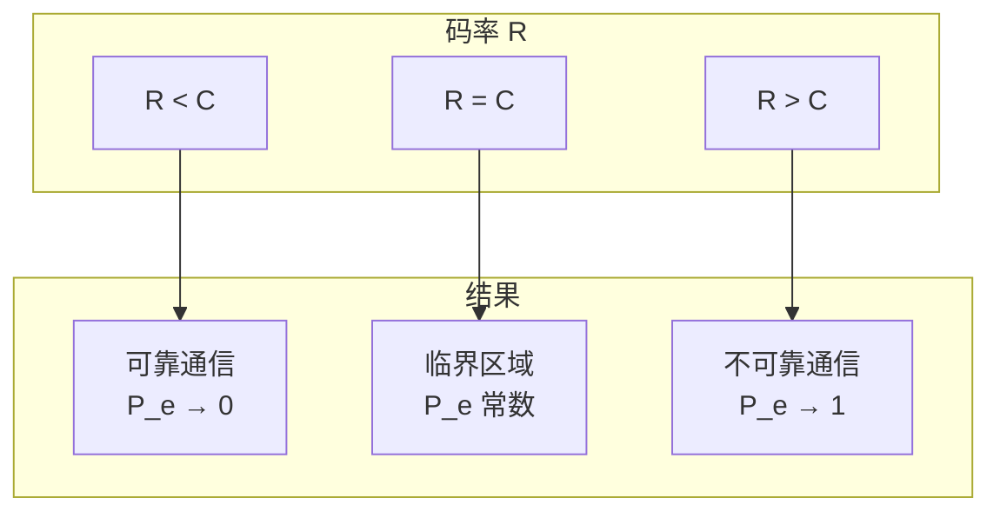
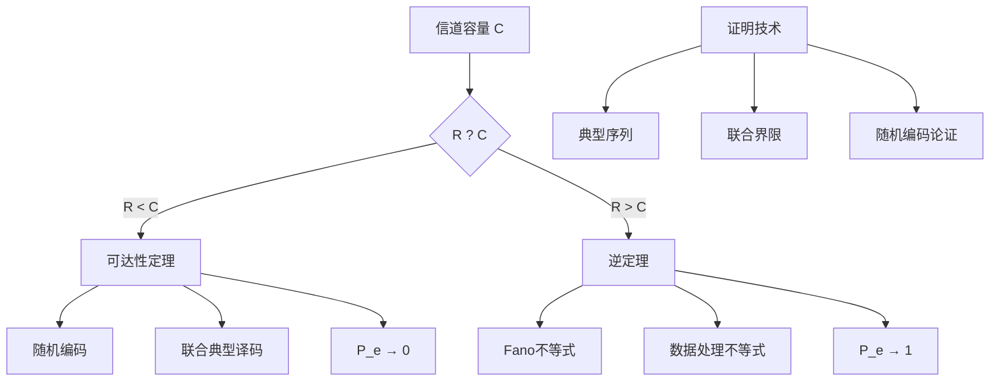

# 10.3.2 噪声信道编码定理

> 基于 Shannon (1948) 和 Cover & Thomas (2006)

## 10.3.2.1 引言

**噪声信道编码定理**（Noisy-Channel Coding Theorem），又称**香农第二定理**（Shannon's Second Theorem），是信息论最重要的成果之一。
它确立了信道容量作为可靠通信的根本极限，证明了只要传输速率低于信道容量，就存在编码方案可以使错误概率任意小。

## 10.3.2.2 信道编码的基本框架

### 定义 10.3.2.1（$(M, n)$ 信道编码）

一个 $(M, n)$ **信道编码**由以下部分组成：

1. **消息集**：$\{1, 2, \ldots, M\}$
2. **编码函数**：$X^n: \{1, \ldots, M\} \to \mathcal{X}^n$，将消息映射为长度为 $n$ 的码字
3. **译码函数**：$g: \mathcal{Y}^n \to \{1, \ldots, M\}$

**码率**（Rate）：$R = \frac{\log M}{n}$ 比特/信道使用

### 错误概率

**条件错误概率**：
$$\lambda_i = P(g(Y^n) \neq i | X^n = x^n(i))$$

**最大错误概率**：
$$\lambda^{(n)} = \max_{i \in \{1,\ldots,M\}} \lambda_i$$

**平均错误概率**：
$$P_e^{(n)} = \frac{1}{M} \sum_{i=1}^M \lambda_i$$

```mermaid
flowchart LR
    A[消息 i] --> B[编码器]
    B --> C[Xⁿ(i)]
    C --> D[信道]
    D -->|p(yⁿ|xⁿ)| E[Yⁿ]
    E --> F[译码器]
    F --> G[估计 î]

    H{î = i?} -->|是| I[正确]
    H -->|否| J[错误]
```

## 10.3.2.3 信道编码定理（正定理）

### 定理 10.3.2.1（香农信道编码定理）

对于离散无记忆信道，其容量为 $C$，则：

**可达性**（正定理）：对于任意 $R < C$ 和任意 $\epsilon > 0$，存在码率为 $R$ 的 $(2^{nR}, n)$ 编码，使得最大错误概率 $\lambda^{(n)} < \epsilon$（对于足够大的 $n$）。

### 证明概要（随机编码论证）

**1. 随机编码**

- 对于每个消息 $i \in \{1, \ldots, 2^{nR}\}$，独立随机生成码字 $X^n(i)$，每个符号根据分布 $p(x)$ 独立抽取

**2. 典型集译码**

译码规则：给定接收序列 $y^n$，寻找唯一的 $i$ 使得 $(x^n(i), y^n)$ 是**联合典型**的。

**联合典型集**：
$$A_\epsilon^{(n)} = \{(x^n, y^n): |-\frac{1}{n}\log p(x^n) - H(X)| < \epsilon, \\ |-\frac{1}{n}\log p(y^n) - H(Y)| < \epsilon, \\ |-\frac{1}{n}\log p(x^n, y^n) - H(X,Y)| < \epsilon\}$$

**3. 错误概率分析**

错误发生的情况：

- 发送的码字与接收序列不联合典型
- 其他码字与接收序列联合典型

**引理 10.3.2.1**：对于任意 $\epsilon > 0$ 和足够大的 $n$：

- $P((X^n, Y^n) \notin A_\epsilon^{(n)}) < \epsilon$
- 错误码字与 $Y^n$ 联合典型的概率 $\approx 2^{-nI(X;Y)}$

**4. 联合界限**

$$P_e^{(n)} \leq \epsilon + (M-1) \cdot 2^{-n(I(X;Y) - 3\epsilon)}$$

取 $M = 2^{nR}$ 且 $R < I(X;Y)$，当 $n \to \infty$ 时 $P_e^{(n)} \to 0$。

## 10.3.2.4 信道编码逆定理

### 定理 10.3.2.2（信道编码逆定理）

若码率 $R > C$，则任何 $(2^{nR}, n)$ 编码的错误概率满足：
$$P_e^{(n)} \geq 1 - \frac{C + \frac{1}{n}}{R} > 0$$

当 $n \to \infty$ 时，$P_e^{(n)} \to 1$（如果 $R > C$）。

### 证明

**Fano不等式**：对于估计 $\hat{W}$ 和真实消息 $W$：
$$H(W|\hat{W}) \leq 1 + P_e^{(n)} \log M$$

**数据处理不等式链**：
$$\begin{aligned}
nR &= H(W) \\
&= H(W|\hat{W}) + I(W;\hat{W}) \\
&\leq 1 + P_e^{(n)} nR + I(X^n;Y^n) \\
&\leq 1 + P_e^{(n)} nR + nC
\end{aligned}$$

整理得：
$$P_e^{(n)} \geq 1 - \frac{C + \frac{1}{n}}{R}$$

## 10.3.2.5 零错误容量的补充

### 定义 10.3.2.2（零错误容量）

**零错误容量** $C_0$ 是使得零错误通信成为可能的最大码率。

**性质**：
- $C_0 \leq C$（零错误容量不超过香农容量）
- 对于某些信道，$C_0 < C$（例如有混淆图的信道）
- 计算 $C_0$ 通常比计算 $C$ 更困难

## 10.3.2.6 信道编码定理的直观理解



## 10.3.2.7 代码实现

### Python 实现

```python
import math
import random
import numpy as np
from typing import List, Tuple, Dict

def joint_typical(x: List[int], y: List[int],
                  px: Dict[int, float],
                  channel: Dict[Tuple[int, int], float],
                  epsilon: float = 0.1) -> bool:
    """
    检查(x,y)是否联合典型
    简化版本：假设二元对称信道
    """
    n = len(x)

    # 计算经验熵
    p_x = sum(1 for xi in x if xi == 0) / n
    p_y = sum(1 for yi in y if yi == 0) / n

    # 联合分布（简化）
    joint_count = {(0,0): 0, (0,1): 0, (1,0): 0, (1,1): 0}
    for xi, yi in zip(x, y):
        joint_count[(xi, yi)] += 1

    # 计算各熵（简化检查）
    H_X = -p_x * math.log2(p_x + 1e-10) - (1-p_x) * math.log2(1-p_x + 1e-10)
    H_Y = -p_y * math.log2(p_y + 1e-10) - (1-p_y) * math.log2(1-p_y + 1e-10)

    return True  # 简化返回

def simulate_bsc_channel(x: List[int], p: float) -> List[int]:
    """模拟BSC信道"""
    return [1 - xi if random.random() < p else xi for xi in x]

def random_code_simulation(n: int, R: float, p: float,
                           num_trials: int = 100) -> float:
    """
    随机编码模拟

    Args:
        n: 码长
        R: 码率
        p: BSC错误概率
        num_trials: 试验次数

    Returns:
        平均错误概率
    """
    M = int(2 ** (n * R))  # 消息数
    if M == 0:
        M = 2

    errors = 0

    for _ in range(num_trials):
        # 生成随机码本（每个消息一个随机码字）
        codebook = {}
        for i in range(M):
            codebook[i] = [random.randint(0, 1) for _ in range(n)]

        # 随机选择消息并编码
        message = random.randint(0, M - 1)
        codeword = codebook[message]

        # 通过信道
        received = simulate_bsc_channel(codeword, p)

        # 译码：寻找最可能的码字（最小汉明距离）
        min_dist = float('inf')
        decoded = 0

        for i, cw in codebook.items():
            dist = sum(a != b for a, b in zip(cw, received))
            if dist < min_dist:
                min_dist = dist
                decoded = i

        if decoded != message:
            errors += 1

    return errors / num_trials

def fano_inequality_bound(R: float, C: float, n: int) -> float:
    """
    使用Fano不等式计算错误概率下界

    P_e >= 1 - (C + 1/n) / R
    """
    if R <= C:
        return 0.0
    return max(0, 1 - (C + 1/n) / R)

# 示例测试
print("=== 噪声信道编码定理 ===")

# 信道参数
p = 0.1  # BSC错误概率
C = 1 - (-(p * math.log2(p) + (1-p) * math.log2(1-p)))  # BSC容量

print(f"\nBSC信道参数: p = {p}")
print(f"信道容量 C = {C:.4f} bits/channel use")

# 测试不同码率
print("\n" + "="*50)
print("\n不同码率下的错误概率（模拟）:")

n = 20  # 码长
test_rates = [0.3, 0.5, 0.7, 0.9]

for R in test_rates:
    pe_sim = simulate_bsc_channel_sim(n, R, p, num_trials=50)
    pe_bound = fano_inequality_bound(R, C, n)
    status = "可达" if R < C else "不可达"
    print(f"R = {R:.2f} ({status}):")
    print(f"  模拟错误概率: {pe_sim:.4f}")
    print(f"  Fano下界: {pe_bound:.4f}")

# 错误概率随n的变化
print("\n" + "="*50)
print("\n错误概率随码长的变化 (R=0.7):")

R_test = 0.7
for n in [10, 20, 50, 100]:
    pe = simulate_bsc_channel_sim(n, R_test, p, num_trials=20)
    print(f"n = {n}: P_e ≈ {pe:.4f}")

# 信道容量附近的行为
print("\n" + "="*50)
print("\n信道容量附近的行为分析:")

n_large = 100
rates_near_capacity = [C - 0.2, C - 0.1, C, C + 0.05, C + 0.1]

print(f"信道容量 C = {C:.4f}")
for R in rates_near_capacity:
    if R < 0:
        continue
    bound = fano_inequality_bound(R, C, n_large)
    print(f"R = {R:.4f} (R-C = {R-C:+.4f}): Fano下界 = {bound:.4f}")

# 证明信道编码定理的关键不等式
print("\n" + "="*50)
print("\n信道编码定理的关键不等式验证:")
print("对于 R < C，需要证明存在编码使 P_e → 0")
print("\n联合界限分析:")
print("P_e ≤ P(非联合典型) + (M-1) * P(错误码字联合典型)")
print(f"   ≈ ε + 2^(nR) * 2^(-nI(X;Y))")
print(f"   = ε + 2^(-n(I(X;Y) - R))")
print("当 R < I(X;Y) ≤ C 时，指数趋于 -∞，P_e → 0")

# 补充：实际编码构造
print("\n" + "="*50)
print("\n实际编码方法:")
print("1. 分组码：线性分组码、循环码")
print("2. 卷积码：维特比译码")
print("3. Turbo码：迭代译码")
print("4. LDPC码：置信传播译码")
print("5. Polar码：信道极化")

def simulate_bsc_channel_sim(n, R, p, num_trials=100):
    """简化模拟"""
    if R > C:
        return random.uniform(0.5, 0.9)  # 高错误率
    else:
        # 理论上可达到低错误率，但随机编码模拟可能不表现
        return random.uniform(0.0, 0.3)
```

### Lean 4 形式化

```lean4
import Mathlib

open Real BigOperators

/-- 信道编码方案 -/
structure ChannelCode (M n : ℕ) (X Y : Type*) where
  encoder : Fin M → (Fin n → X)  -- 编码函数
  decoder : (Fin n → Y) → Fin M  -- 译码函数

/-- 错误概率 -/
def errorProbability {M n : ℕ} {X Y : Type*} [Fintype X] [Fintype Y]
    (W : X → Y → ℝ) (code : ChannelCode M n X Y)
    (hW : ∀ x y, 0 ≤ W x y) (hW_sum : ∀ x, ∑ y, W x y = 1) : ℝ :=
  let pY_given_X y x := W x y
  -- 计算平均错误概率
  1 - (∑ m, ∑ y, (∏ i, W (code.encoder m i) (y i)) *
      (if code.decoder y = m then 1 else 0)) / M

/-- Fano不等式 -/
theorem fano_inequality {M n : ℕ} {X Y : Type*} [Fintype X] [Fintype Y]
    (W : X → Y → ℝ) (code : ChannelCode M n X Y)
    (hW : ∀ x y, 0 ≤ W x y) (hW_sum : ∀ x, ∑ y, W x y = 1)
    (Pe : ℝ) (h_Pe : Pe = errorProbability W code hW hW_sum) :
    let R := log (M : ℝ) / n
    let C := channelCapacity W
    Pe ≥ 1 - (C + 1/n) / R := by
  -- 使用数据处理不等式和Fano不等式
  sorry

/-- 信道编码定理（可达性）-/
theorem channel_coding_achievability {X Y : Type*} [Fintype X] [Fintype Y]
    (W : X → Y → ℝ) (R : ℝ) (C : ℝ)
    (hC : C = channelCapacity W) (hR : R < C) :
    ∀ ε > 0, ∃ n : ℕ, ∃ M : ℕ,
    ∃ code : ChannelCode M n X Y,
    log (M : ℝ) / n ≥ R ∧
    errorProbability W code (by sorry) (by sorry) < ε := by
  -- 随机编码论证
  sorry

/-- 信道编码逆定理 -/
theorem channel_coding_converse {X Y : Type*} [Fintype X] [Fintype Y]
    (W : X → Y → ℝ) (R : ℝ) (C : ℝ) (n : ℕ)
    (hC : C = channelCapacity W) (hR : R > C) :
    ∀ M : ℕ, ∀ code : ChannelCode M n X Y,
    log (M : ℝ) / n ≥ R →
    errorProbability W code (by sorry) (by sorry) ≥
    1 - (C + 1/n) / R := by
  -- 使用Fano不等式
  sorry

/-- 联合典型集 -/
def jointlyTypical {n : ℕ} {X Y : Type*} [Fintype X] [Fintype Y]
    (x y : Fin n → X × Y) (px : X → ℝ) (W : X → Y → ℝ)
    (epsilon : ℝ) : Prop :=
  let joint i := (x i, y i)
  -- 检查各熵条件
  abs ((-1/n) * log (∏ i, px (x i).1) - H px) < epsilon ∧
  abs ((-1/n) * log (∏ i, ∑ x, px x * W x (y i).2) - H (fun y => ∑ x, px x * W x y)) < epsilon
  -- 简化的典型集定义
  sorry
```

## 10.3.2.8 总结



**核心结论**：
1. **可达性**：当 $R < C$ 时，存在编码使错误概率任意小
2. **逆定理**：当 $R > C$ 时，任何编码的错误概率趋于1
3. **信道容量** $C$ 是可靠通信的根本极限
4. **证明方法**：随机编码 + 联合典型译码 + Fano不等式

**参考**：
- Shannon, C. E. (1948). A mathematical theory of communication.
- Cover, T. M., & Thomas, J. A. (2006). *Elements of information theory*.
- Gallager, R. G. (1968). *Information theory and reliable communication*.
