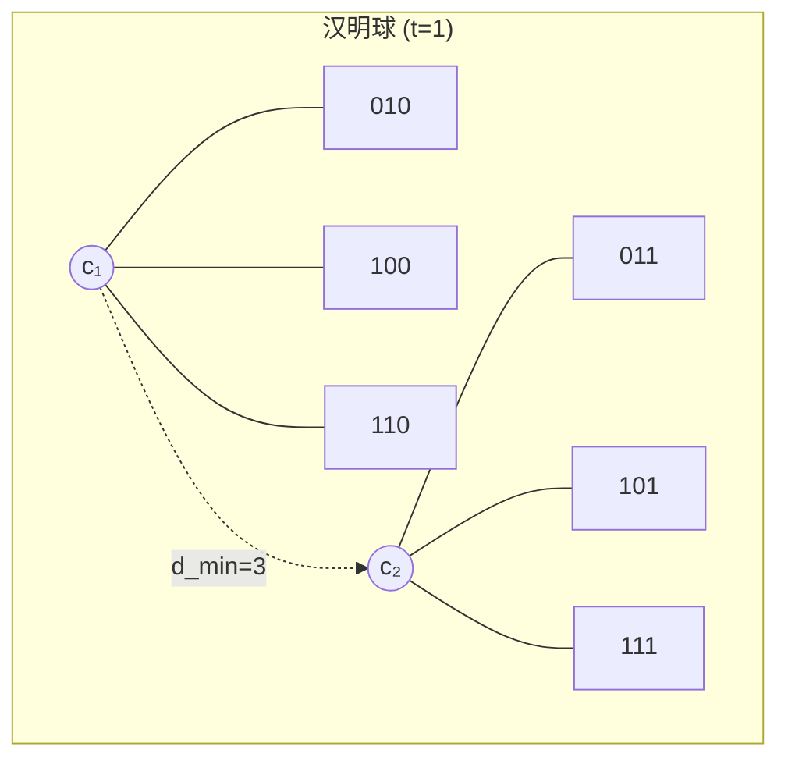

# 10.3.3 纠错码基础

> 基于 Hamming (1950), MacWilliams & Sloane (1977) 和 Cover & Thomas (2006)

## 10.3.3.1 引言

**纠错码**（Error-Correcting Code）是在噪声信道上实现可靠通信的核心技术。通过在传输信息中添加冗余，纠错码可以检测并纠正传输过程中发生的错误。本节介绍纠错码的基本概念、汉明距离以及纠错能力的理论极限。

## 10.3.3.2 分组码的基本概念

### 定义 10.3.3.1（分组码）

一个 **$(n, k)$ 分组码** 将 $k$ 个信息比特编码为 $n$ 个码字比特，码率为 $R = k/n$。

- **码字**（Codeword）：长度为 $n$ 的编码序列
- **信息比特**：原始 $k$ 比特消息
- **冗余比特**：添加的 $n-k$ 个校验比特

```mermaid
flowchart LR
    A[消息 m∈{0,1}ᵏ] --> B[编码器]
    B --> C[码字 c∈{0,1}ⁿ]
    C --> D[信道]
    D -->|错误 e| E[接收 r = c ⊕ e]
    E --> F[译码器]
    F --> G[估计 ĉ]
```

### 码的参数

- **码长**：$n$
- **信息位**：$k$
- **校验位**：$n-k$
- **码率**：$R = k/n$
- **码字数量**：$M = 2^k$（对于二元码）

## 10.3.3.3 汉明距离

### 定义 10.3.3.2（汉明距离）

两个码字 $x, y \in \{0,1\}^n$ 之间的**汉明距离**定义为它们不同位置的个数：
$$d_H(x, y) = \sum_{i=1}^n \mathbb{1}[x_i \neq y_i]$$

### 汉明距离的性质

**定理 10.3.3.1**：汉明距离满足度量的三条公理：

1. **非负性**：$d_H(x, y) \geq 0$，等号当且仅当 $x = y$
2. **对称性**：$d_H(x, y) = d_H(y, x)$
3. **三角不等式**：$d_H(x, z) \leq d_H(x, y) + d_H(y, z)$

**证明**：直接由定义可得。

### 汉明重量

**定义 10.3.3.3**：码字 $x$ 的**汉明重量**为其非零元素的个数：
$$w_H(x) = d_H(x, \mathbf{0})$$

**性质**：$d_H(x, y) = w_H(x \oplus y)$（对于二元码）

## 10.3.3.4 纠错能力与检错能力

### 定义 10.3.3.4（码的最小距离）

码 $\mathcal{C}$ 的**最小汉明距离**为：
$$d_{min} = \min_{c_1, c_2 \in \mathcal{C}, c_1 \neq c_2} d_H(c_1, c_2)$$

### 纠错能力

**定理 10.3.3.2**：最小距离为 $d_{min}$ 的码可以**纠正**最多 $t$ 个错误，其中：
$$t = \left\lfloor \frac{d_{min} - 1}{2} \right\rfloor$$

**证明**：

以每个码字为中心，半径为 $t$ 的汉明球互不相交。若错误数 $\leq t$，则接收序列唯一地属于发送码字的球，译码正确。



### 检错能力

**定理 10.3.3.3**：最小距离为 $d_{min}$ 的码可以**检测**最多 $d_{min} - 1$ 个错误。

**证明**：若错误数 $< d_{min}$，接收序列不可能是其他码字。

### 纠错与检错的权衡

| 能力 | 最大错误数 | 使用场景 |
|------|-----------|----------|
| 纯检错 | $d_{min} - 1$ | 重传机制可用 |
| 纯纠错 | $\lfloor (d_{min}-1)/2 \rfloor$ | 实时通信 |
| 混合 | 检测 $d_{min}-1$，纠正 $t$ | 自适应系统 |

## 10.3.3.5 码的构造界

### 汉明界（球包装界）

**定理 10.3.3.4（汉明界）**：对于 $q$ 元 $(n, k, d)$ 码：
$$q^{n-k} \geq \sum_{i=0}^t \binom{n}{i} (q-1)^i$$

其中 $t = \lfloor (d-1)/2 \rfloor$。

**证明**：考虑所有半径为 $t$ 的汉明球必须包含在 $q^n$ 空间中且不重叠。

### Gilbert-Varshamov界

**定理 10.3.3.5（Gilbert-Varshamov界）**：存在 $q$ 元 $(n, k, d)$ 码满足：
$$q^{n-k} \leq \sum_{i=0}^{d-1} \binom{n}{i} (q-1)^i$$

这是存在性下界。

### Singleton界

**定理 10.3.3.6（Singleton界）**：
$$d_{min} \leq n - k + 1$$

达到Singleton界的码称为**最大距离可分码**（MDS码）。

## 10.3.3.6 简单纠错码示例

### 重复码

**$(3, 1)$ 重复码**：

- 信息：$m \in \{0, 1\}$
- 编码：$c = (m, m, m)$
- 译码：多数表决

参数：$d_{min} = 3$，可纠正1个错误。

### 奇偶校验码

**$(n, n-1)$ 奇偶校验码**：

- 信息：$(m_1, \ldots, m_{n-1})$
- 校验：$p = m_1 \oplus m_2 \oplus \cdots \oplus m_{n-1}$
- 码字：$(m_1, \ldots, m_{n-1}, p)$

参数：$d_{min} = 2$，可检测1个错误，不可纠错。

### 汉明码

**汉明 $(7, 4)$ 码**：

- 信息位：4位
- 校验位：3位
- 最小距离：$d_{min} = 3$
- 纠错能力：纠正1个错误

## 10.3.3.7 代码实现

### Python 实现

```python
import itertools
from typing import List, Tuple, Set, Optional
import numpy as np

def hamming_distance(x: List[int], y: List[int]) -> int:
    """计算汉明距离"""
    return sum(a != b for a, b in zip(x, y))

def hamming_weight(x: List[int]) -> int:
    """计算汉明重量"""
    return sum(x)

def min_distance(codebook: List[List[int]]) -> int:
    """计算码的最小距离"""
    min_dist = float('inf')
    for i, c1 in enumerate(codebook):
        for c2 in codebook[i+1:]:
            dist = hamming_distance(c1, c2)
            min_dist = min(min_dist, dist)
    return min_dist

def error_correction_capability(d_min: int) -> int:
    """
    计算纠错能力 t = floor((d_min - 1) / 2)
    """
    return (d_min - 1) // 2

def error_detection_capability(d_min: int) -> int:
    """
    计算检错能力 = d_min - 1
    """
    return d_min - 1

def hamming_sphere_volume(n: int, t: int, q: int = 2) -> int:
    """
    计算汉明球的体积（包含的点数）
    V_q(n,t) = sum_{i=0}^t C(n,i) * (q-1)^i
    """
    volume = 0
    for i in range(t + 1):
        volume += math.comb(n, i) * (q - 1) ** i
    return volume

def hamming_bound(n: int, k: int, d: int, q: int = 2) -> bool:
    """
    检查是否满足汉明界（球包装界）
    """
    t = (d - 1) // 2
    lhs = q ** (n - k)
    rhs = hamming_sphere_volume(n, t, q)
    return lhs >= rhs

def singleton_bound(n: int, k: int, d: int) -> bool:
    """
    检查是否满足Singleton界
    """
    return d <= n - k + 1

# (3,1) 重复码
print("=== (3,1) 重复码 ===")
repetition_code = [[0, 0, 0], [1, 1, 1]]
d_rep = min_distance(repetition_code)
t_rep = error_correction_capability(d_rep)
print(f"码字: {repetition_code}")
print(f"最小距离 d_min = {d_rep}")
print(f"纠错能力 t = {t_rep}")
print(f"可纠正 {t_rep} 个错误")

# 测试译码
def decode_repetition(received: List[int]) -> List[int]:
    """多数表决译码"""
    return [1] if sum(received) >= 2 else [0]

test_received = [[0, 0, 1], [0, 1, 1], [1, 0, 0]]
print("\n译码测试:")
for r in test_received:
    decoded = decode_repetition(r)
    print(f"  {r} -> {decoded}")

# (7,4) 汉明码
print("\n=== (7,4) 汉明码 ===")

def generate_hamming_7_4() -> Tuple[List[List[int]], np.ndarray]:
    """
    生成(7,4)汉明码的码字
    生成矩阵 G 和校验矩阵 H
    """
    # 生成矩阵 (4x7)
    G = np.array([
        [1, 0, 0, 0, 1, 1, 0],
        [0, 1, 0, 0, 1, 0, 1],
        [0, 0, 1, 0, 0, 1, 1],
        [0, 0, 0, 1, 1, 1, 1]
    ])

    # 校验矩阵 (3x7)
    H = np.array([
        [1, 1, 0, 1, 1, 0, 0],
        [1, 0, 1, 1, 0, 1, 0],
        [0, 1, 1, 1, 0, 0, 1]
    ])

    # 生成所有码字
    codewords = []
    for m in range(16):
        msg = [(m >> i) & 1 for i in range(4)]
        codeword = np.dot(msg, G) % 2
        codewords.append(codeword.tolist())

    return codewords, H

hamming_code, H_matrix = generate_hamming_7_4()
d_hamming = min_distance(hamming_code)
print(f"码字数量: {len(hamming_code)}")
print(f"最小距离 d_min = {d_hamming}")
print(f"纠错能力 t = {error_correction_capability(d_hamming)}")

def syndrome_decode(received: List[int], H: np.ndarray) -> List[int]:
    """
    伴随式译码
    """
    r = np.array(received)
    syndrome = np.dot(H, r) % 2

    # 查找错误图样
    error_pattern = [0] * 7
    syndrome_val = sum(int(s) << i for i, s in enumerate(reversed(syndrome)))

    if syndrome_val > 0:
        # 单比特错误，syndrome值对应错误位置
        error_pattern[syndrome_val - 1] = 1

    # 纠正错误
    corrected = (r + np.array(error_pattern)) % 2
    return corrected[:4].tolist()  # 返回信息位

print("\n汉明码译码测试:")
original_msg = [1, 0, 1, 0]
codeword = np.dot(original_msg, np.array([
    [1, 0, 0, 0, 1, 1, 0],
    [0, 1, 0, 0, 1, 0, 1],
    [0, 0, 1, 0, 0, 1, 1],
    [0, 0, 0, 1, 1, 1, 1]
])) % 2
print(f"原始消息: {original_msg}")
print(f"发送码字: {codeword}")

# 引入1个错误
error = [0, 0, 0, 1, 0, 0, 0]  # 第4位错误
received = (codeword + np.array(error)) % 2
print(f"接收序列 (1个错误): {received}")
decoded = syndrome_decode(received.tolist(), H_matrix)
print(f"译码结果: {decoded}")
print(f"纠正成功: {decoded == original_msg}")

# 界限验证
print("\n=== 编码界限验证 ===")
print("\n(7,4)汉明码:")
print(f"  汉明界检查: {hamming_bound(7, 4, 3)}")
print(f"  Singleton界检查: {singleton_bound(7, 4, 3)}")
print(f"  是完备码: {hamming_sphere_volume(7, 1) == 2**(7-4)}")

# 随机码分析
print("\n=== 随机码最小距离分析 ===")
def random_code_min_distance(n: int, k: int, trials: int = 100) -> float:
    """估计随机码的平均最小距离"""
    avg_d = 0
    for _ in range(trials):
        # 随机生成2^k个码字
        codebook = [[random.randint(0, 1) for _ in range(n)]
                    for _ in range(2**min(k, 6))]  # 限制大小
        if len(codebook) > 1:
            avg_d += min_distance(codebook)
    return avg_d / trials

import random
random.seed(42)
for n, k in [(10, 5), (15, 10), (20, 10)]:
    avg_d = random_code_min_distance(n, k, trials=50)
    print(f"(n={n}, k={k}): 平均最小距离 ≈ {avg_d:.2f}")
```

### Lean 4 形式化

```lean4
import Mathlib

/-- 汉明距离 -/
def hammingDistance {n : ℕ} (x y : Fin n → Fin 2) : ℕ :=
  Finset.card (Finset.filter (fun i => x i ≠ y i) Finset.univ)

/-- 汉明距离是对称的 -/
theorem hammingDistance_sym {n : ℕ} (x y : Fin n → Fin 2) :
    hammingDistance x y = hammingDistance y x := by
  unfold hammingDistance
  congr
  funext i
  simp [ne_comm]

/-- 汉明距离满足三角不等式 -/
theorem hammingDistance_triangle {n : ℕ} (x y z : Fin n → Fin 2) :
    hammingDistance x z ≤ hammingDistance x y + hammingDistance y z := by
  unfold hammingDistance
  -- 使用集合包含关系
  sorry

/-- 码的最小距离 -/
def minDistance {n M : ℕ} (code : Fin M → (Fin n → Fin 2)) : ℕ :=
  Finset.inf' (Finset.univ ×ˢ Finset.univ) (by use (0, 0); simp)
    (fun p => hammingDistance (code p.1) (code p.2))

/-- 纠错能力 -/
def errorCorrectionCapability (d_min : ℕ) : ℕ :=
  (d_min - 1) / 2

/-- 检错能力 -/
def errorDetectionCapability (d_min : ℕ) : ℕ :=
  d_min - 1

/-- 纠错能力定理：可纠正t个错误的条件 -/
theorem canCorrectErrors {n M : ℕ} (code : Fin M → (Fin n → Fin 2))
    (t : ℕ) (ht : t ≤ errorCorrectionCapability (minDistance code)) :
    ∀ c₁ c₂ : Fin M, c₁ ≠ c₂ →
    ∀ e₁ e₂ : Fin n → Fin 2,
    hammingWeight e₁ ≤ t → hammingWeight e₂ ≤ t →
    code c₁ + e₁ ≠ code c₂ + e₂ := by
  -- 证明汉明球不相交
  sorry

/-- 汉明球体积 -/
def hammingSphereVolume (n t : ℕ) (q : ℕ := 2) : ℕ :=
  ∑ i ∈ Finset.range (t + 1), Nat.choose n i * (q - 1) ^ i

/-- 汉明界（球包装界）-/
theorem hammingBound {n k d M : ℕ} (code : Fin M → (Fin n → Fin 2))
    (hM : M = 2 ^ k) (h_d : minDistance code = d) :
    let t := errorCorrectionCapability d
    2 ^ (n - k) ≥ hammingSphereVolume n t := by
  -- 汉明球不相交地包含在空间中
  sorry

/-- Singleton界 -/
theorem singletonBound {n k d M : ℕ} (code : Fin M → (Fin n → Fin 2))
    (hM : M = 2 ^ k) (h_d : minDistance code = d) :
    d ≤ n - k + 1 := by
  -- 使用线性代数或组合论证
  sorry
```

## 10.3.3.8 总结

```mermaid
flowchart TB
    A[纠错码] --> B[汉明距离]
    B --> C[d_min]

    C --> D[纠错能力]
    C --> E[检错能力]

    D --> F[t = floor((d-1)/2)]
    E --> G[d-1]

    H[编码界限] --> I[汉明界]
    H --> J[G-V界]
    H --> K[Singleton界]
```

**核心结论**：

1. **汉明距离**是纠错码的基础度量
2. **纠错能力**：$t = \lfloor (d_{min}-1)/2 \rfloor$
3. **检错能力**：$d_{min} - 1$
4. **编码界限**：汉明界给出上界，G-V界给出存在下界

**参考**：

- Hamming, R. W. (1950). Error detecting and error correcting codes.
- MacWilliams, F. J., & Sloane, N. J. A. (1977). _The theory of error-correcting codes_.
- Cover, T. M., & Thomas, J. A. (2006). _Elements of information theory_.
