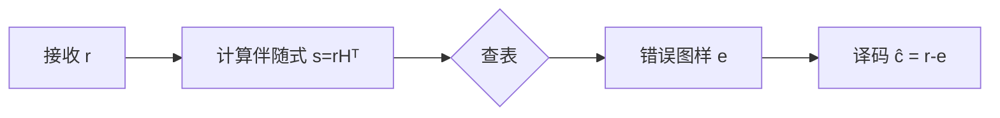
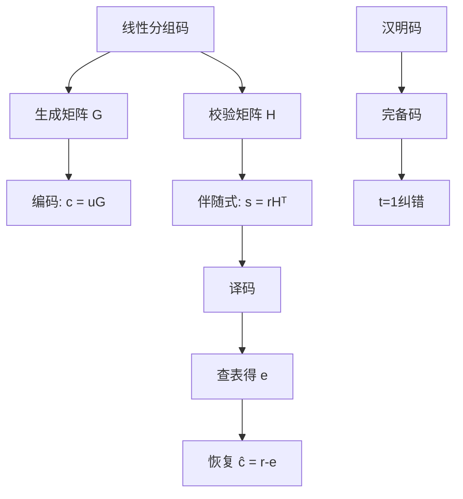

# 10.3.4 线性分组码

> 基于 Hamming (1950), MacWilliams & Sloane (1977) 和 Cover & Thomas (2006)

## 10.3.4.1 引言

**线性分组码**（Linear Block Codes）是一类具有代数结构的纠错码，其码字构成向量空间的一个子空间。
这种结构使得编码和译码可以利用线性代数工具高效实现，是现代纠错码理论的基础。

## 10.3.4.2 线性分组码的定义

### 定义 10.3.4.1（线性分组码）

一个 **$[n, k]$ 线性分组码** $\mathcal{C}$ 是 $\mathbb{F}_q^n$ 的一个 $k$ 维子空间，其中：

- $n$：码长
- $k$：信息位数
- 码率：$R = k/n$
- 码字数量：$q^k$

**线性性质**：

- 若 $c_1, c_2 \in \mathcal{C}$，则 $c_1 + c_2 \in \mathcal{C}$
- 若 $c \in \mathcal{C}$，$\alpha \in \mathbb{F}_q$，则 $\alpha c \in \mathcal{C}$

### 生成矩阵

**定义 10.3.4.2（生成矩阵）**：$k \times n$ 矩阵 $G$ 是码 $\mathcal{C}$ 的**生成矩阵**，如果：
$$\mathcal{C} = \{u \cdot G : u \in \mathbb{F}_q^k\}$$

编码过程：$c = u \cdot G$

**系统形式**：
$$G = [I_k | P]$$
其中 $I_k$ 是 $k \times k$ 单位矩阵，$P$ 是 $k \times (n-k)$ 矩阵。

系统码的码字：$c = (u | u \cdot P)$

## 10.3.4.3 校验矩阵与伴随式

### 定义 10.3.4.3（校验矩阵）

$(n-k) \times n$ 矩阵 $H$ 是码 $\mathcal{C}$ 的**校验矩阵**，如果：
$$\mathcal{C} = \{c \in \mathbb{F}_q^n : c \cdot H^T = 0\}$$

**性质**：$G \cdot H^T = 0$

对于系统码：
$$H = [-P^T | I_{n-k}]$$

### 伴随式译码

**定义 10.3.4.4（伴随式）**：接收向量 $r$ 的**伴随式**为：
$$s = r \cdot H^T$$

**性质**：

- 若 $s = 0$，则 $r$ 是有效码字（无错误或可检测的错误模式）
- $s$ 仅依赖于错误图样 $e$：$s = e \cdot H^T$

**伴随式译码步骤**：

1. 计算伴随式 $s = r \cdot H^T$
2. 查找伴随式对应的错误图样 $e$
3. 译码：$\hat{c} = r - e$



## 10.3.4.4 最小距离与校验矩阵的关系

### 定理 10.3.4.1

线性码的最小距离等于校验矩阵 $H$ 中线性相关的最小列数：
$$d_{min} = \min\{w : \text{存在 } w \text{ 列线性相关}\}$$

**等价表述**：$d_{min}$ 是使得 $H$ 的某 $d_{min}$ 列之和为0的最小整数。

### 定理 10.3.4.2

若校验矩阵 $H$ 的任意 $d-1$ 列线性无关，则码的最小距离至少为 $d$。

## 10.3.4.5 汉明码

### 定义 10.3.4.5（汉明码）

**$[2^r - 1, 2^r - 1 - r]$ 汉明码**的校验矩阵 $H$ 是所有非零 $r$ 维列向量的集合。

对于二元汉明码，$H$ 是 $r \times (2^r - 1)$ 矩阵。

**例**：$[7, 4]$ 汉明码

$$H = \begin{bmatrix} 1 & 0 & 1 & 0 & 1 & 0 & 1 \\ 0 & 1 & 1 & 0 & 0 & 1 & 1 \\ 0 & 0 & 0 & 1 & 1 & 1 & 1 \end{bmatrix}$$

**参数**：

- $n = 2^r - 1$，$k = 2^r - 1 - r$
- $d_{min} = 3$
- 可纠正1个错误

### 汉明码的完备性

**定义 10.3.4.6（完备码）**：满足汉明界取等号的码：
$$q^{n-k} = \sum_{i=0}^t \binom{n}{i} (q-1)^i$$

**定理 10.3.4.3**：汉明码是完备码。

## 10.3.4.6 对偶码

### 定义 10.3.4.7（对偶码）

码 $\mathcal{C}$ 的**对偶码**为：
$$\mathcal{C}^\perp = \{v \in \mathbb{F}_q^n : v \cdot c = 0, \forall c \in \mathcal{C}\}$$

**性质**：

- $\dim(\mathcal{C}^\perp) = n - k$
- $\mathcal{C}^{\perp\perp} = \mathcal{C}$
- 若 $\mathcal{C} = \mathcal{C}^\perp$，称为**自对偶码**

## 10.3.4.7 代码实现

### Python 实现

```python
import numpy as np
from typing import List, Tuple, Optional
import itertools

class LinearBlockCode:
    """线性分组码类"""

    def __init__(self, G: Optional[np.ndarray] = None,
                 H: Optional[np.ndarray] = None,
                 q: int = 2):
        """
        通过生成矩阵或校验矩阵初始化
        """
        self.q = q

        if G is not None:
            self.G = G % q
            self.k, self.n = G.shape
            # 计算校验矩阵
            self.H = self._generator_to_parity(G) % q
        elif H is not None:
            self.H = H % q
            self.n = H.shape[1]
            self.k = self.n - H.shape[0]
            # 计算生成矩阵
            self.G = self._parity_to_generator(H) % q
        else:
            raise ValueError("必须提供G或H")

    def _generator_to_parity(self, G: np.ndarray) -> np.ndarray:
        """从生成矩阵推导校验矩阵（系统形式）"""
        k, n = G.shape
        # 尝试化为系统形式
        G_sys = G.copy()

        # 高斯消元
        for i in range(k):
            # 找主元
            pivot_col = i
            while pivot_col < n and G_sys[i, pivot_col] == 0:
                # 找非零行交换
                found = False
                for j in range(i + 1, k):
                    if G_sys[j, pivot_col] != 0:
                        G_sys[[i, j]] = G_sys[[j, i]]
                        found = True
                        break
                if not found:
                    pivot_col += 1

            if pivot_col >= n:
                continue

            # 消元
            for j in range(k):
                if j != i and G_sys[j, pivot_col] != 0:
                    G_sys[j] = (G_sys[j] + G_sys[i]) % self.q

        # 从系统形式 [I | P] 得到 H = [-P^T | I]
        P = G_sys[:, k:]
        H = np.hstack([(-P.T) % self.q, np.eye(n - k, dtype=int)])
        return H % self.q

    def _parity_to_generator(self, H: np.ndarray) -> np.ndarray:
        """从校验矩阵推导生成矩阵"""
        r, n = H.shape
        k = n - r
        # H = [A | I], G = [I | -A^T]
        A = H[:, :k]
        G = np.hstack([np.eye(k, dtype=int), (-A.T) % self.q])
        return G % self.q

    def encode(self, message: np.ndarray) -> np.ndarray:
        """编码"""
        return (message @ self.G) % self.q

    def syndrome(self, received: np.ndarray) -> np.ndarray:
        """计算伴随式"""
        return (received @ self.H.T) % self.q

    def is_valid_codeword(self, word: np.ndarray) -> bool:
        """检查是否为有效码字"""
        return np.all(self.syndrome(word) == 0)

    def build_syndrome_table(self, max_errors: int = 1) -> dict:
        """
        构建伴随式-错误图样查找表
        """
        table = {}

        # 生成所有可能的错误图样
        for weight in range(max_errors + 1):
            for error_positions in itertools.combinations(range(self.n), weight):
                error = np.zeros(self.n, dtype=int)
                for pos in error_positions:
                    error[pos] = 1

                s = tuple(self.syndrome(error))
                if s not in table:
                    table[s] = error

        return table

    def decode(self, received: np.ndarray, syndrome_table: dict) -> np.ndarray:
        """
        伴随式译码
        """
        s = tuple(self.syndrome(received))

        if s in syndrome_table:
            error = syndrome_table[s]
            corrected = (received - error) % self.q
            # 提取信息位
            return corrected[:self.k]
        else:
            # 无法纠正
            return None

def create_hamming_code(r: int) -> LinearBlockCode:
    """
    创建 [2^r - 1, 2^r - 1 - r] 汉明码
    """
    n = 2**r - 1

    # 构造校验矩阵：所有非零r位二进制向量
    H = np.zeros((r, n), dtype=int)
    for i in range(n):
        # i+1 的二进制表示
        val = i + 1
        for j in range(r):
            H[r - 1 - j, i] = (val >> j) & 1

    return LinearBlockCode(H=H)

# 示例测试
print("=== 线性分组码示例 ===")

# 例1：(7,4)汉明码
print("\n例1：汉明 [7,4] 码")
hamming_7_4 = create_hamming_code(3)
print(f"码参数: n={hamming_7_4.n}, k={hamming_7_4.k}")
print(f"码率: {hamming_7_4.k / hamming_7_4.n:.4f}")

print("\n生成矩阵 G:")
print(hamming_7_4.G)

print("\n校验矩阵 H:")
print(hamming_7_4.H)

# 验证 GH^T = 0
GHt = (hamming_7_4.G @ hamming_7_4.H.T) % 2
print(f"\n验证 GH^T = 0: {np.all(GHt == 0)}")

# 编码测试
msg = np.array([1, 0, 1, 1])
codeword = hamming_7_4.encode(msg)
print(f"\n消息: {msg}")
print(f"码字: {codeword}")
print(f"是有效码字: {hamming_7_4.is_valid_codeword(codeword)}")

# 伴随式译码测试
syndrome_table = hamming_7_4.build_syndrome_table(max_errors=1)
print(f"\n伴随式表大小: {len(syndrome_table)}")

# 引入单比特错误
error = np.array([0, 0, 0, 1, 0, 0, 0])
received = (codeword + error) % 2
print(f"\n错误图样: {error}")
print(f"接收序列: {received}")
print(f"伴随式: {hamming_7_4.syndrome(received)}")

decoded = hamming_7_4.decode(received, syndrome_table)
print(f"译码结果: {decoded}")
print(f"译码正确: {np.array_equal(decoded, msg)}")

# 例2：自定义线性码
print("\n" + "="*50)
print("\n例2：自定义 [6,3] 线性码")

# 生成矩阵
G_custom = np.array([
    [1, 0, 0, 1, 1, 0],
    [0, 1, 0, 1, 0, 1],
    [0, 0, 1, 0, 1, 1]
])

code_6_3 = LinearBlockCode(G=G_custom)
print("生成矩阵 G:")
print(code_6_3.G)
print("\n校验矩阵 H:")
print(code_6_3.H)

# 生成所有码字
print("\n所有码字:")
codewords = []
for i in range(8):
    msg = np.array([(i >> j) & 1 for j in range(3)])
    cw = code_6_3.encode(msg)
    codewords.append(cw)
    print(f"  {msg} -> {cw}")

# 计算最小距离
def min_distance_linear(code_list):
    min_dist = float('inf')
    for i, c1 in enumerate(code_list):
        for c2 in code_list[i+1:]:
            dist = np.sum((c1 + c2) % 2)
            min_dist = min(min_dist, dist)
    return min_dist

d_min = min_distance_linear(codewords)
print(f"\n最小距离 d_min = {d_min}")
print(f"纠错能力 t = {(d_min - 1) // 2}")

# 例3：系统码验证
print("\n" + "="*50)
print("\n例3：系统码性质")

# 检查汉明码是否为系统码
G_hamming = hamming_7_4.G
I_part = G_hamming[:, :4]
print(f"G的前4列:\n{I_part}")
print(f"是单位矩阵: {np.allclose(I_part, np.eye(4))}")
```

### Lean 4 形式化

```lean4
import Mathlib

open BigOperators

/-- 有限域 F_q 上的向量 -/
def Vector (n q : ℕ) := Fin n → Fin q

/-- 线性分组码：F_q^n 的 k 维子空间 -/
structure LinearCode (n k q : ℕ) where
  codewords : Set (Vector n q)
  h_subspace : ∃ basis : Fin k → Vector n q,
    codewords = {v | ∃ coeffs : Fin k → Fin q,
      v = fun i => ∑ j, coeffs j * basis j i}

/-- 生成矩阵 -/
def GeneratorMatrix (n k q : ℕ) := Fin k → Fin n → Fin q

/-- 从生成矩阵构造码 -/
def codeFromGenerator {n k q : ℕ} (G : GeneratorMatrix n k q) :
    LinearCode n k q :=
  ⟨{v | ∃ u : Fin k → Fin q, v = fun i => ∑ j, u j * G j i},
   by use G; rfl⟩

/-- 校验矩阵 -/
def ParityCheckMatrix (n k q : ℕ) := Fin (n - k) → Fin n → Fin q

/-- 校验条件：c * H^T = 0 -/
def satisfiesParityCheck {n k q : ℕ} (c : Vector n q)
    (H : ParityCheckMatrix n k q) : Prop :=
  ∀ i : Fin (n - k), ∑ j, c j * H i j = 0

/-- 生成矩阵和校验矩阵的关系 -/
theorem generator_parity_relation {n k q : ℕ}
    (G : GeneratorMatrix n k q) (H : ParityCheckMatrix n k q) :
    (∀ i : Fin k, ∀ j : Fin (n - k),
      ∑ m, G i m * H j m = 0) ↔
    (∀ c ∈ (codeFromGenerator G).codewords,
      satisfiesParityCheck c H) := by
  constructor
  · intro h_zero c hc
    unfold satisfiesParityCheck
    rcases hc with ⟨u, hu⟩
    -- 证明校验条件
    sorry
  · intro h_code
    -- 反向证明
    sorry

/-- 伴随式 -/
def syndrome {n k q : ℕ} (r : Vector n q) (H : ParityCheckMatrix n k q) :
    Fin (n - k) → Fin q :=
  fun i => ∑ j, r j * H i j

/-- 汉明码构造 -/
def hammingCode (r : ℕ) : LinearCode (2^r - 1) (2^r - 1 - r) 2 :=
  let n := 2^r - 1
  let H : ParityCheckMatrix n (n - r) 2 := fun i j =>
    -- H的列是所有非零r位二进制向量
    sorry
  codeFromGenerator (parityToGenerator H)

/-- 线性码的最小距离 -/
def minDistanceLinear {n k q : ℕ} (C : LinearCode n k q) : ℕ :=
  let nonzero_codewords := C.codewords \ {0}
  if h : Nonempty nonzero_codewords then
    let weights := Set.image (fun c => ∑ i, if c i = 0 then 0 else 1) nonzero_codewords
    sInf weights
  else
    0

/-- 线性码最小距离等于非零码字的最小重量 -/
theorem minDistance_equals_min_weight {n k q : ℕ} (C : LinearCode n k q) :
    minDistanceLinear C =
    sInf {w | ∃ c ∈ C.codewords, c ≠ 0 ∧ w = ∑ i, if c i = 0 then 0 else 1} := by
  sorry
```

## 10.3.4.8 总结



**核心结论**：

1. **线性结构**：码字构成向量空间的子空间
2. **生成矩阵**：$G$ 用于编码，$c = u \cdot G$
3. **校验矩阵**：$H$ 用于检错和译码，$c \cdot H^T = 0$
4. **伴随式译码**：$s = r \cdot H^T = e \cdot H^T$
5. **汉明码**：$[2^r-1, 2^r-1-r]$ 完备码，纠正1个错误

**参考**：

- Hamming, R. W. (1950). Error detecting and error correcting codes.
- MacWilliams, F. J., & Sloane, N. J. A. (1977). _The theory of error-correcting codes_.
- Cover, T. M., & Thomas, J. A. (2006). _Elements of information theory_.
