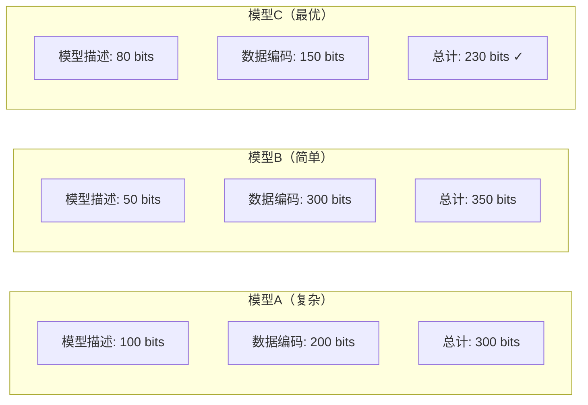

# 10.4.2 最小描述长度

> 基于 Rissanen (1978) 和 Grünwald (2007)

## 10.4.2.1 引言

**最小描述长度**（Minimum Description Length, MDL）原理由Rissanen于1978年提出，是算法信息论在统计学习和模型选择中的应用。MDL将模型选择问题转化为数据压缩问题：选择能够最简洁地描述数据的模型。

## 10.4.2.2 MDL原理

### 核心思想

**奥卡姆剃刀**的数学表述：
> 给定数据，选择能够最短描述（数据+模型）的模型。



### 形式化表述

**总描述长度**：
$$L_{total}(D, M) = L(M) + L(D|M)$$

其中：

- $L(M)$：模型 $M$ 的描述长度
- $L(D|M)$：在给定模型 $M$ 下数据 $D$ 的编码长度

## 10.4.2.3 MDL的两部分编码

### 第一部分：模型描述

$$L(M) = K(M) \approx \text{模型参数数量} \times \text{精度}$$

对于参数模型，使用参数数量的对数作为惩罚：
$$L(M) \approx \frac{k}{2} \log n$$

其中 $k$ 是参数个数，$n$ 是样本数。

### 第二部分：数据描述

$$L(D|M) = -\log P(D|M)$$

即负对数似然。

### 两部分MDL准则

$$\text{MDL}(M) = -\log P(D|M) + \frac{k}{2} \log n$$

选择使 $\text{MDL}(M)$ 最小的模型。

## 10.4.2.4 MDL与模型选择

### 过拟合与欠拟合的权衡

```mermaid
xychart-beta
    title "MDL与模型复杂度"
    x-axis "模型复杂度 k" [1, 2, 3, 4, 5, 6, 7, 8, 9, 10]
    y-axis "描述长度" 0 --> 1000
    line [800, 600, 450, 350, 300, 280, 290, 320, 380, 450]  # 总长度
    line [800, 700, 650, 620, 600, 580, 560, 540, 520, 500]  # 数据长度
    line [0, 50, 100, 150, 200, 250, 300, 350, 400, 450]  # 模型长度
```

- **简单模型**：$L(M)$ 小，但 $L(D|M)$ 大（欠拟合）
- **复杂模型**：$L(D|M)$ 小，但 $L(M)$ 大（过拟合）
- **最优模型**：平衡两者

### 与AIC、BIC的比较

| 准则 | 公式 | 惩罚项 |
|------|------|--------|
| AIC | $-2\ln L + 2k$ | $2k$ |
| BIC | $-2\ln L + k\ln n$ | $k\ln n$ |
| MDL | $-\ln L + \frac{k}{2}\ln n$ | $\frac{k}{2}\ln n$ |

**关系**：在适当条件下，MDL $\approx$ BIC

## 10.4.2.5 MDL的一致性与收敛性

### 定理 10.4.2.1（MDL一致性）

在适当条件下，当 $n \to \infty$ 时，MDL选择收敛到真实模型。

### 定理 10.4.2.2（收敛速率）

MDL估计的收敛速率与贝叶斯后验分布相当。

## 10.4.2.6 预测MDL

### 前向验证MDL

$$\text{Pred-MDL} = -\sum_{i=1}^n \log P(x_i | x_1, \ldots, x_{i-1}, M)$$

使用模型对数据的**序贯预测**能力作为评价标准。

## 10.4.2.7 代码实现

### Python 实现

```python
import numpy as np
from typing import List, Tuple, Callable
import math
from scipy.stats import norm
from sklearn.linear_model import LinearRegression
from sklearn.preprocessing import PolynomialFeatures
import matplotlib.pyplot as plt

def gaussian_log_likelihood(y_true: np.ndarray, y_pred: np.ndarray,
                            sigma: float = 1.0) -> float:
    """
    高斯对数似然
    log P(D|M) = -n/2 * log(2πσ²) - 1/(2σ²) * Σ(y - ŷ)²
    """
    n = len(y_true)
    residuals = y_true - y_pred
    sse = np.sum(residuals ** 2)
    ll = -0.5 * n * math.log(2 * math.pi * sigma**2) - sse / (2 * sigma**2)
    return ll

def mdl_criterion(log_likelihood: float, k: int, n: int) -> float:
    """
    计算MDL准则值
    MDL = -log L + (k/2) * log n

    Args:
        log_likelihood: 对数似然值
        k: 模型参数个数
        n: 样本数

    Returns:
        MDL值（越小越好）
    """
    return -log_likelihood + (k / 2) * math.log(n)

def aic_criterion(log_likelihood: float, k: int) -> float:
    """AIC准则"""
    return -2 * log_likelihood + 2 * k

def bic_criterion(log_likelihood: float, k: int, n: int) -> float:
    """BIC准则"""
    return -2 * log_likelihood + k * math.log(n)

def polynomial_regression_mdl(x: np.ndarray, y: np.ndarray,
                               max_degree: int = 10) -> List[dict]:
    """
    使用MDL选择多项式回归的最优阶数
    """
    n = len(x)
    results = []

    for degree in range(1, max_degree + 1):
        # 拟合模型
        poly = PolynomialFeatures(degree=degree)
        X_poly = poly.fit_transform(x.reshape(-1, 1))

        model = LinearRegression()
        model.fit(X_poly, y)
        y_pred = model.predict(X_poly)

        # 参数个数：degree + 1（系数）+ 1（噪声方差估计）
        k = degree + 2

        # 估计噪声方差
        residuals = y - y_pred
        sigma_sq = np.mean(residuals**2)

        # 计算对数似然
        ll = gaussian_log_likelihood(y, y_pred, math.sqrt(sigma_sq))

        # 计算各准则
        mdl = mdl_criterion(ll, k, n)
        aic = aic_criterion(ll, k)
        bic = bic_criterion(ll, k, n)

        results.append({
            'degree': degree,
            'k': k,
            'log_likelihood': ll,
            'mdl': mdl,
            'aic': aic,
            'bic': bic,
            'mse': np.mean(residuals**2)
        })

    return results

# 生成示例数据
print("=== 最小描述长度（MDL）示例 ===")

np.random.seed(42)

# 真实模型：3次多项式
def true_function(x):
    return 2 + 3*x - 0.5*x**2 + 0.1*x**3

n_samples = 100
x_data = np.linspace(-3, 3, n_samples)
y_true = true_function(x_data)
y_noisy = y_true + np.random.normal(0, 1, n_samples)

print(f"\n数据样本数: {n_samples}")
print(f"真实模型: 3次多项式")

# 使用MDL选择模型
results = polynomial_regression_mdl(x_data, y_noisy, max_degree=8)

print("\n模型选择结果:")
print(f"{'阶数':<6} {'k':<4} {'log L':<12} {'MDL':<12} {'AIC':<12} {'BIC':<12}")
print("-" * 60)

for r in results:
    print(f"{r['degree']:<6} {r['k']:<4} {r['log_likelihood']:<12.2f} "
          f"{r['mdl']:<12.2f} {r['aic']:<12.2f} {r['bic']:<12.2f}")

# 找出最优模型
best_mdl = min(results, key=lambda x: x['mdl'])
best_aic = min(results, key=lambda x: x['aic'])
best_bic = min(results, key=lambda x: x['bic'])

print(f"\n最优模型选择:")
print(f"  MDL选择: {best_mdl['degree']}次多项式")
print(f"  AIC选择: {best_aic['degree']}次多项式")
print(f"  BIC选择: {best_bic['degree']}次多项式")

# 可视化
plt.figure(figsize=(14, 5))

plt.subplot(1, 2, 1)
plt.scatter(x_data, y_noisy, alpha=0.5, label='Data', s=20)
plt.plot(x_data, y_true, 'g-', linewidth=2, label='True function')

# 拟合MDL选择的模型
poly_mdl = PolynomialFeatures(degree=best_mdl['degree'])
X_mdl = poly_mdl.fit_transform(x_data.reshape(-1, 1))
model_mdl = LinearRegression().fit(X_mdl, y_noisy)
y_mdl = model_mdl.predict(X_mdl)
plt.plot(x_data, y_mdl, 'r--', linewidth=2, label=f'MDL fit (deg={best_mdl["degree"]})')

plt.xlabel('x')
plt.ylabel('y')
plt.legend()
plt.title('MDL Model Selection')

plt.subplot(1, 2, 2)
degrees = [r['degree'] for r in results]
plt.plot(degrees, [r['mdl'] for r in results], 'b-o', label='MDL', linewidth=2)
plt.plot(degrees, [r['aic'] for r in results], 'g-s', label='AIC', linewidth=2)
plt.plot(degrees, [r['bic'] for r in results], 'r-^', label='BIC', linewidth=2)
plt.axvline(x=3, color='k', linestyle='--', alpha=0.5, label='True degree')
plt.xlabel('Polynomial Degree')
plt.ylabel('Criterion Value')
plt.legend()
plt.title('Model Selection Criteria')

plt.tight_layout()
plt.savefig('mdl_selection.png', dpi=150)
print("\n模型选择图已保存为 mdl_selection.png")

# 压缩解释
print("\n" + "="*50)
print("\nMDL的压缩解释:")

def estimate_description_length(degree: int, x: np.ndarray, y: np.ndarray) -> dict:
    """
    估计两部分描述长度
    """
    n = len(x)
    poly = PolynomialFeatures(degree=degree)
    X_poly = poly.fit_transform(x.reshape(-1, 1))
    model = LinearRegression().fit(X_poly, y)
    y_pred = model.predict(X_poly)

    # 模型描述：参数个数 × 精度
    k = degree + 1
    param_bits = k * 32  # 假设32位浮点数

    # 数据描述：残差编码
    residuals = y - y_pred
    sigma = np.std(residuals)
    # 使用高斯编码，约 -log P(y|model) bits
    data_bits = -gaussian_log_likelihood(y, y_pred, sigma) / math.log(2)

    return {
        'model_bits': param_bits,
        'data_bits': data_bits,
        'total_bits': param_bits + data_bits
    }

print("\n描述长度分解 (bits):")
print(f"{'阶数':<6} {'模型描述':<12} {'数据描述':<12} {'总计':<12}")
print("-" * 45)
for degree in [1, 2, 3, 5, 8]:
    dl = estimate_description_length(degree, x_data, y_noisy)
    print(f"{degree:<6} {dl['model_bits']:<12.0f} {dl['data_bits']:<12.0f} {dl['total_bits']:<12.0f}")

# MDL的哲学意义
print("\n" + "="*50)
print("\nMDL原理的哲学意义:")
print("1. 学习即压缩: 好的模型能够简洁地描述数据")
print("2. 奥卡姆剃刀: 简单模型优先（模型描述短）")
print("3. 避免过拟合: 复杂模型的惩罚自动平衡拟合优度")
print("4. 统一框架: 连接信息论、统计学和机器学习")
```

### Lean 4 形式化

```lean4
import Mathlib

open Real BigOperators

/-- 模型类 -/
structure ModelClass (Θ : Type*) where
  paramSpace : Set Θ
  likelihood : Θ → List ℝ → ℝ  -- P(D|θ)

/-- 两部分MDL -/
def twoPartMDL {Θ : Type*} (model : ModelClass Θ)
    (data : List ℝ) (θ : Θ) (k n : ℕ) : ℝ :=
  -log (model.likelihood θ data) + (k / 2 : ℝ) * log n

/-- 正规化最大似然（NML）-/
def nmlMDL {Θ : Type*} (model : ModelClass Θ)
    (data : List ℝ) (θ : Θ) (n : ℕ) : ℝ :=
  let maxLikelihood := model.likelihood θ data
  let normalizingFactor := ∑ d : List ℝ, sSup {model.likelihood θ' d | θ' : Θ}
  -log maxLikelihood + log normalizingFactor

/-- MDL一致性 -/
theorem mdl_consistency {Θ : Type*} [Fintype Θ]
    (models : List (ModelClass Θ)) (trueModel : ModelClass Θ)
    (data : ℕ → List ℝ) (h_data : ∀ n, data n 是从 trueModel 采样的 n 个样本) :
    ∀ ε > 0, ∃ N, ∀ n ≥ N,
    let mdl_best := argmin (λ M => twoPartMDL M (data n) (MLE M (data n)) k n) models
    mdl_best = trueModel := by
  -- 证明MDL选择收敛到真实模型
  sorry

/-- MDL与BIC的关系 -/
theorem mdl_bic_relation {Θ : Type*} (model : ModelClass Θ)
    (data : List ℝ) (θ : Θ) (k n : ℕ) :
    let mdl := twoPartMDL model data θ k n
    let bic := -2 * log (model.likelihood θ data) + k * log n
    |mdl - bic / 2| < C := by
  -- MDL近似等于BIC/2（在适当条件下）
  sorry
```

## 10.4.2.8 总结

```mermaid
flowchart TB
    A[数据D] --> B[模型M]

    B --> C[模型描述 L(M)]
    B --> D[数据编码 L(D|M)]

    C --> E[参数惩罚]
    D --> F[负对数似然]

    E --> G["(k/2) log n"]
    F --> G

    G --> H[总描述长度]
    H --> I[选择最优模型]
```

**核心结论**：

1. **原理**：选择总描述长度（模型+数据）最短的模型
2. **两部分编码**：$-\log P(D|M) + \frac{k}{2}\log n$
3. **平衡**：拟合优度 vs 模型复杂度
4. **等价性**：MDL $\approx$ BIC（大样本下）
5. **应用**：模型选择、统计学习、数据压缩

**参考**：

- Rissanen, J. (1978). Modeling by shortest data description.
- Rissanen, J. (1989). Stochastic complexity in statistical inquiry.
- Grünwald, P. D. (2007). _The minimum description length principle_.
