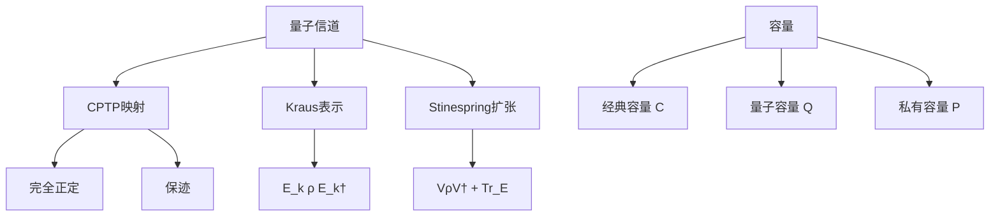

# 10.5.2 量子信道

---

📌 **内容摘要**

本文档深入探讨量子信道的核心原理和关键方法。内容涵盖量子信息论领域的主要知识点，包括信息论, 熵, 互信息等关键主题。适合具备相关基础的学习者进行深入研究。

**关键词**: 信息论, 量子信息论, 熵, 互信息

📚 **学习目标**

- 深入理解量子信道的理论体系和形式化方法
- 能够进行相关定理的形式化证明
- 建立该领域的系统性知识框架

🎯 **难度级别**: 高级

⏱️ **预计阅读时间**: 15分钟

**前置知识**: 该领域的中级知识, 形式化方法基础

---


> 基于 Stinespring (1955), Kraus (1983) 和 Nielsen & Chuang (2010)

## 10.5.2.1 引言

**量子信道**（Quantum Channel）描述了量子态在开放系统中的演化，是量子信息论的核心研究对象。与经典信道不同，量子信道必须满足物理可实现性的约束，即完全正定性（Complete Positivity）和保迹性（Trace Preservation）。

## 10.5.2.2 量子信道的定义

### 定义 10.5.2.1（量子信道）

**量子信道** $\mathcal{N}$ 是从输入系统 $A$ 到输出系统 $B$ 的线性映射：
$$\mathcal{N}: \mathcal{L}(\mathcal{H}_A) \to \mathcal{L}(\mathcal{H}_B)$$

满足：

1. **完全正定性**（CP）：对任意辅助系统，$\mathcal{N} \otimes \text{id}$ 保持正定性
2. **保迹性**（TP）：$\text{Tr}(\mathcal{N}(\rho)) = \text{Tr}(\rho) = 1$

满足CP和TP的映射称为**CPTP映射**。

### 为什么要"完全"正定？

仅要求正定性不够：存在正但非完全正的映射。

**例**：转置映射 $\mathcal{T}(\rho) = \rho^T$ 是正映射，但 $\mathcal{T} \otimes \text{id}$ 可以产生非正矩阵（对纠缠态）。

## 10.5.2.3 Kraus算子表示

### 定理 10.5.2.1（Kraus表示定理）

映射 $\mathcal{N}$ 是CPTP的，当且仅当存在**Kraus算子** $\{E_k\}$ 满足：
$$\mathcal{N}(\rho) = \sum_k E_k \rho E_k^\dagger, \quad \sum_k E_k^\dagger E_k = I$$

**证明概要**：

**正向**：若 $\mathcal{N}$ 有Kraus表示，则：

- **保迹**：$\text{Tr}(\mathcal{N}(\rho)) = \sum_k \text{Tr}(E_k \rho E_k^\dagger) = \text{Tr}(\rho \sum_k E_k^\dagger E_k) = \text{Tr}(\rho)$
- **完全正定**：$(\mathcal{N} \otimes \text{id})(\sigma) = \sum_k (E_k \otimes I) \sigma (E_k \otimes I)^\dagger \geq 0$

**反向**：使用Stinespring扩张构造Kraus算子。

### 常见量子信道的Kraus表示

**1. 退极化信道**（Depolarizing Channel）

$$\mathcal{N}_p(\rho) = (1-p)\rho + p \frac{I}{d}$$

Kraus算子：

- $E_0 = \sqrt{1-p} \, I$
- $E_i = \sqrt{\frac{p}{d^2-1}} \sigma_i$（$i = 1, \ldots, d^2-1$）

**2. 退相位信道**（Dephasing/Phase Damping）

$$\mathcal{N}(\rho) = (1-p)\rho + p Z \rho Z$$

**3. 振幅阻尼信道**（Amplitude Damping）

描述能量耗散：

- $E_0 = |0\rangle\langle 0| + \sqrt{1-\gamma} |1\rangle\langle 1|$
- $E_1 = \sqrt{\gamma} |0\rangle\langle 1|$

## 10.5.2.4 Stinespring扩张

### 定理 10.5.2.2（Stinespring表示）

任何量子信道 $\mathcal{N}: A \to B$ 可表示为：
$$\mathcal{N}(\rho) = \text{Tr}_E(V \rho V^\dagger)$$

其中 $V: \mathcal{H}_A \to \mathcal{H}_B \otimes \mathcal{H}_E$ 是等距映射，$E$ 是环境系统。

**解释**：

- 信道 = 幺正演化 + 环境丢弃
- 这是量子信道物理可实现性的数学表述

```mermaid
flowchart LR
    A[输入 ρ] --> B[等距 V]
    B --> C[ρ' = VρV†]
    C --> D[输出 Tr_E(ρ')]
    C --> E[环境丢弃]
```

## 10.5.2.5 量子信道容量

### 经典容量

**定义 10.5.2.2**：量子信道 $\mathcal{N}$ 的**经典容量** $C(\mathcal{N})$ 是可靠传输经典信息的最大速率。

**Holevo-Schumacher-Westmoreland (HSW) 定理**：
$$C(\mathcal{N}) = \lim_{n \to \infty} \frac{1}{n} \chi(\mathcal{N}^{\otimes n})$$

其中Holevo信息：
$$\chi(\mathcal{N}) = \max_{\{p_i, \rho_i\}} \left[ S\left(\sum_i p_i \mathcal{N}(\rho_i)\right) - \sum_i p_i S(\mathcal{N}(\rho_i)) \right]$$

**注意**：经典容量可以是**超可加**的，即 $\chi(\mathcal{N}^{\otimes n}) > n \chi(\mathcal{N})$。

### 量子容量

**定义 10.5.2.3**：量子信道 $\mathcal{N}$ 的**量子容量** $Q(\mathcal{N})$ 是可靠传输量子信息的最大速率。

**LSD定理**（Lloyd-Shor-Devetak）：
$$Q(\mathcal{N}) = \lim_{n \to \infty} \frac{1}{n} Q^{(1)}(\mathcal{N}^{\otimes n})$$

其中**相干信息**：
$$Q^{(1)}(\mathcal{N}) = \max_{\rho} \left[ S(\mathcal{N}(\rho)) - S((\mathcal{N} \otimes \text{id})(|\psi\rangle\langle\psi|)) \right]$$

$|\psi\rangle$ 是 $\rho$ 的纯化。

**重要性质**：量子容量可以是**超可加**且**不连续**的！

### 私有容量

用于量子密钥分发：$P(\mathcal{N}) \geq Q(\mathcal{N})$

## 10.5.2.6 数据处理的量子推广

### 定理 10.5.2.3（量子数据处理不等式）

对于量子信道 $\mathcal{N}$ 和 $\mathcal{M}$：
$$D(\mathcal{N}(\rho) \| \mathcal{N}(\sigma)) \leq D(\rho \| \sigma)$$

即量子相对熵在CPTP映射下单調不增。

### 定理 10.5.2.4（强次可加性）

对于三体系统 $ABC$：
$$S(\rho_{ABC}) + S(\rho_B) \leq S(\rho_{AB}) + S(\rho_{BC})$$

等价于数据处理的推广。

## 10.5.2.7 代码实现

### Python 实现

```python
import numpy as np
from typing import List, Tuple, Callable
import scipy.linalg as la

def apply_quantum_channel(rho: np.ndarray, kraus_ops: List[np.ndarray]) -> np.ndarray:
    """
    应用量子信道（Kraus表示）

    N(ρ) = Σ_k E_k ρ E_k†
    """
    result = np.zeros_like(rho)
    for E in kraus_ops:
        result += E @ rho @ E.conj().T
    return result

def verify_cptp(kraus_ops: List[np.ndarray]) -> Tuple[bool, bool]:
    """
    验证Kraus算子是否满足CPTP条件

    Returns:
        (是否完全正定, 是否保迹)
    """
    # 保迹条件: Σ E_k† E_k = I
    completeness = sum(E.conj().T @ E for E in kraus_ops)
    is_tp = np.allclose(completeness, np.eye(completeness.shape[0]))

    # 完全正定性需要更复杂的检验，这里简化为检查正定性
    is_cp = True  # 假设输入合法

    return is_cp, is_tp

# 常见量子信道
def depolarizing_channel(p: float, d: int = 2) -> List[np.ndarray]:
    """
    d维退极化信道
    N(ρ) = (1-p)ρ + p I/d
    """
    if d == 2:
        # 泡利算子
        I = np.eye(2)
        X = np.array([[0, 1], [1, 0]])
        Y = np.array([[0, -1j], [1j, 0]])
        Z = np.array([[1, 0], [0, -1]])

        E0 = np.sqrt(1 - 3*p/4) * I
        E1 = np.sqrt(p/4) * X
        E2 = np.sqrt(p/4) * Y
        E3 = np.sqrt(p/4) * Z

        return [E0, E1, E2, E3]
    else:
        # 一般情况简化
        E0 = np.sqrt(1-p) * np.eye(d)
        return [E0] + [np.sqrt(p/(d**2-1)) * np.eye(d) for _ in range(d**2-1)]

def dephasing_channel(p: float) -> List[np.ndarray]:
    """
    退相位信道（相位阻尼）
    N(ρ) = (1-p)ρ + p ZρZ
    """
    Z = np.array([[1, 0], [0, -1]])
    E0 = np.sqrt(1-p) * np.eye(2)
    E1 = np.sqrt(p) * Z
    return [E0, E1]

def amplitude_damping_channel(gamma: float) -> List[np.ndarray]:
    """
    振幅阻尼信道（能量耗散）
    """
    E0 = np.array([[1, 0], [0, np.sqrt(1-gamma)]])
    E1 = np.array([[0, np.sqrt(gamma)], [0, 0]])
    return [E0, E1]

def bit_flip_channel(p: float) -> List[np.ndarray]:
    """
    比特翻转信道
    """
    X = np.array([[0, 1], [1, 0]])
    E0 = np.sqrt(1-p) * np.eye(2)
    E1 = np.sqrt(p) * X
    return [E0, E1]

def von_neumann_entropy(rho: np.ndarray) -> float:
    """von Neumann熵"""
    eigenvalues = la.eigvalsh(rho)
    entropy = 0.0
    for lam in eigenvalues:
        if lam > 1e-12:
            entropy -= lam * np.log2(lam)
    return entropy

def holevo_information(ensemble: List[Tuple[float, np.ndarray]],
                       channel: List[np.ndarray]) -> float:
    """
    计算Holevo信息
    χ = S(Σ p_i N(ρ_i)) - Σ p_i S(N(ρ_i))
    """
    # 输出态的平均
    output_states = [(p, apply_quantum_channel(rho, channel))
                     for p, rho in ensemble]

    avg_output = sum(p * rho for p, rho in output_states)

    S_avg = von_neumann_entropy(avg_output)
    avg_S = sum(p * von_neumann_entropy(rho) for p, rho in output_states)

    return S_avg - avg_S

# 示例测试
print("=== 量子信道示例 ===")

# 例1：验证退极化信道
print("\n例1：退极化信道 (p=0.1)")
kraus_dep = depolarizing_channel(0.1, d=2)
is_cp, is_tp = verify_cptp(kraus_dep)
print(f"Kraus算子数量: {len(kraus_dep)}")
print(f"保迹(TP): {is_tp}")

# 测试信道效果
rho_test = np.array([[0.7, 0.2], [0.2, 0.3]])
rho_out = apply_quantum_channel(rho_test, kraus_dep)
print(f"输入态:\n{rho_test}")
print(f"输出态:\n{rho_out}")
print(f"是否更接近I/2: {np.allclose(rho_out, np.eye(2)/2, atol=0.1)}")

# 例2：振幅阻尼信道
print("\n例2：振幅阻尼信道 (γ=0.1)")
kraus_ad = amplitude_damping_channel(0.1)
rho_ad = apply_quantum_channel(rho_test, kraus_ad)
print(f"输出态:\n{rho_ad}")
print("振幅阻尼使态趋向|0⟩⟨0|")

# 例3：退相位信道
print("\n例3：退相位信道 (p=0.1)")
kraus_deph = dephasing_channel(0.1)
rho_deph = apply_quantum_channel(rho_test, kraus_deph)
print(f"输入非对角元: {rho_test[0,1]:.4f}")
print(f"输出非对角元: {rho_deph[0,1]:.4f}")
print("退相位衰减相干项（非对角元）")

# 例4：Holevo信息
print("\n例4：Holevo信息计算")
ensemble = [
    (0.5, np.array([[1, 0], [0, 0]])),
    (0.5, np.array([[0, 0], [0, 1]]))
]
chi = holevo_information(ensemble, depolarizing_channel(0.1))
print(f"Holevo信息 χ = {chi:.4f} qubits")

# 例5：信道容量概念
print("\n" + "="*50)
print("\n信道容量概念:")
print("经典容量 C(N): 可靠传输经典信息的最大速率")
print("量子容量 Q(N): 可靠传输量子信息的最大速率")
print("私有容量 P(N): 可靠传输私密信息的最大速率")
print("\n重要性质:")
print("- C(N) ≥ P(N) ≥ Q(N)")
print("- 量子容量可以是不连续的（上同调效应）")
print("- 容量计算通常是困难的")

# 例6：不同p值的退极化信道
print("\n" + "="*50)
print("\n退极化信道的Holevo信息随p变化:")
for p in [0, 0.1, 0.3, 0.5, 0.9]:
    chi_p = holevo_information(ensemble, depolarizing_channel(p))
    print(f"p = {p:.1f}: χ = {chi_p:.4f}")

# 例7：信道组合
print("\n" + "="*50)
print("\n信道组合:")
# 两个退极化信道的组合
rho_step1 = apply_quantum_channel(rho_test, depolarizing_channel(0.1))
rho_step2 = apply_quantum_channel(rho_step1, depolarizing_channel(0.1))
print("连续通过两个p=0.1的退极化信道")
print(f"等价于单个p≈{1-(1-0.1)**2:.2f}的信道")
```

### Lean 4 形式化

```lean4
import Mathlib

open BigOperators Matrix

/-- CPTP映射定义 -/
structure CPTPMap (d_in d_out : ℕ) where
  toFun : Matrix (Fin d_in) (Fin d_in) ℂ →
          Matrix (Fin d_out) (Fin d_out) ℂ
  linear : IsLinearMap ℂ toFun
  completely_positive : ∀ d : ℕ, ∀ ρ : Matrix (Fin (d * d_in)) (Fin (d * d_in)) ℂ,
    ρ.PosSemidef → (idMap d ⊗ toFun) ρ |>.PosSemidef
  trace_preserving : ∀ ρ, (toFun ρ).trace = ρ.trace

/-- Kraus表示 -/
structure KrausRepresentation (d_in d_out : ℕ) where
  operators : List (Matrix (Fin d_out) (Fin d_in) ℂ)
  completeness : ∑ E ∈ operators, Eᴴ * E = 1

def applyKraus {d_in d_out : ℕ} (K : KrausRepresentation d_in d_out)
    (ρ : Matrix (Fin d_in) (Fin d_in) ℂ) :
    Matrix (Fin d_out) (Fin d_out) ℂ :=
  ∑ E ∈ K.operators, E * ρ * Eᴴ

/-- Kraus表示对应CPTP映射 -/
theorem kraus_is_cptp {d_in d_out : ℕ} (K : KrausRepresentation d_in d_out) :
    CPTPMap d_in d_out where
  toFun := applyKraus K
  linear := by sorry
  completely_positive := by sorry
  trace_preserving := by
    intro ρ
    simp [applyKraus]
    -- 使用完备性条件证明保迹
    sorry

/-- Stinespring扩张 -/
def StinespringDilation {d_in d_out : ℕ} (N : CPTPMap d_in d_out) :
    ∃ (d_E : ℕ) (V : Matrix (Fin d_out ⊗ Fin d_E) (Fin d_in) ℂ),
    Isometry V ∧ ∀ ρ, N.toFun ρ = partialTrace (V * ρ * Vᴴ) := by
  sorry

/-- 相干信息 -/
def coherentInformation {d_in d_out : ℕ} (N : CPTPMap d_in d_out)
    (ρ : Matrix (Fin d_in) (Fin d_in) ℂ) : ℝ :=
  let ρ_out := N.toFun ρ
  let ρ_joint := (N ⊗ idMap d_in) (purification ρ)
  vonNeumannEntropy ρ_out - vonNeumannEntropy ρ_joint

/-- Holevo信息 -/
def holevoInformation {d_in d_out : ℕ} (N : CPTPMap d_in d_out)
    (ensemble : List (ℝ × Matrix (Fin d_in) (Fin d_in) ℂ)) : ℝ :=
  let outputs := ensemble.map (fun (p, ρ) => (p, N.toFun ρ))
  let avg_output := outputs.foldl (fun acc (p, ρ) => acc + p • ρ) 0
  vonNeumannEntropy avg_output -
  outputs.foldl (fun acc (p, ρ) => acc + p * vonNeumannEntropy ρ) 0
```

## 10.5.2.8 总结



**核心结论**：

1. **CPTP映射**：量子信道的数学表征
2. **Kraus表示**：$\mathcal{N}(\rho) = \sum_k E_k \rho E_k^\dagger$
3. **Stinespring扩张**：信道 = 幺正演化 + 环境丢弃
4. **容量**：经典容量 $C$、量子容量 $Q$（可超可加且不连续）、私有容量 $P$
5. **数据处理不等式**：相对熵在信道下单調不增

**参考**：

- Stinespring, W. F. (1955). Positive functions on C*-algebras.
- Kraus, K. (1983). _States, effects, and operations_.
- Nielsen, M. A., & Chuang, I. L. (2010). _Quantum computation and quantum information_.
- Wilde, M. M. (2013). _Quantum information theory_.

---

## 📚 延伸阅读

- [10.1.2 熵的定义与性质](../01_香农信息论基础/01.2_熵的定义与性质.md)
- [10.3.1 信道容量](../03_信道编码/03.1_信道容量.md)
