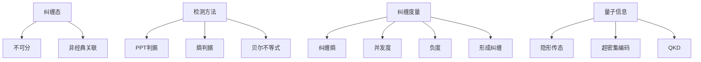

# 10.5.3 量子纠缠与信息

---

📌 **内容摘要**

本文档深入探讨量子纠缠与信息的核心原理和关键方法。内容涵盖量子信息论领域的主要知识点，包括信息论, 熵, 互信息等关键主题。适合具备相关基础的学习者进行深入研究。

**关键词**: 信息论, 量子信息论, 熵, 互信息

📚 **学习目标**

- 深入理解量子纠缠与信息的理论体系和形式化方法
- 能够进行相关定理的形式化证明
- 建立该领域的系统性知识框架

🎯 **难度级别**: 高级

⏱️ **预计阅读时间**: 15分钟

**前置知识**: 该领域的中级知识, 形式化方法基础

---


> 基于 Einstein-Podolsky-Rosen (1935), Bell (1964), Vedral et al. (1997) 和 Horodecki et al. (2009)

## 10.5.3.1 引言

**量子纠缠**（Quantum Entanglement）是量子力学最独特的性质之一，也是量子信息处理的核心资源。纠缠态展现出非经典的关联，在量子通信、量子计算和量子密码学中具有不可替代的作用。本节介绍纠缠的形式化定义、度量方法及其在量子信息论中的地位。

## 10.5.3.2 纠缠的形式化定义

### 可分态与纠缠态

**定义 10.5.3.1（可分态）**：

对于复合系统 $AB$，若密度算子 $\rho_{AB}$ 可表示为：
$$\rho_{AB} = \sum_i p_i \rho_A^i \otimes \rho_B^i, \quad p_i \geq 0, \sum_i p_i = 1$$

则称 $\rho_{AB}$ 是**可分**的（Separable）。

**定义 10.5.3.2（纠缠态）**：

不可分的态称为**纠缠态**（Entangled State）。

**纯态特例**：

- 纯态 $|\psi\rangle_{AB}$ 可分 $\Leftrightarrow$ $|\psi\rangle_{AB} = |\phi\rangle_A \otimes |\chi\rangle_B$（乘积态）
- 否则为纠缠纯态

### 纠缠的典型例子

**贝尔态**（最大纠缠态）：
$$|\Phi^+\rangle = \frac{1}{\sqrt{2}}(|00\rangle + |11\rangle)$$

**性质**：

- 纯态，故纠缠
- 对任意局域测量，结果完全关联
- 违反贝尔不等式

## 10.5.3.3 纠缠的检测

### 正部分转置（PPT）判据

**定义 10.5.3.3（部分转置）**：

对于 $\rho_{AB}$，关于系统 $B$ 的**部分转置**记为 $\rho_{AB}^{T_B}$。

**定理 10.5.3.1（PPT判据）**：

若 $\rho_{AB}$ 可分，则 $\rho_{AB}^{T_B} \geq 0$（正定）。

**逆否**：若 $\rho_{AB}^{T_B}$ 有负特征值，则 $\rho_{AB}$ 纠缠。

**注**：对于 $2 \otimes 2$ 和 $2 \otimes 3$ 系统，PPT判据是**充要条件**。

### 约化密度矩阵判据

**定理 10.5.3.2**：

若纯态 $|\psi\rangle_{AB}$ 的约化密度矩阵 $S(\rho_A) > 0$，则 $|\psi\rangle_{AB}$ 纠缠。

**等价**：纯态纠缠 $\Leftrightarrow$ 约化态是混合的。

### 熵判据

**定理 10.5.3.3**：

- 可分态满足 $S(A|B) \geq 0$
- 若 $S(A|B) < 0$，则态纠缠

## 10.5.3.4 纠缠度量

### 纠缠熵（纯态）

**定义 10.5.3.4**：

对于纯态 $|\psi\rangle_{AB}$，**纠缠熵**为：
$$E(|\psi\rangle_{AB}) = S(\rho_A) = S(\rho_B)$$

**性质**：

- $E = 0$ $\Leftrightarrow$ 乘积态
- $E = \log d$ $\Leftrightarrow$ 最大纠缠态

### 形成纠缠（Entanglement of Formation）

**定义 10.5.3.5**：

$$E_F(\rho_{AB}) = \min_{\{p_i, |\psi_i\rangle\}} \sum_i p_i E(|\psi_i\rangle)$$

其中最小化取遍所有纯态分解 $\rho_{AB} = \sum_i p_i |\psi_i\rangle\langle\psi_i|$。

**对于两量子比特**：

$$E_F(\rho) = h\left(\frac{1 + \sqrt{1 - C^2}}{2}\right)$$

其中 $h(x) = -x\log x - (1-x)\log(1-x)$，$C$ 为**并发度**（Concurrence）。

### 并发度（Concurrence）

**定义 10.5.3.6（两量子比特）**：

$$C(\rho) = \max\{0, \lambda_1 - \lambda_2 - \lambda_3 - \lambda_4\}$$

其中 $\lambda_i$ 是矩阵 $\sqrt{\sqrt{\rho} \tilde{\rho} \sqrt{\rho}}$ 的特征值（降序），$\tilde{\rho} = (\sigma_y \otimes \sigma_y) \rho^* (\sigma_y \otimes \sigma_y)$。

### distillable纠缠

**定义 10.5.3.7**：

**Distillable纠缠** $E_D(\rho)$ 是从 $\rho$ 中提取贝尔态的最大速率。

**性质**：$E_D(\rho) \leq E_F(\rho)$（渐近不可逆！）

### 纠缠负度（Negativity）

**定义 10.5.3.8**：

$$\mathcal{N}(\rho) = \frac{\|\rho^{T_B}\|_1 - 1}{2} = \sum_{\lambda_i < 0} |\lambda_i|$$

即部分转置矩阵负特征值的绝对值之和。

**优点**：易于计算，适用于任意维度。

## 10.5.3.5 纠缠与量子信息任务

### 量子隐形传态

**协议**：

1. Alice和Bob共享贝尔态 $|\Phi^+\rangle$
2. Alice对她持有的未知态和贝尔态的一半进行贝尔测量
3. Alice将测量结果（2比特）发送给Bob
4. Bob根据结果应用相应的泡利操作，恢复未知态

**资源消耗**：1个贝尔态 + 2比特经典通信 $\to$ 传输1个量子比特

```mermaid
flowchart LR
    A[未知态|ψ⟩] --> B[Alice]
    C[|Φ+⟩] --> B
    C --> D[Bob]
    B -->|2 bits| D
    D --> E[恢复|ψ⟩]
```

### 超密集编码

**协议**：

1. Alice和Bob共享贝尔态
2. Alice根据要发送的2比特信息，对她的粒子应用相应操作
3. Alice发送她的粒子给Bob
4. Bob进行贝尔测量，恢复2比特信息

**资源消耗**：1个贝尔态 + 传输1个量子比特 $\to$ 传输2比特经典信息

### 纠缠与信道容量

**定理 10.5.3.4（纠缠辅助容量）**：

纠缠可以辅助经典通信：
$$C_E(\mathcal{N}) \geq C(\mathcal{N})$$

在某些情况下，纠缠可以显著提高信道容量。

## 10.5.3.6 代码实现

### Python 实现

```python
import numpy as np
from typing import Tuple, List
import scipy.linalg as la

# 泡利矩阵
sigma_x = np.array([[0, 1], [1, 0]])
sigma_y = np.array([[0, -1j], [1j, 0]])
sigma_z = np.array([[1, 0], [0, -1]])

def partial_transpose(rho: np.ndarray, dim_A: int, dim_B: int,
                      transpose_system: str = 'B') -> np.ndarray:
    """
    计算部分转置
    """
    # 重塑为四维张量
    rho_tensor = rho.reshape(dim_A, dim_B, dim_A, dim_B)

    if transpose_system == 'B':
        # 对B转置: rho_{ij,kl} -> rho_{ij,lk}
        rho_pt = np.transpose(rho_tensor, (0, 3, 2, 1))
    else:
        # 对A转置: rho_{ij,kl} -> rho_{ji,kl}
        rho_pt = np.transpose(rho_tensor, (2, 1, 0, 3))

    return rho_pt.reshape(dim_A * dim_B, dim_A * dim_B)

def negativity(rho: np.ndarray, dim_A: int, dim_B: int) -> float:
    """
    计算纠缠负度
    N = (||ρ^T_B||_1 - 1) / 2
    """
    rho_pt = partial_transpose(rho, dim_A, dim_B, 'B')
    eigenvalues = la.eigvalsh(rho_pt)
    # 负特征值的绝对值之和
    return sum(abs(ev) for ev in eigenvalues if ev < -1e-10)

def is_ppt(rho: np.ndarray, dim_A: int, dim_B: int) -> bool:
    """
    PPT判据：若ρ^T_B有负特征值，则纠缠
    """
    rho_pt = partial_transpose(rho, dim_A, dim_B, 'B')
    eigenvalues = la.eigvalsh(rho_pt)
    return all(ev >= -1e-10 for ev in eigenvalues)

def concurrence(rho: np.ndarray) -> float:
    """
    计算两量子比特态的并发度
    """
    if rho.shape != (4, 4):
        raise ValueError("Concurrence仅适用于两量子比特系统")

    # 构造 ρ̃ = (σ_y ⊗ σ_y) ρ* (σ_y ⊗ σ_y)
    sigma_y_y = np.kron(sigma_y, sigma_y)
    rho_tilde = sigma_y_y @ rho.conj() @ sigma_y_y

    # 计算 sqrt(sqrt(ρ) ρ̃ sqrt(ρ))
    sqrt_rho = la.sqrtm(rho)
    R = sqrt_rho @ rho_tilde @ sqrt_rho
    R = la.sqrtm(R)

    # 特征值（降序）
    eigenvalues = sorted(la.eigvalsh(R), reverse=True)

    C = max(0, eigenvalues[0] - eigenvalues[1] -
            eigenvalues[2] - eigenvalues[3])
    return np.real(C)

def entanglement_of_formation(rho: np.ndarray) -> float:
    """
    计算两量子比特态的形成纠缠
    """
    C = concurrence(rho)

    # 处理边界情况
    if C < 1e-10:
        return 0.0
    if C > 1 - 1e-10:
        return 1.0

    # E_F = h((1 + sqrt(1-C^2))/2)
    x = (1 + np.sqrt(1 - C**2)) / 2

    # 二元熵 h(x) = -x log x - (1-x) log (1-x)
    def binary_entropy(p):
        if p <= 0 or p >= 1:
            return 0
        return -(p * np.log2(p) + (1-p) * np.log2(1-p))

    return binary_entropy(x)

def von_neumann_entropy(rho: np.ndarray) -> float:
    """von Neumann熵"""
    eigenvalues = la.eigvalsh(rho)
    entropy = 0.0
    for lam in eigenvalues:
        if lam > 1e-12:
            entropy -= lam * np.log2(lam)
    return entropy

def partial_trace(rho: np.ndarray, dim_A: int, dim_B: int,
                  trace_system: str = 'B') -> np.ndarray:
    """计算偏迹"""
    rho_tensor = rho.reshape(dim_A, dim_B, dim_A, dim_B)

    if trace_system == 'B':
        reduced = np.trace(rho_tensor, axis1=1, axis2=3)
    else:
        reduced = np.trace(rho_tensor, axis1=0, axis2=2)

    return reduced

# 创建纠缠态
def bell_state(state_type: str = 'phi_plus') -> np.ndarray:
    """创建贝尔态密度矩阵"""
    if state_type == 'phi_plus':
        psi = np.array([1, 0, 0, 1]) / np.sqrt(2)
    elif state_type == 'phi_minus':
        psi = np.array([1, 0, 0, -1]) / np.sqrt(2)
    elif state_type == 'psi_plus':
        psi = np.array([0, 1, 1, 0]) / np.sqrt(2)
    elif state_type == 'psi_minus':
        psi = np.array([0, 1, -1, 0]) / np.sqrt(2)
    else:
        raise ValueError(f"Unknown Bell state: {state_type}")

    return np.outer(psi, psi.conj())

def werner_state(p: float) -> np.ndarray:
    """
    Werner态：ρ = p |Φ+⟩⟨Φ+| + (1-p) I/4
    p > 1/3 时纠缠
    """
    phi_plus = bell_state('phi_plus')
    I_4 = np.eye(4) / 4
    return p * phi_plus + (1 - p) * I_4

# 示例测试
print("=== 量子纠缠分析 ===")

# 例1：贝尔态
print("\n例1：贝尔态 |Φ+⟩")
phi_plus = bell_state('phi_plus')
print(f"PPT判据（可分=是）: {is_ppt(phi_plus, 2, 2)}")
print(f"负度: {negativity(phi_plus, 2, 2):.6f}")
print(f"并发度: {concurrence(phi_plus):.6f}")
print(f"形成纠缠: {entanglement_of_formation(phi_plus):.6f}")

rho_A = partial_trace(phi_plus, 2, 2, 'B')
print(f"约化熵 S(ρ_A): {von_neumann_entropy(rho_A):.6f} (最大纠缠)")

# 例2：乘积态
print("\n例2：乘积态 |0⟩⊗|0⟩")
product_state = np.kron(np.array([[1, 0], [0, 0]]), np.array([[1, 0], [0, 0]]))
print(f"PPT判据: {is_ppt(product_state, 2, 2)}")
print(f"负度: {negativity(product_state, 2, 2):.6f}")
print(f"并发度: {concurrence(product_state):.6f}")

rho_A_prod = partial_trace(product_state, 2, 2, 'B')
print(f"约化熵 S(ρ_A): {von_neumann_entropy(rho_A_prod):.6f} (纯态，无纠缠)")

# 例3：Werner态
print("\n例3：Werner态分析")
print("ρ = p|Φ+⟩⟨Φ+| + (1-p)I/4")
print("理论：p > 1/3 时纠缠")
print(f"\n{'p':<8} {'PPT':<8} {'负度':<12} {'并发度':<12} {'E_F':<12}")
print("-" * 60)

for p in [0, 0.2, 0.33, 0.4, 0.5, 1.0]:
    rho_w = werner_state(p)
    ppt = is_ppt(rho_w, 2, 2)
    neg = negativity(rho_w, 2, 2)
    conc = concurrence(rho_w)
    ef = entanglement_of_formation(rho_w)
    ppt_str = "是" if ppt else "否（纠缠）"
    print(f"{p:<8.2f} {ppt_str:<8} {neg:<12.6f} {conc:<12.6f} {ef:<12.6f}")

# 例4：不同纠缠度量的比较
print("\n" + "="*50)
print("\n不同贝尔态的比较:")
for state_name in ['phi_plus', 'phi_minus', 'psi_plus', 'psi_minus']:
    bell = bell_state(state_name)
    neg = negativity(bell, 2, 2)
    conc = concurrence(bell)
    ef = entanglement_of_formation(bell)

    print(f"\n|{state_name.replace('_', '')}⟩:")
    print(f"  负度: {neg:.4f}")
    print(f"  并发度: {conc:.4f}")
    print(f"  形成纠缠: {ef:.4f}")

# 例5：纠缠与信息论
print("\n" + "="*50)
print("\n纠缠与量子信息任务:")
print("1. 量子隐形传态: 1 ebit + 2 cbits → 传输1 qubit")
print("2. 超密集编码: 1 ebit + 1 qubit → 传输2 cbits")
print("3. 量子密钥分发: 纠缠辅助提高安全性")
print("4. 量子计算: 纠缠是量子加速的资源")

# 例6：纠缠与负条件熵
print("\n" + "="*50)
print("\n纠缠与负条件熵:")

S_AB = von_neumann_entropy(phi_plus)
S_A = von_neumann_entropy(partial_trace(phi_plus, 2, 2, 'B'))
S_cond = S_AB - S_A

print(f"|Φ+⟩:")
print(f"  S(ρ_AB) = {S_AB:.4f}")
print(f"  S(ρ_A) = {S_A:.4f}")
print(f"  S(A|B) = {S_cond:.4f}")
print(f"  负的条件熵是纠缠的标志!")
```

### Lean 4 形式化

```lean4
import Mathlib

open BigOperators Matrix

/-- 可分态定义 -/
def Separable {d_A d_B : ℕ} (ρ : Matrix (Fin (d_A * d_B)) (Fin (d_A * d_B)) ℂ) :
    Prop :=
  ∃ (n : ℕ) (p : Fin n → ℝ) (ρ_A : Fin n → DensityOperator d_A)
    (ρ_B : Fin n → DensityOperator d_B),
    (∀ i, 0 ≤ p i) ∧ (∑ i, p i = 1) ∧
    ρ = ∑ i, p i • (ρ_A i).matrix ⊗ (ρ_B i).matrix

/-- 纠缠态定义 -/
def Entangled {d_A d_B : ℕ}
    (ρ : Matrix (Fin (d_A * d_B)) (Fin (d_A * d_B)) ℂ) : Prop :=
  ¬Separable ρ

/-- PPT判据 -/
def PPT {d_A d_B : ℕ}
    (ρ : Matrix (Fin (d_A * d_B)) (Fin (d_A * d_B)) ℂ) : Prop :=
  let ρ_pt := partialTranspose ρ d_B
  ρ_pt.PosSemidef

/-- PPT是纠缠的必要条件 -/
theorem ppt_necessary_for_separable {d_A d_B : ℕ}
    (ρ : Matrix (Fin (d_A * d_B)) (Fin (d_A * d_B)) ℂ) :
    Separable ρ → PPT ρ := by
  -- 证明可分态满足PPT
  sorry

/-- 对于2⊗2和2⊗3系统，PPT是充分条件 -/
theorem ppt_sufficient_for_low_dim {d_A d_B : ℕ}
    (ρ : Matrix (Fin (d_A * d_B)) (Fin (d_A * d_B)) ℂ)
    (h_dim : (d_A = 2 ∧ d_B = 2) ∨ (d_A = 2 ∧ d_B = 3)) :
    PPT ρ ↔ Separable ρ := by
  -- 使用Horodecki定理
  sorry

/-- 纠缠负度 -/
def entanglementNegativity {d_A d_B : ℕ}
    (ρ : DensityOperator (d_A * d_B)) : ℝ :=
  let ρ_pt := partialTranspose ρ.matrix d_B
  let eigenvalues := ρ_pt.eigenvalues
  ∑ i, if eigenvalues i < 0 then -eigenvalues i else 0

/-- 纯态纠缠熵 -/
def entanglementEntropyPure {d_A d_B : ℕ}
    (ψ : Vector (d_A * d_B) ℂ) (h_norm : ‖ψ‖ = 1) : ℝ :=
  let ρ_AB := pureState ψ
  let ρ_A := partialTrace ρ_AB d_B
  vonNeumannEntropy ρ_A

/-- 并发度（两量子比特）-/
def concurrence {d : ℕ} (ρ : DensityOperator (d * d)) : ℝ :=
  if d = 2 then
    let sigma_yy := Matrix.kron σY σY
    let rho_tilde := sigma_yy * ρ.matrix.conj * sigma_yy
    let R := Matrix.sqrt (Matrix.sqrt ρ.matrix * rho_tilde * Matrix.sqrt ρ.matrix)
    let eigenvalues := R.eigenvalues.sort (. ≥ .)
    max 0 (eigenvalues 0 - eigenvalues 1 - eigenvalues 2 - eigenvalues 3)
  else
    0  -- 仅定义在2⊗2系统

/-- 形成纠缠（两量子比特）-/
def entanglementOfFormation {d : ℕ} (ρ : DensityOperator (d * d)) : ℝ :=
  if d = 2 then
    let C := concurrence ρ
    binaryEntropy ((1 + Real.sqrt (1 - C^2)) / 2)
  else
    0
```

## 10.5.3.7 总结



**核心结论**：

1. **定义**：纠缠态 = 不可分态（不能表示为混合的乘积态）
2. **检测**：PPT判据（$2\otimes2$和$2\otimes3$系统充要）、熵判据
3. **度量**：纠缠熵（纯态）、并发度、负度、形成纠缠、distillable纠缠
4. **资源**：纠缠是量子信息处理的宝贵资源
5. **应用**：隐形传态、超密集编码、量子密钥分发、量子计算

**参考**：

- Einstein, A., Podolsky, B., & Rosen, N. (1935). Can quantum-mechanical description of physical reality be considered complete?
- Bell, J. S. (1964). On the Einstein Podolsky Rosen paradox.
- Vedral, V., et al. (1997). Quantifying entanglement.
- Horodecki, R., et al. (2009). Quantum entanglement.
- Nielsen, M. A., & Chuang, I. L. (2010). _Quantum computation and quantum information_.

---

## 📚 延伸阅读

- [10.1.2 熵的定义与性质](../01_香农信息论基础/01.2_熵的定义与性质.md)
- [10.3.1 信道容量](../03_信道编码/03.1_信道容量.md)
