# AI计算综合框架

## 目录

1. [AI计算概述](#1-ai计算概述)
2. [机器学习理论](#2-机器学习理论)
3. [深度学习理论](#3-深度学习理论)
4. [知识表示与推理](#4-知识表示与推理)
5. [神经网络理论](#5-神经网络理论)
6. [大语言模型理论](#6-大语言模型理论)
7. [量子计算理论](#7-量子计算理论)
8. [认知计算理论](#8-认知计算理论)
9. [AI哲学基础](#9-ai哲学基础)
10. [形式化AI方法](#10-形式化ai方法)

## 1. AI计算概述

### 1.1 AI的本质

人工智能是研究如何使计算机能够执行通常需要人类智能的任务的科学和工程。

**形式化定义**：
$$\text{AI} = \langle \mathcal{M}, \mathcal{L}, \mathcal{R}, \mathcal{O} \rangle$$

其中：

- $\mathcal{M}$ 是模型集合
- $\mathcal{L}$ 是学习算法集合
- $\mathcal{R}$ 是推理机制集合
- $\mathcal{O}$ 是优化目标集合

### 1.2 AI计算层次

```mermaid
graph TB
    A[AI计算] --> B[机器学习]
    A --> C[深度学习]
    A --> D[知识表示]
    A --> E[神经网络]
    A --> F[大语言模型]
    A --> G[量子计算]
    A --> H[认知计算]
    
    B --> I[监督学习]
    B --> J[无监督学习]
    B --> K[强化学习]
    
    C --> L[前馈网络]
    C --> M[循环网络]
    C --> N[卷积网络]
    C --> O[注意力机制]
    
    D --> P[逻辑表示]
    D --> Q[语义网络]
    D --> R[本体论]
    D --> S[知识图谱]
    
    E --> T[感知器]
    E --> U[多层网络]
    E --> V[递归网络]
    E --> W[生成网络]
    
    F --> X[Transformer]
    F --> Y[GPT系列]
    F --> Z[BERT系列]
    F --> AA[多模态模型]
    
    G --> BB[量子比特]
    G --> CC[量子门]
    G --> DD[量子算法]
    G --> EE[量子机器学习]
    
    H --> FF[认知架构]
    H --> GG[心智模型]
    H --> HH[意识理论]
    H --> II[认知增强]
```



### 1.3 AI方法论

#### 1.3.1 符号主义方法

**定义 1.1** (符号主义)
符号主义认为智能可以通过符号操作来实现，基于逻辑推理和知识表示。

#### 1.3.2 连接主义方法

**定义 1.2** (连接主义)
连接主义认为智能可以通过神经网络中的连接权重来实现，基于并行分布式处理。

#### 1.3.3 行为主义方法

**定义 1.3** (行为主义)
行为主义认为智能可以通过与环境的交互来实现，基于强化学习和适应。

## 2. 机器学习理论

### 2.1 学习理论基础

**定义 2.1** (学习问题)
学习问题是一个三元组 $\langle \mathcal{X}, \mathcal{Y}, \mathcal{H} \rangle$，其中：

- $\mathcal{X}$ 是输入空间
- $\mathcal{Y}$ 是输出空间
- $\mathcal{H}$ 是假设空间

**定义 2.2** (经验风险)
给定训练集 $S = \{(x_1, y_1), \ldots, (x_m, y_m)\}$，假设 $h$ 的经验风险是：
$$R_S(h) = \frac{1}{m} \sum_{i=1}^m L(h(x_i), y_i)$$

其中 $L$ 是损失函数。

### 2.2 监督学习

**定义 2.3** (监督学习)
监督学习是从标记的训练数据中学习映射函数 $f: \mathcal{X} \rightarrow \mathcal{Y}$ 的过程。

**定理 2.1** (VC维理论)
对于VC维为 $d$ 的假设空间 $\mathcal{H}$，以概率至少 $1-\delta$，对于所有 $h \in \mathcal{H}$：
$$R(h) \leq R_S(h) + \sqrt{\frac{d \log(2m/d) + \log(1/\delta)}{m}}$$

### 2.3 无监督学习

**定义 2.4** (无监督学习)
无监督学习是从未标记的数据中发现隐藏结构的过程。

**聚类算法**：

- K-means聚类
- 层次聚类
- 密度聚类
- 谱聚类

### 2.4 强化学习

**定义 2.5** (马尔可夫决策过程)
马尔可夫决策过程是一个五元组 $\langle S, A, P, R, \gamma \rangle$，其中：

- $S$ 是状态空间
- $A$ 是动作空间
- $P$ 是转移概率
- $R$ 是奖励函数
- $\gamma$ 是折扣因子

**定义 2.6** (Q学习)
Q学习算法更新Q值：
$$Q(s,a) \leftarrow Q(s,a) + \alpha[r + \gamma \max_{a'} Q(s',a') - Q(s,a)]$$

## 3. 深度学习理论

### 3.1 神经网络基础

**定义 3.1** (人工神经元)
人工神经元的输出是：
$$y = f\left(\sum_{i=1}^n w_i x_i + b\right)$$

其中 $f$ 是激活函数，$w_i$ 是权重，$b$ 是偏置。

**常用激活函数**：

- Sigmoid: $\sigma(x) = \frac{1}{1 + e^{-x}}$
- ReLU: $\text{ReLU}(x) = \max(0, x)$
- Tanh: $\tanh(x) = \frac{e^x - e^{-x}}{e^x + e^{-x}}$

### 3.2 前馈神经网络

**定义 3.2** (前馈神经网络)
前馈神经网络是一个有向无环图，信息从输入层流向输出层。

**反向传播算法**：
$$\delta_j^{(l)} = \sum_k w_{jk}^{(l+1)} \delta_k^{(l+1)} f'(z_j^{(l)})$$
$$\frac{\partial J}{\partial w_{ij}^{(l)}} = a_i^{(l-1)} \delta_j^{(l)}$$

### 3.3 卷积神经网络

**定义 3.3** (卷积操作)
卷积操作定义为：
$$(f * g)(t) = \int_{-\infty}^{\infty} f(\tau) g(t - \tau) d\tau$$

**卷积层**：
$$h_{i,j} = \sum_{m=0}^{k-1} \sum_{n=0}^{k-1} w_{m,n} x_{i+m, j+n} + b$$

### 3.4 循环神经网络

**定义 3.4** (循环神经网络)
RNN的隐藏状态更新为：
$$h_t = f(W_h h_{t-1} + W_x x_t + b_h)$$

**长短期记忆网络(LSTM)**：
$$f_t = \sigma(W_f \cdot [h_{t-1}, x_t] + b_f)$$
$$i_t = \sigma(W_i \cdot [h_{t-1}, x_t] + b_i)$$
$$\tilde{C}_t = \tanh(W_C \cdot [h_{t-1}, x_t] + b_C)$$
$$C_t = f_t * C_{t-1} + i_t * \tilde{C}_t$$
$$o_t = \sigma(W_o \cdot [h_{t-1}, x_t] + b_o)$$
$$h_t = o_t * \tanh(C_t)$$

### 3.5 注意力机制

**定义 3.5** (注意力权重)
注意力权重计算为：
$$\alpha_{ij} = \frac{\exp(e_{ij})}{\sum_{k=1}^T \exp(e_{ik})}$$

其中 $e_{ij} = a(s_{i-1}, h_j)$ 是注意力分数。

## 4. 知识表示与推理

### 4.1 逻辑表示

**定义 4.1** (一阶逻辑)
一阶逻辑包含：

- 常量符号
- 变量符号
- 函数符号
- 谓词符号
- 逻辑连接词
- 量词

**推理规则**：

- 假言推理：$A \rightarrow B, A \vdash B$
- 全称实例化：$\forall x P(x) \vdash P(a)$
- 存在概括：$P(a) \vdash \exists x P(x)$

### 4.2 语义网络

**定义 4.2** (语义网络)
语义网络是一个有向图，节点表示概念，边表示关系。

**继承推理**：
如果 $A$ 是 $B$ 的子类，$B$ 具有属性 $P$，则 $A$ 也具有属性 $P$。

### 4.3 本体论

**定义 4.3** (本体论)
本体论是概念化的明确规范，包含：

- 类（Classes）
- 实例（Instances）
- 属性（Properties）
- 关系（Relations）

**OWL语言**：

```owl
Class: Person
    SubClassOf: 
        hasName some string
        hasAge some integer
```

### 4.4 知识图谱

**定义 4.4** (知识图谱)
知识图谱是一个三元组集合 $\{(s, p, o)\}$，其中：

- $s$ 是主体
- $p$ 是谓词
- $o$ 是客体

**图嵌入**：
$$f: \mathcal{E} \rightarrow \mathbb{R}^d$$
$$g: \mathcal{R} \rightarrow \mathbb{R}^d$$

## 5. 神经网络理论

### 5.1 感知器理论

**定义 5.1** (感知器)
感知器是一个线性分类器：
$$f(x) = \text{sign}(w^T x + b)$$

**感知器学习算法**：

1. 初始化权重 $w = 0$
2. 对于每个训练样本 $(x_i, y_i)$：
   - 如果 $y_i(w^T x_i + b) \leq 0$，则更新：
     $$w \leftarrow w + y_i x_i$$
     $$b \leftarrow b + y_i$$

### 5.2 多层感知器

**定义 5.2** (多层感知器)
多层感知器是一个前馈神经网络，包含多个隐藏层。

**万能近似定理**：
具有一个隐藏层的前馈神经网络可以近似任何连续函数。

### 5.3 递归神经网络

**定义 5.3** (递归神经网络)
RNN是具有循环连接的神经网络，可以处理序列数据。

**梯度消失问题**：
在深层RNN中，梯度可能指数级衰减，导致学习困难。

### 5.4 生成对抗网络

**定义 5.4** (生成对抗网络)
GAN包含生成器 $G$ 和判别器 $D$，目标函数为：
$$\min_G \max_D V(D,G) = \mathbb{E}_{x \sim p_{data}(x)}[\log D(x)] + \mathbb{E}_{z \sim p_z(z)}[\log(1-D(G(z)))]$$

## 6. 大语言模型理论

### 6.1 Transformer架构

**定义 6.1** (Transformer)
Transformer是基于自注意力机制的神经网络架构。

**自注意力机制**：
$$\text{Attention}(Q,K,V) = \text{softmax}\left(\frac{QK^T}{\sqrt{d_k}}\right)V$$

其中：

- $Q$ 是查询矩阵
- $K$ 是键矩阵
- $V$ 是值矩阵
- $d_k$ 是键的维度

### 6.2 GPT系列

**定义 6.2** (GPT)
GPT是生成式预训练Transformer，使用自回归语言建模。

**语言建模目标**：
$$L = \sum_{i=1}^n \log P(x_i | x_1, \ldots, x_{i-1})$$

### 6.3 BERT系列

**定义 6.3** (BERT)
BERT是双向编码器表示Transformer，使用掩码语言建模。

**掩码语言建模**：
$$L = \sum_{i \in M} \log P(x_i | x_{\setminus M})$$

其中 $M$ 是掩码位置集合。

### 6.4 多模态模型

**定义 6.4** (多模态学习)
多模态学习处理多种类型的数据（文本、图像、音频等）。

**跨模态对齐**：
$$\mathcal{L}_{align} = \sum_{i,j} \|f_t(t_i) - f_v(v_j)\|_2^2$$

## 7. 量子计算理论

### 7.1 量子比特

**定义 7.1** (量子比特)
量子比特是量子信息的基本单位：
$$|\psi\rangle = \alpha|0\rangle + \beta|1\rangle$$

其中 $|\alpha|^2 + |\beta|^2 = 1$。

**布洛赫球表示**：
$$|\psi\rangle = \cos\frac{\theta}{2}|0\rangle + e^{i\phi}\sin\frac{\theta}{2}|1\rangle$$

### 7.2 量子门

**定义 7.2** (量子门)
量子门是作用在量子比特上的酉算子。

**常用量子门**：

- Hadamard门：$H = \frac{1}{\sqrt{2}}\begin{pmatrix} 1 & 1 \\ 1 & -1 \end{pmatrix}$
- Pauli-X门：$X = \begin{pmatrix} 0 & 1 \\ 1 & 0 \end{pmatrix}$
- CNOT门：$\text{CNOT} = \begin{pmatrix} 1 & 0 & 0 & 0 \\ 0 & 1 & 0 & 0 \\ 0 & 0 & 0 & 1 \\ 0 & 0 & 1 & 0 \end{pmatrix}$

### 7.3 量子算法

**定义 7.3** (量子傅里叶变换)
量子傅里叶变换是经典傅里叶变换的量子版本：
$$|j\rangle \rightarrow \frac{1}{\sqrt{N}} \sum_{k=0}^{N-1} e^{2\pi i jk/N}|k\rangle$$

**Shor算法**：
用于大数分解的量子算法，时间复杂度为 $O((\log N)^3)$。

### 7.4 量子机器学习

**定义 7.4** (量子机器学习)
量子机器学习结合量子计算和机器学习技术。

**量子支持向量机**：
$$\max_{\alpha} \sum_{i=1}^m \alpha_i - \frac{1}{2} \sum_{i,j=1}^m \alpha_i \alpha_j y_i y_j K(x_i, x_j)$$

## 8. 认知计算理论

### 8.1 认知架构

**定义 8.1** (认知架构)
认知架构是智能系统的计算框架，模拟人类认知过程。

**ACT-R架构**：

- 声明性记忆
- 程序性记忆
- 工作记忆
- 感知运动系统

### 8.2 心智模型

**定义 8.2** (心智模型)
心智模型是智能体对世界的内在表示。

**贝叶斯推理**：
$$P(H|E) = \frac{P(E|H)P(H)}{P(E)}$$

### 8.3 意识理论

**定义 8.3** (意识)
意识是主观体验的现象学特征。

**全局工作空间理论**：
意识信息在全局工作空间中广播，使多个认知模块能够访问。

### 8.4 认知增强

**定义 8.4** (认知增强)
认知增强是通过技术手段提升认知能力。

**脑机接口**：
$$y(t) = \sum_{i=1}^n w_i x_i(t) + \epsilon(t)$$

## 9. AI哲学基础

### 9.1 强AI与弱AI

**定义 9.1** (强AI)
强AI认为计算机可以实现真正的智能，具有意识和理解能力。

**定义 9.2** (弱AI)
弱AI认为计算机可以模拟智能行为，但不具有真正的智能。

### 9.2 图灵测试

**定义 9.3** (图灵测试)
如果人类评判者无法区分计算机和人类的回答，则认为计算机具有智能。

**中文房间论证**：
即使计算机通过了图灵测试，也不意味着它具有真正的理解能力。

### 9.3 意识问题

**定义 9.4** (困难问题)
意识的主观体验如何从物理过程中产生的问题。

**功能主义**：
意识状态由其功能角色定义，而不是由其物理实现定义。

## 10. 形式化AI方法

### 10.1 形式化验证

**定义 10.1** (形式化验证)
使用数学方法验证AI系统的正确性。

**模型检查**：
$$\mathcal{M}, s \models \phi$$

其中 $\mathcal{M}$ 是模型，$s$ 是状态，$\phi$ 是公式。

### 10.2 可解释AI

**定义 10.2** (可解释性)
AI系统的决策过程可以被人类理解和解释。

**SHAP值**：
$$\phi_i = \sum_{S \subseteq N \setminus \{i\}} \frac{|S|!(n-|S|-1)!}{n!}[f(S \cup \{i\}) - f(S)]$$

### 10.3 鲁棒性理论

**定义 10.3** (鲁棒性)
AI系统对输入扰动的抵抗能力。

**对抗训练**：
$$\min_\theta \max_{\delta \in \mathcal{B}} \mathcal{L}(f_\theta(x + \delta), y)$$

### 10.4 公平性理论

**定义 10.4** (公平性)
AI系统对不同群体的公平对待。

**统计公平性**：
$$P(\hat{Y} = 1 | A = a) = P(\hat{Y} = 1 | A = b)$$

## 总结

AI计算综合框架提供了一个统一的AI理论体系，涵盖了从基础机器学习到高级认知计算的各个层面。这个框架不仅建立了严格的AI理论基础，还为实际应用提供了理论指导。

通过形式化表达、严格证明和系统化组织，我们建立了一个完整的AI知识体系，为后续的研究和应用奠定了坚实的基础。

---

**参考文献**：

1. Mitchell, T. M. (1997). Machine Learning. McGraw-Hill.
2. Goodfellow, I., Bengio, Y., & Courville, A. (2016). Deep Learning. MIT Press.
3. Russell, S., & Norvig, P. (2020). Artificial Intelligence: A Modern Approach. Pearson.
4. Vaswani, A., et al. (2017). Attention is all you need. NIPS.
5. Nielsen, M. A., & Chuang, I. L. (2010). Quantum Computation and Quantum Information. Cambridge.
6. Anderson, J. R. (2007). How Can the Human Mind Occur in the Physical Universe? Oxford.
