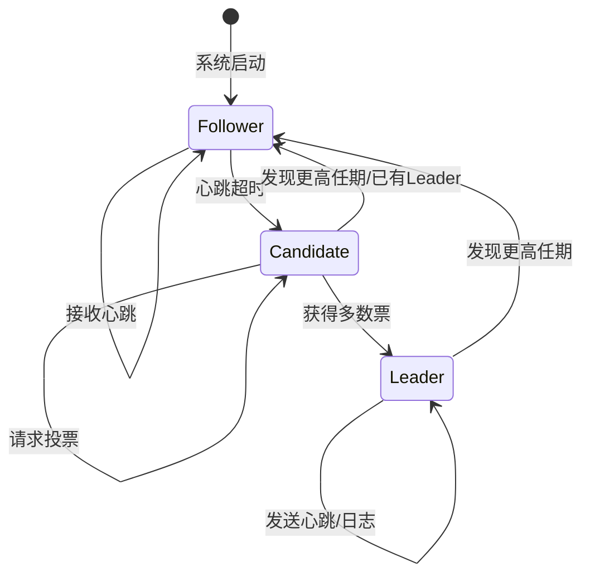

# 06.3 共识与协作 (Consensus and Coordination)

## 目录

- [06.3 共识与协作 (Consensus and Coordination)](#063-共识与协作-consensus-and-coordination)
  - [目录](#目录)
  - [1. 定义与背景](#1-定义与背景)
  - [2. 批判性分析](#2-批判性分析)
  - [3. 核心问题与算法](#3-核心问题与算法)
  - [4. 形式化表达](#4-形式化表达)
  - [5. 交叉引用](#5-交叉引用)
  - [6. 参考文献](#6-参考文献)
  - [批判性分析](#批判性分析)

---

## 1. 定义与背景

共识问题是分布式计算中的核心问题：要求一组相互独立的节点，就一个值或一系列值达成唯一的、不可撤销的协议。共识是实现系统状态一致性、领导者选举、分布式锁等协作任务的基础。

---

## 2. 批判性分析

- **重要性**: 没有共识，就无法在可能出现故障的分布式系统中构建可靠的服务。
- **挑战**: 根据FLP不可能性，在异步网络中无法保证达成共识。因此，所有实用的共识算法都必须对系统模型做出让步，例如假设网络延迟有界（同步模型）或使用随机化。

---

## 3. 核心问题与算法

- **共识属性 (Consensus Properties)**:
  - **一致性 (Agreement)**: 所有正确的节点必须就同一个值达成一致。
  - **有效性 (Validity)**: 如果所有正确的节点都提议了同一个值v，那么最终决议的值必须是v。
  - **可终止性 (Termination)**: 所有正确的节点最终必须能做出决定。
- **Paxos 算法**:
  - **描述**: 由Lamport提出的第一个被证明的共识算法，分为两个阶段（Prepare/Promise 和 Propose/Accept）。非常强大但难以理解和实现。
  - **变种**: Multi-Paxos, Cheap Paxos.
- **Raft 算法**:
  - **描述**: 由Ongaro和Ousterhout设计，目标是比Paxos更易于理解和实现。它将共识问题分解为三个子问题：领导者选举、日志复制和安全性。
  - **优点**: 设计清晰，被广泛应用于现代分布式系统（如etcd, Consul）。
- **Zab (ZooKeeper Atomic Broadcast)**:
  - **描述**: ZooKeeper使用的原子广播协议，类似于Raft，也包含领导者选举和原子广播阶段，为客户端提供高可用的分布式协作服务。

---

## 4. 形式化表达

**Raft 领导者选举流程**:

---

## 5. 交叉引用

- [分布式系统总览](README.md)
- [基础理论](06.1_Foundations.md)
- [复制与一致性](06.4_Replication_and_Consistency.md)

---

## 6. 参考文献

1. Lamport, Leslie. "The Part-Time Parliament." *ACM Transactions on Computer Systems*, 1998.
2. Ongaro, Diego, and Ousterhout, John. "In search of an understandable consensus algorithm." *USENIX Annual Technical Conference*, 2014.
3. Chandra, Tushar D., and Toueg, Sam. "Unreliable failure detectors for reliable distributed systems." *Journal of the ACM*, 1996.

## 批判性分析

- 本节内容待补充：请从多元理论视角、局限性、争议点、应用前景等方面进行批判性分析。
