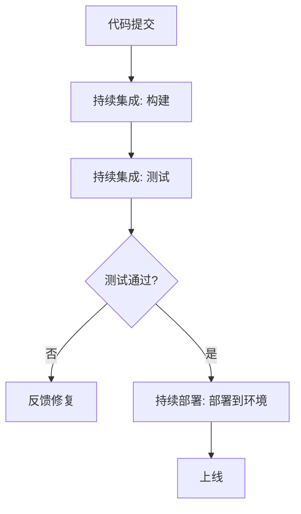

# 10.3 CI/CD 理论 (Continuous Integration/Continuous Deployment Theory)

## 概述

CI/CD 理论研究自动化软件交付流程，包括持续集成、持续部署和持续交付的原理和方法。CI/CD 通过自动化构建、测试和部署流程提高软件交付效率和质量。

## 目录

- [10.3 CI/CD 理论 (Continuous Integration/Continuous Deployment Theory)](#103-cicd-理论-continuous-integrationcontinuous-deployment-theory)
  - [概述](#概述)
  - [目录](#目录)
  - [理论基础](#理论基础)
    - [形式化基础](#形式化基础)
  - [核心组件](#核心组件)
    - [持续集成](#持续集成)
    - [持续部署](#持续部署)
    - [CI/CD 流水线完整实现（Rust示例）](#cicd-流水线完整实现rust示例)
  - [批判性分析](#批判性分析)

## 理论基础

### 形式化基础

CI/CD 流程可以形式化为以下数学结构：

1. **构建流程**: $Build: Source \rightarrow Artifact$
2. **测试流程**: $Test: Artifact \rightarrow \{Pass, Fail\}$
3. **部署流程**: $Deploy: Artifact \rightarrow Environment$

## 核心组件

### 持续集成

```rust
use std::process::Command;

struct ContinuousIntegration {
    build_script: String,
    test_script: String,
}

impl ContinuousIntegration {
    fn build(&self) -> Result<(), Box<dyn std::error::Error>> {
        Command::new("cargo")
            .arg("build")
            .status()?;
        Ok(())
    }

    fn test(&self) -> Result<(), Box<dyn std::error::Error>> {
        Command::new("cargo")
            .arg("test")
            .status()?;
        Ok(())
    }
}
```

### 持续部署

```rust
struct ContinuousDeployment {
    target_environment: String,
    deployment_strategy: DeploymentStrategy,
}

enum DeploymentStrategy {
    Rolling,
    BlueGreen,
    Canary,
}

impl ContinuousDeployment {
    fn deploy(&self, artifact: &str) -> Result<(), Box<dyn std::error::Error>> {
        match self.deployment_strategy {
            DeploymentStrategy::Rolling => self.rolling_deploy(artifact),
            DeploymentStrategy::BlueGreen => self.blue_green_deploy(artifact),
            DeploymentStrategy::Canary => self.canary_deploy(artifact),
        }
    }
}
```

### CI/CD 流水线完整实现（Rust示例）

```rust
use std::process::Command;
use std::sync::{Arc, Mutex};
use std::thread;

struct Pipeline {
    ci: ContinuousIntegration,
    cd: ContinuousDeployment,
}

impl Pipeline {
    fn run(&self, artifact: &str) -> Result<(), Box<dyn std::error::Error>> {
        // 1. 构建阶段
        self.ci.build()?;
        // 2. 测试阶段
        self.ci.test()?;
        // 3. 部署阶段
        self.cd.deploy(artifact)?;
        Ok(())
    }

    // 并发执行多个流水线（如多分支/多环境）
    fn run_parallel(pipelines: Vec<Pipeline>, artifact: &str) {
        let handles: Vec<_> = pipelines.into_iter().map(|p| {
            let artifact = artifact.to_string();
            thread::spawn(move || {
                p.run(&artifact).unwrap_or_else(|e| eprintln!("Pipeline failed: {}", e));
            })
        }).collect();
        for h in handles { h.join().unwrap(); }
    }
}

// 边界场景说明：
// - 构建或测试失败时，流水线应立即终止并报告错误。
// - 部署阶段可扩展为支持回滚、重试等高级策略。
// - 并发执行时需注意资源隔离与并发安全。

## 应用场景

1. **自动化测试**
2. **快速反馈**
3. **风险降低**
4. **部署自动化**

## 相关理论

- [软件工程理论](README.md)
- [软件质量与测试](README.md)

### CI/CD 流程Mermaid图



## 批判性分析

### 多元理论视角

- 工程视角：CI/CD为软件工程提供自动化交付流程，提高开发效率和软件质量。
- 系统视角：CI/CD系统本身是复杂的分布式系统，需要处理并发、故障和扩展性。
- 管理视角：CI/CD改变软件开发流程，影响团队协作和项目管理方式。
- 质量视角：CI/CD通过自动化测试和部署提高软件质量和可靠性。

### 局限性

- 复杂性增加：CI/CD流水线本身可能变得复杂，增加维护成本。
- 测试覆盖不足：自动化测试难以覆盖所有场景，可能导致质量问题。
- 部署风险：自动化部署可能引入新的风险，如配置错误或依赖问题。
- 学习成本：团队需要学习新的工具和流程，初期效率可能下降。

### 争议与分歧

- 自动化程度：完全自动化vs人工干预，哪种更适合特定项目。
- 测试策略：单元测试vs集成测试vs端到端测试的平衡。
- 部署频率：频繁部署vs稳定性的权衡。
- 工具选择：开源vs商业工具，哪种更适合企业需求。

### 应用前景

- 云原生应用：容器化和微服务架构的自动化部署。
- 大规模系统：企业级应用的持续交付。
- 移动应用：移动应用的自动化测试和发布。
- 基础设施：基础设施即代码的自动化管理。

### 改进建议

- 发展智能CI/CD，利用AI优化流水线决策。
- 加强安全集成，在CI/CD中嵌入安全检查和合规验证。
- 推进可观测性，提供详细的流水线监控和故障诊断。
- 发展多环境管理，支持复杂的企业级部署场景。
