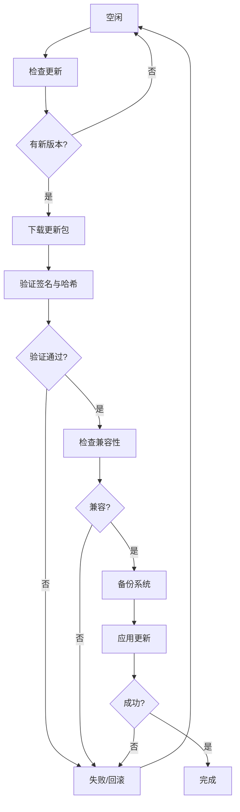

# 10.4 物联网系统理论 (IoT Systems Theory)

## 目录

- [10.4 物联网系统理论 (IoT Systems Theory)](#104-物联网系统理论-iot-systems-theory)
  - [目录](#目录)
  - [概述](#概述)
  - [理论基础](#理论基础)
    - [形式化基础](#形式化基础)
    - [系统架构](#系统架构)
  - [OTA更新系统](#ota更新系统)
    - [更新流程](#更新流程)
  - [OTA更新流程Mermaid图](#ota更新流程mermaid图)
    - [A/B分区更新](#ab分区更新)
  - [设备管理](#设备管理)
    - [设备注册和认证](#设备注册和认证)
  - [通信协议](#通信协议)
    - [MQTT协议实现](#mqtt协议实现)
  - [实现示例](#实现示例)
    - [完整的IoT设备示例](#完整的iot设备示例)
  - [应用场景](#应用场景)
    - [智能家居](#智能家居)
    - [工业物联网](#工业物联网)
  - [相关理论](#相关理论)
    - [分布式系统理论](#分布式系统理论)
    - [软件工程理论](#软件工程理论)
  - [参考文献](#参考文献)
  - [批判性分析](#批判性分析)

---

## 概述

物联网系统理论研究连接物理世界和数字世界的分布式系统架构。物联网系统通过传感器、执行器和网络连接实现设备间的智能交互和数据交换。

**定义**: 物联网系统是由相互连接的物理设备、传感器、执行器和计算节点组成的网络，能够收集、传输、处理和执行数据驱动的决策。

## 理论基础

### 形式化基础

物联网系统可以形式化为以下数学结构：

1. **设备定义**: $D = (ID, Type, State, Capabilities)$，其中 $ID$ 是设备标识，$Type$ 是设备类型，$State$ 是设备状态，$Capabilities$ 是设备能力
2. **网络拓扑**: $G = (V, E)$，其中 $V$ 是设备节点集合，$E$ 是连接边集合
3. **数据流**: $F = (Source, Destination, Data, QoS)$，表示数据从源到目标的传输

### 系统架构

1. **感知层**: 传感器和执行器
2. **网络层**: 通信协议和网络拓扑
3. **平台层**: 数据处理和存储
4. **应用层**: 业务逻辑和用户界面

## OTA更新系统

### 更新流程

OTA (Over-the-Air) 更新是物联网设备远程软件更新的核心机制。

## OTA更新流程Mermaid图



### A/B分区更新

A/B分区更新提供原子性和回滚能力。

```rust
#[derive(Clone, Debug)]
enum PartitionSlot {
    A,
    B,
}

struct ABPartitionManager {
    current_slot: PartitionSlot,
    partitions: HashMap<PartitionSlot, PartitionInfo>,
}

#[derive(Clone, Debug)]
struct PartitionInfo {
    slot: PartitionSlot,
    is_active: bool,
    version: String,
    status: PartitionStatus,
}

#[derive(Clone, Debug)]
enum PartitionStatus {
    Valid,
    Invalid,
    Updating,
}

impl ABPartitionManager {
    fn new() -> Self {
        let mut partitions = HashMap::new();
        partitions.insert(PartitionSlot::A, PartitionInfo {
            slot: PartitionSlot::A,
            is_active: true,
            version: "1.0.0".to_string(),
            status: PartitionStatus::Valid,
        });
        partitions.insert(PartitionSlot::B, PartitionInfo {
            slot: PartitionSlot::B,
            is_active: false,
            version: "1.0.0".to_string(),
            status: PartitionStatus::Valid,
        });
        
        ABPartitionManager {
            current_slot: PartitionSlot::A,
            partitions,
        }
    }

    fn get_inactive_slot(&self) -> PartitionSlot {
        match self.current_slot {
            PartitionSlot::A => PartitionSlot::B,
            PartitionSlot::B => PartitionSlot::A,
        }
    }

    async fn update_inactive_partition(&mut self, package: &UpdatePackage) -> Result<(), Box<dyn std::error::Error>> {
        let inactive_slot = self.get_inactive_slot();
        let partition = self.partitions.get_mut(&inactive_slot).unwrap();
        
        partition.status = PartitionStatus::Updating;
        
        // 将更新包写入非活动分区
        self.write_partition(&inactive_slot, &package.payload).await?;
        
        // 验证分区完整性
        if self.verify_partition(&inactive_slot).await? {
            partition.status = PartitionStatus::Valid;
            partition.version = package.manifest.version.clone();
            Ok(())
        } else {
            partition.status = PartitionStatus::Invalid;
            Err("Partition verification failed".into())
        }
    }

    async fn switch_to_updated_partition(&mut self) -> Result<(), Box<dyn std::error::Error>> {
        let inactive_slot = self.get_inactive_slot();
        let partition = self.partitions.get(&inactive_slot).unwrap();
        
        if partition.status == PartitionStatus::Valid {
            // 更新启动配置
            self.update_boot_config(&inactive_slot).await?;
            
            // 切换当前槽位
            self.current_slot = inactive_slot.clone();
            
            // 更新分区状态
            let old_active = self.partitions.get_mut(&self.get_inactive_slot()).unwrap();
            old_active.is_active = false;
            
            let new_active = self.partitions.get_mut(&self.current_slot).unwrap();
            new_active.is_active = true;
            
            Ok(())
        } else {
            Err("Cannot switch to invalid partition".into())
        }
    }

    async fn rollback_to_previous_partition(&mut self) -> Result<(), Box<dyn std::error::Error>> {
        let inactive_slot = self.get_inactive_slot();
        let partition = self.partitions.get(&inactive_slot).unwrap();
        
        if partition.status == PartitionStatus::Valid {
            self.switch_to_updated_partition().await
        } else {
            Err("No valid partition to rollback to".into())
        }
    }

    async fn write_partition(&self, slot: &PartitionSlot, data: &[u8]) -> Result<(), Box<dyn std::error::Error>> {
        // 实现分区写入
        Ok(())
    }

    async fn verify_partition(&self, slot: &PartitionSlot) -> Result<bool, Box<dyn std::error::Error>> {
        // 实现分区验证
        Ok(true)
    }

    async fn update_boot_config(&self, slot: &PartitionSlot) -> Result<(), Box<dyn std::error::Error>> {
        // 更新启动配置
        Ok(())
    }
}
```

## 设备管理

### 设备注册和认证

```rust
use std::collections::HashMap;

#[derive(Clone, Debug)]
struct Device {
    id: String,
    device_type: String,
    state: String,
    metadata: HashMap<String, String>,
}

struct DeviceManager {
    devices: HashMap<String, Device>,
}

impl DeviceManager {
    fn new() -> Self {
        DeviceManager { devices: HashMap::new() }
    }
    fn register_device(&mut self, device: Device) {
        self.devices.insert(device.id.clone(), device);
    }
    fn update_state(&mut self, id: &str, state: &str) {
        if let Some(device) = self.devices.get_mut(id) {
            device.state = state.to_string();
        }
    }
    fn get_device(&self, id: &str) -> Option<&Device> {
        self.devices.get(id)
    }
}
```

## 通信协议

### MQTT协议实现

```rust
use rumqttc::{MqttOptions, Client, QoS};
use std::time::Duration;

fn mqtt_publish_example() {
    let mut mqttoptions = MqttOptions::new("device1", "broker.emqx.io", 1883);
    mqttoptions.set_keep_alive(Duration::from_secs(5));
    let (mut client, mut connection) = Client::new(mqttoptions, 10);
    client.publish("iot/devices/1/state", QoS::AtLeastOnce, false, "online").unwrap();
}
```

## 实现示例

### 完整的IoT设备示例

```rust
struct IoTDevice {
    device_id: String,
    ota_client: OTAClient,
    partition_manager: ABPartitionManager,
    device_manager: DeviceManager,
    mqtt_handler: MQTTHandler,
    sensors: HashMap<String, Box<dyn Sensor>>,
    actuators: HashMap<String, Box<dyn Actuator>>,
}

trait Sensor {
    fn read(&self) -> Result<f64, Box<dyn std::error::Error>>;
    fn get_type(&self) -> &str;
}

trait Actuator {
    fn set_value(&mut self, value: f64) -> Result<(), Box<dyn std::error::Error>>;
    fn get_type(&self) -> &str;
}

impl IoTDevice {
    async fn new(device_id: String, update_server: String, mqtt_broker: String) -> Result<Self, Box<dyn std::error::Error>> {
        let ota_client = OTAClient::new(device_id.clone(), "1.0.0".to_string(), update_server);
        let partition_manager = ABPartitionManager::new();
        let device_manager = DeviceManager::new();
        let mqtt_handler = MQTTHandler::new(mqtt_broker, device_id.clone()).await?;
        
        Ok(IoTDevice {
            device_id,
            ota_client,
            partition_manager,
            device_manager,
            mqtt_handler,
            sensors: HashMap::new(),
            actuators: HashMap::new(),
        })
    }

    async fn start(&mut self) -> Result<(), Box<dyn std::error::Error>> {
        // 注册设备
        let device = Device {
            id: self.device_id.clone(),
            name: "IoT Device".to_string(),
            device_type: "sensor".to_string(),
            firmware_version: "1.0.0".to_string(),
            capabilities: vec!["temperature".to_string(), "humidity".to_string()],
            status: DeviceStatus::Online,
            last_seen: chrono::Utc::now(),
        };
        
        let token = self.device_manager.register_device(device).await?;
        
        // 订阅MQTT主题
        self.mqtt_handler.subscribe_to_topic("device/+/command").await?;
        self.mqtt_handler.subscribe_to_topic("device/+/config").await?;
        
        // 启动主循环
        self.main_loop().await
    }

    async fn main_loop(&mut self) -> Result<(), Box<dyn std::error::Error>> {
        loop {
            // 检查更新
            if let Some(manifest) = self.ota_client.check_for_updates().await? {
                self.handle_update(manifest).await?;
            }
            
            // 读取传感器数据
            let sensor_data = self.read_sensors().await?;
            
            // 发布数据
            self.publish_sensor_data(&sensor_data).await?;
            
            // 处理MQTT消息
            self.mqtt_handler.handle_messages().await?;
            
            // 等待一段时间
            tokio::time::sleep(tokio::time::Duration::from_secs(60)).await;
        }
    }

    async fn handle_update(&mut self, manifest: UpdateManifest) -> Result<(), Box<dyn std::error::Error>> {
        // 下载更新包
        let package = self.ota_client.download_update(&manifest).await?;
        
        // 更新非活动分区
        self.partition_manager.update_inactive_partition(&package).await?;
        
        // 切换到更新后的分区
        self.partition_manager.switch_to_updated_partition().await?;
        
        Ok(())
    }

    async fn read_sensors(&self) -> Result<HashMap<String, f64>, Box<dyn std::error::Error>> {
        let mut data = HashMap::new();
        
        for (name, sensor) in &self.sensors {
            match sensor.read() {
                Ok(value) => {
                    data.insert(name.clone(), value);
                }
                Err(e) => {
                    eprintln!("Error reading sensor {}: {}", name, e);
                }
            }
        }
        
        Ok(data)
    }

    async fn publish_sensor_data(&mut self, data: &HashMap<String, f64>) -> Result<(), Box<dyn std::error::Error>> {
        let message = serde_json::json!({
            "device_id": self.device_id,
            "timestamp": chrono::Utc::now(),
            "sensor_data": data
        });
        
        self.mqtt_handler.publish_message("device/data", &message).await?;
        Ok(())
    }
}
```

## 应用场景

### 智能家居

1. **环境监控**
   - 温度、湿度传感器
   - 空气质量监测
   - 自动调节系统

2. **安全系统**
   - 门锁控制
   - 摄像头监控
   - 入侵检测

### 工业物联网

1. **设备监控**
   - 设备状态监测
   - 预测性维护
   - 性能优化

2. **自动化控制**
   - 生产线控制
   - 质量检测
   - 库存管理

## 相关理论

### 分布式系统理论

- **[10.1 微服务架构理论](10.1_Microservice_Architecture.md)**: 分布式设备管理
- **[10.2 容器技术理论](10.2_Container_Technology.md)**: 设备容器化
- **[11.1 并发控制](11_Concurrency_Theory/11.1_Concurrency_Control.md)**: 设备并发管理

### 软件工程理论

- **[07.8 工作流工程理论](../08_Software_Engineering_Theory/07.8_Workflow_Engineering.md)**: 设备工作流
- **[07.7 软件组件理论](README.md)**: 设备组件化

## 参考文献

1. Gubbi, J., Buyya, R., Marusic, S., & Palaniswami, M. (2013). Internet of Things (IoT): A vision, architectural elements, and future directions. *Future Generation Computer Systems*, 29(7), 1645-1660.
2. Atzori, L., Iera, A., & Morabito, G. (2010). The internet of things: A survey. *Computer Networks*, 54(15), 2787-2805.
3. OTA Update Best Practices. <https://docs.aws.amazon.com/iot/latest/developerguide/ota-best-practices.html>
4. MQTT Protocol Specification. <http://docs.oasis-open.org/mqtt/mqtt/v3.1.1/os/mqtt-v3.1.1-os.html>

---

**相关链接**:

- [返回分布式系统理论总览](README.md#10-分布式系统理论)
- [微服务架构理论](10.1_Microservice_Architecture.md)
- [容器技术理论](10.2_Container_Technology.md)
- [工作流工程理论](../08_Software_Engineering_Theory/07.8_Workflow_Engineering.md)
- [工作流工程理论](../08_Software_Engineering_Theory/07.8_Workflow_Engineering.md)

## 批判性分析

- 本节内容待补充：请从多元理论视角、局限性、争议点、应用前景等方面进行批判性分析。
