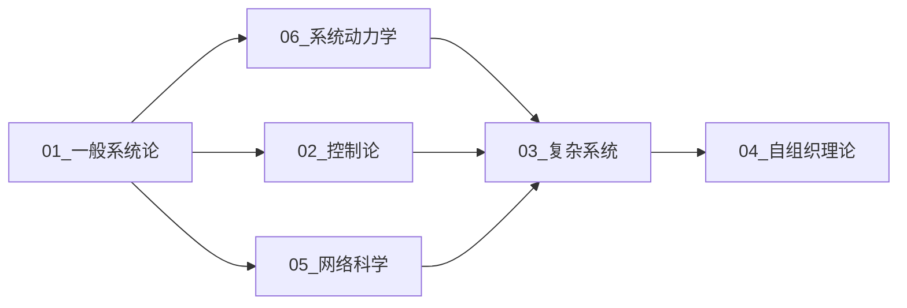

# 11 系统科学 - 目录与导航

> **导航文档** | 系统科学模块完整目录树

---

## 1. 快速导航

### 1.1 文档地图

```
11_系统科学/
├── 📘 README.md ......................... [当前] 模块概述
├── 📑 00_目录与导航.md .................. [当前] 本文档
│
├── 📗 01_一般系统论.md .................. 系统定义、涌现性、层次性
│   ├── 1.1 系统的形式化定义
│   ├── 1.2 系统边界与环境
│   ├── 1.3 系统的层次结构
│   ├── 1.4 涌现性质
│   ├── 1.5 系统分类
│   └── 1.6 应用案例
│
├── 📗 02_控制论.md ...................... 反馈控制、系统稳定性、最优控制
│   ├── 2.1 反馈系统基础
│   ├── 2.2 稳定性分析
│   ├── 2.3 最优控制理论
│   ├── 2.4 自适应控制
│   ├── 2.5 鲁棒控制
│   └── 2.6 应用案例
│
├── 📗 03_复杂系统.md .................... 复杂性度量、混沌理论、分形
│   ├── 3.1 复杂性度量
│   ├── 3.2 相变与临界现象
│   ├── 3.3 分形与幂律
│   ├── 3.4 混沌理论
│   └── 3.5 应用案例
│
├── 📗 04_自组织理论.md .................. 耗散结构、协同学
│   ├── 4.1 耗散结构理论
│   ├── 4.2 协同学
│   ├── 4.3 超循环理论
│   ├── 4.4 自创生系统
│   └── 4.5 应用案例
│
├── 📗 05_网络科学.md .................... 复杂网络、小世界、无标度网络
│   ├── 5.1 图论基础
│   ├── 5.2 随机图模型
│   ├── 5.3 小世界网络
│   ├── 5.4 无标度网络
│   ├── 5.5 网络动力学
│   └── 5.6 应用案例
│
└── 📗 06_系统动力学.md .................. 系统建模、仿真、预测
    ├── 6.1 存量与流量
    ├── 6.2 反馈回路
    ├── 6.3 延迟效应
    ├── 6.4 系统建模方法
    ├── 6.5 经典模型
    └── 6.6 应用案例
```

---

## 2. 详细目录

### 2.1 01_一般系统论.md

```
1. 一般系统论
├── 1.1 系统的形式化定义
│   ├── 1.1.1 Bertalanffy系统定义
│   ├── 1.1.2 系统状态与状态空间
│   ├── 1.1.3 系统动力学方程
│   └── 1.1.4 解的存在唯一性
│
├── 1.2 系统边界与环境
│   ├── 1.2.1 边界的形式化定义
│   ├── 1.2.2 刚性边界与柔性边界
│   └── 1.2.3 渗透边界
│
├── 1.3 系统的层次结构
│   ├── 1.3.1 层次的形式化
│   ├── 1.3.2 层次间的关系
│   └── 1.3.3 层次分离原理
│
├── 1.4 涌现性质
│   ├── 1.4.1 涌现的定义
│   ├── 1.4.2 弱涌现与强涌现
│   └── 1.4.3 涌现的度量
│
├── 1.5 系统分类
│   ├── 1.5.1 开放系统与封闭系统
│   ├── 1.5.2 线性系统与非线性系统
│   └── 1.5.3 静态系统与动态系统
│
├── 1.6 思维导图
├── 1.7 对比矩阵
├── 1.8 Python实现
└── 1.9 应用案例
```

### 2.2 02_控制论.md

```
2. 控制论
├── 2.1 反馈系统基础
│   ├── 2.1.1 反馈系统的数学描述
│   ├── 2.1.2 闭环传递函数
│   ├── 2.1.3 正反馈与负反馈
│   └── 2.1.4 反馈的基本效应
│
├── 2.2 稳定性分析
│   ├── 2.2.1 Lyapunov稳定性
│   ├── 2.2.2 BIBO稳定性
│   ├── 2.2.3 非线性系统稳定性
│   └── 2.2.4 鲁棒稳定性
│
├── 2.3 最优控制理论
│   ├── 2.3.1 Pontryagin极大值原理
│   ├── 2.3.2 动态规划
│   ├── 2.3.3 线性二次调节器(LQR)
│   └── 2.3.4 Bang-Bang控制
│
├── 2.4 自适应控制
│   ├── 2.4.1 参数自适应
│   ├── 2.4.2 模型参考自适应
│   └── 2.4.3 自校正调节器
│
├── 2.5 鲁棒控制
│   ├── 2.5.1 不确定性建模
│   ├── 2.5.2 H∞控制
│   └── 2.5.3 μ分析
│
├── 2.6 思维导图
├── 2.7 对比矩阵
├── 2.8 Python实现
└── 2.9 应用案例
```

### 2.3 03_复杂系统.md

```
3. 复杂系统
├── 3.1 复杂性度量
│   ├── 3.1.1 Kolmogorov复杂度
│   ├── 3.1.2 算法信息论
│   ├── 3.1.3 统计复杂度
│   └── 3.1.4 有效复杂度
│
├── 3.2 相变与临界现象
│   ├── 3.2.1 临界性概念
│   ├── 3.2.2 自组织临界性
│   └── 3.2.3 相变分类
│
├── 3.3 分形与幂律
│   ├── 3.3.1 分形几何
│   ├── 3.3.2 分形维度
│   └── 3.3.3 幂律分布
│
├── 3.4 混沌理论
│   ├── 3.4.1 Devaney混沌定义
│   ├── 3.4.2 Lyapunov指数
│   ├── 3.4.3 奇怪吸引子
│   └── 3.4.4 分岔理论
│
├── 3.5 思维导图
├── 3.6 对比矩阵
├── 3.7 Python实现
└── 3.8 应用案例
```

### 2.4 04_自组织理论.md

```
4. 自组织理论
├── 4.1 耗散结构理论
│   ├── 4.1.1 远离平衡态的热力学
│   ├── 4.1.2 熵平衡方程
│   ├── 4.1.3 最小熵产生原理
│   └── 4.1.4 Brusselator模型
│
├── 4.2 协同学
│   ├── 4.2.1 序参量概念
│   ├── 4.2.2 役使原理
│   ├── 4.2.3 绝热消去
│   └── 4.2.4 势函数方法
│
├── 4.3 超循环理论
│   ├── 4.3.1 自复制与演化
│   └── 4.3.2 分子进化
│
├── 4.4 自创生系统
│   ├── 4.4.1 组织闭合
│   └── 4.4.2 生命系统特征
│
├── 4.5 思维导图
├── 4.6 对比矩阵
├── 4.7 Python实现
└── 4.8 应用案例
```

### 2.5 05_网络科学.md

```
5. 网络科学
├── 5.1 图论基础
│   ├── 5.1.1 图的基本概念
│   ├── 5.1.2 图的表示方法
│   ├── 5.1.3 路径与连通性
│   └── 5.1.4 图的度量指标
│
├── 5.2 随机图模型
│   ├── 5.2.1 Erdős-Rényi模型
│   ├── 5.2.2 度分布
│   └── 5.2.3 相变现象
│
├── 5.3 小世界网络
│   ├── 5.3.1 Watts-Strogatz模型
│   ├── 5.3.2 聚类系数与路径长度
│   └── 5.3.3 小世界特性度量
│
├── 5.4 无标度网络
│   ├── 5.4.1 Barabási-Albert模型
│   ├── 5.4.2 偏好依附机制
│   ├── 5.4.3 度分布幂律
│   └── 5.4.4 度相关性
│
├── 5.5 网络动力学
│   ├── 5.5.1 传播过程
│   ├── 5.5.2 同步现象
│   └── 5.5.3 级联效应
│
├── 5.6 思维导图
├── 5.7 对比矩阵
├── 5.8 Python实现
└── 5.9 应用案例
```

### 2.6 06_系统动力学.md

```
6. 系统动力学
├── 6.1 存量与流量
│   ├── 6.1.1 存量的形式化定义
│   ├── 6.1.2 流量的形式化定义
│   └── 6.1.3 守恒方程
│
├── 6.2 反馈回路
│   ├── 6.2.1 增强回路
│   ├── 6.2.2 调节回路
│   └── 6.2.3 回路分析
│
├── 6.3 延迟效应
│   ├── 6.3.1 物质延迟
│   ├── 6.3.2 信息延迟
│   └── 6.3.3 延迟的影响
│
├── 6.4 系统建模方法
│   ├── 6.4.1 建模步骤
│   ├── 6.4.2 因果回路图
│   └── 6.4.3 存量流量图
│
├── 6.5 经典模型
│   ├── 6.5.1 Bass扩散模型
│   ├── 6.5.2 捕食者-猎物模型
│   └── 6.5.3 库存管理模型
│
├── 6.6 思维导图
├── 6.7 对比矩阵
├── 6.8 Python实现
└── 6.9 应用案例
```

---

## 3. 学习路径

### 3.1 推荐学习顺序



### 3.2 按主题分组

#### 主题1：系统思维基础

- [01_一般系统论](01_一般系统论.md)
- [06_系统动力学](06_系统动力学.md)

#### 主题2：控制与优化

- [02_控制论](02_控制论.md)

#### 主题3：复杂性与涌现

- [03_复杂系统](03_复杂系统.md)
- [04_自组织理论](04_自组织理论.md)

#### 主题4：网络与连接

- [05_网络科学](05_网络科学.md)

---

## 4. 交叉引用索引

### 4.1 与数学基础的交叉

| 本文档概念 | 数学基础模块 | 具体位置 |
|------------|--------------|----------|
| 微分方程 | 01_数学基础 | 04_分析学/04.1_实分析.md |
| 线性代数 | 01_数学基础 | 02_代数学/02.2_线性代数.md |
| 图论 | 01_数学基础 | 02_代数学/02.1_抽象代数.md |
| 动力系统 | 01_数学基础 | 04_分析学/04.2_泛函分析.md |

### 4.2 与形式化理论的交叉

| 本文档概念 | 形式化理论模块 | 具体位置 |
|------------|----------------|----------|
| 控制论形式化 | 05_形式化理论 | 03_控制论/03.1_系统动力学.md |
| Petri网 | 05_形式化理论 | 02_Petri网理论/02.1_Petri网基础.md |
| 时序逻辑 | 05_形式化理论 | 01_时序逻辑/01.1_线性时序逻辑_LTL.md |

### 4.3 与软件工程的交叉

| 本文档概念 | 软件工程模块 | 应用场景 |
|------------|--------------|----------|
| 反馈控制 | 04_软件工程 | 微服务熔断、限流 |
| 系统动力学 | 04_软件工程 | 负载均衡策略 |
| 网络科学 | 04_软件工程 | 服务依赖分析 |

---

## 5. 难度分级

| 文档 | 难度等级 | 预计学习时间 | 前置要求 |
|------|----------|--------------|----------|
| 01_一般系统论.md | ⭐⭐ | 4-6小时 | 基础逻辑 |
| 02_控制论.md | ⭐⭐⭐⭐ | 8-12小时 | 微积分、线性代数 |
| 03_复杂系统.md | ⭐⭐⭐⭐⭐ | 10-15小时 | 概率论、统计物理 |
| 04_自组织理论.md | ⭐⭐⭐⭐ | 6-10小时 | 热力学基础 |
| 05_网络科学.md | ⭐⭐⭐ | 6-8小时 | 基础图论 |
| 06_系统动力学.md | ⭐⭐⭐ | 6-8小时 | 微积分基础 |

---

## 6. 快速查询表

### 6.1 核心公式速查

| 概念 | 公式 | 文档位置 |
|------|------|----------|
| 系统定义 | $S = (E, R, \mathcal{B})$ | 01_一般系统论.md / 1.1 |
| 闭环传递函数 | $T(s) = \frac{G(s)}{1 + G(s)H(s)}$ | 02_控制论.md / 2.1 |
| Lyapunov指数 | $\lambda = \lim_{t \to \infty} \frac{1}{t} \ln \frac{\|\delta x(t)\|}{\|\delta x_0\|}$ | 03_复杂系统.md / 3.4 |
| 熵产生 | $dS = d_eS + d_iS$ | 04_自组织理论.md / 4.1 |
| BA网络度分布 | $P(k) \sim k^{-\gamma}$ | 05_网络科学.md / 5.4 |
| 存量方程 | $S(t) = S(0) + \int_0^t [I(s) - O(s)] ds$ | 06_系统动力学.md / 6.1 |

### 6.2 关键算法速查

| 算法 | 用途 | 文档位置 |
|------|------|----------|
| Lempel-Ziv复杂度 | 复杂性度量 | 03_复杂系统.md / 3.1 |
| LQR控制 | 最优控制 | 02_控制论.md / 2.3 |
| 绝热消去 | 多尺度分析 | 04_自组织理论.md / 4.2 |
| PageRank | 网络中心性 | 05_网络科学.md / 5.5 |
| Bass扩散 | 产品采纳 | 06_系统动力学.md / 6.5 |

---

## 7. 术语表

| 术语 | 英文 | 定义 |
|------|------|------|
| 系统 | System | 相互作用的元素集合 |
| 涌现 | Emergence | 整体大于部分之和的现象 |
| 反馈 | Feedback | 输出影响输入的机制 |
| 稳态 | Steady State | 不随时间变化的系统状态 |
| 分岔 | Bifurcation | 系统定性行为的突变 |
| 吸引子 | Attractor | 系统长期趋向的状态 |
| 熵 | Entropy | 系统无序程度的度量 |
| 耗散结构 | Dissipative Structure | 远离平衡态的有序结构 |
| 序参量 | Order Parameter | 描述宏观有序的变量 |
| 无标度 | Scale-Free | 缺乏特征尺度的网络 |

---

## 8. 附录

### 8.1 参考文献格式

本模块采用以下引用格式：

> 作者. (年份). _书名_. 出版社.
>
> 作者. (年份). "文章标题". _期刊名_, 卷(期), 页码.

### 8.2 符号约定

| 符号 | 含义 | 使用场景 |
|------|------|----------|
| $S$ | 系统 | 一般系统论 |
| $x$ | 状态向量 | 控制论、动力学 |
| $u$ | 控制输入 | 控制论 |
| $y$ | 系统输出 | 控制论 |
| $G(s)$ | 传递函数 | 控制论 |
| $\lambda$ | Lyapunov指数 | 混沌理论 |
| $k$ | 节点度 | 网络科学 |
| $S$ | 存量 | 系统动力学 |
| $f$ | 流量 | 系统动力学 |

---

> **导航提示**：点击任意文档链接即可跳转。建议使用支持Markdown导航的编辑器（如VS Code）以获得最佳体验。
