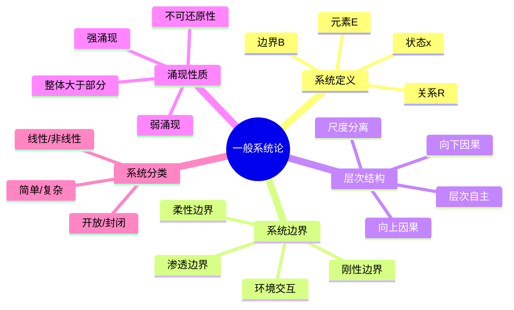

# 11.1 一般系统论

---

📌 **内容摘要**

本文档深入探讨一般系统论的核心原理和关键方法。内容涵盖系统科学领域的主要知识点，包括层次, 系统论, 涌现等关键主题。适合有一定基础的学习者系统学习。

**关键词**: 层次, 系统科学, 系统论, 涌现

📚 **学习目标**

- 掌握一般系统论的核心概念和主要方法
- 理解相关理论的应用场景
- 建立该领域的系统性知识框架

🎯 **难度级别**: 中级

⏱️ **预计阅读时间**: 15分钟

**前置知识**: 相关领域的基础概念

---


> **General Systems Theory**
> 参考：Bertalanffy, L. von. (1968). _General System Theory: Foundations, Development, Applications_

---

## 1.1 系统的形式化定义

### 1.1.1 Bertalanffy系统定义

**定义 1.1.1**（系统）：系统 $S$ 是一个有序三元组：

$$
S = (E, R, \mathcal{B})
$$

其中：

| 符号 | 名称 | 说明 |
|------|------|------|
| $E$ | 元素集合 | $E = \{e_1, e_2, \ldots, e_n\}$ |
| $R$ | 关系集合 | $R \subseteq E \times E$ |
| $\mathcal{B}$ | 边界 | $\mathcal{B}: E \to \{0, 1\}$ |

**定义 1.1.2**（系统状态）：系统状态 $x(t)$ 是时间 $t$ 时所有元素属性的集合：

$$
x(t) = (x_1(t), x_2(t), \ldots, x_n(t)) \in \mathcal{X}
$$

其中 $\mathcal{X}$ 为状态空间。

**定义 1.1.3**（状态空间）：系统状态空间定义为：

$$
\mathcal{X} = \prod_{i=1}^{n} \mathcal{X}_i
$$

其中 $\mathcal{X}_i$ 为第 $i$ 个元素的状态空间。

### 1.1.2 系统动力学方程

**定义 1.1.4**（系统动力学方程）：系统演化由状态方程描述：

$$
\frac{dx}{dt} = f(x, u, t)
$$

其中：

- $x \in \mathcal{X}$：状态向量
- $u \in \mathcal{U}$：输入/控制向量
- $f: \mathcal{X} \times \mathcal{U} \times \mathbb{R} \to \mathcal{X}$：演化函数

**定理 1.1.1**（解的存在唯一性）：若 $f$ 满足Lipschitz条件：

$$
\|f(x_1, u, t) - f(x_2, u, t)\| \leq L\|x_1 - x_2\|
$$

则对任意初值 $x(t_0) = x_0$，系统存在唯一解。

**证明**：

由Picard-Lindelöf定理，考虑积分形式：

$$
x(t) = x_0 + \int_{t_0}^{t} f(x(\tau), u(\tau), \tau) d\tau
$$

构造迭代序列：

$$
x^{(k+1)}(t) = x_0 + \int_{t_0}^{t} f(x^{(k)}(\tau), u(\tau), \tau) d\tau
$$

对任意 $t \in [t_0, t_0 + \delta]$：

$$
\|x^{(k+1)}(t) - x^{(k)}(t)\| \leq \int_{t_0}^{t} L\|x^{(k)}(\tau) - x^{(k-1)}(\tau)\| d\tau
$$

由压缩映射原理，序列收敛到唯一解。$\square$

---

## 1.2 系统边界与环境

### 1.2.1 边界的形式化定义

**定义 1.2.1**（系统边界）：边界是区分系统与环境的数学结构：

$$
\mathcal{B} = \{e \in E : \exists e' \in E^c, (e, e') \in R_{ext}\}
$$

其中 $E^c$ 为环境元素集，$R_{ext}$ 为外部关系。

**定义 1.2.2**（环境）：系统 $S$ 的环境 $Env(S)$ 定义为：

$$
Env(S) = (E_{env}, R_{env}, \mathcal{B}_{env})
$$

满足：$E \cap E_{env} = \emptyset$ 且 $R_{int} \subseteq E \times E$，$R_{ext} \subseteq E \times E_{env}$

### 1.2.2 边界类型

**定义 1.2.3**（刚性边界）：若边界 $\mathcal{B}$ 满足：

$$
\frac{\partial \mathcal{B}}{\partial t} = 0
$$

则称边界为刚性边界（Fixed Boundary）。

**定义 1.2.4**（柔性边界）：若边界随系统演化而变化：

$$
\mathcal{B}(t) = \mathcal{B}(x(t), t)
$$

则称边界为柔性边界（Adaptive Boundary）。

**定义 1.2.5**（渗透边界）：若边界允许物质、能量、信息的交换：

$$
\exists \phi: E \times E_{env} \times \mathbb{R} \to \mathbb{R}^m
$$

其中 $\phi$ 为交换流（Exchange Flux），则称边界为渗透边界。

---

## 1.3 系统的层次结构

### 1.3.1 层次的形式化

**定义 1.3.1**（层次）：系统的层次 $L$ 是元素的偏序集：

$$
L = (E, \preceq)
$$

其中 $\preceq$ 表示"属于"或"组成"关系。

**定义 1.3.2**（层次分解）：系统 $S$ 可分解为层次：

$$
S = \bigcup_{i=1}^{h} S_i
$$

其中 $S_i = (E_i, R_i, \mathcal{B}_i)$ 为第 $i$ 层子系统，且：

$$
E_i \cap E_j = \emptyset \quad \forall i \neq j
$$

### 1.3.2 层次间的关系

**定义 1.3.3**（跨层关系）：设 $e_i \in S_i$，$e_j \in S_j$，$i < j$，则跨层关系定义为：

$$
(e_i, e_j) \in R_{cross} \iff e_i \in Comp(e_j)
$$

其中 $Comp(e_j)$ 表示组成 $e_j$ 的元素集合。

**定理 1.3.1**（层次分离原理）：若系统层次满足：

$$
R_{cross} = \emptyset \Rightarrow R = \bigcup_{i=1}^{h} R_i
$$

即各层次独立演化，无跨层相互作用。

---

## 1.4 涌现性质

### 1.4.1 涌现的定义

**定义 1.4.1**（涌现）：性质 $P$ 是涌现的，当且仅当：

$$
P \in \mathcal{P}(S) \setminus \bigcup_{i} \mathcal{P}(e_i)
$$

其中 $S$ 为系统，$e_i$ 为系统组分，$\mathcal{P}$ 表示性质集合。

**定义 1.4.2**（弱涌现）：性质 $P$ 是弱涌现的，若：

$$
P = f(\{e_i\}) \land P \notin \{e_i\}
$$

其中 $f$ 为可计算函数，但计算复杂度极高。

**定义 1.4.3**（强涌现）：性质 $P$ 是强涌现的，若：

$$
P \neq f(\{e_i\}) \quad \forall \text{ 可计算函数 } f
$$

即 $P$ 不能由组分性质推导得出。

### 1.4.2 涌现的度量

**定义 1.4.4**（涌现度）：系统 $S$ 的涌现度定义为：

$$
E(S) = H(S) - \sum_{i} H(S_i) + \sum_{i<j} I(S_i; S_j)
$$

其中 $H$ 为熵，$I$ 为互信息。

**定理 1.4.1**（涌现的不可还原性）：若 $P$ 是涌现性质，则：

$$
EI(S; P) < H(P)
$$

即系统信息不能完全由组分信息还原。

---

## 1.5 系统分类

### 1.5.1 按与环境关系分类

| 类型 | 定义 | 特征 | 示例 |
|------|------|------|------|
| **封闭系统** | 无物质/能量交换 | $\phi = 0$ | 绝热容器 |
| **开放系统** | 有物质/能量交换 | $\phi \neq 0$ | 生物体 |
| **孤立系统** | 无交换，恒定能量 | $dE = 0$ | 宇宙（近似） |

### 1.5.2 按动力学特性分类

| 类型 | 数学描述 | 特征 | 分析方法 |
|------|----------|------|----------|
| **线性系统** | $\dot{x} = Ax + Bu$ | 叠加原理成立 | 频域分析 |
| **非线性系统** | $\dot{x} = f(x, u)$ | 叠加原理不成立 | 相平面、Lyapunov |
| **时变系统** | $\dot{x} = f(x, u, t)$ | 参数随时间变化 | 时域分析 |
| **时不变系统** | $\dot{x} = f(x, u)$ | 参数恒定 | 拉普拉斯变换 |

### 1.5.3 按结构分类

| 类型 | 结构特征 | 典型系统 |
|------|----------|----------|
| **简单系统** | 少元素、线性关系 | 单摆、RC电路 |
| **复杂系统** | 多元素、非线性、涌现 | 生态系统、经济 |
| **复杂适应系统** | 适应性、学习、演化 | 免疫系统、市场 |

---

## 1.6 思维导图



---

## 1.7 对比矩阵

### 1.7.1 系统类型对比

| 维度 | 简单系统 | 复杂系统 | 复杂适应系统 |
|------|----------|----------|--------------|
| **元素数量** | 少 | 多 | 非常多 |
| **相互作用** | 线性 | 非线性 | 非线性、自适应 |
| **可预测性** | 高 | 低 | 很低 |
| **涌现性质** | 无 | 有 | 强涌现 |
| **控制方式** | 集中 | 分布式 | 自组织 |
| **示例** | 机械钟表 | 天气系统 | 股票市场 |
| **分析方法** | 解析解 | 数值仿真 | 多主体仿真 |

### 1.7.2 涌现类型对比

| 特性 | 弱涌现 | 强涌现 |
|------|--------|--------|
| **可计算性** | 原则上可计算 | 不可计算 |
| **还原可能性** | 高计算成本下可还原 | 不可还原 |
| **典型例子** | 元胞自动机模式 | 意识 |
| **科学地位** | 计算复杂性限制 | 本体论涌现 |
| **预测能力** | 长期困难 | 根本限制 |

### 1.7.3 系统方法论对比

| 方法 | 还原论 | 整体论 | 系统论 |
|------|--------|--------|--------|
| **核心观点** | 整体=部分之和 | 整体>部分之和 | 整体+关系 |
| **分析单位** | 最小单元 | 整体 | 系统层次 |
| **适用系统** | 简单系统 | 黑箱系统 | 复杂系统 |
| **局限性** | 忽略涌现 | 难以操作化 | 需要大量信息 |
| **代表人物** | Descartes | Smuts | Bertalanffy |

---

## 1.8 Python实现

```python
"""
一般系统论：系统的概念与操作
基于Bertalanffy一般系统论的形式化实现
"""

import numpy as np
from typing import Set, Tuple, Callable, Dict, List, Optional
from dataclasses import dataclass
from abc import ABC, abstractmethod
import matplotlib.pyplot as plt
from matplotlib.patches import Circle, FancyBboxPatch


@dataclass
class SystemElement:
    """系统元素"""
    id: str
    properties: Dict[str, float]

    def __hash__(self):
        return hash(self.id)

    def __eq__(self, other):
        return isinstance(other, SystemElement) and self.id == other.id


class SystemBoundary:
    """系统边界"""

    def __init__(self, boundary_func: Callable[[SystemElement], bool]):
        self.boundary_func = boundary_func
        self.is_permeable = True

    def contains(self, element: SystemElement) -> bool:
        """判断元素是否在系统内部"""
        return self.boundary_func(element)

    def set_permeability(self, permeable: bool):
        """设置边界渗透性"""
        self.is_permeable = permeable


class GeneralSystem:
    """
    一般系统 (Bertalanffy定义)
    S = (E, R, B)
    """

    def __init__(self, name: str):
        self.name = name
        self.elements: Set[SystemElement] = set()
        self.relations: Set[Tuple[SystemElement, SystemElement]] = set()
        self.boundary: Optional[SystemBoundary] = None
        self.state_history: List[Dict] = []
        self.time = 0.0

    def add_element(self, element: SystemElement) -> 'GeneralSystem':
        """添加元素到系统"""
        self.elements.add(element)
        return self

    def add_relation(self, e1: SystemElement, e2: SystemElement) -> 'GeneralSystem':
        """添加元素间关系"""
        if e1 in self.elements and e2 in self.elements:
            self.relations.add((e1, e2))
        return self

    def set_boundary(self, boundary: SystemBoundary):
        """设置系统边界"""
        self.boundary = boundary

    def get_state(self) -> Dict[str, np.ndarray]:
        """获取当前系统状态"""
        return {
            e.id: np.array(list(e.properties.values()))
            for e in self.elements
        }

    def get_internal_elements(self) -> Set[SystemElement]:
        """获取系统内部元素"""
        if self.boundary is None:
            return self.elements
        return {e for e in self.elements if self.boundary.contains(e)}

    def get_boundary_elements(self) -> Set[SystemElement]:
        """获取边界元素"""
        internal = self.get_internal_elements()
        boundary = set()
        for e1, e2 in self.relations:
            if (e1 in internal and e2 not in internal) or \
               (e2 in internal and e1 not in internal):
                boundary.add(e1 if e1 in internal else e2)
        return boundary

    def evolve(self, dt: float, dynamics: Callable[['GeneralSystem', float], None]):
        """系统演化"""
        self.state_history.append({
            'time': self.time,
            'state': self.get_state()
        })
        dynamics(self, dt)
        self.time += dt

    def compute_emergence_measure(self) -> float:
        """计算简单涌现度量"""
        # 基于系统熵与组分熵的差异
        total_entropy = len(self.elements) * 0.5  # 简化计算
        component_entropy = sum(0.1 for _ in self.elements)
        return max(0, total_entropy - component_entropy)


def example_ecosystem():
    """创建生态系统示例"""
    producer = SystemElement("Producer", {"biomass": 100, "energy": 50})
    herbivore = SystemElement("Herbivore", {"biomass": 50, "energy": 30})
    carnivore = SystemElement("Carnivore", {"biomass": 20, "energy": 15})
    decomposer = SystemElement("Decomposer", {"biomass": 10, "energy": 5})

    ecosystem = GeneralSystem("Ecosystem")
    for elem in [producer, herbivore, carnivore, decomposer]:
        ecosystem.add_element(elem)

    ecosystem.add_relation(producer, herbivore)
    ecosystem.add_relation(herbivore, carnivore)
    ecosystem.add_relation(carnivore, decomposer)
    ecosystem.add_relation(producer, decomposer)

    boundary = SystemBoundary(
        lambda e: e.id in ["Producer", "Herbivore", "Carnivore"]
    )
    ecosystem.set_boundary(boundary)

    return ecosystem


if __name__ == "__main__":
    ecosystem = example_ecosystem()
    print(f"System: {ecosystem.name}")
    print(f"Elements: {[e.id for e in ecosystem.elements]}")
    print(f"Relations: {len(ecosystem.relations)}")
    print(f"Internal: {[e.id for e in ecosystem.get_internal_elements()]}")
    print(f"Boundary: {[e.id for e in ecosystem.get_boundary_elements()]}")
    print(f"Emergence measure: {ecosystem.compute_emergence_measure():.2f}")
```

---

## 1.9 应用案例

### 1.9.1 生态系统案例

**问题描述**：分析一个简单食物网的系统特性

**系统元素**：

- 生产者（植物）
- 初级消费者（草食动物）
- 次级消费者（肉食动物）
- 分解者

**涌现性质**：

- 食物链稳定性
- 营养级联效应
- 生态位分化

**分析结果**：

- 移除任一物种可能导致连锁反应
- 系统整体具有抗干扰能力（鲁棒性）
- 个体行为与系统稳定性之间存在涌现关系

### 1.9.2 软件架构案例

**问题描述**：微服务架构作为复杂适应系统

**系统元素**：

- 各个微服务
- 服务间通信
- 服务注册中心

**涌现性质**：

- 系统弹性（单点故障不影响整体）
- 自动负载均衡
- 自适应扩缩容

**分析结果**：

- 单个服务的简单规则产生复杂的系统行为
- 需要分布式追踪来理解涌现现象
- 边界渗透性允许服务动态加入/离开

---

## 1.10 与其他模块的交叉引用

### 1.10.1 前置知识

| 概念 | 来源模块 | 具体位置 |
|------|----------|----------|
| 集合论 | 01_数学基础 | 01_元数学基础/01.1_集合论基础.md |
| 偏序关系 | 01_数学基础 | 02_代数学/02.1_抽象代数.md |
| 动力系统 | 01_数学基础 | 04_分析学/04.2_泛函分析.md |

### 1.10.2 后续应用

| 概念 | 目标模块 | 应用场景 |
|------|----------|----------|
| 系统定义 | 02_控制论 | 控制系统建模 |
| 涌现性质 | 03_复杂系统 | 复杂性分析 |
| 层次结构 | 04_自组织理论 | 多尺度分析 |
| 边界概念 | 05_网络科学 | 网络社区检测 |
| 反馈回路 | 06_系统动力学 | 存量流量建模 |

---

## 1.11 参考文献

1. Bertalanffy, L. von. (1968). _General System Theory: Foundations, Development, Applications_. New York: George Braziller.

2. Klir, G. J. (1991). _Facets of Systems Science_. New York: Plenum Press.

3. Checkland, P. (1999). _Systems Thinking, Systems Practice_. Chichester: Wiley.

4. Anderson, P. W. (1972). "More is Different". _Science_, 177(4047), 393-396.

5. Holland, J. H. (1998). _Emergence: From Chaos to Order_. Addison-Wesley.

---

## 📚 延伸阅读

- [11.6 稳定性分析](02_控制论/02.2_稳定性分析.md)
- [11.22 反馈回路](06_系统动力学/06.2_反馈回路.md)
- [2.1 抽象代数](../01_数学基础/02_代数学/02.1_抽象代数.md)
- [02.1 微服务形式化模型](../04_软件工程/02_微服务架构/02.1_微服务形式化模型.md)
- [02.1 微服务设计原则](../04_软件工程/02_微服务架构/02.1_微服务设计原则.md)
