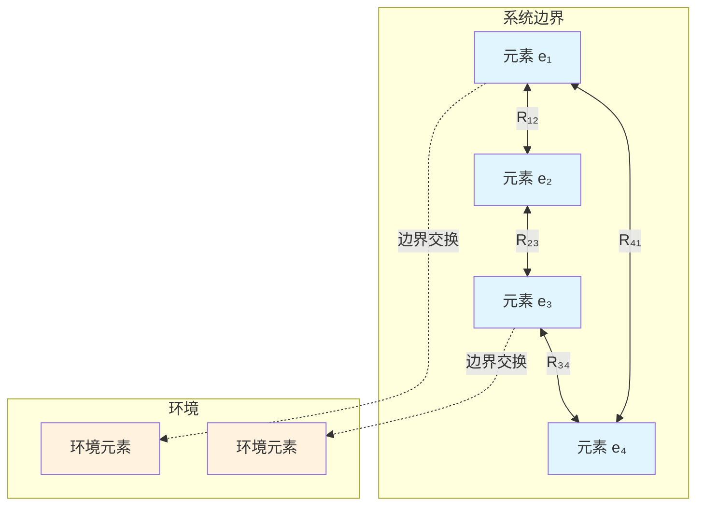
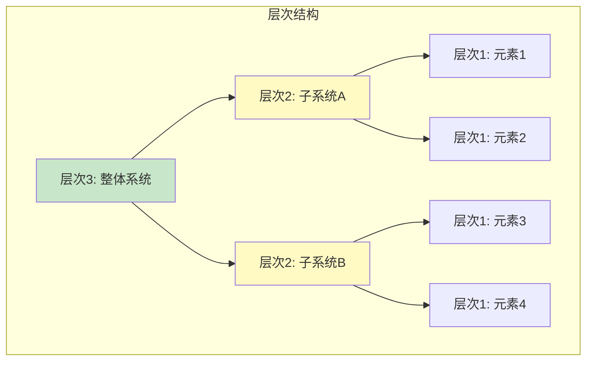

# 11.1 系统的概念

---

📌 **内容摘要**

本文档深入探讨系统的概念的核心原理和关键方法。内容涵盖一般系统论领域的主要知识点，包括相关理论、方法及应用。适合初学者建立基础知识体系。

**关键词**: 一般系统论

📚 **学习目标**

- 理解系统的概念的基本概念和核心原理
- 掌握相关术语和符号表示
- 建立该领域的系统性知识框架

🎯 **难度级别**: 初级

⏱️ **预计阅读时间**: 15分钟

**前置知识**: 基础数学知识

---


> 参考：Bertalanffy, L. von. (1968). _General System Theory: Foundations, Development, Applications_. George Braziller.

---

## 11.1.1 系统的形式化定义

### 11.1.1.1 Bertalanffy系统定义

**定义 11.1.1**（系统）：系统 $S$ 是一个有序三元组：

$$S = (E, R, \mathcal{B})$$

其中：

- $E$：元素集合（Components），$E = \{e_1, e_2, \ldots, e_n\}$
- $R$：关系集合（Relations），$R \subseteq E \times E$
- $\mathcal{B}$：边界（Boundary），$\mathcal{B}: E \to \{0, 1\}$

**定义 11.1.2**（系统状态）：系统状态 $x(t)$ 是时间 $t$ 时所有元素属性的集合：

$$x(t) = (x_1(t), x_2(t), \ldots, x_n(t)) \in \mathcal{X}$$

其中 $\mathcal{X}$ 为状态空间。

**定义 11.1.3**（状态空间）：系统状态空间定义为：

$$\mathcal{X} = \prod_{i=1}^{n} \mathcal{X}_i$$

其中 $\mathcal{X}_i$ 为第 $i$ 个元素的状态空间。

### 11.1.1.2 系统动力学的数学描述

**定义 11.1.4**（系统动力学方程）：系统演化由状态方程描述：

$$\frac{dx}{dt} = f(x, u, t)$$

其中：

- $x \in \mathcal{X}$：状态向量
- $u \in \mathcal{U}$：输入/控制向量
- $f: \mathcal{X} \times \mathcal{U} \times \mathbb{R} \to \mathcal{X}$：演化函数

**定理 11.1.1**（解的存在唯一性）：若 $f$ 满足Lipschitz条件：

$$\|f(x_1, u, t) - f(x_2, u, t)\| \leq L\|x_1 - x_2\|$$

则对任意初值 $x(t_0) = x_0$，系统存在唯一解。

**证明**：

由Picard-Lindelöf定理，考虑积分形式：

$$x(t) = x_0 + \int_{t_0}^{t} f(x(\tau), u(\tau), \tau) d\tau$$

构造迭代序列：

$$x^{(k+1)}(t) = x_0 + \int_{t_0}^{t} f(x^{(k)}(\tau), u(\tau), \tau) d\tau$$

对任意 $t \in [t_0, t_0 + \delta]$：

$$\|x^{(k+1)}(t) - x^{(k)}(t)\| \leq \int_{t_0}^{t} L\|x^{(k)}(\tau) - x^{(k-1)}(\tau)\| d\tau$$

由压缩映射原理，序列收敛到唯一解。$\square$

---

## 11.1.2 系统边界与环境

### 11.1.2.1 边界的形式化定义

**定义 11.1.5**（系统边界）：边界是区分系统与环境的数学结构：

$$\mathcal{B} = \{e \in E : \exists e' \in E^c, (e, e') \in R_{ext}\}$$

其中 $E^c$ 为环境元素集，$R_{ext}$ 为外部关系。

**定义 11.1.6**（环境）：系统 $S$ 的环境 $Env(S)$ 定义为：

$$Env(S) = (E_{env}, R_{env}, \mathcal{B}_{env})$$

满足：$E \cap E_{env} = \emptyset$ 且 $R_{int} \subseteq E \times E$，$R_{ext} \subseteq E \times E_{env}$

### 11.1.2.2 边界类型

**定义 11.1.7**（刚性边界）：若边界 $\mathcal{B}$ 满足：

$$\frac{\partial \mathcal{B}}{\partial t} = 0$$

则称边界为刚性边界（Fixed Boundary）。

**定义 11.1.8**（柔性边界）：若边界随系统演化而变化：

$$\mathcal{B}(t) = \mathcal{B}(x(t), t)$$

则称边界为柔性边界（Adaptive Boundary）。

**定义 11.1.9**（渗透边界）：若边界允许物质、能量、信息的交换：

$$\exists \phi: E \times E_{env} \times \mathbb{R} \to \mathbb{R}^m$$

其中 $\phi$ 为交换流（Exchange Flux），则称边界为渗透边界。

---

## 11.1.3 系统的层次与组织

### 11.1.3.1 层次结构的形式化

**定义 11.1.10**（层次）：系统的层次 $L$ 是元素的偏序集：

$$L = (E, \preceq)$$

其中 $\preceq$ 表示"属于"或"组成"关系。

**定义 11.1.11**（层次分解）：系统 $S$ 可分解为层次：

$$S = \bigcup_{i=1}^{h} S_i$$

其中 $S_i = (E_i, R_i, \mathcal{B}_i)$ 为第 $i$ 层子系统，且：

$$E_i \cap E_j = \emptyset \quad \forall i \neq j$$

### 11.1.3.2 层次间的关系

**定义 11.1.12**（跨层关系）：设 $e_i \in S_i$，$e_j \in S_j$，$i < j$，则跨层关系定义为：

$$(e_i, e_j) \in R_{cross} \iff e_i \in Comp(e_j)$$

其中 $Comp(e_j)$ 表示组成 $e_j$ 的元素集合。

**定理 11.1.2**（层次分离原理）：若系统层次满足：

$$R_{cross} = \emptyset \Rightarrow R = \bigcup_{i=1}^{h} R_i$$

即各层次独立演化，无跨层相互作用。

---

## 11.1.4 系统的整体性

### 11.1.4.1 整体性公理

**公理 11.1.1**（整体性公理）：系统的整体性质不能由部分性质简单叠加得到：

$$\exists P: P(S) \neq \bigoplus_{i=1}^{n} P(e_i)$$

其中 $\oplus$ 表示某种组合运算。

**定义 11.1.13**（系统涌现性质）：性质 $P$ 是涌现的，当且仅当：

$$P \in Props(S) \land P \notin \bigcup_{i=1}^{n} Props(e_i)$$

### 11.1.4.2 同构与同态

**定义 11.1.14**（系统同构）：系统 $S_1$ 与 $S_2$ 同构，记为 $S_1 \cong S_2$，若存在双射：

$$\phi: E_1 \to E_2$$

使得：$(e_i, e_j) \in R_1 \iff (\phi(e_i), \phi(e_j)) \in R_2$

**定理 11.1.3**（同构系统的等价性）：若 $S_1 \cong S_2$，则对所有系统性质 $P$：

$$P(S_1) = P(S_2)$$

---

## 11.1.5 系统概念的Python实现

```python
"""
系统科学基础：系统的概念
基于Bertalanffy一般系统论的形式化实现
"""

import numpy as np
from typing import Set, Tuple, Callable, Dict, List, Optional
from dataclasses import dataclass
from abc import ABC, abstractmethod
import matplotlib.pyplot as plt
from matplotlib.patches import Circle, FancyBboxPatch


@dataclass
class SystemElement:
    """系统元素"""
    id: str
    properties: Dict[str, float]

    def __hash__(self):
        return hash(self.id)

    def __eq__(self, other):
        return isinstance(other, SystemElement) and self.id == other.id


class SystemBoundary:
    """系统边界"""

    def __init__(self, boundary_func: Callable[[SystemElement], bool]):
        """
        初始化边界

        Args:
            boundary_func: 判断元素是否在系统内的函数
        """
        self.boundary_func = boundary_func
        self.is_permeable = True

    def contains(self, element: SystemElement) -> bool:
        """判断元素是否在系统内部"""
        return self.boundary_func(element)

    def set_permeability(self, permeable: bool):
        """设置边界渗透性"""
        self.is_permeable = permeable


class GeneralSystem:
    """
    一般系统 (Bertalanffy定义)
    S = (E, R, B)
    """

    def __init__(self, name: str):
        self.name = name
        self.elements: Set[SystemElement] = set()
        self.relations: Set[Tuple[SystemElement, SystemElement]] = set()
        self.boundary: Optional[SystemBoundary] = None
        self.state_history: List[Dict] = []
        self.time = 0.0

    def add_element(self, element: SystemElement) -> 'GeneralSystem':
        """添加元素到系统"""
        self.elements.add(element)
        return self

    def add_relation(self, e1: SystemElement, e2: SystemElement) -> 'GeneralSystem':
        """添加元素间关系"""
        if e1 in self.elements and e2 in self.elements:
            self.relations.add((e1, e2))
        return self

    def set_boundary(self, boundary: SystemBoundary):
        """设置系统边界"""
        self.boundary = boundary

    def get_state(self) -> Dict[str, np.ndarray]:
        """获取当前系统状态"""
        return {
            e.id: np.array(list(e.properties.values()))
            for e in self.elements
        }

    def get_internal_elements(self) -> Set[SystemElement]:
        """获取系统内部元素"""
        if self.boundary is None:
            return self.elements
        return {e for e in self.elements if self.boundary.contains(e)}

    def get_boundary_elements(self) -> Set[SystemElement]:
        """获取边界元素（与环境有关系的元素）"""
        internal = self.get_internal_elements()
        boundary = set()
        for e1, e2 in self.relations:
            if (e1 in internal and e2 not in internal) or \
               (e2 in internal and e1 not in internal):
                boundary.add(e1 if e1 in internal else e2)
        return boundary

    def evolve(self, dt: float, dynamics: Callable[['GeneralSystem', float], None]):
        """系统演化"""
        self.state_history.append({
            'time': self.time,
            'state': self.get_state()
        })
        dynamics(self, dt)
        self.time += dt

    def is_isomorphic(self, other: 'GeneralSystem') -> bool:
        """检查两个系统是否同构（简化检查）"""
        if len(self.elements) != len(other.elements):
            return False
        if len(self.relations) != len(other.relations):
            return False
        return True  # 简化处理，实际需要更复杂的图同构算法

    def visualize(self, ax=None):
        """可视化系统结构"""
        if ax is None:
            fig, ax = plt.subplots(figsize=(10, 8))

        # 使用弹簧布局计算位置
        positions = self._spring_layout()

        # 绘制元素
        for elem, pos in positions.items():
            color = 'lightblue' if self.boundary is None or self.boundary.contains(elem) else 'lightgray'
            circle = Circle(pos, 0.08, color=color, ec='black', linewidth=2)
            ax.add_patch(circle)
            ax.text(pos[0], pos[1], elem.id, ha='center', va='center', fontsize=10)

        # 绘制关系
        for e1, e2 in self.relations:
            if e1 in positions and e2 in positions:
                p1, p2 = positions[e1], positions[e2]
                ax.arrow(p1[0], p1[1], p2[0]-p1[0], p2[1]-p1[1],
                        head_width=0.03, head_length=0.02, fc='gray', ec='gray',
                        length_includes_head=True, alpha=0.6)

        ax.set_xlim(-1.5, 1.5)
        ax.set_ylim(-1.5, 1.5)
        ax.set_aspect('equal')
        ax.set_title(f'System: {self.name}')
        ax.axis('off')

        return ax

    def _spring_layout(self, iterations=50) -> Dict[SystemElement, np.ndarray]:
        """简单的弹簧布局算法"""
        positions = {e: np.random.randn(2) * 0.5 for e in self.elements}

        for _ in range(iterations):
            forces = {e: np.zeros(2) for e in self.elements}

            # 斥力
            for e1 in self.elements:
                for e2 in self.elements:
                    if e1 != e2:
                        diff = positions[e1] - positions[e2]
                        dist = np.linalg.norm(diff) + 0.01
                        forces[e1] += 0.01 * diff / dist**2

            # 引力（对有关系连接的元素）
            for e1, e2 in self.relations:
                diff = positions[e2] - positions[e1]
                forces[e1] += 0.001 * diff
                forces[e2] -= 0.001 * diff

            # 更新位置
            for e in self.elements:
                positions[e] += 0.1 * forces[e]

        return positions


def example_ecosystem():
    """创建生态系统示例"""
    # 创建元素
    producer = SystemElement("Producer", {"biomass": 100, "energy": 50})
    herbivore = SystemElement("Herbivore", {"biomass": 50, "energy": 30})
    carnivore = SystemElement("Carnivore", {"biomass": 20, "energy": 15})
    decomposer = SystemElement("Decomposer", {"biomass": 10, "energy": 5})

    # 创建系统
    ecosystem = GeneralSystem("Ecosystem")
    for elem in [producer, herbivore, carnivore, decomposer]:
        ecosystem.add_element(elem)

    # 添加食物链关系
    ecosystem.add_relation(producer, herbivore)  # 生产者 → 草食动物
    ecosystem.add_relation(herbivore, carnivore)  # 草食动物 → 肉食动物
    ecosystem.add_relation(carnivore, decomposer)  # 肉食动物 → 分解者
    ecosystem.add_relation(producer, decomposer)  # 生产者 → 分解者
    ecosystem.add_relation(herbivore, decomposer)  # 草食动物 → 分解者

    # 设置边界（只包含核心生物群落）
    boundary = SystemBoundary(
        lambda e: e.id in ["Producer", "Herbivore", "Carnivore"]
    )
    ecosystem.set_boundary(boundary)

    return ecosystem


def example_social_system():
    """创建社会系统示例"""
    individuals = [
        SystemElement(f"Person_{i}", {"wealth": np.random.uniform(0, 100),
                                       "influence": np.random.uniform(0, 50)})
        for i in range(10)
    ]

    social_system = GeneralSystem("Social Network")
    for person in individuals:
        social_system.add_element(person)

    # 随机添加社会关系
    np.random.seed(42)
    for i, p1 in enumerate(individuals):
        for j, p2 in enumerate(individuals):
            if i < j and np.random.random() < 0.3:
                social_system.add_relation(p1, p2)

    return social_system


if __name__ == "__main__":
    # 示例1：生态系统
    print("=" * 50)
    print("Example 1: Ecosystem System")
    print("=" * 50)

    ecosystem = example_ecosystem()
    print(f"System: {ecosystem.name}")
    print(f"Elements: {[e.id for e in ecosystem.elements]}")
    print(f"Relations: {len(ecosystem.relations)}")
    print(f"Internal Elements: {[e.id for e in ecosystem.get_internal_elements()]}")
    print(f"Boundary Elements: {[e.id for e in ecosystem.get_boundary_elements()]}")

    # 可视化
    fig, axes = plt.subplots(1, 2, figsize=(14, 6))
    ecosystem.visualize(axes[0])

    # 示例2：社会系统
    print("\n" + "=" * 50)
    print("Example 2: Social System")
    print("=" * 50)

    social = example_social_system()
    print(f"System: {social.name}")
    print(f"Elements: {len(social.elements)}")
    print(f"Relations: {len(social.relations)}")

    social.visualize(axes[1])
    plt.tight_layout()
    plt.savefig('system_concepts.png', dpi=150, bbox_inches='tight')
    plt.show()

    print("\nVisualization saved to 'system_concepts.png'")
```

---

## 11.1.6 Mermaid系统图





---

## 11.1.7 参考文献

1. Bertalanffy, L. von. (1968). _General System Theory: Foundations, Development, Applications_. New York: George Braziller.

2. Klir, G. J. (1991). _Facets of Systems Science_. New York: Plenum Press.

3. Checkland, P. (1999). _Systems Thinking, Systems Practice_. Chichester: Wiley.

4. Senge, P. M. (1990). _The Fifth Discipline: The Art and Practice of the Learning Organization_. New York: Doubleday.

---

## 📚 延伸阅读

- [11.3 涌现与层次](./11_系统科学/01_一般系统论/01.3_涌现与层次.md)
- [03.1 系统动力学](./05_形式化理论/03_控制论/03.1_系统动力学.md)
- [11.11 分形与幂律](./11_系统科学/03_复杂系统/03.3_分形与幂律.md)
- [11.1 一般系统论](./11_系统科学/01_一般系统论.md)
