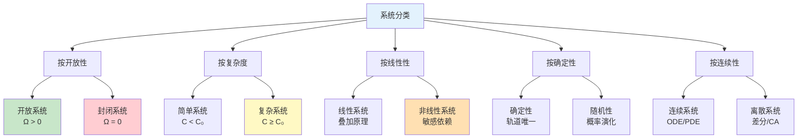
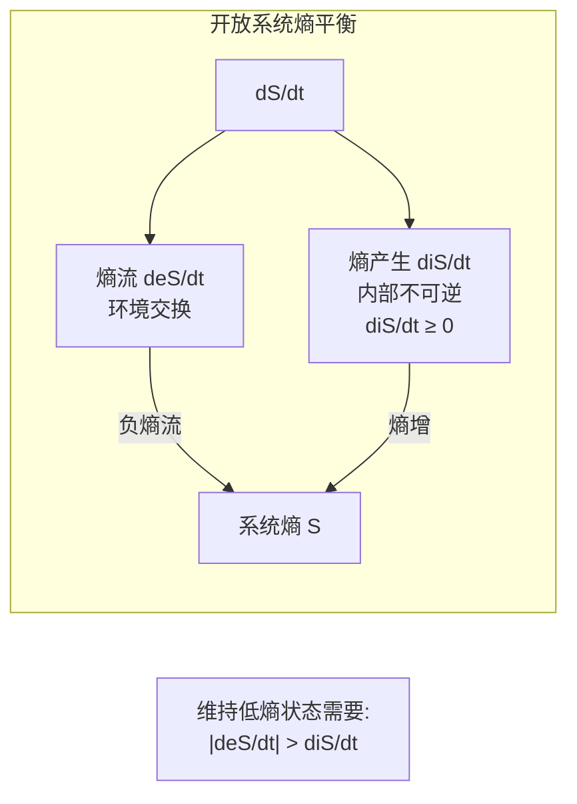

# 11.2 系统分类

> 参考：Bertalanffy, L. von. (1968). _General System Theory_; Boulding, K. (1956). "General Systems Theory: The Skeleton of Science"

---

## 11.2.1 开放系统与封闭系统

### 11.2.1.1 形式化定义

**定义 11.2.1**（封闭系统）：系统 $S$ 是封闭的，当且仅当：

$$\forall t: \frac{dM}{dt} = 0, \quad \frac{dE}{dt} = 0, \quad \frac{dI}{dt} = 0$$

其中 $M$ 为物质，$E$ 为能量，$I$ 为信息。

**定义 11.2.2**（开放系统）：系统 $S$ 是开放的，当且仅当存在至少一种交换：

$$\exists t: \frac{dM}{dt} \neq 0 \lor \frac{dE}{dt} \neq 0 \lor \frac{dI}{dt} \neq 0$$

**定义 11.2.3**（开放度）：系统开放度定义为：

$$\Omega = \frac{\|\Phi_{in}\| + \|\Phi_{out}\|}{\|S_{internal}\|}$$

其中 $\Phi$ 表示交换流，$\|S_{internal}\|$ 为系统内部度量。

### 11.2.1.2 Bertalanffy开放系统方程

**定义 11.2.4**（开放系统状态方程）：开放系统满足：

$$\frac{dQ_i}{dt} = T_i + P_i$$

其中：

- $Q_i$：第 $i$ 个状态变量
- $T_i$：系统内部产生的变化率
- $P_i$：与环境的交换率

**定理 11.2.1**（开放系统的稳态）：若系统存在稳态 $Q^*$，则：

$$T_i(Q^*) = -P_i(Q^*)$$

即内部变化被外部交换所平衡。

**证明**：

在稳态，$\frac{dQ_i}{dt} = 0$，因此：

$$0 = T_i(Q^*) + P_i(Q^*) \Rightarrow T_i(Q^*) = -P_i(Q^*)$$

这表示系统内部产生的物质/能量/信息被输出所平衡，或输入被内部消耗所平衡。$\square$

### 11.2.1.3 开放系统的特征

**定义 11.2.5**（系统熵）：系统熵定义为：

$$S_{sys} = -k_B \sum_{i} p_i \ln p_i$$

其中 $p_i$ 为系统处于第 $i$ 个微观状态的概率。

**定理 11.2.2**（开放系统的熵平衡）：开放系统的熵变化满足：

$$\frac{dS}{dt} = \frac{d_e S}{dt} + \frac{d_i S}{dt}$$

其中：

- $\frac{d_e S}{dt}$：熵流（与环境交换）
- $\frac{d_i S}{dt} \geq 0$：熵产生（内部不可逆过程）

**推论 11.2.1**：开放系统可以维持低熵状态，即使 $\frac{d_i S}{dt} > 0$，只要：

$$\frac{d_e S}{dt} < -\frac{d_i S}{dt}$$

---

## 11.2.2 简单系统与复杂系统

### 11.2.2.1 复杂度度量

**定义 11.2.6**（系统复杂度）：基于Kolmogorov复杂度，系统复杂度定义为：

$$C(S) = \min\{|p| : U(p) = S\}$$

其中 $U$ 为通用图灵机，$p$ 为程序。

**定义 11.2.7**（有效复杂度）：Gell-Mann有效复杂度定义为：

$$C_{eff}(S) = H(S) - H(S|Env)$$

其中 $H$ 为香农熵。

**定义 11.2.8**（简单系统）：若 $C(S) < C_{threshold}$ 且系统行为可预测，则称 $S$ 为简单系统。

**定义 11.2.9**（复杂系统）：若 $C(S) \geq C_{threshold}$ 且系统呈现涌现行为，则称 $S$ 为复杂系统。

### 11.2.2.2 系统分类谱系

**定义 11.2.10**（系统九层分类）：基于Boulding的分类：

| 层级 | 类型 | 特征 | 示例 |
|------|------|------|------|
| 1 | 框架 | 静态结构 | 晶体结构 |
| 2 | 时钟机构 | 简单动态系统 | 钟表、太阳系 |
| 3 | 控制机制 | 闭环控制 | 恒温器 |
| 4 | 开放系统 | 自我维持 | 细胞 |
| 5 | 低级有机体 | 有目的行为 | 植物 |
| 6 | 动物 | 意识、学习 | 动物 |
| 7 | 人类 | 自我意识 | 人 |
| 8 | 社会组织 | 角色、规范 | 组织 |
| 9 | 超越系统 | 未知 | ? |

---

## 11.2.3 线性系统与非线性系统

### 11.2.3.1 线性系统的形式化

**定义 11.2.11**（线性系统）：系统 $S$ 是线性的，若其动力学方程满足叠加原理：

$$f(\alpha x_1 + \beta x_2) = \alpha f(x_1) + \beta f(x_2)$$

**定理 11.2.3**（线性系统的叠加原理）：设 $x_1(t)$ 和 $x_2(t)$ 分别为输入 $u_1(t)$ 和 $u_2(t)$ 的响应，则对输入 $\alpha u_1 + \beta u_2$，响应为：

$$x(t) = \alpha x_1(t) + \beta x_2(t)$$

**证明**：

由线性性：

$$\frac{d}{dt}(\alpha x_1 + \beta x_2) = \alpha \frac{dx_1}{dt} + \beta \frac{dx_2}{dt} = \alpha f(x_1) + \beta f(x_2) = f(\alpha x_1 + \beta x_2)$$

因此 $\alpha x_1 + \beta x_2$ 满足系统方程。$\square$

### 11.2.3.2 非线性系统的特征

**定义 11.2.12**（非线性系统）：不满足叠加原理的系统称为非线性系统。

**定义 11.2.13**（非线性度）：系统非线性度定义为：

$$NL(S) = \sup_{x_1, x_2, \alpha, \beta} \frac{\|f(\alpha x_1 + \beta x_2) - \alpha f(x_1) - \beta f(x_2)\|}{\|\alpha x_1 + \beta x_2\|}$$

**定理 11.2.4**（非线性系统的敏感性）：非线性系统对初值敏感：

$$\exists \delta > 0: \|x_0 - x'_0\| < \delta \Rightarrow \|x(t) - x'(t)\| \text{ 可任意大}$$

---

## 11.2.4 确定性系统与随机系统

### 11.2.4.1 确定性系统

**定义 11.2.14**（确定性系统）：若系统状态完全由初值和输入决定：

$$x(t) = \phi(t, t_0, x_0, u)$$

其中 $\phi$ 为确定性演化函数。

**定理 11.2.5**（确定性演化）：确定性系统的相空间轨道不相交。

**证明**：假设存在交点 $x^*$，则有两个不同的历史 $x_1(t)$ 和 $x_2(t)$ 都到达 $x^*$，违反确定性。$\square$

### 11.2.4.2 随机系统

**定义 11.2.15**（随机系统）：系统状态为随机过程：

$$dX_t = f(X_t, t)dt + g(X_t, t)dW_t$$

其中 $W_t$ 为维纳过程（布朗运动）。

**定义 11.2.16**（概率演化）：随机系统的概率密度演化由Fokker-Planck方程描述：

$$\frac{\partial p}{\partial t} = -\frac{\partial}{\partial x}(f p) + \frac{1}{2}\frac{\partial^2}{\partial x^2}(g^2 p)$$

---

## 11.2.5 离散系统与连续系统

### 11.2.5.1 形式化定义

**定义 11.2.17**（连续系统）：状态空间和时间都连续的系统：

$$\frac{dx}{dt} = f(x, t), \quad x \in \mathbb{R}^n, \quad t \in \mathbb{R}$$

**定义 11.2.18**（离散系统）：状态空间或时间离散（或两者都离散）的系统：

$$x_{k+1} = f(x_k, k), \quad x_k \in \mathbb{R}^n \text{ 或 } \mathbb{Z}^n, \quad k \in \mathbb{Z}$$

**定义 11.2.19**（元胞自动机）：离散时空系统：

$$s_i^{t+1} = f(s_{i-r}^t, \ldots, s_i^t, \ldots, s_{i+r}^t)$$

其中 $s_i^t \in \Sigma$（有限状态集），$r$ 为邻域半径。

### 11.2.5.2 离散-连续对应

**定理 11.2.6**（Euler离散化）：连续系统可通过离散化近似：

$$x_{k+1} = x_k + h f(x_k, t_k) + O(h^2)$$

**定理 11.2.7**（离散化的稳定性条件）：若 $f$ Lipschitz常数为 $L$，则当 $h < 2/L$ 时，Euler方法稳定。

---

## 11.2.6 Python实现：系统分类仿真

```python
"""
系统科学：系统分类
基于Bertalanffy开放系统理论和系统分类学
"""

import numpy as np
from typing import Callable, Tuple, Optional
from dataclasses import dataclass
from enum import Enum, auto
import matplotlib.pyplot as plt
from scipy.integrate import odeint
from scipy.stats import entropy


class SystemType(Enum):
    """系统类型枚举"""
    CLOSED = auto()        # 封闭系统
    OPEN = auto()          # 开放系统
    SIMPLE = auto()        # 简单系统
    COMPLEX = auto()       # 复杂系统
    LINEAR = auto()        # 线性系统
    NONLINEAR = auto()     # 非线性系统
    DETERMINISTIC = auto() # 确定性系统
    STOCHASTIC = auto()    # 随机系统


@dataclass
class SystemClassification:
    """系统分类属性"""
    is_open: bool = False
    complexity: float = 0.0
    linearity: float = 1.0  # 1.0 = 完全线性
    determinism: float = 1.0  # 1.0 = 完全确定
    entropy_production: float = 0.0


class OpenSystem:
    """
    Bertalanffy开放系统
    dQ/dt = T + P (内部变化 + 环境交换)
    """

    def __init__(self, n_states: int, exchange_rate: float = 0.1):
        self.n = n_states
        self.state = np.ones(n_states) / n_states
        self.exchange_rate = exchange_rate
        self.history = []

    def internal_dynamics(self, Q: np.ndarray) -> np.ndarray:
        """内部动力学 T(Q) """
        # 简单的内部反应模型
        T = -0.1 * Q + 0.05 * np.roll(Q, 1)
        return T

    def exchange(self, Q: np.ndarray, env: np.ndarray) -> np.ndarray:
        """环境交换 P(Q, env) """
        # 与环境的物质/能量交换
        P = self.exchange_rate * (env - Q)
        return P

    def evolve(self, env: np.ndarray, dt: float = 0.01, steps: int = 1000):
        """系统演化"""
        self.history = [self.state.copy()]

        for _ in range(steps):
            T = self.internal_dynamics(self.state)
            P = self.exchange(self.state, env)
            dQ = T + P
            self.state += dt * dQ
            self.state = np.clip(self.state, 0, None)  # 非负约束
            self.state /= (self.state.sum() + 1e-10)  # 归一化
            self.history.append(self.state.copy())

    def compute_entropy(self) -> float:
        """计算系统熵"""
        return entropy(self.state + 1e-10)

    def entropy_flow(self) -> float:
        """计算熵流 deS/dt """
        if len(self.history) < 2:
            return 0
        entropies = [entropy(h + 1e-10) for h in self.history[-100:]]
        return np.polyfit(range(len(entropies)), entropies, 1)[0]


class ClosedSystem:
    """
    封闭系统
    dM/dt = 0, dE/dt = 0, dI/dt = 0
    """

    def __init__(self, initial_state: np.ndarray,
                 dynamics: Callable[[np.ndarray, float], np.ndarray]):
        self.state = initial_state.copy()
        self.dynamics = dynamics
        self.history = []
        self.total_mass = initial_state.sum()
        self.total_energy = np.sum(initial_state ** 2)

    def evolve(self, dt: float = 0.01, steps: int = 1000):
        """演化并验证封闭性"""
        self.history = [self.state.copy()]
        t = 0

        for _ in range(steps):
            # Runge-Kutta 4阶积分
            k1 = self.dynamics(self.state, t)
            k2 = self.dynamics(self.state + 0.5*dt*k1, t + 0.5*dt)
            k3 = self.dynamics(self.state + 0.5*dt*k2, t + 0.5*dt)
            k4 = self.dynamics(self.state + dt*k3, t + dt)

            self.state += (dt/6) * (k1 + 2*k2 + 2*k3 + k4)
            self.history.append(self.state.copy())
            t += dt

    def verify_conservation(self) -> Tuple[float, float]:
        """验证守恒律"""
        current_mass = self.state.sum()
        current_energy = np.sum(self.state ** 2)

        mass_error = abs(current_mass - self.total_mass) / self.total_mass
        energy_error = abs(current_energy - self.total_energy) / self.total_energy

        return mass_error, energy_error


class LinearSystem:
    """线性系统: dx/dt = Ax + Bu"""

    def __init__(self, A: np.ndarray, B: Optional[np.ndarray] = None):
        self.A = A
        self.B = B
        self.n = A.shape[0]
        self.state = np.zeros(self.n)

    def dynamics(self, x: np.ndarray, u: np.ndarray = None) -> np.ndarray:
        """线性动力学"""
        dx = self.A @ x
        if u is not None and self.B is not None:
            dx += self.B @ u
        return dx

    def is_stable(self) -> bool:
        """检查稳定性（所有特征值实部为负）"""
        eigenvalues = np.linalg.eigvals(self.A)
        return np.all(np.real(eigenvalues) < 0)

    def check_superposition(self, x1: np.ndarray, x2: np.ndarray,
                           alpha: float = 1.0, beta: float = 1.0) -> float:
        """验证叠加原理"""
        # f(alpha*x1 + beta*x2)
        lhs = self.dynamics(alpha * x1 + beta * x2)
        # alpha*f(x1) + beta*f(x2)
        rhs = alpha * self.dynamics(x1) + beta * self.dynamics(x2)
        return np.linalg.norm(lhs - rhs)


class NonlinearSystem:
    """非线性系统示例"""

    def __init__(self, system_type: str = "logistic"):
        self.type = system_type
        self.state = np.array([0.5])

    def dynamics(self, x: np.ndarray, t: float = 0) -> np.ndarray:
        """非线性动力学"""
        if self.type == "logistic":
            r, K = 1.0, 1.0  # 增长率，承载能力
            return np.array([r * x[0] * (1 - x[0]/K)])
        elif self.type == "lorenz":
            sigma, rho, beta = 10.0, 28.0, 8/3
            if len(x) < 3:
                x = np.array([x[0], 0, 0])
            dx = np.array([
                sigma * (x[1] - x[0]),
                x[0] * (rho - x[2]) - x[1],
                x[0] * x[1] - beta * x[2]
            ])
            return dx
        return np.zeros_like(x)

    def compute_nonlinearity(self, x_range: Tuple[float, float] = (-1, 1),
                            n_points: int = 100) -> float:
        """计算系统的非线性度"""
        xs = np.linspace(x_range[0], x_range[1], n_points)
        max_nl = 0

        for i, x1 in enumerate(xs):
            for x2 in xs[i+1:]:
                for alpha in [0.3, 0.5, 0.7]:
                    beta = 1 - alpha
                    x_combined = alpha * x1 + beta * x2
                    f_combined = self.dynamics(np.array([x_combined]))[0]
                    f_separate = alpha * self.dynamics(np.array([x1]))[0] + \
                                beta * self.dynamics(np.array([x2]))[0]
                    nl = abs(f_combined - f_separate)
                    max_nl = max(max_nl, nl)

        return max_nl


def compare_system_types():
    """比较不同系统类型"""
    print("=" * 60)
    print("System Classification Comparison")
    print("=" * 60)

    # 1. 开放系统 vs 封闭系统
    print("\n1. Open System vs Closed System")
    print("-" * 40)

    # 封闭系统：能量守恒
    def pendulum(x, t):
        theta, omega = x
        g, L = 9.8, 1.0
        return np.array([omega, -(g/L) * np.sin(theta)])

    closed_sys = ClosedSystem(np.array([np.pi/4, 0]), pendulum)
    closed_sys.evolve(dt=0.01, steps=1000)
    mass_err, energy_err = closed_sys.verify_conservation()
    print(f"   Closed System (Pendulum):")
    print(f"   - Mass conservation error: {mass_err:.2e}")
    print(f"   - Energy conservation error: {energy_err:.2e}")

    # 开放系统
    open_sys = OpenSystem(n_states=3, exchange_rate=0.2)
    env = np.array([0.5, 0.3, 0.2])
    open_sys.evolve(env, steps=1000)
    print(f"\n   Open System (Chemical Reactions):")
    print(f"   - Final state: {open_sys.state}")
    print(f"   - System entropy: {open_sys.compute_entropy():.4f}")
    print(f"   - Entropy flow rate: {open_sys.entropy_flow():.6f}")

    # 2. 线性系统
    print("\n2. Linear System Analysis")
    print("-" * 40)

    A = np.array([[-1, 0.5], [0.3, -0.8]])
    lin_sys = LinearSystem(A)
    print(f"   System matrix A:\n{A}")
    print(f"   Is stable: {lin_sys.is_stable()}")
    print(f"   Eigenvalues: {np.linalg.eigvals(A)}")

    # 验证叠加原理
    x1, x2 = np.array([1, 0]), np.array([0, 1])
    error = lin_sys.check_superposition(x1, x2, alpha=0.5, beta=0.5)
    print(f"   Superposition principle error: {error:.2e}")

    # 3. 非线性系统
    print("\n3. Nonlinear System Analysis")
    print("-" * 40)

    nonlin_sys = NonlinearSystem("logistic")
    nl_measure = nonlin_sys.compute_nonlinearity(x_range=(0, 1))
    print(f"   Logistic growth system:")
    print(f"   - Nonlinearity measure: {nl_measure:.4f}")

    # Lorenz系统
    lorenz = NonlinearSystem("lorenz")
    lorenz.state = np.array([1.0, 1.0, 1.0])
    from scipy.integrate import odeint
    trajectory = odeint(lambda x, t: lorenz.dynamics(x, t),
                       lorenz.state, np.linspace(0, 50, 5000))
    print(f"   Lorenz system trajectory length: {len(trajectory)}")

    # 4. 复杂度分析
    print("\n4. Complexity Analysis")
    print("-" * 40)

    simple_hist = np.array([0.9, 0.05, 0.03, 0.02])
    complex_hist = np.array([0.25, 0.25, 0.25, 0.25])

    simple_entropy = entropy(simple_hist)
    complex_entropy = entropy(complex_hist)

    print(f"   Simple system entropy: {simple_entropy:.4f}")
    print(f"   Complex system entropy: {complex_entropy:.4f}")
    print(f"   Entropy ratio (complex/simple): {complex_entropy/simple_entropy:.2f}")

    return closed_sys, open_sys, lin_sys, nonlin_sys, lorenz


def visualize_classifications():
    """可视化系统分类"""
    fig, axes = plt.subplots(2, 3, figsize=(15, 10))

    # 1. 封闭系统：单摆
    def pendulum(x, t):
        theta, omega = x
        return np.array([omega, -9.8 * np.sin(theta)])

    closed = ClosedSystem(np.array([np.pi/3, 0]), pendulum)
    closed.evolve(dt=0.01, steps=2000)
    traj = np.array(closed.history)

    axes[0, 0].plot(traj[:, 0], traj[:, 1])
    axes[0, 0].set_title('Closed System: Pendulum Phase Space')
    axes[0, 0].set_xlabel('θ')
    axes[0, 0].set_ylabel('ω')

    # 2. 开放系统：状态演化
    open_sys = OpenSystem(n_states=3)
    open_sys.evolve(np.array([0.6, 0.3, 0.1]), steps=2000)
    history = np.array(open_sys.history)

    axes[0, 1].plot(history)
    axes[0, 1].set_title('Open System: State Evolution')
    axes[0, 1].set_xlabel('Time')
    axes[0, 1].set_ylabel('State Value')
    axes[0, 1].legend(['State 1', 'State 2', 'State 3'])

    # 3. 线性系统稳定性
    A = np.array([[-0.5, 0.2], [0.1, -0.3]])
    lin = LinearSystem(A)
    times = np.linspace(0, 10, 1000)
    x0 = np.array([1, 0.5])
    trajectory = odeint(lambda x, t: lin.dynamics(x), x0, times)

    axes[0, 2].plot(times, trajectory)
    axes[0, 2].set_title('Linear System: Stable Response')
    axes[0, 2].set_xlabel('Time')
    axes[0, 2].legend(['x₁', 'x₂'])

    # 4. 非线性系统：Logistic
    nonlin = NonlinearSystem("logistic")
    times = np.linspace(0, 10, 1000)
    traj = odeint(lambda x, t: nonlin.dynamics(x, t), [0.1], times)

    axes[1, 0].plot(times, traj)
    axes[1, 0].set_title('Nonlinear: Logistic Growth')
    axes[1, 0].set_xlabel('Time')
    axes[1, 0].set_ylabel('Population')

    # 5. Lorenz吸引子
    lorenz = NonlinearSystem("lorenz")
    times = np.linspace(0, 50, 5000)
    traj = odeint(lambda x, t: lorenz.dynamics(x, t), [1, 1, 1], times)

    axes[1, 1].plot(traj[:, 0], traj[:, 2], alpha=0.5, linewidth=0.5)
    axes[1, 1].set_title('Chaotic: Lorenz Attractor (x-z)')
    axes[1, 1].set_xlabel('x')
    axes[1, 1].set_ylabel('z')

    # 6. 复杂度比较
    entropies = []
    labels = ['Deterministic\n(Ordered)', 'Simple', 'Complex', 'Random']
    probs_list = [
        [0.99, 0.005, 0.003, 0.002],
        [0.6, 0.3, 0.08, 0.02],
        [0.3, 0.25, 0.25, 0.2],
        [0.25, 0.25, 0.25, 0.25]
    ]

    for probs in probs_list:
        entropies.append(entropy(probs))

    axes[1, 2].bar(labels, entropies, color=['#4CAF50', '#2196F3', '#FF9800', '#9C27B0'])
    axes[1, 2].set_title('Entropy vs System Type')
    axes[1, 2].set_ylabel('Entropy (bits)')

    plt.tight_layout()
    plt.savefig('system_classification.png', dpi=150, bbox_inches='tight')
    plt.show()


if __name__ == "__main__":
    compare_system_types()
    visualize_classifications()
    print("\nVisualization saved to 'system_classification.png'")
```

---

## 11.2.7 Mermaid分类图





---

## 11.2.8 参考文献

1. Bertalanffy, L. von. (1968). _General System Theory: Foundations, Development, Applications_. George Braziller.

2. Boulding, K. E. (1956). "General Systems Theory: The Skeleton of Science". _Management Science_, 2(3), 197-208.

3. Nicolis, G., & Prigogine, I. (1977). _Self-Organization in Nonequilibrium Systems_. Wiley.

4. Gell-Mann, M. (1994). _The Quark and the Jaguar_. W.H. Freeman.
