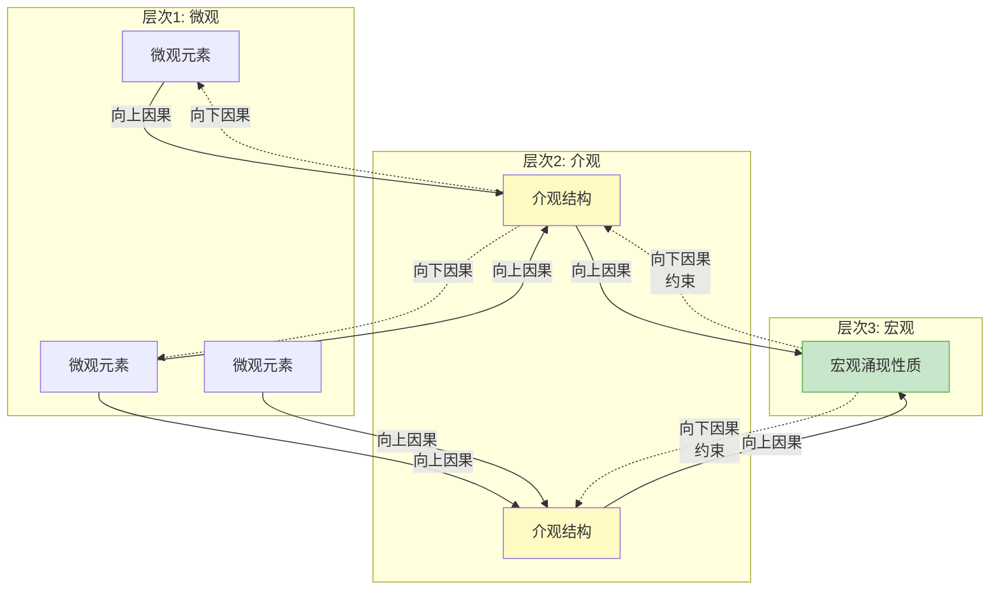
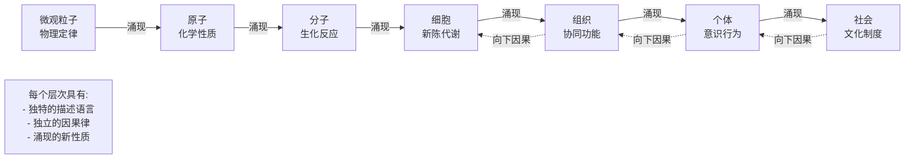

# 11.3 涌现与层次

---

📌 **内容摘要**

本文档深入探讨涌现与层次的核心原理和关键方法。内容涵盖一般系统论领域的主要知识点，包括相关理论、方法及应用。适合有一定基础的学习者系统学习。

**关键词**: 一般系统论

📚 **学习目标**

- 掌握涌现与层次的核心概念和主要方法
- 理解相关理论的应用场景
- 建立该领域的系统性知识框架

🎯 **难度级别**: 中级

⏱️ **预计阅读时间**: 15分钟

**前置知识**: 相关领域的基础概念

---


> 参考：Anderson, P. W. (1972). "More is Different"; Holland, J. H. (1998). _Emergence: From Chaos to Order_

---

## 11.3.1 涌现的形式化定义

### 11.3.1.1 涌现的基本概念

**定义 11.3.1**（涌现）：性质 $P$ 是涌现的，当且仅当：

$$P \in \mathcal{P}(S) \setminus \bigcup_{i} \mathcal{P}(e_i)$$

其中 $S$ 为系统，$e_i$ 为系统组分，$\mathcal{P}$ 表示性质集合。

**定义 11.3.2**（弱涌现）：性质 $P$ 是弱涌现的，若：

$$P = f(\{e_i\}) \land P \notin \{e_i\}$$

其中 $f$ 为可计算函数，但计算复杂度极高。

**定义 11.3.3**（强涌现）：性质 $P$ 是强涌现的，若：

$$P \neq f(\{e_i\}) \quad \forall \text{ 可计算函数 } f$$

即 $P$ 不能由组分性质推导得出。

### 11.3.1.2 涌现的度量

**定义 11.3.4**（涌现度）：系统 $S$ 的涌现度定义为：

$$E(S) = H(S) - \sum_{i} H(S_i) + \sum_{i<j} I(S_i; S_j)$$

其中 $H$ 为熵，$I$ 为互信息。

**定义 11.3.5**（有效信息）：组分 $S_i$ 对整体性质 $P$ 的有效贡献：

$$EI(S_i \to P) = H(P) - H(P | S_i)$$

**定理 11.3.1**（涌现的不可还原性）：若 $P$ 是涌现性质，则：

$$EI(S; P) < H(P)$$

即系统信息不能完全由组分信息还原。

**证明**：

由涌现定义，$P$ 包含超越组分简单组合的信息。设 $S = \{S_1, \ldots, S_n\}$，则：

$$H(P) = I(S; P) + H(P | S) = \sum_{i} EI(S_i \to P) - \text{冗余} + H(P | S)$$

由于涌现性质不能由单个组分完全决定，$H(P | S) > 0$，因此：

$$\sum_{i} EI(S_i \to P) < H(P) \quad \square$$

---

## 11.3.2 层次理论

### 11.3.2.1 层次的形式化

**定义 11.3.6**（层次结构）：层次结构 $H$ 是有序对：

$$H = (\mathcal{L}, \preceq)$$

其中：

- $\mathcal{L} = \{L_1, L_2, \ldots, L_h\}$：层次集合
- $\preceq$：层次间的偏序关系（"组成于"或"实现于"）

**定义 11.3.7**（层次映射）：从层次 $L_i$ 到 $L_{i+1}$ 的映射：

$$\phi_i: L_i \to 2^{L_{i+1}}$$

其中 $2^{L_{i+1}}$ 为 $L_{i+1}$ 的幂集。

**定义 11.3.8**（层次的粒度）：层次 $L_i$ 的粒度定义为：

$$G(L_i) = \frac{1}{|L_i|} \sum_{x \in L_i} |Comp(x)|$$

其中 $Comp(x)$ 为组成 $x$ 的低层次元素集合。

### 11.3.2.2 层次间的因果关系

**定义 11.3.9**（向下因果）：高层次性质对低层次行为的约束：

$$C_{down}: P_{high} \to \mathcal{C}_{low}$$

其中 $\mathcal{C}_{low}$ 为低层次行为的约束集合。

**定义 11.3.10**（向上因果）：低层次相互作用产生高层次性质：

$$C_{up}: \{e_i\} \to P_{high}$$

**定理 11.3.2**（层次的相对自主性）：各层次具有相对独立的描述和因果律：

$$\exists \mathcal{L}_i: Caus(L_i) \not\subseteq Caus(L_{i-1})$$

**证明**：

由涌现性质的存在，$L_i$ 中存在不能由 $L_{i-1}$ 完全解释的现象。例如：

- 化学层次：分子的化学性质
- 生物层次：生命的自我复制

化学定律不能完全解释生物行为，因此生物层次具有相对自主性。$\square$

---

## 11.3.3 多尺度系统

### 11.3.3.1 尺度分离

**定义 11.3.11**（特征尺度）：层次 $L_i$ 的特征尺度：

$$\tau_i = \frac{1}{|L_i|} \sum_{x \in L_i} \tau(x)$$

其中 $\tau(x)$ 为元素 $x$ 的特征时间尺度。

**定义 11.3.12**（尺度分离）：若层次间满足：

$$\frac{\tau_{i+1}}{\tau_i} \gg 1$$

则称层次间存在尺度分离。

**定理 11.3.3**（绝热消去）：若存在尺度分离，则快变量可绝热消去：

$$\frac{dx_{fast}}{dt} = 0 \Rightarrow x_{fast} = x_{fast}(x_{slow})$$

**证明**：

设快变量弛豫时间 $\tau_f$，慢变量时间尺度 $\tau_s$，且 $\tau_f \ll \tau_s$。

在时间 $\Delta t$ 满足 $\tau_f \ll \Delta t \ll \tau_s$ 内：

- 快变量已达到准稳态：$\frac{dx_{fast}}{dt} \approx 0$
- 慢变量几乎不变

因此可设 $\frac{dx_{fast}}{dt} = 0$，解得 $x_{fast}$ 作为 $x_{slow}$ 的函数。$\square$

---

## 11.3.4 自组织与涌现

### 11.3.4.1 自组织的形式化

**定义 11.3.13**（自组织）：系统 $S$ 是自组织的，若：

$$\exists t_1 < t_2: Order(S(t_2)) > Order(S(t_1))$$

其中 $Order$ 为有序度度量，且无外源有序输入。

**定义 11.3.14**（有序度）：系统有序度：

$$Order(S) = 1 - \frac{S_{actual}}{S_{max}}$$

其中 $S_{actual}$ 为实际熵，$S_{max}$ 为最大熵。

### 11.3.4.2 涌现的生成机制

**定义 11.3.15**（模式形成）：自组织导致的宏观模式：

$$Pattern = \{x \in S: \Phi(x) > \theta\}$$

其中 $\Phi$ 为序参量，$\theta$ 为阈值。

**定理 11.3.4**（涌现的必要条件）：涌现需要：

1. **非线性相互作用**：$f(x_1 + x_2) \neq f(x_1) + f(x_2)$
2. **反馈机制**：存在循环因果关系
3. **远离平衡态**：$\|\nabla \mu\| > \epsilon$（化学势梯度）

---

## 11.3.5 Python实现：涌现仿真

```python
"""
系统科学：涌现与层次
基于Anderson "More is Different" 和复杂系统涌现理论
"""

import numpy as np
from typing import List, Callable, Dict, Tuple
from dataclasses import dataclass
import matplotlib.pyplot as plt
from scipy.ndimage import convolve
from scipy.stats import entropy


@dataclass
class EmergentProperty:
    """涌现性质"""
    name: str
    value: float
    level: int  # 出现的层次
    reducible: bool  # 是否可还原


class CellularAutomaton:
    """
    元胞自动机：涌现的经典模型
    """

    def __init__(self, size: Tuple[int, int], rule: int = 110):
        self.size = size
        self.grid = np.random.randint(0, 2, size)
        self.rule = rule
        self.rule_binary = format(rule, '08b')
        self.history = [self.grid.copy()]

    def get_neighbors(self, i: int, j: int) -> int:
        """获取邻居状态（Moore邻域）"""
        total = 0
        for di in [-1, 0, 1]:
            for dj in [-1, 0, 1]:
                if di == 0 and dj == 0:
                    continue
                ni, nj = (i + di) % self.size[0], (j + dj) % self.size[1]
                total += self.grid[ni, nj]
        return total

    def step(self):
        """演化一步"""
        new_grid = self.grid.copy()

        for i in range(self.size[0]):
            for j in range(self.size[1]):
                neighbors = self.get_neighbors(i, j)

                # Conway's Game of Life规则
                if self.grid[i, j] == 1:  # 活细胞
                    if neighbors < 2 or neighbors > 3:
                        new_grid[i, j] = 0  # 死亡
                else:  # 死细胞
                    if neighbors == 3:
                        new_grid[i, j] = 1  # 出生

        self.grid = new_grid
        self.history.append(self.grid.copy())

    def compute_emergent_properties(self) -> Dict[str, float]:
        """计算涌现性质"""
        # 1. 密度
        density = np.mean(self.grid)

        # 2. 聚类（使用连通分量）
        from scipy.ndimage import label
        labeled, num_clusters = label(self.grid)

        # 3. 熵
        hist, _ = np.histogram(self.grid, bins=2)
        ent = entropy(hist + 1e-10)

        # 4. 模式复杂度（使用空间相关性）
        correlation = self._spatial_correlation()

        return {
            'density': density,
            'num_clusters': num_clusters,
            'entropy': ent,
            'spatial_correlation': correlation
        }

    def _spatial_correlation(self, max_dist: int = 10) -> float:
        """计算空间相关性"""
        correlations = []
        for d in range(1, max_dist + 1):
            shifted = np.roll(self.grid, d, axis=0)
            corr = np.corrcoef(self.grid.flatten(), shifted.flatten())[0, 1]
            if not np.isnan(corr):
                correlations.append(abs(corr))
        return np.mean(correlations) if correlations else 0

    def visualize(self, ax=None):
        """可视化"""
        if ax is None:
            fig, ax = plt.subplots(figsize=(8, 8))

        ax.imshow(self.grid, cmap='binary', interpolation='nearest')
        ax.set_title(f'Cellular Automaton (Rule: Life)')
        return ax


class HierarchicalSystem:
    """
    层次系统模型
    实现多层次、多尺度的系统结构
    """

    def __init__(self, n_levels: int, elements_per_level: List[int]):
        self.n_levels = n_levels
        self.elements_per_level = elements_per_level
        self.levels = []

        # 初始化各层次
        for i, n_elem in enumerate(elements_per_level):
            level = {
                'id': i,
                'elements': np.random.randn(n_elem),
                'timescale': 10 ** i,  # 层次越高，时间尺度越长
                'interactions': np.random.randn(n_elem, n_elem) * 0.1
            }
            self.levels.append(level)

        # 建立层次间映射
        self.hierarchy_maps = []
        for i in range(n_levels - 1):
            # 低层次到高层次的聚合映射
            n_low = elements_per_level[i]
            n_high = elements_per_level[i + 1]
            map_matrix = np.random.randn(n_high, n_low) / np.sqrt(n_low)
            self.hierarchy_maps.append(map_matrix)

    def upward_causation(self, level_idx: int) -> np.ndarray:
        """向上因果：低层次 → 高层次"""
        if level_idx >= self.n_levels - 1:
            return None

        low_level = self.levels[level_idx]['elements']
        map_matrix = self.hierarchy_maps[level_idx]

        # 聚合到低层次
        high_level_input = map_matrix @ low_level

        # 非线性激活（涌现的关键）
        high_level_output = np.tanh(high_level_input)

        return high_level_output

    def downward_causation(self, level_idx: int) -> np.ndarray:
        """向下因果：高层次 → 低层次约束"""
        if level_idx <= 0:
            return None

        high_level = self.levels[level_idx]['elements']
        map_matrix = self.hierarchy_maps[level_idx - 1]

        # 高层次对低层次的约束
        constraint = map_matrix.T @ high_level

        return constraint

    def adiabatic_elimination(self, fast_level: int, slow_level: int):
        """
        绝热消去：消去快变量
        假设 fast_level 的时间尺度 << slow_level 的时间尺度
        """
        fast_timescale = self.levels[fast_level]['timescale']
        slow_timescale = self.levels[slow_level]['timescale']

        if fast_timescale >= slow_timescale:
            print(f"Warning: Level {fast_level} is not faster than level {slow_level}")
            return None

        # 快变量达到准稳态
        fast_elements = self.levels[fast_level]['elements']
        interactions = self.levels[fast_level]['interactions']

        # 解方程: interactions @ fast_elements + external = 0
        # 简化为快变量等于相互作用的结果
        steady_state = np.linalg.solve(
            np.eye(len(fast_elements)) - interactions,
            np.zeros(len(fast_elements))
        )

        return steady_state

    def evolve(self, n_steps: int = 100):
        """多尺度演化"""
        history = {i: [] for i in range(self.n_levels)}

        for step in range(n_steps):
            # 各层次按各自时间尺度演化
            for level_idx, level in enumerate(self.levels):
                if step % max(1, level['timescale'] // 10) == 0:
                    # 内部演化
                    elements = level['elements']
                    interactions = level['interactions']

                    # 线性动力学 + 非线性相互作用
                    change = interactions @ elements - 0.1 * elements
                    change += 0.01 * np.random.randn(len(elements))  # 噪声

                    level['elements'] += 0.01 * change
                    history[level_idx].append(level['elements'].copy())

            # 层次间相互作用（每隔一定步数）
            if step % 10 == 0:
                for i in range(self.n_levels - 1):
                    upward = self.upward_causation(i)
                    if upward is not None:
                        self.levels[i + 1]['elements'] += 0.1 * upward

        return history

    def compute_emergence_measure(self) -> float:
        """计算涌现度量"""
        # 基于互信息的涌现度量
        emergence = 0

        for i in range(self.n_levels - 1):
            low = self.levels[i]['elements']
            high = self.levels[i + 1]['elements']

            # 计算层次间的互信息（简化估计）
            # 使用相关性作为互信息的代理
            mapped = self.hierarchy_maps[i] @ low
            if len(mapped) == len(high):
                correlation = np.corrcoef(mapped, high)[0, 1] if len(mapped) > 1 else 0
                emergence += abs(correlation)

        return emergence / max(1, self.n_levels - 1)


class EmergenceDetector:
    """
    涌现检测器
    检测系统中的涌现现象
    """

    def __init__(self, system_history: List[np.ndarray]):
        self.history = system_history

    def detect_phase_transition(self) -> List[int]:
        """检测相变点"""
        # 使用熵的变化率检测相变
        entropies = [entropy(h.flatten() + 1e-10) for h in self.history]
        entropy_changes = np.diff(entropies)

        # 寻找熵变化率的突变点
        threshold = np.std(entropy_changes) * 2
        transitions = np.where(np.abs(entropy_changes) > threshold)[0]

        return transitions.tolist()

    def compute_effective_information(self, partition: np.ndarray) -> float:
        """
        计算有效信息 (Effective Information)
        基于Tononi等人的Integrated Information Theory
        """
        # 简化实现：使用方差解释率
        if len(self.history) < 2:
            return 0

        # 计算整体和分区的方差
        whole_variance = np.var([np.mean(h) for h in self.history])

        # 分区方差
        partitioned_variances = []
        n_parts = len(partition)
        for i in range(n_parts):
            part_mask = partition == i
            part_variance = np.var([np.mean(h[part_mask]) for h in self.history])
            partitioned_variances.append(part_variance)

        # 有效信息 = 整体信息 - 分区信息之和
        ei = whole_variance - sum(partitioned_variances)

        return max(0, ei)

    def measure_downward_causation(self, macro_var: np.ndarray,
                                   micro_vars: List[np.ndarray]) -> float:
        """
        测量向下因果的强度
        """
        # 宏观变量对微观变量的约束强度
        constraints = []

        for micro in micro_vars:
            if len(micro) == len(macro_var):
                # 计算宏观对微观的预测能力
                correlation = np.corrcoef(macro_var, micro)[0, 1]
                if not np.isnan(correlation):
                    constraints.append(abs(correlation))

        return np.mean(constraints) if constraints else 0


def example_emergence_cellular_automata():
    """元胞自动机涌现示例"""
    print("=" * 60)
    print("Cellular Automata: Emergence Example")
    print("=" * 60)

    # 创建元胞自动机
    ca = CellularAutomaton((50, 50))

    # 演化
    print("\nEvolving cellular automaton...")
    for i in range(100):
        ca.step()
        if i % 20 == 0:
            props = ca.compute_emergent_properties()
            print(f"  Step {i}: Density={props['density']:.3f}, "
                  f"Clusters={props['num_clusters']}, "
                  f"Entropy={props['entropy']:.3f}")

    return ca


def example_hierarchical_emergence():
    """层次涌现示例"""
    print("\n" + "=" * 60)
    print("Hierarchical System: Multi-level Emergence")
    print("=" * 60)

    # 创建3层系统
    # 微观 (100) → 介观 (20) → 宏观 (5)
    hier_sys = HierarchicalSystem(3, [100, 20, 5])

    print(f"\nSystem structure:")
    for i, level in enumerate(hier_sys.levels):
        print(f"  Level {i}: {len(level['elements'])} elements, "
              f"timescale={level['timescale']}")

    # 测试向上因果
    print("\nUpward causation (micro → meso):")
    upward = hier_sys.upward_causation(0)
    print(f"  Result shape: {upward.shape if upward is not None else 'None'}")
    print(f"  Output range: [{upward.min():.3f}, {upward.max():.3f}]" if upward is not None else "")

    # 测试向下因果
    print("\nDownward causation (meso → micro):")
    downward = hier_sys.downward_causation(1)
    print(f"  Result shape: {downward.shape if downward is not None else 'None'}")

    # 绝热消去
    print("\nAdiabatic elimination (fast level 0):")
    steady = hier_sys.adiabatic_elimination(0, 1)
    print(f"  Steady state shape: {steady.shape if steady is not None else 'None'}")

    # 演化
    print("\nEvolving hierarchical system...")
    history = hier_sys.evolve(n_steps=200)

    # 计算涌现度量
    emergence = hier_sys.compute_emergence_measure()
    print(f"\nEmergence measure: {emergence:.4f}")

    return hier_sys, history


def visualize_emergence():
    """可视化涌现现象"""
    fig, axes = plt.subplots(2, 3, figsize=(15, 10))

    # 1. 元胞自动机初始状态
    ca = CellularAutomaton((40, 40))
    axes[0, 0].imshow(ca.grid, cmap='binary')
    axes[0, 0].set_title('CA: Initial State')
    axes[0, 0].axis('off')

    # 2. 元胞自动机演化后
    for _ in range(50):
        ca.step()
    axes[0, 1].imshow(ca.grid, cmap='binary')
    axes[0, 1].set_title('CA: After 50 Steps\n(Glider patterns emerge)')
    axes[0, 1].axis('off')

    # 3. 性质演化
    ca2 = CellularAutomaton((30, 30))
    densities = []
    entropies = []
    clusters = []

    for step in range(100):
        props = ca2.compute_emergent_properties()
        densities.append(props['density'])
        entropies.append(props['entropy'])
        clusters.append(props['num_clusters'])
        ca2.step()

    axes[0, 2].plot(densities, label='Density', linewidth=2)
    axes[0, 2].plot(np.array(entropies)/max(entropies), label='Normalized Entropy', linewidth=2)
    axes[0, 2].set_title('Emergent Properties Evolution')
    axes[0, 2].set_xlabel('Time Step')
    axes[0, 2].legend()
    axes[0, 2].grid(True, alpha=0.3)

    # 4. 层次系统结构
    hier = HierarchicalSystem(3, [20, 8, 3])

    # 绘制层次结构
    level_positions = [(0.2, 0.5), (0.5, 0.5), (0.8, 0.5)]
    colors = ['#FF6B6B', '#4ECDC4', '#45B7D1']

    for i, (pos, color) in enumerate(zip(level_positions, colors)):
        n = len(hier.levels[i]['elements'])
        y_positions = np.linspace(0.1, 0.9, n)
        for y in y_positions:
            axes[1, 0].scatter(pos[0], y, c=color, s=50, alpha=0.6)

    # 绘制层次连接
    for i in range(2):
        for j in range(min(5, len(hier.levels[i]['elements']))):
            y1 = 0.1 + j * (0.8 / max(1, len(hier.levels[i]['elements']) - 1))
            for k in range(min(3, len(hier.levels[i+1]['elements']))):
                y2 = 0.1 + k * (0.8 / max(1, len(hier.levels[i+1]['elements']) - 1))
                if np.random.random() < 0.3:
                    axes[1, 0].annotate('', xy=(level_positions[i+1][0], y2),
                                       xytext=(level_positions[i][0], y1),
                                       arrowprops=dict(arrowstyle='->', color='gray', alpha=0.3))

    axes[1, 0].set_xlim(0, 1)
    axes[1, 0].set_ylim(0, 1)
    axes[1, 0].set_title('Hierarchical Structure\n(3 Levels)')
    axes[1, 0].axis('off')

    # 5. 层次时间尺度
    timescales = [level['timescale'] for level in hier.levels]
    axes[1, 1].bar(range(len(timescales)), timescales, color=colors)
    axes[1, 1].set_title('Timescales by Level')
    axes[1, 1].set_xlabel('Level')
    axes[1, 1].set_ylabel('Timescale')
    axes[1, 1].set_yscale('log')

    # 6. 涌现度量示意
    hier2 = HierarchicalSystem(3, [50, 15, 5])
    history = hier2.evolve(n_steps=100)

    # 绘制各层次演化
    for level_idx in range(3):
        if history[level_idx]:
            mean_activity = [np.mean(state) for state in history[level_idx]]
            axes[1, 2].plot(mean_activity, label=f'Level {level_idx}', linewidth=2)

    axes[1, 2].set_title('Multi-level Dynamics')
    axes[1, 2].set_xlabel('Time')
    axes[1, 2].set_ylabel('Mean Activity')
    axes[1, 2].legend()
    axes[1, 2].grid(True, alpha=0.3)

    plt.tight_layout()
    plt.savefig('emergence_hierarchy.png', dpi=150, bbox_inches='tight')
    plt.show()


if __name__ == "__main__":
    ca = example_emergence_cellular_automata()
    hier_sys, history = example_hierarchical_emergence()
    visualize_emergence()
    print("\nVisualization saved to 'emergence_hierarchy.png'")
```

---

## 11.3.6 Mermaid层次图





---

## 11.3.7 参考文献

1. Anderson, P. W. (1972). "More is Different". _Science_, 177(4047), 393-396.

2. Holland, J. H. (1998). _Emergence: From Chaos to Order_. Addison-Wesley.

3. Tononi, G., et al. (2016). "Integrated information theory: from consciousness to its physical substrate". _Nature Reviews Neuroscience_, 17(7), 450-461.

4. Deacon, T. W. (2006). _Incomplete Nature: How Mind Emerged from Matter_. W.W. Norton.

5. Clayton, P., & Davies, P. (Eds.). (2006). _The Re-Emergence of Emergence_. Oxford University Press.

---

## 📚 延伸阅读

- [10.1.2 熵的定义与性质](../../10_信息论/01_香农信息论基础/01.2_熵的定义与性质.md)
- [10.1.4 互信息与相对熵](../../10_信息论/01_香农信息论基础/01.4_互信息与相对熵.md)
- [11.10 相变与临界现象](../03_复杂系统/03.2_相变与临界现象.md)
