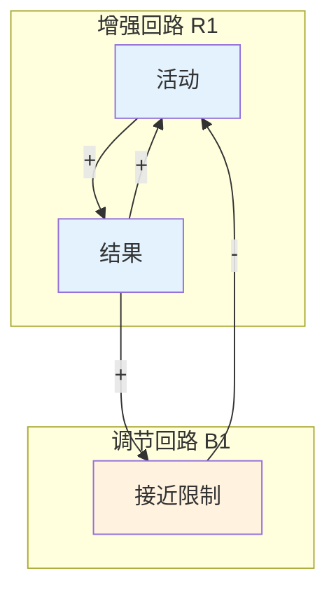
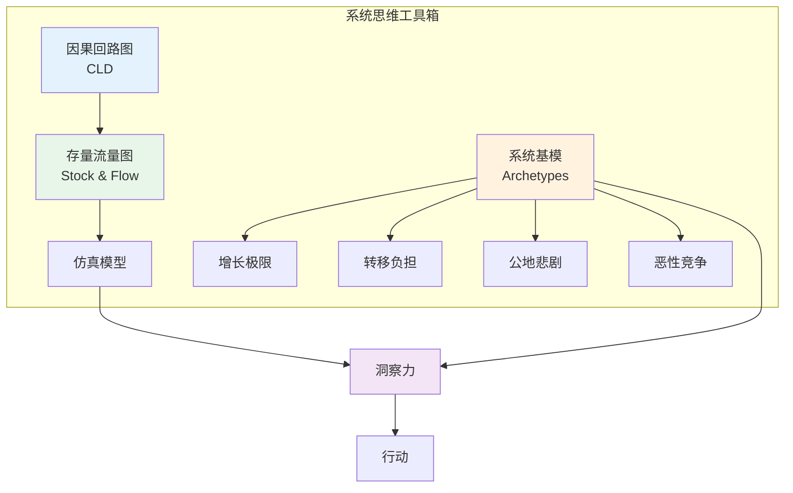

# 11.4 系统思维

---

📌 **内容摘要**

本文档深入探讨系统思维的核心原理和关键方法。内容涵盖一般系统论领域的主要知识点，包括知识逻辑, 形式认识论, 认知科学等关键主题。适合有一定基础的学习者系统学习。

**关键词**: 知识逻辑, 一般系统论, 形式认识论, 认知科学

📚 **学习目标**

- 掌握系统思维的核心概念和主要方法
- 理解相关理论的应用场景
- 建立该领域的系统性知识框架

🎯 **难度级别**: 中级

⏱️ **预计阅读时间**: 15分钟

**前置知识**: 相关领域的基础概念

---


> 参考：Senge, P. M. (1990). _The Fifth Discipline_; Meadows, D. H. (2008). _Thinking in Systems_

---

## 11.4.1 系统思维的方法论基础

### 11.4.1.1 系统思维的定义

**定义 11.4.1**（系统思维）：系统思维是一种认知框架，强调整体性、相互关联性和动态演化：

$$\text{Systems Thinking} = \{(H, R, D, F)\}$$

其中：

- $H$（Holism）：整体性视角
- $R$（Relations）：关系优先于实体
- $D$（Dynamics）：动态演化过程
- $F$（Feedback）：反馈循环结构

**定义 11.4.2**（心智模型）：对系统的内部表征：

$$M = \langle S, C, I \rangle$$

- $S$：结构（系统组分及其关系）
- $C$：因果（因果关系网络）
- $I$：意图（系统目的和行为倾向）

### 11.4.1.2 系统思维的核心原则

**原则 11.4.1**（整体性原则）：

$$\text{The whole} \neq \sum \text{parts}$$

系统的整体性质不能还原为部分性质的简单加和。

**原则 11.4.2**（边界批判原则）：

$$\mathcal{B} \text{ is a choice, not a given}$$

系统边界是认知建构，而非客观存在。

**原则 11.4.3**（反馈回路原则）：

$$\text{Structure} \Rightarrow \text{Behavior}$$

系统行为由其反馈结构决定。

---

## 11.4.2 因果回路图

### 11.4.2.1 因果关系的类型

**定义 11.4.3**（正因果）：变量 $A$ 对变量 $B$ 有正因果影响：

$$\frac{\partial B}{\partial A} > 0$$

记为：$A \xrightarrow{+} B$

**定义 11.4.4**（负因果）：变量 $A$ 对变量 $B$ 有负因果影响：

$$\frac{\partial B}{\partial A} < 0$$

记为：$A \xrightarrow{-} B$

**定义 11.4.5**（因果回路）：有向图 $G = (V, E)$，其中：

- $V$：系统变量集合
- $E \subseteq V \times V \times \{+, -\}$：带符号的因果关系边

### 11.4.2.2 反馈回路的类型

**定义 11.4.6**（增强回路）：正反馈回路，回路中负因果数为偶数：

$$R_{reinforcing}: (-1)^{n_-} = 1$$

其中 $n_-$ 为回路中负因果边的数量。

**定义 11.4.7**（调节回路）：负反馈回路，回路中负因果数为奇数：

$$R_{balancing}: (-1)^{n_-} = -1$$

**定理 11.4.1**（回路极性定理）：回路 $L$ 的极性为：

$$Polarity(L) = \prod_{e \in L} sign(e)$$

其中 $sign(e) \in \{+1, -1\}$。

**证明**：沿回路追踪变量变化。设初始变量变化为 $\Delta$，经过正因果边时符号不变，经过负因果边时符号反转。回路总效应为各边符号的乘积。$\square$

---

## 11.4.3 系统基模

### 11.4.3.1 常见的系统基模

**定义 11.4.8**（系统基模）：反复出现的系统结构模式。

**基模 1：增长极限（Limits to Growth）**

结构：

```
增长回路: A → B → C → A (+)
抑制回路: C → D → C (-)
```

行为：初期指数增长，后期趋于平稳或下降。

**基模 2：转移负担（Shifting the Burden）**

结构：

```
问题 → 症状缓解 → 问题感知降低 (-)
问题 → 根本解决 → 问题解决 (-)
症状缓解 → 根本解决能力降低 (-)
```

**基模 3：公地悲剧（Tragedy of the Commons）**

结构：

```
个体收益 → 个体行动 → 资源消耗 → 个体收益 (+)
资源消耗 → 资源存量 → 个体收益 (-)
```

### 11.4.3.2 基模的形式化

**定义 11.4.9**（基模识别）：给定系统 $S$ 和基模库 $\mathcal{P}$，识别问题为：

$$Find(P \in \mathcal{P}): Subgraph(P) \subseteq S$$

即寻找与系统子图同构的基模。

---

## 11.4.4 系统动力学建模

### 11.4.4.1 存量-流量结构

**定义 11.4.10**（存量）：累积量，状态变量：

$$Stock(t) = Stock(t_0) + \int_{t_0}^{t} [Inflow(s) - Outflow(s)] ds$$

**定义 11.4.11**（流量）：存量的变化率：

$$Flow = \frac{d(Stock)}{dt}$$

**定义 11.4.12**（延迟）：流量对信息的响应延迟：

$$Flow(t) = f(Information(t - \tau))$$

其中 $\tau$ 为延迟时间。

### 11.4.4.2 系统行为的模式

**定义 11.4.13**（行为模式）：系统变量的时间轨迹类型：

1. **指数增长**：$x(t) = x_0 e^{rt}$
2. **渐进目标**：$x(t) = x^* - (x^* - x_0)e^{-kt}$
3. **振荡**：$x(t) = A \sin(\omega t + \phi)$
4. **S型增长**：$x(t) = \frac{K}{1 + e^{-r(t-t_0)}}$
5. **超调与崩溃**：增长超过承载能力后的下降

**定理 11.4.2**（主导回路识别）：系统行为由当前主导回路决定：

$$Dominant(t) = \arg\max_{L} |Gain(L, t)|$$

其中 $Gain(L, t)$ 为回路 $L$ 在时刻 $t$ 的增益。

---

## 11.4.5 Python实现：系统思维工具

```python
"""
系统科学：系统思维方法
基于Senge《第五项修炼》和Meadows《系统之美》
"""

import numpy as np
from typing import Dict, List, Tuple, Callable, Set
from dataclasses import dataclass
from enum import Enum
import matplotlib.pyplot as plt
import networkx as nx
from scipy.integrate import odeint


class CausalType(Enum):
    """因果类型"""
    POSITIVE = "+"
    NEGATIVE = "-"


@dataclass
class CausalLink:
    """因果链接"""
    source: str
    target: str
    causal_type: CausalType
    strength: float = 1.0


class CausalLoopDiagram:
    """
    因果回路图 (CLD)
    """

    def __init__(self, name: str = "CLD"):
        self.name = name
        self.variables: Set[str] = set()
        self.links: List[CausalLink] = []
        self.graph = nx.DiGraph()

    def add_variable(self, name: str) -> 'CausalLoopDiagram':
        """添加变量"""
        self.variables.add(name)
        self.graph.add_node(name)
        return self

    def add_link(self, source: str, target: str,
                 causal_type: CausalType, strength: float = 1.0):
        """添加因果链接"""
        if source not in self.variables:
            self.add_variable(source)
        if target not in self.variables:
            self.add_variable(target)

        link = CausalLink(source, target, causal_type, strength)
        self.links.append(link)
        self.graph.add_edge(source, target,
                           sign=causal_type.value,
                           strength=strength)
        return self

    def find_loops(self) -> List[List[str]]:
        """查找所有回路"""
        loops = []
        try:
            cycles = list(nx.simple_cycles(self.graph))
            loops = [cycle for cycle in cycles if len(cycle) >= 2]
        except:
            pass
        return loops

    def loop_polarity(self, loop: List[str]) -> str:
        """确定回路极性"""
        polarity = 1
        n = len(loop)

        for i in range(n):
            source = loop[i]
            target = loop[(i + 1) % n]

            if self.graph.has_edge(source, target):
                sign = self.graph[source][target].get('sign', '+')
                if sign == '-':
                    polarity *= -1

        return "Reinforcing (+)" if polarity == 1 else "Balancing (-)"

    def analyze_structure(self) -> Dict:
        """分析结构"""
        loops = self.find_loops()

        reinforcing = 0
        balancing = 0

        for loop in loops:
            if self.loop_polarity(loop).startswith("Reinforcing"):
                reinforcing += 1
            else:
                balancing += 1

        return {
            'num_variables': len(self.variables),
            'num_links': len(self.links),
            'num_loops': len(loops),
            'reinforcing_loops': reinforcing,
            'balancing_loops': balancing,
            'loops': loops
        }

    def visualize(self, ax=None, layout='spring'):
        """可视化因果回路图"""
        if ax is None:
            fig, ax = plt.subplots(figsize=(12, 10))

        # 选择布局
        if layout == 'spring':
            pos = nx.spring_layout(self.graph, k=2, iterations=50)
        elif layout == 'circular':
            pos = nx.circular_layout(self.graph)
        else:
            pos = nx.shell_layout(self.graph)

        # 绘制节点
        nx.draw_networkx_nodes(self.graph, pos, node_color='lightblue',
                              node_size=3000, ax=ax)
        nx.draw_networkx_labels(self.graph, pos, font_size=10, ax=ax)

        # 绘制边（带符号颜色）
        positive_edges = [(u, v) for u, v, d in self.graph.edges(data=True)
                         if d.get('sign', '+') == '+']
        negative_edges = [(u, v) for u, v, d in self.graph.edges(data=True)
                         if d.get('sign', '+') == '-']

        nx.draw_networkx_edges(self.graph, pos, edgelist=positive_edges,
                              edge_color='green', arrows=True,
                              arrowsize=20, width=2, ax=ax)
        nx.draw_networkx_edges(self.graph, pos, edgelist=negative_edges,
                              edge_color='red', arrows=True,
                              arrowsize=20, width=2, ax=ax,
                              style='dashed')

        # 添加符号标签
        edge_labels = {}
        for u, v, d in self.graph.edges(data=True):
            edge_labels[(u, v)] = d.get('sign', '+')
        nx.draw_networkx_edge_labels(self.graph, pos, edge_labels, ax=ax)

        ax.set_title(f'Causal Loop Diagram: {self.name}')
        ax.axis('off')

        return ax


class SystemArchetype:
    """
    系统基模库
    """

    @staticmethod
    def limits_to_growth() -> CausalLoopDiagram:
        """
        增长极限基模
        初期快速增长，后期遇到限制
        """
        cld = CausalLoopDiagram("Limits to Growth")

        # 增长回路
        cld.add_link("Growth Activity", "Growth Results", CausalType.POSITIVE)
        cld.add_link("Growth Results", "Growth Activity", CausalType.POSITIVE)

        # 限制回路
        cld.add_link("Growth Activity", "Approaching Limits", CausalType.POSITIVE)
        cld.add_link("Approaching Limits", "Growth Activity", CausalType.NEGATIVE)

        return cld

    @staticmethod
    def shifting_burden() -> CausalLoopDiagram:
        """
        转移负担基模
        症状解削弱根本解的能力
        """
        cld = CausalLoopDiagram("Shifting the Burden")

        # 问题
        cld.add_link("Problem", "Symptom", CausalType.POSITIVE)

        # 症状解回路
        cld.add_link("Symptom", "Symptom Solution", CausalType.POSITIVE)
        cld.add_link("Symptom Solution", "Symptom", CausalType.NEGATIVE)

        # 根本解回路
        cld.add_link("Problem", "Fundamental Solution", CausalType.POSITIVE)
        cld.add_link("Fundamental Solution", "Problem", CausalType.NEGATIVE)

        # 副作用
        cld.add_link("Symptom Solution", "Fundamental Solution Capability",
                    CausalType.NEGATIVE)

        return cld

    @staticmethod
    def tragedy_commons() -> CausalLoopDiagram:
        """
        公地悲剧基模
        个体理性导致集体非理性
        """
        cld = CausalLoopDiagram("Tragedy of the Commons")

        # 个体收益回路
        cld.add_link("Individual Benefit", "Individual Activity", CausalType.POSITIVE)
        cld.add_link("Individual Activity", "Resource Consumption", CausalType.POSITIVE)
        cld.add_link("Resource Consumption", "Individual Benefit", CausalType.POSITIVE)

        # 资源限制
        cld.add_link("Resource Consumption", "Resource Stock", CausalType.NEGATIVE)
        cld.add_link("Resource Stock", "Individual Benefit", CausalType.POSITIVE)

        return cld

    @staticmethod
    def escalation() -> CausalLoopDiagram:
        """
        恶性竞争/军备竞赛基模
        """
        cld = CausalLoopDiagram("Escalation")

        # 双方竞争回路
        cld.add_link("Party A Action", "Party B Threat", CausalType.POSITIVE)
        cld.add_link("Party B Threat", "Party B Action", CausalType.POSITIVE)
        cld.add_link("Party B Action", "Party A Threat", CausalType.POSITIVE)
        cld.add_link("Party A Threat", "Party A Action", CausalType.POSITIVE)

        return cld


class SystemDynamicsModel:
    """
    系统动力学模型
    """

    def __init__(self):
        self.stocks: Dict[str, float] = {}
        self.flows: Dict[str, Callable] = {}
        self.auxiliaries: Dict[str, Callable] = {}
        self.history: Dict[str, List] = {}

    def add_stock(self, name: str, initial_value: float):
        """添加存量"""
        self.stocks[name] = initial_value
        self.history[name] = [initial_value]

    def add_flow(self, name: str, stock_name: str,
                 flow_func: Callable, direction: str = 'in'):
        """添加流量"""
        self.flows[name] = {
            'stock': stock_name,
            'func': flow_func,
            'direction': direction
        }

    def add_auxiliary(self, name: str, func: Callable):
        """添加辅助变量"""
        self.auxiliaries[name] = func

    def step(self, dt: float = 0.1):
        """仿真步进"""
        # 计算辅助变量
        aux_values = {}
        for name, func in self.auxiliaries.items():
            aux_values[name] = func(self.stocks, aux_values)

        # 计算流量
        flow_values = {}
        for name, flow_info in self.flows.items():
            flow_values[name] = flow_info['func'](self.stocks, aux_values)

        # 更新存量
        for stock_name in self.stocks:
            net_flow = 0
            for flow_name, flow_info in self.flows.items():
                if flow_info['stock'] == stock_name:
                    if flow_info['direction'] == 'in':
                        net_flow += flow_values[flow_name]
                    else:
                        net_flow -= flow_values[flow_name]

            self.stocks[stock_name] += dt * net_flow
            self.history[stock_name].append(self.stocks[stock_name])

    def simulate(self, dt: float = 0.1, steps: int = 1000):
        """运行仿真"""
        for _ in range(steps):
            self.step(dt)


def example_cld_analysis():
    """因果回路图分析示例"""
    print("=" * 60)
    print("Causal Loop Diagram Analysis")
    print("=" * 60)

    # 创建增长极限基模
    cld = SystemArchetype.limits_to_growth()

    analysis = cld.analyze_structure()
    print(f"\n{cld.name} Structure:")
    print(f"  Variables: {analysis['num_variables']}")
    print(f"  Links: {analysis['num_links']}")
    print(f"  Loops: {analysis['num_loops']}")
    print(f"  Reinforcing: {analysis['reinforcing_loops']}")
    print(f"  Balancing: {analysis['balancing_loops']}")

    print("\nLoop Details:")
    for loop in analysis['loops']:
        polarity = cld.loop_polarity(loop)
        print(f"  {' → '.join(loop)}: {polarity}")

    return cld


def example_system_dynamics():
    """系统动力学示例"""
    print("\n" + "=" * 60)
    print("System Dynamics Simulation")
    print("=" * 60)

    # 人口增长模型
    model = SystemDynamicsModel()

    # 存量
    model.add_stock("Population", 100)

    # 辅助变量
    model.add_auxiliary("Birth Rate",
                       lambda s, a: 0.05 * (1 - s["Population"] / 1000))
    model.add_auxiliary("Death Rate",
                       lambda s, a: 0.02)

    # 流量
    model.add_flow("Births", "Population",
                  lambda s, a: s["Population"] * a.get("Birth Rate", 0.05),
                  'in')
    model.add_flow("Deaths", "Population",
                  lambda s, a: s["Population"] * a.get("Death Rate", 0.02),
                  'out')

    # 仿真
    model.simulate(dt=0.1, steps=200)

    print(f"\nPopulation Model:")
    print(f"  Initial: {model.history['Population'][0]:.2f}")
    print(f"  Final: {model.history['Population'][-1]:.2f}")
    print(f"  Max: {max(model.history['Population']):.2f}")

    return model


def visualize_system_thinking():
    """可视化系统思维工具"""
    fig = plt.figure(figsize=(16, 12))

    # 1. 增长极限基模
    ax1 = plt.subplot(2, 3, 1)
    cld1 = SystemArchetype.limits_to_growth()
    cld1.visualize(ax1)

    # 2. 转移负担基模
    ax2 = plt.subplot(2, 3, 2)
    cld2 = SystemArchetype.shifting_burden()
    cld2.visualize(ax2)

    # 3. 公地悲剧基模
    ax3 = plt.subplot(2, 3, 3)
    cld3 = SystemArchetype.tragedy_commons()
    cld3.visualize(ax3)

    # 4. 军备竞赛基模
    ax4 = plt.subplot(2, 3, 4)
    cld4 = SystemArchetype.escalation()
    cld4.visualize(ax4)

    # 5. 系统动力学：S型增长
    ax5 = plt.subplot(2, 3, 5)
    model = SystemDynamicsModel()
    model.add_stock("Population", 10)
    model.add_auxiliary("Growth Rate", lambda s, a: 0.1 * (1 - s["Population"]/100))
    model.add_flow("Growth", "Population",
                  lambda s, a: s["Population"] * a.get("Growth Rate", 0.1), 'in')
    model.simulate(dt=0.1, steps=150)

    ax5.plot(model.history["Population"], linewidth=2, color='#2196F3')
    ax5.axhline(y=100, color='red', linestyle='--', label='Carrying Capacity')
    ax5.set_title('S-shaped Growth')
    ax5.set_xlabel('Time')
    ax5.set_ylabel('Population')
    ax5.legend()
    ax5.grid(True, alpha=0.3)

    # 6. 振荡行为
    ax6 = plt.subplot(2, 3, 6)
    model2 = SystemDynamicsModel()
    model2.add_stock("Inventory", 100)
    model2.add_stock("Production Rate", 50)
    model2.add_auxiliary("Desired Inventory", lambda s, a: 100)
    model2.add_auxiliary("Inventory Gap",
                        lambda s, a: a["Desired Inventory"] - s["Inventory"])
    model2.add_flow("Production Change", "Production Rate",
                   lambda s, a: 0.1 * a.get("Inventory Gap", 0), 'in')
    model2.add_flow("Sales", "Inventory",
                   lambda s, a: 50 + 10 * np.sin(len(model2.history.get("Inventory", [])) * 0.1), 'out')
    model2.simulate(dt=0.1, steps=300)

    ax6.plot(model2.history["Inventory"], linewidth=2, color='#4CAF50', label='Inventory')
    ax6.plot(model2.history["Production Rate"], linewidth=2, color='#FF9800', label='Production')
    ax6.set_title('Oscillatory Behavior')
    ax6.set_xlabel('Time')
    ax6.legend()
    ax6.grid(True, alpha=0.3)

    plt.tight_layout()
    plt.savefig('system_thinking.png', dpi=150, bbox_inches='tight')
    plt.show()


if __name__ == "__main__":
    cld = example_cld_analysis()
    model = example_system_dynamics()
    visualize_system_thinking()
    print("\nVisualization saved to 'system_thinking.png'")
```

---

## 11.4.6 Mermaid系统思维图





---

## 11.4.7 参考文献

1. Senge, P. M. (1990). _The Fifth Discipline: The Art and Practice of the Learning Organization_. Doubleday.

2. Meadows, D. H. (2008). _Thinking in Systems: A Primer_. Chelsea Green Publishing.

3. Forrester, J. W. (1961). _Industrial Dynamics_. MIT Press.

4. Sterman, J. D. (2000). _Business Dynamics: Systems Thinking and Modeling for a Complex World_. Irwin/McGraw-Hill.

5. Richmond, B. (1993). "Systems Thinking: Critical Thinking Skills for the 1990s and Beyond". _System Dynamics Review_, 9(2), 113-133.

---

## 📚 延伸阅读

- [11.22 反馈回路](./11_系统科学/06_系统动力学/06.2_反馈回路.md)
- [03.1 系统动力学](./05_形式化理论/03_控制论/03.1_系统动力学.md)
- [11.21 存量与流量](./11_系统科学/06_系统动力学/06.1_存量与流量.md)
- [11.6 系统动力学](./11_系统科学/06_系统动力学.md)
