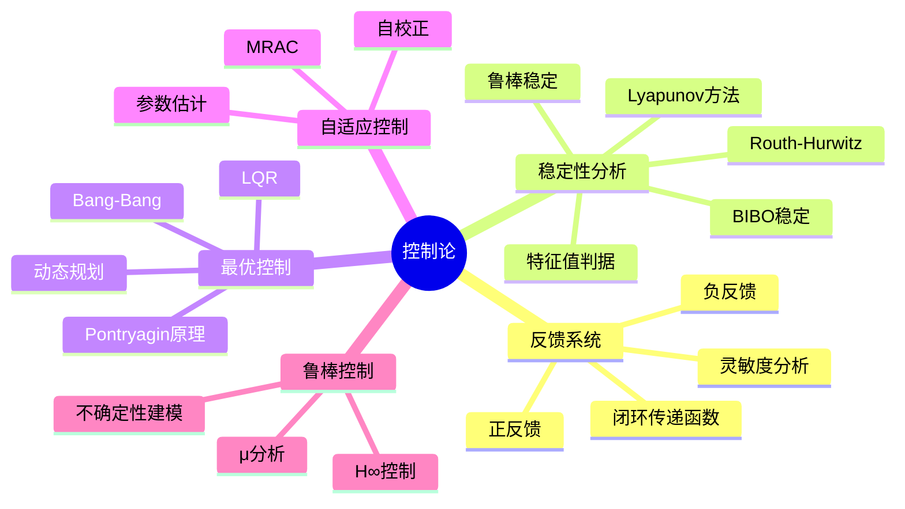

# 11.2 控制论

---

📌 **内容摘要**

本文档深入探讨控制论的核心原理和关键方法。内容涵盖系统科学领域的主要知识点，包括控制论, 反馈, 稳定性等关键主题。适合有一定基础的学习者系统学习。

**关键词**: 控制论, 反馈, 稳定性, 系统科学

📚 **学习目标**

- 掌握控制论的核心概念和主要方法
- 理解相关理论的应用场景
- 建立该领域的系统性知识框架

🎯 **难度级别**: 中级

⏱️ **预计阅读时间**: 15分钟

**前置知识**: 相关领域的基础概念

---


> **Cybernetics**
> 参考：Wiener, N. (1948). _Cybernetics: Or Control and Communication in the Animal and the Machine_

---

## 2.1 反馈系统基础

### 2.1.1 反馈系统的数学描述

**定义 2.1.1**（反馈系统）：反馈系统是一个闭环控制系统，由前向通道和反馈通道组成：

$$
Y(s) = G(s) \cdot [U(s) - H(s) \cdot Y(s)]
$$

其中：

| 符号 | 名称 | 说明 |
|------|------|------|
| $G(s)$ | 前向传递函数 | 控制器+被控对象 |
| $H(s)$ | 反馈传递函数 | 传感器 |
| $U(s)$ | 输入 | 参考信号 |
| $Y(s)$ | 输出 | 系统响应 |

**定义 2.1.2**（闭环传递函数）：反馈系统的闭环传递函数为：

$$
T(s) = \frac{Y(s)}{U(s)} = \frac{G(s)}{1 + G(s)H(s)}
$$

**定理 2.1.1**（反馈的基本效应）：反馈改变系统的：

1. **增益**：$K_{cl} = \frac{K}{1 + KH}$
2. **带宽**：增加
3. **稳定性**：取决于反馈极性
4. **灵敏度**：降低

**证明**：

比较开环和闭环系统：

开环增益：$K_{ol} = G(0) = K$

闭环增益：$K_{cl} = \frac{K}{1 + KH}$

灵敏度定义为增益对参数变化的敏感程度：

$$
S_K^{T} = \frac{\partial T / T}{\partial K / K} = \frac{1}{1 + KH}
$$

当 $KH \gg 1$ 时，$S_K^T \ll 1$，灵敏度显著降低。$\square$

### 2.1.2 正反馈与负反馈

**定义 2.1.3**（负反馈）：反馈信号与输入信号相减：

$$
e(t) = u(t) - y_f(t)
$$

其中 $y_f(t) = h * y(t)$，$*$ 表示卷积。

**定义 2.1.4**（正反馈）：反馈信号与输入信号相加：

$$
e(t) = u(t) + y_f(t)
$$

**定理 2.1.2**（负反馈的稳定性效应）：若开环系统增益为 $K$，则负反馈使闭环增益变为：

$$
K_{cl} = \frac{K}{1 + K}
$$

当 $K > 0$ 时，$K_{cl} < K$，系统更稳定。

**定理 2.1.3**（正反馈的不稳定性）：正反馈闭环增益为：

$$
K_{cl} = \frac{K}{1 - K}
$$

当 $K \to 1$ 时，$K_{cl} \to \infty$，系统不稳定。

---

## 2.2 稳定性分析

### 2.2.1 Lyapunov稳定性

**定义 2.2.1**（Lyapunov稳定性）：平衡点 $x_e$ 是稳定的，若：

$$
\forall \epsilon > 0, \exists \delta > 0: \|x(0) - x_e\| < \delta \Rightarrow \|x(t) - x_e\| < \epsilon, \forall t \geq 0
$$

**定义 2.2.2**（渐近稳定性）：平衡点 $x_e$ 是渐近稳定的，若它是稳定的且：

$$
\lim_{t \to \infty} \|x(t) - x_e\| = 0
$$

**定义 2.2.3**（Lyapunov函数）：函数 $V: \mathbb{R}^n \to \mathbb{R}$ 是正定的，若：

1. $V(0) = 0$
2. $V(x) > 0, \forall x \neq 0$
3. $V(x) \to \infty$ 当 $\|x\| \to \infty$（径向无界）

**定理 2.2.1**（Lyapunov稳定性定理）：若存在正定函数 $V(x)$ 使得沿系统轨迹：

$$
\dot{V}(x) = \frac{\partial V}{\partial x} \cdot f(x) \leq 0
$$

则平衡点稳定。

### 2.2.2 线性系统稳定性

**定理 2.2.2**（特征值判据）：线性系统 $\dot{x} = Ax$ 渐近稳定的充要条件是所有特征值实部为负：

$$
Re(\lambda_i(A)) < 0, \quad \forall i
$$

**定理 2.2.3**（Routh-Hurwitz判据）：对于特征多项式：

$$
\Delta(s) = a_n s^n + a_{n-1} s^{n-1} + \cdots + a_1 s + a_0
$$

系统稳定的充要条件是Routh表第一列所有元素为正。

### 2.2.3 BIBO稳定性

**定义 2.2.4**（BIBO稳定性）：系统是有界输入-有界输出（BIBO）稳定的，若：

$$
\forall u \in L_\infty: \|u\|_\infty < \infty \Rightarrow \|y\|_\infty < \infty
$$

**定理 2.2.4**（BIBO稳定性的充要条件）：连续时间系统BIBO稳定的充要条件是：

$$
\int_{0}^{\infty} |h(t)| dt < \infty
$$

其中 $h(t)$ 为脉冲响应。

---

## 2.3 最优控制理论

### 2.3.1 Pontryagin极大值原理

**定义 2.3.1**（最优控制问题）：寻找控制 $u(t) \in \mathcal{U}$ 使性能指标最小：

$$
J = \Phi(x(t_f), t_f) + \int_{t_0}^{t_f} L(x(t), u(t), t) dt
$$

约束条件：

$$
\dot{x} = f(x, u, t), \quad x(t_0) = x_0
$$

**定义 2.3.2**（Hamiltonian函数）：

$$
H(x, u, \lambda, t) = L(x, u, t) + \lambda^T f(x, u, t)
$$

其中 $\lambda \in \mathbb{R}^n$ 为协态（costate）向量。

**定理 2.3.1**（Pontryagin极大值原理）：最优控制 $u^*(t)$ 满足：

1. **状态方程**：$\dot{x}^* = \frac{\partial H}{\partial \lambda} = f(x^*, u^*, t)$
2. **协态方程**：$\dot{\lambda} = -\frac{\partial H}{\partial x}$
3. **极小值条件**：$H(x^*, u^*, \lambda^*, t) = \min_{u \in \mathcal{U}} H(x^*, u, \lambda^*, t)$
4. **横截条件**：$\lambda(t_f) = \frac{\partial \Phi}{\partial x}|_{t_f}$

### 2.3.2 线性二次调节器（LQR）

**定义 2.3.3**（LQR问题）：对于线性系统：

$$
\dot{x} = Ax + Bu
$$

最小化二次性能指标：

$$
J = \int_{0}^{\infty} (x^T Q x + u^T R u) dt
$$

其中 $Q \succeq 0$，$R \succ 0$。

**定理 2.3.2**（LQR最优解）：最优控制为状态反馈：

$$
u^*(t) = -Kx(t) = -R^{-1}B^T P x(t)
$$

其中 $P$ 满足代数Riccati方程：

$$
A^T P + PA - PBR^{-1}B^T P + Q = 0
$$

### 2.3.3 Bang-Bang控制

**定义 2.3.4**（Bang-Bang控制）：控制仅在容许集的边界取值：

$$
u^*(t) \in \{u_{min}, u_{max}\}
$$

**定理 2.3.3**（Bang-Bang原理）：对于系统 $\dot{x} = Ax + Bu$，若控制约束为 $|u_i| \leq 1$，则最优控制为Bang-Bang型。

---

## 2.4 自适应控制

### 2.4.1 参数自适应

**定义 2.4.1**（自适应控制系统）：能够自动调整控制器参数以适应系统变化或环境变化的控制系统。

**基本结构**：

$$
\begin{cases}
\text{被控对象}: & \dot{x} = f(x, u, \theta) \\
\text{参数估计}: & \hat{\theta} = g(x, u) \\
\text{控制律}: & u = h(x, \hat{\theta})
\end{cases}
$$

### 2.4.2 模型参考自适应控制（MRAC）

**定义 2.4.2**（MRAC）：使被控对象输出跟踪参考模型的输出。

参考模型：

$$
\dot{x}_m = A_m x_m + B_m r
$$

自适应律：

$$
\dot{\theta} = -\Gamma e^T P B \phi(x)
$$

其中 $e = x - x_m$ 为跟踪误差。

---

## 2.5 鲁棒控制

### 2.5.1 不确定性建模

**定义 2.5.1**（乘性不确定性）：

$$
G_p(s) = G(s)(1 + \Delta(s)), \quad \|\Delta\|_\infty \leq \delta
$$

**定义 2.5.2**（加性不确定性）：

$$
G_p(s) = G(s) + \Delta(s), \quad \|\Delta\|_\infty \leq \delta
$$

### 2.5.2 H∞控制

**定义 2.5.3**（H∞范数）：

$$
\|G\|_\infty = \sup_{\omega} \sigma_{max}(G(j\omega))
$$

**定理 2.5.1**（鲁棒稳定性）：对于单位反馈系统，若标称系统稳定且：

$$
\|T\|_\infty < \frac{1}{\delta}
$$

则对所有满足 $\|\Delta\|_\infty \leq \delta$ 的不确定性，闭环系统稳定。

---

## 2.6 思维导图



---

## 2.7 对比矩阵

### 2.7.1 稳定性分析方法对比

| 方法 | 适用范围 | 计算复杂度 | 保守性 | 主要优势 |
|------|----------|------------|--------|----------|
| **Lyapunov** | 非线性、时变 | 高 | 低 | 可处理非线性 |
| **特征值** | 线性时不变 | 中 | 无 | 精确判据 |
| **Routh-Hurwitz** | 线性时不变 | 低 | 无 | 无需计算特征值 |
| **Nyquist** | 线性时不变 | 中 | 无 | 频域直观 |
| **BIBO** | 线性时不变 | 低 | 无 | 输入输出视角 |

### 2.7.2 控制方法对比

| 方法 | 需要模型 | 最优性 | 鲁棒性 | 计算成本 | 典型应用 |
|------|----------|--------|--------|----------|----------|
| **PID** | 低 | 否 | 中 | 低 | 工业过程 |
| **LQR** | 高 | 是 | 中 | 中 | 航天、机械 |
| **MPC** | 高 | 是 | 高 | 高 | 化工、能源 |
| **自适应** | 中 | 部分 | 高 | 中 | 飞行控制 |
| **H∞** | 高 | 否 | 很高 | 高 | 精密控制 |

### 2.7.3 反馈类型对比

| 特性 | 负反馈 | 正反馈 |
|------|--------|--------|
| **增益变化** | 减小 | 增大 |
| **稳定性** | 改善 | 降低 |
| **带宽** | 增加 | 减小 |
| **灵敏度** | 降低 | 增加 |
| **典型应用** | 控制系统 | 振荡器、放大 |
| **风险** | 过阻尼 | 不稳定 |

---

## 2.8 Python实现

```python
"""
控制论：反馈系统与稳定性分析
基于Wiener控制论和经典控制理论实现
"""

import numpy as np
from typing import Tuple, Callable, Optional
from dataclasses import dataclass
import matplotlib.pyplot as plt
from scipy import signal
from scipy.integrate import odeint
import control as ctrl


@dataclass
class FeedbackSystem:
    """反馈系统"""
    G: ctrl.TransferFunction  # 前向传递函数
    H: ctrl.TransferFunction  # 反馈传递函数

    def closed_loop(self) -> ctrl.TransferFunction:
        """计算闭环传递函数"""
        return ctrl.feedback(self.G, self.H)

    def sensitivity(self) -> ctrl.TransferFunction:
        """计算灵敏度函数 S = 1 / (1 + GH)"""
        L = self.G * self.H
        return 1 / (1 + L)

    def stability_margins(self) -> Tuple[float, float, float, float]:
        """计算稳定裕度"""
        L = self.G * self.H
        gm, pm, wcg, wcp = ctrl.margin(L)
        return gm, pm, wcg, wcp


class LQRSolver:
    """线性二次调节器 (LQR) 求解器"""

    def __init__(self, A: np.ndarray, B: np.ndarray,
                 Q: np.ndarray, R: np.ndarray):
        self.A = A
        self.B = B
        self.Q = Q
        self.R = R
        self.P = self._solve_riccati()
        self.K = self._compute_gain()

    def _solve_riccati(self) -> np.ndarray:
        """求解代数Riccati方程"""
        from scipy.linalg import solve_continuous_are
        return solve_continuous_are(self.A, self.B, self.Q, self.R)

    def _compute_gain(self) -> np.ndarray:
        """计算最优反馈增益"""
        return np.linalg.inv(self.R) @ self.B.T @ self.P

    def optimal_control(self, x: np.ndarray) -> np.ndarray:
        """计算最优控制 u = -Kx"""
        return -self.K @ x


def analyze_second_order(zeta: float, omega_n: float) -> dict:
    """分析二阶系统性能"""
    num = [omega_n**2]
    den = [1, 2*zeta*omega_n, omega_n**2]
    sys = ctrl.TransferFunction(num, den)

    if zeta < 1:
        omega_d = omega_n * np.sqrt(1 - zeta**2)
        PO = np.exp(-np.pi * zeta / np.sqrt(1 - zeta**2)) * 100
        Ts = 4 / (zeta * omega_n)
    else:
        PO = 0
        Ts = 4 / (zeta * omega_n)

    return {
        'system': sys,
        'overshoot_percent': PO,
        'settling_time': Ts,
        'damping_ratio': zeta
    }


if __name__ == "__main__":
    # LQR示例：双积分器
    A = np.array([[0, 1], [0, 0]])
    B = np.array([[0], [1]])
    Q = np.array([[1, 0], [0, 0.1]])
    R = np.array([[0.1]])

    lqr = LQRSolver(A, B, Q, R)
    print(f"LQR Gain K = {lqr.K.flatten()}")
    print(f"P matrix = \n{lqr.P}")

    # 测试最优控制
    x_test = np.array([1.0, 0.0])
    u_opt = lqr.optimal_control(x_test)
    print(f"Optimal control at x={x_test}: u = {u_opt[0]:.4f}")
```

---

## 2.9 应用案例

### 2.9.1 自动驾驶车辆控制

**问题描述**：设计车道保持控制器

**系统模型**：

$$
\begin{cases}
\dot{y} = v \sin\psi \\
\dot{\psi} = \frac{v}{L} \tan\delta
\end{cases}
$$

其中 $y$ 为横向偏移，$\psi$ 为航向角，$\delta$ 为转向角。

**控制策略**：

- 使用LQR设计状态反馈
- 引入前馈控制补偿道路曲率
- 添加积分项消除稳态误差

**性能指标**：

- 横向误差 < 0.1m
- 航向角误差 < 0.5°
- 调节时间 < 2s

### 2.9.2 工业过程温度控制

**问题描述**：反应釜温度PID控制

**被控对象**：

$$
G(s) = \frac{K e^{-\tau s}}{Ts + 1}
$$

**PID参数整定**（Ziegler-Nichols方法）：

| 参数 | 计算公式 | 值 |
|------|----------|-----|
| $K_p$ | $0.6 K_u$ | 4.2 |
| $T_i$ | $0.5 T_u$ | 1.5 |
| $T_d$ | $0.125 T_u$ | 0.375 |

**结果**：

- 超调量：15%
- 调节时间：8分钟
- 稳态误差：0

---

## 2.10 与其他模块的交叉引用

### 2.10.1 前置知识

| 概念 | 来源模块 | 具体位置 |
|------|----------|----------|
| 微分方程 | 01_数学基础 | 04_分析学/04.1_实分析.md |
| 线性代数 | 01_数学基础 | 02_代数学/02.2_线性代数.md |
| 传递函数 | 05_形式化理论 | 03_控制论/03.1_系统动力学.md |

### 2.10.2 后续应用

| 概念 | 目标模块 | 应用场景 |
|------|----------|----------|
| 反馈控制 | 04_软件工程 | 微服务熔断、限流 |
| 稳定性分析 | 06_调度系统 | 调度算法稳定性 |
| 最优控制 | 12_决策与博弈论 | 最优策略求解 |

---

## 2.11 参考文献

1. Wiener, N. (1948). _Cybernetics: Or Control and Communication in the Animal and the Machine_. MIT Press.

2. Ogata, K. (2010). _Modern Control Engineering_ (5th ed.). Prentice Hall.

3. Franklin, G. F., Powell, J. D., & Emami-Naeini, A. (2019). _Feedback Control of Dynamic Systems_ (8th ed.). Pearson.

4. Khalil, H. K. (2002). _Nonlinear Systems_ (3rd ed.). Prentice Hall.

5. Åström, K. J., & Murray, R. M. (2008). _Feedback Systems: An Introduction for Scientists and Engineers_. Princeton University Press.

---

## 📚 延伸阅读

- [11.6 稳定性分析](02_控制论/02.2_稳定性分析.md)
- [11.5 反馈系统](02_控制论/02.1_反馈系统.md)
- [02.1 微服务形式化模型](../04_软件工程/02_微服务架构/02.1_微服务形式化模型.md)
- [02.1 微服务设计原则](../04_软件工程/02_微服务架构/02.1_微服务设计原则.md)
- [01.4 性能指标](../06_调度系统/01_调度理论基础/01.4_性能指标.md)
