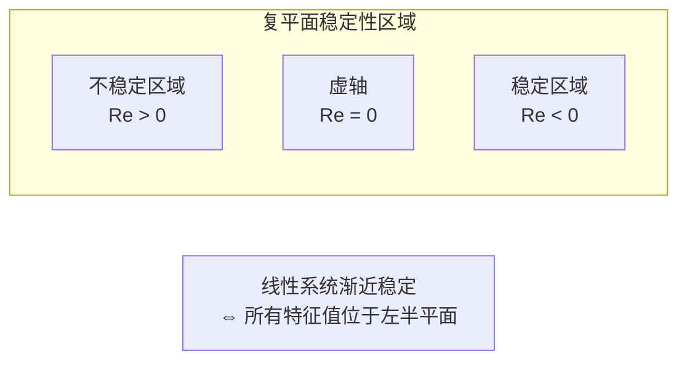

# 11.6 稳定性分析

---

📌 **内容摘要**

本文档深入探讨稳定性分析的核心原理和关键方法。内容涵盖控制论领域的主要知识点，包括相关理论、方法及应用。适合有一定基础的学习者系统学习。

**关键词**: 控制论

📚 **学习目标**

- 掌握稳定性分析的核心概念和主要方法
- 理解相关理论的应用场景
- 建立该领域的系统性知识框架

🎯 **难度级别**: 中级

⏱️ **预计阅读时间**: 15分钟

**前置知识**: 相关领域的基础概念

---


> 参考：Lyapunov, A. M. (1892). _The General Problem of the Stability of Motion_; Khalil, H. K. (2002). _Nonlinear Systems_

---

## 11.6.1 Lyapunov稳定性

### 11.6.1.1 稳定性定义

**定义 11.6.1**（Lyapunov稳定性）：平衡点 $x_e$ 是稳定的，若：

$$\forall \epsilon > 0, \exists \delta > 0: \|x(0) - x_e\| < \delta \Rightarrow \|x(t) - x_e\| < \epsilon, \forall t \geq 0$$

**定义 11.6.2**（渐近稳定性）：平衡点 $x_e$ 是渐近稳定的，若它是稳定的且：

$$\lim_{t \to \infty} \|x(t) - x_e\| = 0$$

**定义 11.6.3**（指数稳定性）：平衡点 $x_e$ 是指数稳定的，若存在 $\alpha, \beta > 0$：

$$\|x(t) - x_e\| \leq \alpha \|x(0) - x_e\| e^{-\beta t}$$

**定义 11.6.4**（全局渐近稳定性）：若渐近稳定性对任意初始条件成立，则称全局渐近稳定。

### 11.6.1.2 Lyapunov直接法

**定义 11.6.5**（Lyapunov函数）：函数 $V: \mathbb{R}^n \to \mathbb{R}$ 是正定的，若：

1. $V(0) = 0$
2. $V(x) > 0, \forall x \neq 0$
3. $V(x) \to \infty$ 当 $\|x\| \to \infty$（径向无界）

**定理 11.6.1**（Lyapunov稳定性定理）：若存在正定函数 $V(x)$ 使得沿系统轨迹：

$$\dot{V}(x) = \frac{\partial V}{\partial x} \cdot f(x) \leq 0$$

则平衡点稳定。

**证明**：

由 $\dot{V} \leq 0$，$V(x(t))$ 非增。设 $x(0) \in B_\delta$，则：

$$V(x(t)) \leq V(x(0)) < V_\epsilon$$

其中 $V_\epsilon = \min_{\|x\|=\epsilon} V(x)$。由于 $V$ 正定，$V(x(t)) < V_\epsilon \Rightarrow \|x(t)\| < \epsilon$。$\square$

**定理 11.6.2**（LaSalle不变性原理）：若 $\dot{V}(x) \leq 0$，令 $E = \{x: \dot{V}(x) = 0\}$，$M$ 为 $E$ 中最大不变集，则：

$$x(t) \to M \text{ 当 } t \to \infty$$

**推论 11.6.1**：若 $\dot{V}(x) < 0, \forall x \neq 0$，则平衡点渐近稳定。

### 11.6.1.3 线性系统的Lyapunov分析

**定理 11.6.3**（线性系统的Lyapunov方程）：对于线性系统 $\dot{x} = Ax$，Lyapunov方程为：

$$A^T P + P A = -Q$$

其中 $Q$ 为正定矩阵。若存在正定解 $P$，则系统渐近稳定。

**证明**：

设 $V(x) = x^T P x$，则：

$$\dot{V} = \dot{x}^T P x + x^T P \dot{x} = x^T A^T P x + x^T P A x = x^T(A^T P + P A)x = -x^T Q x < 0$$

因此系统渐近稳定。$\square$

**定理 11.6.4**（Lyapunov方程与特征值）：线性系统渐近稳定的充要条件是所有特征值实部为负：

$$Re(\lambda_i(A)) < 0, \quad \forall i$$

---

## 11.6.2 BIBO稳定性

### 11.6.2.1 输入输出稳定性

**定义 11.6.6**（BIBO稳定性）：系统是有界输入-有界输出（BIBO）稳定的，若：

$$\forall u \in L_\infty: \|u\|_\infty < \infty \Rightarrow \|y\|_\infty < \infty$$

**定义 11.6.7**（脉冲响应）：系统的脉冲响应为 $h(t)$，输出为：

$$y(t) = \int_{0}^{t} h(\tau) u(t - \tau) d\tau$$

**定理 11.6.5**（BIBO稳定性的充要条件）：连续时间系统BIBO稳定的充要条件是：

$$\int_{0}^{\infty} |h(t)| dt < \infty$$

**证明**：

充分性：设 $\|u\|_\infty \leq M_u$，则：

$$|y(t)| \leq \int_{0}^{t} |h(\tau)| |u(t-\tau)| d\tau \leq M_u \int_{0}^{\infty} |h(\tau)| d\tau < \infty$$

必要性：反设积分发散，构造有界输入使输出无界。$\square$

**定理 11.6.6**（传递函数判据）：系统BIBO稳定的充要条件是所有传递函数极点位于左半平面：

$$Re(p_i) < 0, \quad \forall i$$

### 11.6.2.2 频域稳定性判据

**定义 11.6.8**（$H_\infty$范数）：系统的$H_\infty$范数定义为：

$$\|G\|_\infty = \sup_{\omega} |G(j\omega)|$$

**定理 11.6.7**（小增益定理）：对于反馈系统，若：

$$\|G\|_\infty \cdot \|H\|_\infty < 1$$

则闭环系统BIBO稳定。

---

## 11.6.3 非线性系统稳定性

### 11.6.3.1 局部线性化方法

**定理 11.6.8**（Lyapunov第一方法/间接法）：设 $\dot{x} = f(x)$ 在平衡点 $x_e$ 附近可线性化为：

$$\dot{\delta x} = A \delta x + O(\|\delta x\|^2)$$

其中 $A = \frac{\partial f}{\partial x}|_{x_e}$。则：

1. 若 $A$ 所有特征值实部为负，则 $x_e$ 渐近稳定
2. 若 $A$ 存在特征值实部为正，则 $x_e$ 不稳定
3. 若特征值实部为零，需要进一步分析

### 11.6.3.2 全局稳定性

**定义 11.6.9**（径向无界）：$V(x)$ 径向无界若：

$$\|x\| \to \infty \Rightarrow V(x) \to \infty$$

**定理 11.6.9**（Barbashin-Krasovskii定理）：若 $V(x)$ 正定、径向无界，且 $\dot{V}(x)$ 负定，则平衡点全局渐近稳定。

---

## 11.6.4 鲁棒稳定性

### 11.6.4.1 结构不确定性

**定义 11.6.10**（乘性不确定性）：

$$G_p(s) = G(s)(1 + \Delta(s)), \quad \|\Delta\|_\infty \leq \delta$$

**定义 11.6.11**（加性不确定性）：

$$G_p(s) = G(s) + \Delta(s), \quad \|\Delta\|_\infty \leq \delta$$

**定理 11.6.10**（鲁棒稳定性条件）：对于单位反馈系统，若标称系统稳定且：

$$\|T\|_\infty < \frac{1}{\delta}$$

其中 $T$ 为互补灵敏度函数，则对所有满足 $\|\Delta\|_\infty \leq \delta$ 的不确定性，闭环系统稳定。

---

## 11.6.5 Python实现：稳定性分析

```python
"""
控制论：稳定性分析
基于Lyapunov理论和BIBO稳定性的实现
"""

import numpy as np
from typing import Tuple, Callable, Optional, List
from dataclasses import dataclass
import matplotlib.pyplot as plt
from scipy import linalg
from scipy.integrate import odeint
import control as ctrl
from scipy.optimize import minimize


class LyapunovAnalysis:
    """
    Lyapunov稳定性分析
    """

    def __init__(self, dynamics: Callable[[np.ndarray], np.ndarray],
                 equilibrium: np.ndarray = None):
        """
        初始化

        Args:
            dynamics: 系统动力学 f(x), dx/dt = f(x)
            equilibrium: 平衡点 (默认原点)
        """
        self.f = dynamics
        self.x_e = equilibrium if equilibrium is not None else np.zeros_like(dynamics(np.zeros(2)))
        self.n = len(self.x_e)

    def linearize(self, x0: np.ndarray = None, h: float = 1e-6) -> np.ndarray:
        """
        在指定点线性化，计算Jacobian矩阵
        """
        if x0 is None:
            x0 = self.x_e

        n = len(x0)
        J = np.zeros((n, n))

        for i in range(n):
            x_plus = x0.copy()
            x_minus = x0.copy()
            x_plus[i] += h
            x_minus[i] -= h

            J[:, i] = (self.f(x_plus) - self.f(x_minus)) / (2 * h)

        return J

    def check_eigenvalues(self, A: np.ndarray = None) -> Tuple[np.ndarray, bool]:
        """
        检查特征值稳定性

        Returns:
            (特征值数组, 是否稳定)
        """
        if A is None:
            A = self.linearize()

        eigenvalues = np.linalg.eigvals(A)
        is_stable = np.all(np.real(eigenvalues) < 0)

        return eigenvalues, is_stable

    def solve_lyapunov_equation(self, A: np.ndarray = None,
                                Q: np.ndarray = None) -> Optional[np.ndarray]:
        """
        求解Lyapunov方程: A^T P + P A = -Q

        Returns:
            正定解P，若存在
        """
        if A is None:
            A = self.linearize()

        if Q is None:
            Q = np.eye(len(A))

        try:
            P = linalg.solve_continuous_lyapunov(A.T, -Q)

            # 检查P是否正定
            eigenvalues = np.linalg.eigvals(P)
            if np.all(eigenvalues > 0):
                return P
            else:
                return None
        except:
            return None

    def find_lyapunov_function(self, degree: int = 2,
                                grid_size: int = 20) -> Optional[Callable]:
        """
        尝试找到Lyapunov函数（简化实现）

        对于二次型 V(x) = x^T P x
        """
        A = self.linearize()
        P = self.solve_lyapunov_equation(A)

        if P is not None:
            def V(x):
                return x.T @ P @ x
            return V

        return None

    def compute_v_dot(self, V: Callable, x: np.ndarray,
                      h: float = 1e-6) -> float:
        """
        计算Lyapunov函数沿轨迹的导数
        """
        # 数值微分
        fx = self.f(x)

        # 梯度
        grad_V = np.zeros_like(x)
        for i in range(len(x)):
            x_plus = x.copy()
            x_minus = x.copy()
            x_plus[i] += h
            x_minus[i] -= h
            grad_V[i] = (V(x_plus) - V(x_minus)) / (2 * h)

        return grad_V @ fx

    def region_of_attraction_estimate(self, V: Callable,
                                     grid_range: Tuple[float, float] = (-2, 2),
                                     n_points: int = 50) -> float:
        """
        估计吸引域（简化）

        找到最大的c使得 V(x) < c 蕴含 V_dot(x) < 0
        """
        max_c = np.inf

        x_vals = np.linspace(grid_range[0], grid_range[1], n_points)
        if self.n == 2:
            for x1 in x_vals:
                for x2 in x_vals:
                    x = np.array([x1, x2])
                    if np.linalg.norm(x) < 1e-6:
                        continue

                    V_x = V(x)
                    V_dot = self.compute_v_dot(V, x)

                    if V_dot >= 0 and V_x > 0:
                        max_c = min(max_c, V_x)

        return max_c if max_c < np.inf else 0


class BIBOStability:
    """
    BIBO稳定性分析
    """

    def __init__(self, system: ctrl.TransferFunction):
        self.sys = system
        self.poles = ctrl.pole(system)
        self.zeros = ctrl.zero(system)

    def is_bibo_stable(self) -> bool:
        """
        检查BIBO稳定性

        所有极点位于左半平面
        """
        return np.all(np.real(self.poles) < 0)

    def impulse_response_integral(self, t_max: float = 50,
                                   n_points: int = 10000) -> float:
        """
        计算脉冲响应的绝对值积分

        ∫|h(t)|dt
        """
        t = np.linspace(0, t_max, n_points)
        _, h = ctrl.impulse_response(self.sys, t)

        return np.trapz(np.abs(h), t)

    def h_infinity_norm(self, omega_range: Tuple[float, float] = (1e-3, 1e3),
                        n_points: int = 10000) -> float:
        """
        计算H无穷范数

        ||G||_∞ = sup_ω |G(jω)|
        """
        omega = np.logspace(np.log10(omega_range[0]),
                           np.log10(omega_range[1]), n_points)

        mag, _, _ = ctrl.frequency_response(self.sys, omega)
        return np.max(np.abs(mag))

    def step_response_characteristics(self) -> dict:
        """
        计算阶跃响应特性
        """
        t = np.linspace(0, 50, 10000)
        t_out, y = ctrl.step_response(self.sys, t)

        # 稳态值
        y_ss = y[-1]

        # 超调量
        y_max = np.max(y)
        overshoot = (y_max - y_ss) / y_ss * 100 if y_ss != 0 else 0

        # 上升时间 (10% 到 90%)
        t_10 = t_out[np.where(y >= 0.1 * y_ss)[0][0]] if np.any(y >= 0.1 * y_ss) else None
        t_90 = t_out[np.where(y >= 0.9 * y_ss)[0][0]] if np.any(y >= 0.9 * y_ss) else None
        rise_time = t_90 - t_10 if t_10 and t_90 else None

        # 调节时间 (2% 准则)
        idx_settle = np.where(np.abs(y - y_ss) > 0.02 * abs(y_ss))[0]
        settling_time = t_out[idx_settle[-1] + 1] if len(idx_settle) > 0 and idx_settle[-1] + 1 < len(t_out) else 0

        return {
            'steady_state': y_ss,
            'overshoot_percent': overshoot,
            'rise_time': rise_time,
            'settling_time': settling_time,
            'peak_value': y_max
        }


def pendulum_stability_analysis():
    """
    单摆稳定性分析
    """
    print("=" * 60)
    print("Pendulum Stability Analysis")
    print("=" * 60)

    # 单摆动力学: dx1/dt = x2, dx2/dt = -g/l * sin(x1)
    g, l = 9.8, 1.0

    def pendulum_dynamics(x):
        return np.array([x[1], -(g/l) * np.sin(x[0])])

    analyzer = LyapunovAnalysis(pendulum_dynamics, equilibrium=np.array([0, 0]))

    # 线性化
    A = analyzer.linearize()
    print(f"\nLinearization at (0, 0):")
    print(f"A = \n{A}")

    eigenvalues, is_stable = analyzer.check_eigenvalues(A)
    print(f"\nEigenvalues: {eigenvalues}")
    print(f"Linearized system is {'stable' if is_stable else 'unstable'}")

    # 求解Lyapunov方程
    P = analyzer.solve_lyapunov_equation(A)
    if P is not None:
        print(f"\nLyapunov function exists:")
        print(f"P = \n{P}")
        print(f"Eigenvalues of P: {np.linalg.eigvals(P)}")

    # 检查另一个平衡点 (π, 0)
    print(f"\n{'='*40}")
    print("Analysis at (π, 0) - upright position:")

    analyzer2 = LyapunovAnalysis(pendulum_dynamics, equilibrium=np.array([np.pi, 0]))
    A2 = analyzer2.linearize()
    eigenvalues2, is_stable2 = analyzer2.check_eigenvalues(A2)
    print(f"Eigenvalues: {eigenvalues2}")
    print(f"Upright position is {'stable' if is_stable2 else 'unstable'}")

    return analyzer, A, eigenvalues


def second_order_systems_analysis():
    """
    二阶系统稳定性分析
    """
    print("\n" + "=" * 60)
    print("Second-order System Stability")
    print("=" * 60)

    systems = [
        ("Stable", [1], [1, 2, 1]),  # 过阻尼
        ("Underdamped stable", [1], [1, 0.5, 1]),  # 欠阻尼
        ("Marginally stable", [1], [1, 0, 1]),  # 临界稳定
        ("Unstable", [1], [1, -0.5, 1]),  # 不稳定
    ]

    results = []
    for name, num, den in systems:
        sys = ctrl.TransferFunction(num, den)
        bibostab = BIBOStability(sys)

        print(f"\n{name}: G(s) = {num[0]} / ({den[0]}s² + {den[1]}s + {den[2]})")
        print(f"  Poles: {bibostab.poles}")
        print(f"  BIBO stable: {bibostab.is_bibo_stable()}")

        if bibostab.is_bibo_stable():
            h_int = bibostab.impulse_response_integral()
            print(f"  ∫|h(t)|dt = {h_int:.4f}")

        results.append((name, sys, bibostab))

    return results


def robust_stability_analysis():
    """
    鲁棒稳定性分析
    """
    print("\n" + "=" * 60)
    print("Robust Stability Analysis")
    print("=" * 60)

    # 标称系统
    G_nom = ctrl.TransferFunction([1], [1, 2, 1])

    # 不确定性边界
    delta_max = 0.5

    print(f"\nNominal system: G(s) = 1 / (s² + 2s + 1)")
    print(f"Multiplicative uncertainty bound: δ = {delta_max}")

    # 计算互补灵敏度函数的H无穷范数
    T = ctrl.feedback(G_nom, 1)
    mag, _, _ = ctrl.frequency_response(T)
    T_inf = np.max(np.abs(mag))

    print(f"||T||_∞ = {T_inf:.4f}")
    print(f"Robust stability condition: ||T||_∞ < 1/δ = {1/delta_max:.4f}")

    if T_inf < 1/delta_max:
        print("✓ Robust stability condition SATISFIED")
    else:
        print("✗ Robust stability condition VIOLATED")

    return G_nom, T_inf


def visualize_stability():
    """可视化稳定性分析"""
    fig = plt.figure(figsize=(16, 10))

    # 1. 相平面图：单摆
    ax1 = plt.subplot(2, 3, 1)

    def pendulum_dynamics(state, t):
        theta, omega = state
        g, l = 9.8, 1.0
        return [omega, -(g/l) * np.sin(theta)]

    theta_range = np.linspace(-2*np.pi, 2*np.pi, 20)
    omega_range = np.linspace(-4, 4, 15)

    for theta0 in theta_range[::3]:
        for omega0 in omega_range[::2]:
            sol = odeint(pendulum_dynamics, [theta0, omega0], np.linspace(0, 5, 100))
            ax1.plot(sol[:, 0], sol[:, 1], 'b-', alpha=0.3, linewidth=0.5)

    ax1.scatter([0, np.pi, -np.pi], [0, 0, 0], c=['g', 'r', 'r'], s=100, zorder=5)
    ax1.set_xlabel('θ')
    ax1.set_ylabel('ω')
    ax1.set_title('Phase Portrait: Pendulum')
    ax1.grid(True, alpha=0.3)
    ax1.set_xlim(-2*np.pi, 2*np.pi)
    ax1.set_ylim(-4, 4)

    # 2. 特征值在复平面的位置
    ax2 = plt.subplot(2, 3, 2)

    systems_eigenvals = [
        np.roots([1, 2, 1]),  # 稳定
        np.roots([1, 0.5, 1]),  # 稳定
        np.roots([1, 0, 1]),  # 临界
        np.roots([1, -0.5, 1]),  # 不稳定
    ]
    colors = ['green', 'blue', 'orange', 'red']
    labels = ['Stable', 'Underdamped', 'Marginal', 'Unstable']

    for ev, color, label in zip(systems_eigenvals, colors, labels):
        ax2.scatter(np.real(ev), np.imag(ev), c=color, s=100, label=label, zorder=5)

    ax2.axvline(x=0, color='k', linestyle='-', linewidth=0.5)
    ax2.axhline(y=0, color='k', linestyle='-', linewidth=0.5)
    ax2.fill_betweenx([-2, 2], -3, 0, alpha=0.1, color='green', label='Stable region')
    ax2.set_xlabel('Real')
    ax2.set_ylabel('Imaginary')
    ax2.set_title('Eigenvalue Locations')
    ax2.legend()
    ax2.grid(True, alpha=0.3)
    ax2.set_xlim(-3, 1)
    ax2.set_ylim(-2, 2)

    # 3. 阶跃响应比较
    ax3 = plt.subplot(2, 3, 3)
    t = np.linspace(0, 15, 1000)

    for num, den, color, label in [
        ([1], [1, 2, 1], 'green', 'ζ=1'),
        ([1], [1, 0.5, 1], 'blue', 'ζ=0.25'),
        ([1], [1, 0, 1], 'orange', 'ζ=0'),
    ]:
        sys = ctrl.TransferFunction(num, den)
        _, y = ctrl.step_response(sys, t)
        ax3.plot(t, y, color=color, linewidth=2, label=label)

    ax3.axhline(y=1, color='k', linestyle='--', alpha=0.5)
    ax3.set_xlabel('Time')
    ax3.set_ylabel('Response')
    ax3.set_title('Step Responses')
    ax3.legend()
    ax3.grid(True, alpha=0.3)

    # 4. Lyapunov函数等高线
    ax4 = plt.subplot(2, 3, 4)

    # 线性系统 V(x) = x^T P x
    A = np.array([[0, 1], [-1, -1]])
    P = linalg.solve_continuous_lyapunov(A.T, -np.eye(2))

    x1 = np.linspace(-3, 3, 100)
    x2 = np.linspace(-3, 3, 100)
    X1, X2 = np.meshgrid(x1, x2)

    V = np.zeros_like(X1)
    for i in range(len(x1)):
        for j in range(len(x2)):
            x = np.array([X1[i,j], X2[i,j]])
            V[i,j] = x.T @ P @ x

    contour = ax4.contour(X1, X2, V, levels=10, cmap='viridis')
    plt.colorbar(contour, ax=ax4)
    ax4.set_xlabel('x₁')
    ax4.set_ylabel('x₂')
    ax4.set_title('Lyapunov Function Contours')
    ax4.grid(True, alpha=0.3)

    # 5. 脉冲响应积分
    ax5 = plt.subplot(2, 3, 5)

    t = np.linspace(0, 20, 1000)
    stable_sys = ctrl.TransferFunction([1], [1, 1])
    _, h = ctrl.impulse_response(stable_sys, t)

    ax5.plot(t, h, 'b-', linewidth=2, label='h(t)')
    ax5.fill_between(t, 0, np.abs(h), alpha=0.3, label='∫|h(t)|dt')
    ax5.set_xlabel('Time')
    ax5.set_ylabel('Impulse Response')
    ax5.set_title('BIBO Stability: Impulse Response')
    ax5.legend()
    ax5.grid(True, alpha=0.3)

    # 6. Nyquist图和稳定裕度
    ax6 = plt.subplot(2, 3, 6)

    G = ctrl.TransferFunction([10], [1, 3, 3, 1])
    ctrl.nyquist_plot(G, ax=ax6)
    ax6.plot(-1, 0, 'r+', markersize=15, markeredgewidth=2)
    ax6.set_title('Nyquist Plot & Stability Margins')
    ax6.grid(True)
    ax6.axis('equal')

    plt.tight_layout()
    plt.savefig('stability_analysis.png', dpi=150, bbox_inches='tight')
    plt.show()


if __name__ == "__main__":
    analyzer, A, eigenvalues = pendulum_stability_analysis()
    results = second_order_systems_analysis()
    G_nom, T_inf = robust_stability_analysis()
    visualize_stability()
    print("\nVisualization saved to 'stability_analysis.png'")
```

---

## 11.6.6 Mermaid稳定性图

```mermaid
graph TB
    subgraph "稳定性层次"
        GS[全局渐近稳定] --> AS[渐近稳定]
        AS --> S[Lyapunov稳定]
        AS --> ES[指数稳定]
        S --> BIBO[BIBO稳定]
    end

    subgraph "分析方法"
        L1[Lyapunov直接法] --> L2[构造V(x)]
        L1 --> L3[V̇(x) < 0]

        E1[特征值分析] --> E2[Reλ < 0]

        N1[Nyquist判据] --> N2[不包围-1点]
    end

    style GS fill:#c8e6c9
    style AS fill:#c8e6c9
    style ES fill:#c8e6c9
```



---

## 11.6.7 参考文献

1. Lyapunov, A. M. (1892). _The General Problem of the Stability of Motion_. (English translation: Taylor & Francis, 1992).

2. Khalil, H. K. (2002). _Nonlinear Systems_ (3rd ed.). Prentice Hall.

3. Vidyasagar, M. (2002). _Nonlinear Systems Analysis_ (2nd ed.). SIAM.

4. Slotine, J. J. E., & Li, W. (1991). _Applied Nonlinear Control_. Prentice Hall.

---

## 📚 延伸阅读

- [11.5 反馈系统](02.1_反馈系统.md)
- [11.2 控制论](../02_控制论.md)
- [03.1 系统动力学](../../05_形式化理论/03_控制论/03.1_系统动力学.md)
