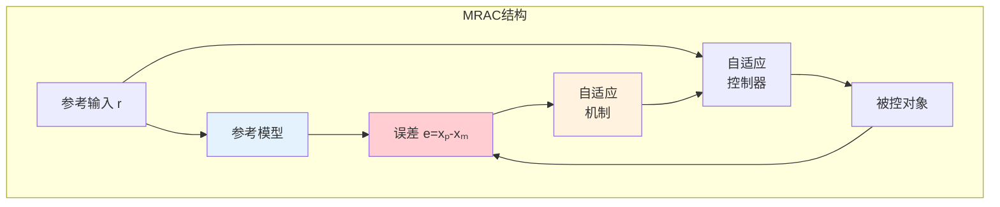
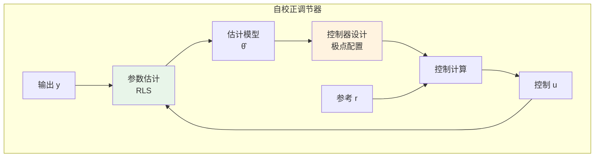

# 11.8 自适应控制

---

📌 **内容摘要**

本文档深入探讨自适应控制的核心原理和关键方法。内容涵盖控制论领域的主要知识点，包括相关理论、方法及应用。适合具备相关基础的学习者进行深入研究。

**关键词**: 控制论

📚 **学习目标**

- 深入理解自适应控制的理论体系和形式化方法
- 能够进行相关定理的形式化证明
- 建立该领域的系统性知识框架

🎯 **难度级别**: 高级

⏱️ **预计阅读时间**: 15分钟

**前置知识**: 该领域的中级知识, 形式化方法基础

---


> 参考：Åström, K. J., & Wittenmark, B. (2013). _Adaptive Control_ (2nd ed.); Narendra, K. S., & Annaswamy, A. M. (1989). _Stable Adaptive Systems_

---

## 11.8.1 模型参考自适应控制（MRAC）

### 11.8.1.1 MRAC结构

**定义 11.8.1**（MRAC问题）：给定参考模型：

$$\dot{x}_m = A_m x_m + B_m r$$

设计控制器使被控对象：

$$\dot{x}_p = A_p x_p + B_p u$$

的状态跟踪参考模型状态。

**定义 11.8.2**（跟踪误差）：

$$e = x_p - x_m$$

目标：$\lim_{t \to \infty} e(t) = 0$

### 11.8.1.2 MIT规则

**定义 11.8.3**（MIT自适应律）：调整参数 $\theta$ 使代价函数最小：

$$J(\theta) = \frac{1}{2} e^2$$

参数更新律：

$$\frac{d\theta}{dt} = -\gamma \frac{\partial J}{\partial \theta} = -\gamma e \frac{\partial e}{\partial \theta}$$

其中 $\gamma > 0$ 为自适应增益。

**定理 11.8.1**（MIT规则的局部稳定性）：在理想参数附近，MIT规则保证局部渐近稳定。

### 11.8.1.3 Lyapunov稳定性设计

**定理 11.8.2**（MRAC稳定性）：设控制器为：

$$u = \theta_1^T x_p + \theta_2 r$$

若存在正定矩阵 $P$ 和自适应律：

$$\dot{\theta}_1 = -\Gamma_1 x_p e^T P B_p$$
$$\dot{\theta}_2 = -\Gamma_2 r e^T P B_p$$

则跟踪误差渐近收敛到零。

**证明**：

考虑Lyapunov函数：

$$V = \frac{1}{2} e^T P e + \frac{1}{2} \tilde{\theta}_1^T \Gamma_1^{-1} \tilde{\theta}_1 + \frac{1}{2} \tilde{\theta}_2^T \Gamma_2^{-1} \tilde{\theta}_2$$

其中 $\tilde{\theta} = \theta - \theta^*$ 为参数误差。

计算 $\dot{V}$ 并代入自适应律，可证 $\dot{V} \leq 0$。由LaSalle原理，$e \to 0$。$\square$

---

## 11.8.2 自校正调节器（STR）

### 11.8.2.1 间接自适应控制

**定义 11.8.4**（自校正调节器）：实时辨识系统参数，然后基于辨识模型设计控制器。

算法步骤：

1. **参数估计**：使用递推最小二乘法(RLS)估计参数 $\hat{\theta}(t)$
2. **控制器设计**：基于 $\hat{\theta}(t)$ 计算控制器参数
3. **控制计算**：应用控制器

### 11.8.2.2 递推最小二乘法

**定义 11.8.5**（RLS算法）：参数估计：

$$\hat{\theta}(t) = \hat{\theta}(t-1) + K(t)[y(t) - \phi^T(t)\hat{\theta}(t-1)]$$

其中增益：

$$K(t) = P(t-1)\phi(t)[\lambda + \phi^T(t)P(t-1)\phi(t)]^{-1}$$

协方差更新：

$$P(t) = \frac{1}{\lambda}[P(t-1) - K(t)\phi^T(t)P(t-1)]$$

其中 $\lambda \in (0, 1]$ 为遗忘因子。

**定理 11.8.3**（RLS收敛性）：在持续激励条件下，RLS估计收敛到真值。

---

## 11.8.3 鲁棒自适应控制

### 11.8.3.1 未建模动态

**定义 11.8.6**（未建模动态）：实际系统与模型之间的差异：

$$y = G_0(p)u + \Delta(p)u + d$$

其中 $\Delta(p)$ 为未建模动态，$d$ 为扰动。

### 11.8.3.2 鲁棒自适应律

**定义 11.8.7**（投影算子）：限制参数在已知集合内：

$$\dot{\theta} = \text{Proj}(f(\theta))$$

**定义 11.8.8**（死区自适应）：当误差小于阈值时不更新：

$$\dot{\theta} = \begin{cases} f(e, \theta) & |e| > \epsilon \\ 0 & |e| \leq \epsilon \end{cases}$$

**定义 11.8.9**（$\sigma$修正）：添加正则化项：

$$\dot{\theta} = -\gamma e \phi - \sigma \theta$$

---

## 11.8.4 自适应控制的收敛性

### 11.8.4.1 持续激励

**定义 11.8.10**（持续激励）：信号 $u(t)$ 是持续激励的，若存在 $\alpha, \beta, T > 0$：

$$\alpha I \leq \int_{t}^{t+T} \phi(\tau)\phi^T(\tau) d\tau \leq \beta I, \quad \forall t$$

**定理 11.8.4**（参数收敛）：在持续激励条件下，自适应估计的参数收敛到真值。

### 11.8.4.2 自校正定理

**定理 11.8.5**（自校正调节器的收敛性）：若闭环系统能控能观，且参数估计有界，则自校正调节器稳定。

---

## 11.8.5 Python实现：自适应控制

```python
"""
控制论：自适应控制
基于MRAC和自校正调节器的实现
"""

import numpy as np
from typing import Callable, Tuple, List, Optional
from dataclasses import dataclass
import matplotlib.pyplot as plt
from scipy.integrate import odeint


class RecursiveLeastSquares:
    """
    递推最小二乘法 (RLS)
    """

    def __init__(self, n_params: int, forgetting_factor: float = 0.99):
        """
        初始化RLS

        Args:
            n_params: 参数个数
            forgetting_factor: 遗忘因子 λ
        """
        self.n = n_params
        self.lambda_ = forgetting_factor

        # 初始化参数估计
        self.theta = np.zeros(n_params)

        # 初始化协方差矩阵
        self.P = np.eye(n_params) * 100

        # 历史记录
        self.theta_history = [self.theta.copy()]
        self.P_history = [self.P.copy()]

    def update(self, phi: np.ndarray, y: float) -> np.ndarray:
        """
        更新参数估计

        Args:
            phi: 回归向量
            y: 观测值

        Returns:
            更新后的参数估计
        """
        # 预测误差
        y_pred = phi @ self.theta
        error = y - y_pred

        # 增益计算
        denom = self.lambda_ + phi.T @ self.P @ phi
        K = self.P @ phi / denom

        # 参数更新
        self.theta = self.theta + K * error

        # 协方差更新
        self.P = (self.P - np.outer(K, phi) @ self.P) / self.lambda_

        # 记录
        self.theta_history.append(self.theta.copy())
        self.P_history.append(self.P.copy())

        return self.theta

    def predict(self, phi: np.ndarray) -> float:
        """预测输出"""
        return phi @ self.theta


class ModelReferenceAdaptiveControl:
    """
    模型参考自适应控制 (MRAC)
    """

    def __init__(self, Am: np.ndarray, Bm: np.ndarray,
                 Bp: np.ndarray, gamma: float = 1.0):
        """
        初始化MRAC

        Args:
            Am: 参考模型系统矩阵
            Bm: 参考模型输入矩阵
            Bp: 被控对象输入矩阵
            gamma: 自适应增益
        """
        self.Am = Am
        self.Bm = Bm
        self.Bp = Bp
        self.gamma = gamma

        self.n = Am.shape[0]
        self.m = Bm.shape[1]

        # 初始化控制器参数
        self.theta_x = np.zeros((self.n, self.n))  # 状态反馈增益
        self.theta_r = np.zeros((self.n, self.m))  # 前馈增益

        # 求解Lyapunov方程
        self.P = self._solve_lyapunov()

    def _solve_lyapunov(self) -> np.ndarray:
        """求解Lyapunov方程"""
        Q = np.eye(self.n)
        # 简化解
        from scipy.linalg import solve_continuous_lyapunov
        try:
            P = solve_continuous_lyapunov(self.Am.T, -Q)
            return P
        except:
            return np.eye(self.n)

    def compute_control(self, xp: np.ndarray, r: np.ndarray) -> np.ndarray:
        """
        计算控制输入

        u = θₓᵀ xₚ + θᵣᵀ r
        """
        u = self.theta_x.T @ xp + self.theta_r.T @ r
        return u

    def update_parameters(self, xp: np.ndarray, xm: np.ndarray, r: np.ndarray):
        """
        更新自适应参数
        """
        # 跟踪误差
        e = xp - xm

        # MIT规则更新（简化）
        # dθₓ/dt = -γ xₚ eᵀ P Bₚ
        # dθᵣ/dt = -γ r eᵀ P Bₚ

        ePB = e.T @ self.P @ self.Bp

        dtheta_x = -self.gamma * np.outer(xp, ePB)
        dtheta_r = -self.gamma * np.outer(r, ePB)

        self.theta_x += dtheta_x * 0.01  # 离散化步长
        self.theta_r += dtheta_r * 0.01

    def simulate(self, x0_p: np.ndarray, x0_m: np.ndarray,
                reference: Callable, t_span: Tuple[float, float] = (0, 20),
                dt: float = 0.01) -> Tuple[np.ndarray, np.ndarray, np.ndarray, np.ndarray]:
        """
        仿真MRAC系统

        Returns:
            (时间, 被控对象状态, 参考模型状态, 控制输入)
        """
        t = np.arange(t_span[0], t_span[1], dt)
        n_steps = len(t)

        xp = np.zeros((n_steps, self.n))
        xm = np.zeros((n_steps, self.n))
        u = np.zeros((n_steps, self.m))

        xp[0] = x0_p
        xm[0] = x0_m

        # 假设被控对象动力学（简化）
        # 在实际应用中，这是真实系统
        Ap = np.array([[-1, 1], [0, -2]])  # 未知参数

        for i in range(n_steps - 1):
            # 参考输入
            r_val = reference(t[i])
            if np.isscalar(r_val):
                r_val = np.array([r_val])

            # 计算控制
            u[i] = self.compute_control(xp[i], r_val)

            # 被控对象动力学（Euler离散化）
            dxp = Ap @ xp[i] + self.Bp @ u[i]
            xp[i+1] = xp[i] + dt * dxp

            # 参考模型动力学
            dxm = self.Am @ xm[i] + self.Bm @ r_val
            xm[i+1] = xm[i] + dt * dxm

            # 参数更新
            self.update_parameters(xp[i], xm[i], r_val)

        return t, xp, xm, u


class SelfTuningRegulator:
    """
    自校正调节器 (STR)
    """

    def __init__(self, n_params: int, control_horizon: int = 1):
        """
        初始化STR

        Args:
            n_params: 模型参数个数
            control_horizon: 控制时域
        """
        self.estimator = RecursiveLeastSquares(n_params)
        self.control_horizon = control_horizon

        # 控制参数
        self.K = 0.0  # 反馈增益

    def estimate(self, y: float, phi: np.ndarray) -> np.ndarray:
        """估计模型参数"""
        return self.estimator.update(phi, y)

    def design_controller(self, pole_placement: float = 0.5):
        """
        基于估计模型设计控制器（极点配置）

        对于一阶系统 y(t) = a y(t-1) + b u(t-1)
        期望闭环极点: p
        控制律: u = -K y + r
        其中 K 使得 (a - bK) = p
        """
        theta = self.estimator.theta
        if len(theta) >= 2:
            a, b = theta[0], theta[1]
            if abs(b) > 0.01:  # 避免除零
                self.K = (a - pole_placement) / b

    def compute_control(self, y: float, r: float) -> float:
        """
        计算控制输入

        u = -K y + r
        """
        return -self.K * y + r


def example_rls_identification():
    """
    RLS参数辨识示例
    """
    print("=" * 60)
    print("RLS Parameter Identification")
    print("=" * 60)

    # 真实系统: y(t) = 0.7 y(t-1) + 0.3 u(t-1)
    a_true, b_true = 0.7, 0.3

    # 创建RLS估计器
    rls = RecursiveLeastSquares(n_params=2, forgetting_factor=0.98)

    # 仿真数据
    n_steps = 500
    y = np.zeros(n_steps)
    u = np.sin(np.linspace(0, 10*np.pi, n_steps))  # 持续激励输入

    # 生成数据
    for t in range(1, n_steps):
        y[t] = a_true * y[t-1] + b_true * u[t-1] + 0.01 * np.random.randn()

    # 估计
    for t in range(1, n_steps):
        phi = np.array([y[t-1], u[t-1]])
        rls.update(phi, y[t])

    print(f"\nTrue parameters: a={a_true}, b={b_true}")
    print(f"Estimated: a={rls.theta[0]:.4f}, b={rls.theta[1]:.4f}")
    print(f"Estimation error: {np.linalg.norm(rls.theta - [a_true, b_true]):.4f}")

    return rls


def example_mrac():
    """
    MRAC示例
    """
    print("\n" + "=" * 60)
    print("Model Reference Adaptive Control (MRAC)")
    print("=" * 60)

    # 参考模型: 二阶系统
    Am = np.array([[0, 1], [-2, -3]])
    Bm = np.array([[0], [1]])
    Bp = np.array([[0], [1]])  # 假设已知

    print(f"\nReference Model: ẋₘ = Aₘxₘ + Bₘr")
    print(f"Aₘ = \n{Am}")
    print(f"Bₘ = \n{Bm}")

    # 创建MRAC
    mrac = ModelReferenceAdaptiveControl(Am, Bm, Bp, gamma=2.0)

    # 参考输入: 方波
    def reference(t):
        return np.array([1.0 if (t // 5) % 2 == 0 else -1.0])

    # 仿真
    t, xp, xm, u = mrac.simulate(
        x0_p=np.array([0, 0]),
        x0_m=np.array([0, 0]),
        reference=reference,
        t_span=(0, 30),
        dt=0.01
    )

    print(f"\nSimulation completed:")
    print(f"  Final tracking error: {np.linalg.norm(xp[-1] - xm[-1]):.4f}")
    print(f"  Mean tracking error: {np.mean(np.linalg.norm(xp - xm, axis=1)):.4f}")

    return t, xp, xm, u


def example_self_tuning():
    """
    自校正调节器示例
    """
    print("\n" + "=" * 60)
    print("Self-Tuning Regulator (STR)")
    print("=" * 60)

    # 真实系统参数（时变）
    def true_parameters(t):
        """时变参数"""
        a = 0.5 + 0.2 * np.sin(0.1 * t)  # 缓慢变化
        b = 0.5
        return a, b

    # 创建STR
    str_controller = SelfTuningRegulator(n_params=2)

    # 仿真
    n_steps = 1000
    dt = 0.01
    y = np.zeros(n_steps)
    u = np.zeros(n_steps)
    r = np.ones(n_steps)  # 阶跃参考

    theta_history = []
    K_history = []

    for t in range(1, n_steps):
        # 获取当前真实参数
        a_true, b_true = true_parameters(t * dt)

        # 系统输出
        y[t] = a_true * y[t-1] + b_true * u[t-1] + 0.01 * np.random.randn()

        # 参数估计
        phi = np.array([y[t-1], u[t-1]])
        theta = str_controller.estimate(y[t], phi)
        theta_history.append(theta.copy())

        # 控制器设计
        str_controller.design_controller(pole_placement=0.3)
        K_history.append(str_controller.K)

        # 计算控制
        u[t] = str_controller.compute_control(y[t], r[t])

    theta_history = np.array(theta_history)

    print(f"\nSTR Performance:")
    print(f"  Final parameter estimates: a={theta[-1,0]:.4f}, b={theta[-1,1]:.4f}")
    print(f"  Final controller gain: K={str_controller.K:.4f}")
    print(f"  Output settling: y_final={y[-1]:.4f}")

    return y, u, r, theta_history, K_history


def visualize_adaptive_control():
    """可视化自适应控制结果"""
    fig = plt.figure(figsize=(16, 12))

    # 1. RLS参数收敛
    ax1 = plt.subplot(2, 3, 1)
    rls = example_rls_identification()
    theta_hist = np.array(rls.theta_history)
    ax1.plot(theta_hist[:, 0], 'b-', linewidth=2, label='Estimated a')
    ax1.plot(theta_hist[:, 1], 'r-', linewidth=2, label='Estimated b')
    ax1.axhline(y=0.7, color='b', linestyle='--', alpha=0.5, label='True a')
    ax1.axhline(y=0.3, color='r', linestyle='--', alpha=0.5, label='True b')
    ax1.set_xlabel('Time Step')
    ax1.set_ylabel('Parameter Value')
    ax1.set_title('RLS Parameter Convergence')
    ax1.legend()
    ax1.grid(True, alpha=0.3)

    # 2. MRAC跟踪性能
    ax2 = plt.subplot(2, 3, 2)
    t, xp, xm, u = example_mrac()
    ax2.plot(t, xp[:, 0], 'b-', linewidth=2, label='Plant x₁')
    ax2.plot(t, xm[:, 0], 'r--', linewidth=2, label='Reference xₘ₁')
    ax2.set_xlabel('Time')
    ax2.set_ylabel('Position')
    ax2.set_title('MRAC: State Tracking')
    ax2.legend()
    ax2.grid(True, alpha=0.3)

    # 3. MRAC跟踪误差
    ax3 = plt.subplot(2, 3, 3)
    error = np.linalg.norm(xp - xm, axis=1)
    ax3.semilogy(t, error, 'g-', linewidth=2)
    ax3.set_xlabel('Time')
    ax3.set_ylabel('||e|| (log scale)')
    ax3.set_title('MRAC: Tracking Error')
    ax3.grid(True, alpha=0.3)

    # 4. STR系统响应
    ax4 = plt.subplot(2, 3, 4)
    y, u, r, theta_history, K_history = example_self_tuning()
    t_str = np.arange(len(y)) * 0.01
    ax4.plot(t_str, y, 'b-', linewidth=2, label='Output y')
    ax4.plot(t_str, r, 'r--', linewidth=2, label='Reference r')
    ax4.set_xlabel('Time')
    ax4.set_ylabel('Output')
    ax4.set_title('STR: System Response')
    ax4.legend()
    ax4.grid(True, alpha=0.3)

    # 5. STR参数自适应
    ax5 = plt.subplot(2, 3, 5)
    ax5.plot(t_str[1:], theta_history[:, 0], 'b-', linewidth=2, label='Estimated a')
    ax5.plot(t_str[1:], theta_history[:, 1], 'r-', linewidth=2, label='Estimated b')
    ax5.set_xlabel('Time')
    ax5.set_ylabel('Parameter Value')
    ax5.set_title('STR: Parameter Adaptation')
    ax5.legend()
    ax5.grid(True, alpha=0.3)

    # 6. STR控制器增益
    ax6 = plt.subplot(2, 3, 6)
    ax6.plot(t_str[1:], K_history, 'g-', linewidth=2)
    ax6.set_xlabel('Time')
    ax6.set_ylabel('Controller Gain K')
    ax6.set_title('STR: Controller Gain')
    ax6.grid(True, alpha=0.3)

    plt.tight_layout()
    plt.savefig('adaptive_control.png', dpi=150, bbox_inches='tight')
    plt.show()


if __name__ == "__main__":
    visualize_adaptive_control()
    print("\nVisualization saved to 'adaptive_control.png'")
```

---

## 11.8.6 Mermaid自适应控制图





---

## 11.8.7 参考文献

1. Åström, K. J., & Wittenmark, B. (2013). _Adaptive Control_ (2nd ed.). Dover Publications.

2. Narendra, K. S., & Annaswamy, A. M. (1989). _Stable Adaptive Systems_. Prentice Hall.

3. Ioannou, P. A., & Sun, J. (1996). _Robust Adaptive Control_. Prentice Hall.

4. Sastry, S., & Bodson, M. (1989). _Adaptive Control: Stability, Convergence and Robustness_. Prentice Hall.

---

## 📚 延伸阅读

- [11.6 稳定性分析](./11_系统科学/02_控制论/02.2_稳定性分析.md)
