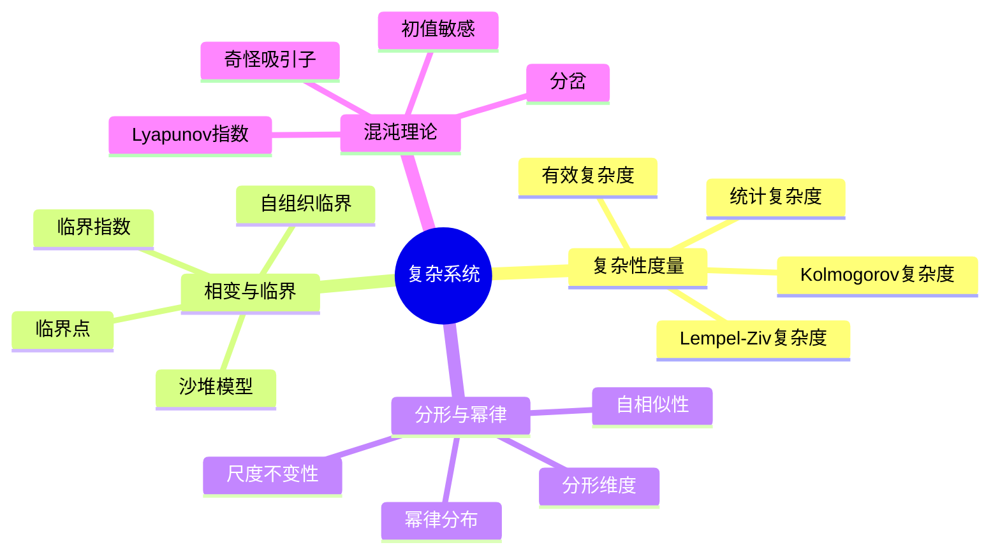

# 11.3 复杂系统

> **Complex Systems**
> 参考：Gell-Mann, M. (1994). _The Quark and the Jaguar_; Mitchell, M. (2009). _Complexity: A Guided Tour_

---

## 3.1 复杂性度量

### 3.1.1 Kolmogorov复杂度

**定义 3.1.1**（Kolmogorov复杂度）：字符串 $x$ 的Kolmogorov复杂度 $K(x)$ 是生成 $x$ 的最短程序的长度：

$$
K(x) = \min_{p} \{|p| : U(p) = x\}
$$

其中 $U$ 为通用图灵机，$|p|$ 为程序 $p$ 的长度。

**定理 3.1.1**（Kolmogorov复杂度的不可计算性）：$K(x)$ 是不可计算的。

**证明**：假设存在计算 $K(x)$ 的程序。构造程序 $Q$：

1. 枚举所有字符串 $s$
2. 对每个 $s$，计算 $K(s)$
3. 找到第一个满足 $K(s) > |Q|$ 的 $s$

但 $Q$ 本身生成 $s$，因此 $K(s) \leq |Q|$，矛盾。$\square$

**定义 3.1.2**（条件Kolmogorov复杂度）：

$$
K(x|y) = \min_{p} \{|p| : U(p, y) = x\}
$$

### 3.1.2 Lempel-Ziv复杂度

**定义 3.1.3**（Lempel-Ziv复杂度）：字符串 $s$ 的LZ复杂度 $c(s)$ 是将 $s$ 分解为最小数量不同子串的数目。

**算法步骤**：

1. 初始化空字典
2. 从左到右扫描字符串
3. 每当遇到字典中未出现的子串时，将其加入字典
4. 复杂度 = 字典中子串数量

**定理 3.1.2**（LZ复杂度的收敛性）：对于遍历随机过程生成的序列：

$$
\lim_{n \to \infty} \frac{c(s^n)}{n} = H
$$

其中 $H$ 为熵率。

### 3.1.3 统计复杂度

**定义 3.1.4**（有效复杂度）：Gell-Mann有效复杂度：

$$
C_{eff}(S) = H(S) - H(S|Env)
$$

即系统熵减去环境给定条件下的条件熵。

**定义 3.1.5**（统计复杂度 - Crutchfield-Young）：因果状态的熵：

$$
C_\mu = H(S) = -\sum_{s} p(s) \log p(s)
$$

其中 $S$ 为因果状态集合。

**定理 3.1.3**（统计复杂度的性质）：

$$
0 \leq C_\mu \leq H(X)
$$

---

## 3.2 相变与临界现象

### 3.2.1 临界性概念

**定义 3.2.1**（临界系统）：系统在临界点附近表现出：

- 长程关联
- 尺度不变性
- 幂律行为

**定义 3.2.2**（序参量）：描述系统有序程度的宏观变量 $\phi$。

**定义 3.2.3**（临界指数）：在临界点附近的幂律行为：

$$
\xi \sim |T - T_c|^{-\nu}
$$

其中 $\xi$ 为关联长度，$\nu$ 为临界指数。

### 3.2.2 自组织临界性

**定义 3.2.4**（自组织临界性 - SOC）：系统自发演化到临界状态，无需外部调节参数。

**经典模型**：Bak-Tang-Wiesenfeld沙堆模型

**特征**：

- 1/f 噪声
- 幂律分布的爆发事件
- 无特征时间/长度尺度

---

## 3.3 分形与幂律

### 3.3.1 分形几何

**定义 3.3.1**（分形）：具有自相似性的几何对象，其豪斯多夫维度严格大于拓扑维度。

**定义 3.3.2**（盒计数维度）：

$$
D_B = \lim_{\epsilon \to 0} \frac{\log N(\epsilon)}{\log(1/\epsilon)}
$$

其中 $N(\epsilon)$ 是覆盖集合所需的边长为 $\epsilon$ 的盒子数。

**定义 3.3.3**（自相似维度）：

$$
D_S = \frac{\log N}{\log(1/r)}
$$

其中 $N$ 是自相似片段数，$r$ 是缩放因子。

### 3.3.2 幂律分布

**定义 3.3.4**（幂律分布）：

$$
P(X > x) \sim x^{-\alpha}
$$

**特征**：

- 无特征尺度
- 厚尾
- 尺度不变性

**常见幂律现象**：

| 现象 | 指数 $\alpha$ | 领域 |
|------|---------------|------|
| Zipf定律（词频） | ~1 | 语言学 |
| Pareto分布（财富） | ~2-3 | 经济学 |
| 地震频率 | ~1 | 地球物理 |
| 网络度分布 | 2-3 | 网络科学 |

---

## 3.4 混沌理论

### 3.4.1 Devaney混沌定义

**定义 3.4.1**（Devaney混沌）：映射 $f: X \to X$ 是混沌的，若：

1. **初值敏感依赖**：$\exists \delta > 0$，对任意 $x$ 和邻域 $N$，$\exists y \in N$ 和 $n \geq 0$ 使得 $|f^n(x) - f^n(y)| > \delta$

2. **拓扑传递性**：对任意开集 $U, V \subset X$，$\exists n > 0$ 使 $f^n(U) \cap V \neq \emptyset$

3. **周期点稠密**：周期点在 $X$ 中稠密

**定理 3.4.1**（Banks et al., 1992）：周期点稠密 + 拓扑传递性 $\Rightarrow$ 初值敏感依赖

### 3.4.2 Lyapunov指数

**定义 3.4.2**（Lyapunov指数）：相邻轨迹的指数分离率：

$$
\lambda = \lim_{t \to \infty} \lim_{\|\delta x_0\| \to 0} \frac{1}{t} \ln \frac{\|\delta x(t)\|}{\|\delta x_0\|}
$$

**定义 3.4.3**（Lyapunov谱）：多维系统的Lyapunov指数集合 $\{\lambda_1 \geq \lambda_2 \geq \cdots \geq \lambda_n\}$。

**定理 3.4.2**（混沌判据）：若最大Lyapunov指数 $\lambda_1 > 0$，则系统混沌。

### 3.4.3 经典混沌系统

**Logistic映射**：

$$
x_{n+1} = r x_n (1 - x_n), \quad x \in [0, 1]
$$

**定理 3.4.3**（倍周期分岔）：当 $r$ 增加时，系统经历一系列倍周期分岔：

$$
r_1 = 3, \quad r_2 = 1 + \sqrt{6} \approx 3.449, \quad \ldots
$$

**定理 3.4.4**（Feigenbaum常数）：分岔间距比收敛于：

$$
\delta = \lim_{n \to \infty} \frac{r_n - r_{n-1}}{r_{n+1} - r_n} \approx 4.6692
$$

**Lorenz系统**：

$$
\begin{cases}
\dot{x} = \sigma(y - x) \\
\dot{y} = x(\rho - z) - y \\
\dot{z} = xy - \beta z
\end{cases}
$$

标准参数：$\sigma = 10$，$\beta = 8/3$，$\rho = 28$

---

## 3.5 思维导图



---

## 3.6 对比矩阵

### 3.6.1 复杂性度量对比

| 度量 | 计算可行性 | 普适性 | 物理意义 | 主要应用 |
|------|------------|--------|----------|----------|
| **Kolmogorov** | 不可计算 | 高 | 信息量 | 理论基础 |
| **LZ复杂度** | 可计算 | 中 | 压缩率 | 序列分析 |
| **统计复杂度** | 可计算 | 中 | 因果结构 | 预测建模 |
| **有效复杂度** | 近似 | 中 | 信息量 | 复杂适应系统 |
| **熵** | 可计算 | 高 | 不确定性 | 通用 |

### 3.6.2 混沌vs随机对比

| 特性 | 确定性混沌 | 随机过程 |
|------|------------|----------|
| **可预测性** | 短期可预测 | 统计可预测 |
| **确定性** | 是 | 否 |
| **初值敏感性** | 是 | 否 |
| **相空间** | 低维 | 高维/无限维 |
| **示例** | 天气、心脏 | 量子测量、噪声 |
| **分析方法** | 相空间重构 | 统计方法 |

### 3.6.3 相变类型对比

| 类型 | 序参量 | 临界行为 | 典型系统 |
|------|--------|----------|----------|
| **二级相变** | 连续变化 | 幂律 | 磁性材料 |
| **一级相变** | 跳跃 | 不连续 | 液体-气体 |
| **渗流** | 连通分量 | 幂律 | 网络、多孔介质 |
| **自组织临界** | 事件大小 | 幂律 | 地震、沙堆 |

---

## 3.7 Python实现

```python
"""
复杂系统：混沌理论与复杂性度量
Lyapunov指数、分岔图和奇怪吸引子
"""

import numpy as np
import matplotlib.pyplot as plt
from scipy.integrate import odeint


class LogisticMap:
    """Logistic映射"""

    def __init__(self, r: float, x0: float = 0.5):
        self.r = r
        self.x = x0
        self.history = [x0]

    def iterate(self, n: int):
        """迭代n次"""
        for _ in range(n):
            self.x = self.r * self.x * (1 - self.x)
            self.history.append(self.x)
        return np.array(self.history)

    def lyapunov_exponent(self, n_transient: int = 1000, n_compute: int = 10000) -> float:
        """计算Lyapunov指数"""
        x = 0.5
        for _ in range(n_transient):
            x = self.r * x * (1 - x)

        lyap_sum = 0
        for _ in range(n_compute):
            x = self.r * x * (1 - x)
            lyap_sum += np.log(abs(self.r * (1 - 2 * x)))

        return lyap_sum / n_compute


class LorenzSystem:
    """Lorenz系统"""

    def __init__(self, sigma: float = 10.0, rho: float = 28.0, beta: float = 8/3):
        self.sigma = sigma
        self.rho = rho
        self.beta = beta

    def dynamics(self, state, t):
        """Lorenz动力学"""
        x, y, z = state
        dx = self.sigma * (y - x)
        dy = x * (self.rho - z) - y
        dz = x * y - self.beta * z
        return [dx, dy, dz]

    def simulate(self, x0: np.ndarray, t_span: tuple = (0, 50), n_points: int = 5000):
        """仿真"""
        t = np.linspace(t_span[0], t_span[1], n_points)
        trajectory = odeint(self.dynamics, x0, t)
        return t, trajectory


def lempel_ziv_complexity(sequence: str) -> int:
    """Lempel-Ziv复杂度"""
    if not sequence:
        return 0

    substrings = set()
    i = 0
    n = len(sequence)

    while i < n:
        found = ""
        for j in range(i + 1, n + 1):
            substring = sequence[i:j]
            if substring in substrings:
                found = substring
            else:
                break

        if found:
            new_substring = sequence[i:i+len(found)+1] if i+len(found) < n else sequence[i:]
        else:
            new_substring = sequence[i:i+1]

        substrings.add(new_substring)
        i += len(new_substring)

    return len(substrings)


if __name__ == "__main__":
    # Logistic映射示例
    log_map = LogisticMap(r=3.8)
    trajectory = log_map.iterate(100)
    lyap = log_map.lyapunov_exponent()
    print(f"Logistic Map (r=3.8):")
    print(f"  Final value: {trajectory[-1]:.4f}")
    print(f"  Lyapunov exponent: {lyap:.4f}")
    print(f"  Is chaotic: {lyap > 0}")

    # LZ复杂度示例
    test_seq = "0101010101010101"
    lz_complex = lempel_ziv_complexity(test_seq)
    print(f"\nLempel-Ziv complexity of periodic sequence: {lz_complex}")

    random_seq = "".join(str(np.random.randint(0, 2)) for _ in range(100))
    lz_complex_random = lempel_ziv_complexity(random_seq)
    print(f"Lempel-Ziv complexity of random sequence: {lz_complex_random}")
```

---

## 3.8 应用案例

### 3.8.1 金融市场复杂性分析

**问题描述**：分析股票价格波动的复杂性特征

**分析方法**：

1. 计算收益率序列的LZ复杂度
2. 估计Hurst指数（长程相关性）
3. 检测幂律分布特征

**结果**：

- 收益率呈现近似随机行走（Hurst ≈ 0.5）
- 波动聚集现象（GARCH效应）
- 极端事件服从幂律分布（厚尾）

### 3.8.2 气候系统临界点检测

**问题描述**：识别气候系统的临界转变预警信号

**方法**：

- 计算方差和自相关的增加
- 监测恢复速率变慢
- 分析空间相关性变化

**预警指标**：

| 指标 | 临界前行为 | 物理意义 |
|------|------------|----------|
| 方差 | 增加 | 系统稳定性降低 |
| 自相关 | 增加 | 记忆效应增强 |
| 偏度 | 增加 | 不对称性增强 |

---

## 3.9 与其他模块的交叉引用

### 3.9.1 前置知识

| 概念 | 来源模块 | 具体位置 |
|------|----------|----------|
| 熵 | 10_信息论 | 信息熵理论 |
| 动力系统 | 01_数学基础 | 微分方程 |
| 概率论 | 01_数学基础 | 05_概率论与测度论 |

### 3.9.2 后续应用

| 概念 | 目标模块 | 应用场景 |
|------|----------|----------|
| 混沌 | 04_自组织理论 | 耗散结构动力学 |
| 幂律 | 05_网络科学 | 无标度网络分析 |
| 复杂性 | 06_系统动力学 | 模型复杂度评估 |

---

## 3.10 参考文献

1. Gell-Mann, M. (1994). _The Quark and the Jaguar: Adventures in the Simple and the Complex_. W.H. Freeman.

2. Mitchell, M. (2009). _Complexity: A Guided Tour_. Oxford University Press.

3. Strogatz, S. H. (2018). _Nonlinear Dynamics and Chaos_ (2nd ed.). Westview Press.

4. Bak, P. (1996). _How Nature Works: The Science of Self-Organized Criticality_. Copernicus.

5. Kantz, H., & Schreiber, T. (2004). _Nonlinear Time Series Analysis_ (2nd ed.). Cambridge University Press.
