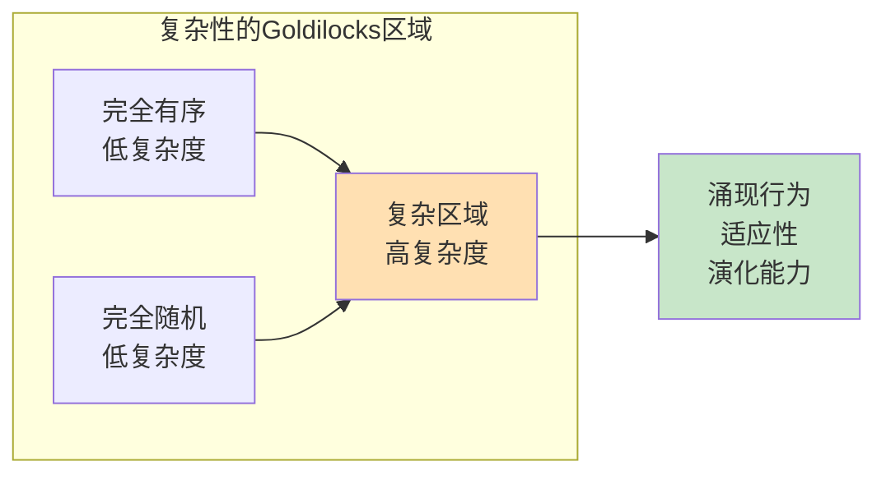

# 11.9 复杂性度量

> 参考：Gell-Mann, M. (1994). _The Quark and the Jaguar_; Lloyd, S. (2001). "Measures of Complexity"

---

## 11.9.1 算法复杂度

### 11.9.1.1 Kolmogorov复杂度

**定义 11.9.1**（Kolmogorov复杂度）：字符串 $x$ 的Kolmogorov复杂度 $K(x)$ 是生成 $x$ 的最短程序的长度：

$$K(x) = \min_{p} \{|p| : U(p) = x\}$$

其中 $U$ 为通用图灵机，$|p|$ 为程序 $p$ 的长度。

**定理 11.9.1**（Kolmogorov复杂度的不可计算性）：$K(x)$ 是不可计算的。

**证明**：假设存在计算 $K(x)$ 的程序。构造程序 $Q$：

1. 枚举所有字符串 $s$
2. 对每个 $s$，计算 $K(s)$
3. 找到第一个满足 $K(s) > |Q|$ 的 $s$

但 $Q$ 本身生成 $s$，因此 $K(s) \leq |Q|$，矛盾。$\square$

**定义 11.9.2**（条件Kolmogorov复杂度）：

$$K(x|y) = \min_{p} \{|p| : U(p, y) = x\}$$

**定理 11.9.2**（信息不等式）：

$$K(x, y) \leq K(x) + K(y|x) + O(\log(|x| + |y|))$$

### 11.9.1.2 Lempel-Ziv复杂度

**定义 11.9.3**（Lempel-Ziv复杂度）：字符串 $s$ 的LZ复杂度 $c(s)$ 是将 $s$ 分解为最小数量不同子串的数目。

算法步骤：

1. 初始化空字典
2. 从左到右扫描字符串
3. 每当遇到字典中未出现的子串时，将其加入字典
4. 复杂度 = 字典中子串数量

**定理 11.9.3**（LZ复杂度的收敛性）：对于遍历随机过程生成的序列：

$$\lim_{n \to \infty} \frac{c(s^n)}{n} = H$$

其中 $H$ 为熵率。

---

## 11.9.2 统计复杂度

### 11.9.2.1 有效复杂度

**定义 11.9.4**（有效复杂度）：Gell-Mann有效复杂度：

$$C_{eff}(S) = H(S) - H(S|Env)$$

即系统熵减去环境给定条件下的条件熵。

**定义 11.9.5**（总信息）：

$$\Sigma = H(S) + C_{eff}(S)$$

### 11.9.2.2 统计复杂度（Crutchfield-Young）

**定义 11.9.6**（因果状态）：两个历史 $\overleftarrow{x}$ 和 $\overleftarrow{x}'$ 等价，若它们对未来有相同的条件分布：

$$P(\overrightarrow{X}|\overleftarrow{x}) = P(\overrightarrow{X}|\overleftarrow{x}')$$

**定义 11.9.7**（统计复杂度）：因果状态的熵：

$$C_\mu = H(S) = -\sum_{s} p(s) \log p(s)$$

其中 $S$ 为因果状态集合。

**定理 11.9.4**（统计复杂度的性质）：

$$0 \leq C_\mu \leq H(X)$$

等号成立条件：

- $C_\mu = 0$：完全随机（无结构）
- $C_\mu = H(X)$：完全有序（最大结构）

---

## 11.9.3 物理复杂度

### 11.9.3.1 热力学深度

**定义 11.9.8**（热力学深度）：系统达到当前状态所需的最小计算资源：

$$\mathcal{D} = -\langle \ln p(\vec{x}|\vec{x}_0) \rangle$$

其中 $\vec{x}_0$ 为初始条件，$\vec{x}$ 为最终状态。

### 11.9.3.2 有效测度复杂度

**定义 11.9.9**（有效测度复杂度）：

$$EMC = \sum_{L=1}^{\infty} [H(X_0|X_{-L}^{-1}) - H(X_0|X_{-\infty}^{-1})]$$

即有限记忆与无限记忆的预测差异之和。

---

## 11.9.4 网络复杂度

### 11.9.4.1 图复杂度

**定义 11.9.10**（图Kolmogorov复杂度）：图 $G$ 的复杂度：

$$K(G) = K(A_G) + O(\log |V|)$$

其中 $A_G$ 为邻接矩阵。

**定义 11.9.11**（图熵）：

$$H(G) = -\sum_{i,j} \frac{a_{ij}}{2|E|} \log \frac{a_{ij}}{2|E|}$$

### 11.9.4.2 复杂网络度量

**定义 11.9.12**（网络复杂度指数）：

$$C_{net} = \frac{\langle C \rangle}{C_{random}} \cdot \frac{L_{random}}{L}$$

其中 $C$ 为聚类系数，$L$ 为特征路径长度。

---

## 11.9.5 Python实现：复杂性度量

```python
"""
复杂系统：复杂性度量
基于Kolmogorov复杂度、统计复杂度和有效复杂度的实现
"""

import numpy as np
from typing import List, Tuple, Dict, Optional
from dataclasses import dataclass
from collections import Counter, defaultdict
import matplotlib.pyplot as plt
from scipy.stats import entropy
import zlib


class KolmogorovComplexity:
    """
    Kolmogorov复杂度的近似计算
    """

    @staticmethod
    def compression_ratio(data: bytes) -> float:
        """
        使用压缩算法估计Kolmogorov复杂度

        压缩后的长度作为复杂度的上界
        """
        compressed = zlib.compress(data)
        return len(compressed) / len(data)

    @staticmethod
    def lempel_ziv_complexity(sequence: str) -> int:
        """
        Lempel-Ziv复杂度（子串分解法）

        返回分解所需的最小子串数
        """
        if not sequence:
            return 0

        substrings = set()
        i = 0
        n = len(sequence)

        while i < n:
            # 找到最长的已存在子串
            found = ""
            for j in range(i + 1, n + 1):
                substring = sequence[i:j]
                if substring in substrings:
                    found = substring
                else:
                    break

            # 添加新子串
            if found:
                new_substring = sequence[i:i+len(found)+1] if i+len(found) < n else sequence[i:]
            else:
                new_substring = sequence[i:i+1]

            substrings.add(new_substring)
            i += len(new_substring)

        return len(substrings)

    @staticmethod
    def lempel_ziv_normalized(sequence: str) -> float:
        """归一化的LZ复杂度"""
        n = len(sequence)
        if n == 0:
            return 0

        c = KolmogorovComplexity.lempel_ziv_complexity(sequence)

        # 归一化因子
        if n > 0:
            # 对于随机序列，期望复杂度约为 n / log(n)
            normalization = n / np.log2(n) if n > 1 else 1
            return c / normalization
        return 0


class StatisticalComplexity:
    """
    统计复杂度度量
    """

    def __init__(self, sequence: List, order: int = 3):
        """
        初始化

        Args:
            sequence: 符号序列
            order: 记忆阶数（用于因果状态）
        """
        self.sequence = sequence
        self.order = order
        self.n = len(sequence)

    def block_entropy(self, block_size: int) -> float:
        """计算块熵"""
        if block_size == 0:
            return 0

        blocks = []
        for i in range(len(self.sequence) - block_size + 1):
            block = tuple(self.sequence[i:i+block_size])
            blocks.append(block)

        # 计算频率
        counter = Counter(blocks)
        total = len(blocks)
        probabilities = [count / total for count in counter.values()]

        return entropy(probabilities, base=2)

    def entropy_rate(self, max_block: int = 5) -> float:
        """
        估计熵率

        H = lim_{L→∞} H(X_0 | X_{-L}^{-1})
        """
        entropies = []
        for L in range(1, max_block + 1):
            h = self.conditional_entropy(L)
            entropies.append(h)

        # 使用最后几个值估计极限
        if len(entropies) >= 2:
            return np.mean(entropies[-2:])
        return entropies[-1] if entropies else 0

    def conditional_entropy(self, history_length: int) -> float:
        """计算条件熵 H(X_t | X_{t-history_length}^{t-1})"""
        if history_length == 0:
            # 边际熵
            counter = Counter(self.sequence)
            probs = [c / len(self.sequence) for c in counter.values()]
            return entropy(probs, base=2)

        # 构建历史到未来的映射
        history_future = defaultdict(list)

        for i in range(history_length, len(self.sequence)):
            history = tuple(self.sequence[i-history_length:i])
            future = self.sequence[i]
            history_future[history].append(future)

        # 计算条件熵
        total = sum(len(futures) for futures in history_future.values())
        h_cond = 0

        for history, futures in history_future.items():
            p_history = len(futures) / total

            # 给定历史下的条件分布
            counter = Counter(futures)
            cond_probs = [c / len(futures) for c in counter.values()]
            h_future_given_history = entropy(cond_probs, base=2)

            h_cond += p_history * h_future_given_history

        return h_cond

    def excess_entropy(self, max_block: int = 5) -> float:
        """
        过剩熵（统计复杂度的估计）

        E = I[X_{-∞}^{-1} : X_0^{∞}] = Σ[H(L) - L·h_μ]
        """
        h_infinity = self.entropy_rate(max_block)

        excess = 0
        for L in range(1, max_block + 1):
            h_L = self.block_entropy(L)
            excess += h_L - L * h_infinity

        return excess

    def effective_complexity(self, tolerance: float = 0.1) -> float:
        """
        有效复杂度（简化估计）

        基于熵和描述复杂度的平衡
        """
        # 总熵
        h_total = self.block_entropy(1)

        # 随机性度量
        randomness = self.entropy_rate()

        # 有效复杂度 = 总熵 - 随机性
        # 这表示"结构化"的信息量
        c_eff = h_total - randomness

        return max(0, c_eff)


class NetworkComplexity:
    """
    网络复杂度度量
    """

    def __init__(self, adjacency_matrix: np.ndarray):
        """
        初始化

        Args:
            adjacency_matrix: 邻接矩阵
        """
        self.A = adjacency_matrix
        self.n = adjacency_matrix.shape[0]

    def graph_entropy(self) -> float:
        """
        图熵（基于度分布）
        """
        degrees = np.sum(self.A, axis=1)
        degree_dist = degrees / np.sum(degrees)

        return entropy(degree_dist + 1e-10, base=2)

    def offdiagonal_complexity(self) -> float:
        """
        非对角复杂度

        基于邻接矩阵的非对角结构
        """
        # 归一化邻接矩阵
        if np.sum(self.A) > 0:
            P = self.A / np.sum(self.A)
        else:
            return 0

        # 计算熵
        flat_P = P.flatten()
        flat_P = flat_P[flat_P > 0]

        return entropy(flat_P, base=2)

    def compressibility(self) -> float:
        """
        图的可压缩性

        作为结构复杂度的代理
        """
        # 将邻接矩阵展平为字节
        flat = self.A.flatten()
        byte_data = np.packbits(flat.astype(np.uint8))

        # 压缩
        compressed = zlib.compress(byte_data.tobytes())

        return len(compressed) / len(byte_data)


class ThermodynamicDepth:
    """
    热力学深度
    """

    @staticmethod
    def compute_trajectory_probability(trajectory: np.ndarray,
                                      transition_matrix: np.ndarray) -> float:
        """
        计算轨迹的概率

        Args:
            trajectory: 状态序列
            transition_matrix: 转移概率矩阵
        """
        prob = 1.0

        for i in range(len(trajectory) - 1):
            state_from = int(trajectory[i])
            state_to = int(trajectory[i+1])

            if state_from < transition_matrix.shape[0] and \
               state_to < transition_matrix.shape[1]:
                prob *= transition_matrix[state_from, state_to]

        return prob

    @staticmethod
    def thermodynamic_depth(trajectory: np.ndarray,
                           transition_matrix: np.ndarray) -> float:
        """
        计算热力学深度

        D = -ln p(trajectory | initial_state)
        """
        prob = ThermodynamicDepth.compute_trajectory_probability(
            trajectory, transition_matrix
        )

        if prob > 0:
            return -np.log(prob)
        else:
            return np.inf


def complexity_analysis_examples():
    """
    复杂性分析示例
    """
    print("=" * 60)
    print("Complexity Analysis Examples")
    print("=" * 60)

    # 1. 不同序列的Kolmogorov复杂度（近似）
    print("\n1. Lempel-Ziv Complexity")
    print("-" * 40)

    sequences = {
        "Constant": "00000000000000000000",
        "Periodic": "01010101010101010101",
        "Fibonacci": "01001010010010100100",
        "Random": ''.join(np.random.choice(['0', '1'], 20).tolist())
    }

    for name, seq in sequences.items():
        lz_c = KolmogorovComplexity.lempel_ziv_complexity(seq)
        lz_norm = KolmogorovComplexity.lempel_ziv_normalized(seq)
        print(f"  {name:12s}: LZ={lz_c:2d}, Normalized={lz_norm:.3f}, Seq={seq[:20]}")

    # 2. 统计复杂度
    print("\n2. Statistical Complexity")
    print("-" * 40)

    # 生成不同复杂度的序列
    np.random.seed(42)

    sequences_stat = {
        "Ordered": [i % 3 for i in range(1000)],
        "Markov": [],
        "Random": np.random.randint(0, 3, 1000).tolist()
    }

    # 生成Markov序列
    transition = np.array([[0.7, 0.2, 0.1],
                          [0.1, 0.8, 0.1],
                          [0.2, 0.2, 0.6]])
    state = 0
    for _ in range(1000):
        sequences_stat["Markov"].append(state)
        state = np.random.choice(3, p=transition[state])

    for name, seq in sequences_stat.items():
        sc = StatisticalComplexity(seq, order=2)
        h_rate = sc.entropy_rate(4)
        excess = sc.excess_entropy(4)
        eff_complex = sc.effective_complexity()

        print(f"  {name:10s}: Entropy rate={h_rate:.4f}, "
              f"Excess entropy={excess:.4f}, Effective complexity={eff_complex:.4f}")

    return sequences, sequences_stat


def network_complexity_example():
    """
    网络复杂度示例
    """
    print("\n" + "=" * 60)
    print("Network Complexity")
    print("=" * 60)

    # 不同结构的网络
    n = 20

    networks = {
        "Complete": np.ones((n, n)) - np.eye(n),
        "Random": np.random.rand(n, n) < 0.2,
        "Star": np.zeros((n, n)),
        "Ring": np.zeros((n, n))
    }

    # 星型网络
    networks["Star"][0, 1:] = 1
    networks["Star"][1:, 0] = 1

    # 环形网络
    for i in range(n):
        networks["Ring"][i, (i+1) % n] = 1
        networks["Ring"][(i+1) % n, i] = 1

    for name, A in networks.items():
        A = A.astype(int)
        nc = NetworkComplexity(A)

        h_graph = nc.graph_entropy()
        h_offdiag = nc.offdiagonal_complexity()
        compress = nc.compressibility()

        print(f"  {name:10s}: Graph entropy={h_graph:.4f}, "
              f"Off-diag entropy={h_offdiag:.4f}, Compressibility={compress:.4f}")

    return networks


def visualize_complexity():
    """可视化复杂性分析"""
    fig = plt.figure(figsize=(16, 10))

    # 1. LZ复杂度随序列长度变化
    ax1 = plt.subplot(2, 3, 1)
    lengths = range(10, 1000, 50)

    lz_periodic = []
    lz_random = []

    for n in lengths:
        seq_p = ('01' * (n // 2 + 1))[:n]
        seq_r = ''.join(np.random.choice(['0', '1'], n).tolist())

        lz_periodic.append(KolmogorovComplexity.lempel_ziv_complexity(seq_p))
        lz_random.append(KolmogorovComplexity.lempel_ziv_complexity(seq_r))

    ax1.plot(lengths, lz_periodic, 'b-', linewidth=2, label='Periodic')
    ax1.plot(lengths, lz_random, 'r-', linewidth=2, label='Random')
    ax1.set_xlabel('Sequence Length')
    ax1.set_ylabel('LZ Complexity')
    ax1.set_title('LZ Complexity vs Length')
    ax1.legend()
    ax1.grid(True, alpha=0.3)

    # 2. 块熵随块大小变化
    ax2 = plt.subplot(2, 3, 2)

    # 生成序列
    seq_ordered = [i % 4 for i in range(1000)]
    seq_random = np.random.randint(0, 4, 1000).tolist()

    sc_ordered = StatisticalComplexity(seq_ordered)
    sc_random = StatisticalComplexity(seq_random)

    block_sizes = range(1, 6)
    h_ordered = [sc_ordered.block_entropy(b) for b in block_sizes]
    h_random = [sc_random.block_entropy(b) for b in block_sizes]

    ax2.plot(block_sizes, h_ordered, 'b-o', linewidth=2, label='Ordered')
    ax2.plot(block_sizes, h_random, 'r-s', linewidth=2, label='Random')
    ax2.set_xlabel('Block Size')
    ax2.set_ylabel('Block Entropy')
    ax2.set_title('Block Entropy vs Size')
    ax2.legend()
    ax2.grid(True, alpha=0.3)

    # 3. 条件熵（记忆长度）
    ax3 = plt.subplot(2, 3, 3)

    histories = range(0, 5)
    h_cond_ordered = [sc_ordered.conditional_entropy(h) for h in histories]
    h_cond_random = [sc_random.conditional_entropy(h) for h in histories]

    ax3.plot(histories, h_cond_ordered, 'b-o', linewidth=2, label='Ordered')
    ax3.plot(histories, h_cond_random, 'r-s', linewidth=2, label='Random')
    ax3.set_xlabel('History Length')
    ax3.set_ylabel('Conditional Entropy')
    ax3.set_title('Conditional Entropy vs History')
    ax3.legend()
    ax3.grid(True, alpha=0.3)

    # 4. 网络结构可视化
    ax4 = plt.subplot(2, 3, 4)

    n = 15
    # 随机网络
    A_random = np.random.rand(n, n) < 0.3
    ax4.imshow(A_random, cmap='Blues', interpolation='nearest')
    ax4.set_title('Random Network Adjacency')
    ax4.set_xlabel('Node')
    ax4.set_ylabel('Node')

    # 5. 网络复杂度比较
    ax5 = plt.subplot(2, 3, 5)

    network_types = ['Complete', 'Star', 'Ring', 'Random']
    complexities = []

    for name in network_types:
        if name == 'Complete':
            A = np.ones((n, n)) - np.eye(n)
        elif name == 'Star':
            A = np.zeros((n, n))
            A[0, 1:] = 1
            A[1:, 0] = 1
        elif name == 'Ring':
            A = np.zeros((n, n))
            for i in range(n):
                A[i, (i+1) % n] = 1
                A[(i+1) % n, i] = 1
        else:  # Random
            A = np.random.rand(n, n) < 0.3

        A = A.astype(int)
        nc = NetworkComplexity(A)
        complexities.append(nc.offdiagonal_complexity())

    ax5.bar(network_types, complexities, color=['#e74c3c', '#3498db', '#2ecc71', '#9b59b6'])
    ax5.set_ylabel('Off-diagonal Entropy')
    ax5.set_title('Network Complexity by Type')
    ax5.grid(True, alpha=0.3, axis='y')

    # 6. 复杂度-随机性图（复杂图）
    ax6 = plt.subplot(2, 3, 6)

    # 生成不同复杂度的序列并绘制
    randomness_vals = []
    complexity_vals = []
    labels = []

    for order_level in [0, 0.25, 0.5, 0.75, 1.0]:
        # 混合序列
        n = 1000
        seq = []
        for i in range(n):
            if np.random.random() < order_level:
                seq.append(i % 4)
            else:
                seq.append(np.random.randint(0, 4))

        sc = StatisticalComplexity(seq)
        rand = sc.entropy_rate()
        comp = sc.effective_complexity()

        randomness_vals.append(rand)
        complexity_vals.append(comp)
        labels.append(f'{order_level*100:.0f}%')

    ax6.scatter(randomness_vals, complexity_vals, s=200, c=range(len(labels)), cmap='viridis')
    for i, label in enumerate(labels):
        ax6.annotate(label, (randomness_vals[i], complexity_vals[i]),
                    fontsize=10, ha='center', va='bottom')

    ax6.set_xlabel('Randomness (Entropy Rate)')
    ax6.set_ylabel('Effective Complexity')
    ax6.set_title('Complexity vs Randomness')
    ax6.grid(True, alpha=0.3)

    plt.tight_layout()
    plt.savefig('complexity_measures.png', dpi=150, bbox_inches='tight')
    plt.show()


if __name__ == "__main__":
    sequences, sequences_stat = complexity_analysis_examples()
    networks = network_complexity_example()
    visualize_complexity()
    print("\nVisualization saved to 'complexity_measures.png'")
```

---

## 11.9.6 Mermaid复杂度图

```mermaid
graph TB
    subgraph "复杂性度量谱系"
        A[Kolmogorov复杂度<br/>K(x)] --> B[算法复杂度]
        C[统计复杂度<br/>C_μ] --> D[物理复杂度]
        E[有效复杂度<br/>C_eff] --> F[网络复杂度]

        B --> G[热力学深度<br/>𝒟]
        D --> G
        F --> H[图熵]
    end

    note["高复杂度 ≠ 高有序<br/>复杂性的最大值在<br/>有序与随机的边界"]
```



---

## 11.9.7 参考文献

1. Gell-Mann, M. (1994). _The Quark and the Jaguar: Adventures in the Simple and the Complex_. W.H. Freeman.

2. Lloyd, S. (2001). "Measures of Complexity: A Nonexhaustive List". _IEEE Control Systems Magazine_, 21(4), 7-8.

3. Crutchfield, J. P., & Young, K. (1989). "Inferring Statistical Complexity". _Physical Review Letters_, 63(2), 105-108.

4. Li, M., & Vitányi, P. (2008). _An Introduction to Kolmogorov Complexity and Its Applications_ (3rd ed.). Springer.

5. Shalizi, C. R. (2006). "Methods and Techniques of Complex Systems Science: An Overview". In _Complex Systems Science in Biomedicine_ (pp. 33-114). Springer.
