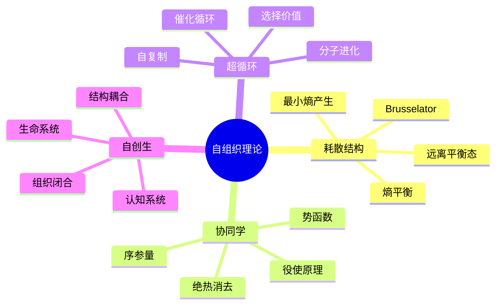

# 11.4 自组织理论

---

📌 **内容摘要**

本文档深入探讨自组织理论的核心原理和关键方法。内容涵盖系统科学领域的主要知识点，包括相关理论、方法及应用。适合有一定基础的学习者系统学习。

**关键词**: 系统科学

📚 **学习目标**

- 掌握自组织的核心概念和主要方法
- 理解相关理论的应用场景
- 建立该领域的系统性知识框架

🎯 **难度级别**: 中级

⏱️ **预计阅读时间**: 15分钟

**前置知识**: 相关领域的基础概念

---


> **Self-Organization Theory**
> 参考：Prigogine, I. (1977). _Self-Organization in Nonequilibrium Systems_; Haken, H. (1983). _Advanced Synergetics_

---

## 4.1 耗散结构理论

### 4.1.1 远离平衡态的热力学

**定义 4.1.1**（熵平衡）：开放系统的熵变化：

$$
dS = d_e S + d_i S
$$

其中：

| 符号 | 名称 | 说明 |
|------|------|------|
| $d_e S$ | 熵流 | 与环境交换 |
| $d_i S$ | 熵产生 | 内部不可逆过程 |

**定理 4.1.1**（熵产生非负）：

$$
d_i S \geq 0
$$

**定义 4.1.2**（定态）：系统性质不随时间变化的状态，但内部存在持续的流。

### 4.1.2 最小熵产生原理

**定理 4.1.2**（Prigogine最小熵产生原理）：在线性非平衡区，定态使熵产生取极小值。

**证明**：设熵产生：

$$
P = \int \sigma dV = \int \sum_i J_i X_i dV
$$

在定态，流 $J_i$ 稳定，力 $X_i$ 达到使 $\delta P = 0$ 且 $\delta^2 P > 0$。$\square$

### 4.1.3 耗散结构

**定义 4.1.3**（耗散结构）：在远离平衡条件下，通过与外界交换物质和能量而形成的时-空有序结构。

**特征**：

- 需要持续的能量/物质输入
- 对称性破缺
- 对涨落的敏感性
- 阈值行为

### 4.1.4 Brusselator模型

**定义 4.1.4**（Brusselator反应）：

$$
\begin{cases}
A \xrightarrow{k_1} X \\
B + X \xrightarrow{k_2} Y + D \\
2X + Y \xrightarrow{k_3} 3X \\
X \xrightarrow{k_4} E
\end{cases}
$$

**定义 4.1.5**（动力学方程）：

$$
\begin{cases}
\frac{dX}{dt} = A - (B + 1)X + X^2 Y \\
\frac{dY}{dt} = BX - X^2 Y
\end{cases}
$$

**定理 4.1.3**（Brusselator分岔）：当 $B > B_c = 1 + A^2$ 时，定态失稳，出现极限环。

---

## 4.2 协同学

### 4.2.1 序参量概念

**定义 4.2.1**（序参量）：描述系统宏观有序程度的变量 $\xi$，它支配子系统的行为。

**特征**：

- 在相变点从零变为非零
- 弛豫时间远长于子系统
- 支配子系统的演化

**定理 4.2.1**（绝热消去原理）：快弛豫变量追随慢变量（序参量）：

$$
\dot{q}_s = -\gamma_s q_s + f_s(q_f, q_s), \quad \gamma_s \ll \gamma_f
$$

定态时：$q_f = q_f(q_s)$（快变量表示为序参量的函数）

### 4.2.2 役使原理

**定义 4.2.2**（役使原理）：序参量支配子系统，子系统通过反馈影响序参量。

**定理 4.2.2**（役使方程）：消去快变量后，序参量方程：

$$
\dot{\xi} = N(\xi) + F(t)
$$

其中 $N$ 为非线性函数，$F$ 为涨落力。

### 4.2.3 势函数方法

**定义 4.2.3**（势函数）：系统演化的"驱动力"来自势函数的梯度：

$$
\dot{\xi} = -\frac{\partial V}{\partial \xi} + F(t)
$$

**典型势函数**（超临界分岔）：

$$
V(\xi) = -\frac{\alpha}{2}\xi^2 + \frac{\beta}{4}\xi^4
$$

---

## 4.3 超循环理论

### 4.3.1 自复制与演化

**定义 4.3.1**（超循环）：自我复制的分子通过催化循环耦合形成的自组织系统。

**基本结构**：

$$
I_1 \xrightarrow{E_n} I_2 \xrightarrow{E_1} I_3 \xrightarrow{E_2} \cdots \xrightarrow{E_{n-1}} I_1
$$

其中 $I_i$ 为信息载体，$E_i$ 为催化剂。

### 4.3.2 达尔文选择

**定理 4.3.1**（超循环选择）：在超循环竞争中，具有最大增长率的选择价值 $W$ 的超循环被选择：

$$
W = \prod_{i=1}^{n} k_i^{1/n}
$$

其中 $k_i$ 为各步反应速率。

---

## 4.4 自创生系统

### 4.4.1 组织闭合

**定义 4.4.1**（自创生）：系统通过自身的组成部分产生和维持自身的组织边界和内部结构。

**特征**：

- 组织闭合（非物质闭合）
- 结构耦合
- 认知与行动的统一

### 4.4.2 生命系统特征

**生命系统的自组织特征**：

| 特征 | 说明 | 示例 |
|------|------|------|
| 自维持 | 维持内部环境稳定 | 体温调节 |
| 自修复 | 损伤后恢复 | 伤口愈合 |
| 自适应 | 响应环境变化 | 免疫应答 |
| 自复制 | 产生相似个体 | 细胞分裂 |
| 自进化 | 种群水平适应 | 自然选择 |

---

## 4.5 思维导图



---

## 4.6 对比矩阵

### 4.6.1 自组织理论对比

| 理论 | 核心概念 | 数学工具 | 典型系统 | 时间尺度 |
|------|----------|----------|----------|----------|
| **耗散结构** | 熵产生、定态 | 非平衡热力学 | 化学反应、流体 | 宏观 |
| **协同学** | 序参量、役使 | 随机微分方程 | 激光、对流 | 宏观 |
| **超循环** | 自复制、选择 | 微分方程组 | 分子进化 | 进化 |
| **自创生** | 组织闭合 | 逻辑/范畴论 | 生命、认知 | 多尺度 |

### 4.6.2 平衡vs非平衡对比

| 特性 | 平衡态 | 线性非平衡 | 非线性非平衡 |
|------|--------|------------|--------------|
| **熵产生** | 零 | 极小 | 可变 |
| **有序性** | 最大无序 | 近无序 | 自发有序 |
| **稳定性** | 最大 | 稳定 | 可能不稳定 |
| **对称性** | 完整 | 完整 | 破缺 |
| **典型结构** | 均匀 | 均匀 | 耗散结构 |

### 4.6.3 自组织vs他组织对比

| 特性 | 自组织 | 他组织 |
|------|--------|--------|
| **指令来源** | 内部 | 外部 |
| **控制方式** | 分布式 | 集中式 |
| **适应性** | 高 | 低 |
| **鲁棒性** | 高 | 中 |
| **设计成本** | 低 | 高 |
| **可预测性** | 低 | 高 |
| **典型例子** | 市场、蚁群 | 工厂、军队 |

---

## 4.7 Python实现

```python
"""
自组织理论：耗散结构与协同学
Brusselator模型和序参量动力学
"""

import numpy as np
import matplotlib.pyplot as plt
from scipy.integrate import odeint


class Brusselator:
    """Brusselator模型"""

    def __init__(self, A: float = 1.0, B: float = 2.5):
        self.A = A
        self.B = B
        self.Bc = 1 + A**2  # 临界值

    def dynamics(self, state, t):
        """动力学方程"""
        X, Y = state
        dX = self.A - (self.B + 1) * X + X**2 * Y
        dY = self.B * X - X**2 * Y
        return [dX, dY]

    def steady_state(self):
        """定态"""
        return np.array([self.A, self.B / self.A])

    def is_stable(self):
        """检查定态稳定性"""
        return self.B < self.Bc

    def simulate(self, X0: np.ndarray, t_span: tuple = (0, 50), n_points: int = 5000):
        """仿真"""
        t = np.linspace(t_span[0], t_span[1], n_points)
        trajectory = odeint(self.dynamics, X0, t)
        return t, trajectory


class OrderParameter:
    """序参量动力学"""

    def __init__(self, a: float = -1.0, b: float = 1.0):
        """
        标准序参量方程: dξ/dt = aξ - bξ³
        """
        self.a = a
        self.b = b

    def dynamics(self, xi, t):
        """序参量方程"""
        return self.a * xi - self.b * xi**3

    def steady_states(self):
        """定态解"""
        if self.a < 0:
            return [0]
        else:
            return [0, np.sqrt(self.a/self.b), -np.sqrt(self.a/self.b)]

    def potential(self, xi):
        """势函数 V(ξ) = -∫(dξ/dt)dξ"""
        return -0.5 * self.a * xi**2 + 0.25 * self.b * xi**4


if __name__ == "__main__":
    # Brusselator示例
    bruss_stable = Brusselator(A=1.0, B=1.5)
    bruss_unstable = Brusselator(A=1.0, B=3.0)

    print("Brusselator Model:")
    print(f"  Critical Bc = {bruss_stable.Bc:.2f}")
    print(f"  B=1.5 is {'stable' if bruss_stable.is_stable() else 'unstable'}")
    print(f"  B=3.0 is {'stable' if bruss_unstable.is_stable() else 'unstable'}")

    # 序参量示例
    op = OrderParameter(a=1.0, b=1.0)
    states = op.steady_states()
    print(f"\nOrder Parameter (a=1, b=1):")
    print(f"  Steady states: {states}")
    print(f"  Potential at ξ=0: {op.potential(0):.4f}")
    print(f"  Potential at ξ=1: {op.potential(1):.4f}")
```

---

## 4.8 应用案例

### 4.8.1 化学模式形成

**问题描述**：Belousov-Zhabotinsky反应中的螺旋波形成

**机制**：

- 自催化反应产生化学振荡
- 扩散导致空间模式
- 波传播形成螺旋结构

**数学模型**：反应-扩散方程

$$
\frac{\partial c}{\partial t} = f(c) + D \nabla^2 c
$$

**应用价值**：

- 理解生物形态发生
- 设计化学计算系统
- 开发新型材料

### 4.8.2 城市演化自组织

**问题描述**：城市空间结构的自发形成

**观察现象**：

- 商业中心自发形成
- 居住区与工业区分离
- 交通网络的层级结构

**自组织机制**：

- 居民选址的偏好依附
- 土地使用的竞争
- 交通流反馈

**模型**：基于主体的城市演化模型

---

## 4.9 与其他模块的交叉引用

### 4.9.1 前置知识

| 概念 | 来源模块 | 具体位置 |
|------|----------|----------|
| 热力学 | 物理学 | 热力学基础 |
| 微分方程 | 01_数学基础 | 04_分析学 |
| 随机过程 | 01_数学基础 | 05_概率论与随机过程 |

### 4.9.2 后续应用

| 概念 | 目标模块 | 应用场景 |
|------|----------|----------|
| 序参量 | 03_复杂系统 | 相变分析 |
| 耗散结构 | 06_系统动力学 | 非平衡系统建模 |
| 自组织 | 05_网络科学 | 网络演化 |

---

## 4.10 参考文献

1. Prigogine, I., & Nicolis, G. (1977). _Self-Organization in Nonequilibrium Systems: From Dissipative Structures to Order Through Fluctuations_. Wiley.

2. Haken, H. (1983). _Advanced Synergetics: Instability Hierarchies of Self-Organizing Systems and Devices_. Springer.

3. Eigen, M., & Schuster, P. (1979). _The Hypercycle: A Principle of Natural Self-Organization_. Springer.

4. Maturana, H. R., & Varela, F. J. (1980). _Autopoiesis and Cognition: The Realization of the Living_. Reidel.

5. Kauffman, S. A. (1993). _The Origins of Order: Self-Organization and Selection in Evolution_. Oxford University Press.

---

## 📚 延伸阅读

- [04.1 范畴基本概念](./02_形式语言/04_范畴论/04.1_范畴基本概念.md)
- [4.1 范畴基础 (Category Theory Foundations)](./02_形式语言/04_范畴论/04.1_范畴基础.md)
- [11.6 稳定性分析](./11_系统科学/02_控制论/02.2_稳定性分析.md)
- [11.23 系统建模方法](./11_系统科学/06_系统动力学/06.3_系统建模方法.md)
- [11.14 协同学](./11_系统科学/04_自组织理论/04.2_协同学.md)
