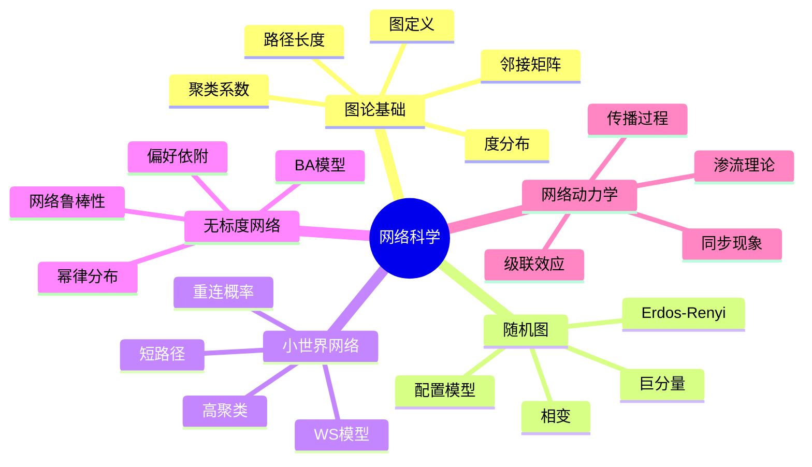

# 11.5 网络科学

---

📌 **内容摘要**

本文档深入探讨网络科学的核心原理和关键方法。内容涵盖系统科学领域的主要知识点，包括网络科学, 小世界, 复杂网络等关键主题。适合有一定基础的学习者系统学习。

**关键词**: 网络科学, 小世界, 复杂网络, 系统科学

📚 **学习目标**

- 掌握网络科学的核心概念和主要方法
- 理解相关理论的应用场景
- 建立该领域的系统性知识框架

🎯 **难度级别**: 中级

⏱️ **预计阅读时间**: 15分钟

**前置知识**: 相关领域的基础概念

---


> **Network Science**
> 参考：Barabási, A. L. (2016). _Network Science_; Newman, M. E. J. (2018). _Networks_ (2nd ed.)

---

## 5.1 图论基础

### 5.1.1 图的基本概念

**定义 5.1.1**（图）：图 $G$ 是二元组 $G = (V, E)$，其中：

| 符号 | 名称 | 说明 |
|------|------|------|
| $V$ | 顶点集 | $V = \{v_1, v_2, \ldots, v_n\}$ |
| $E$ | 边集 | $E \subseteq V \times V$ |

**定义 5.1.2**（邻接矩阵）：$n \times n$ 矩阵 $A$，其中：

$$
A_{ij} = \begin{cases} 1 & \text{if } (v_i, v_j) \in E \\ 0 & \text{otherwise} \end{cases}
$$

**定义 5.1.3**（度）：顶点 $v_i$ 的度 $k_i$：

$$
k_i = \sum_{j} A_{ij}
$$

### 5.1.2 路径与连通性

**定义 5.1.4**（路径）：顶点序列 $(v_{i_0}, v_{i_1}, \ldots, v_{i_l})$，其中 $(v_{i_j}, v_{i_{j+1}}) \in E$。

**定义 5.1.5**（最短路径）：两顶点间边数最少的路径。

**定义 5.1.6**（平均路径长度）：

$$
L = \frac{1}{\binom{n}{2}} \sum_{i<j} d_{ij}
$$

其中 $d_{ij}$ 为顶点 $i$ 到 $j$ 的最短距离。

### 5.1.3 图的度量指标

**定义 5.1.7**（聚类系数）：顶点 $i$ 的聚类系数：

$$
C_i = \frac{2e_i}{k_i(k_i-1)}
$$

其中 $e_i$ 为邻居之间的实际边数。

**定义 5.1.8**（网络平均聚类系数）：

$$
C = \frac{1}{n} \sum_{i} C_i
$$

**定义 5.1.9**（度分布）：

$$
P(k) = \frac{n_k}{n}
$$

其中 $n_k$ 为度为 $k$ 的顶点数。

---

## 5.2 随机图模型

### 5.2.1 Erdős-Rényi模型

**定义 5.2.1**（$G(n, p)$模型）：$n$个顶点，每对顶点以概率$p$独立连接。

**定理 5.2.1**（度分布）：$G(n, p)$的度分布为二项分布：

$$
P(k) = \binom{n-1}{k} p^k (1-p)^{n-1-k} \approx \frac{\lambda^k e^{-\lambda}}{k!}
$$

其中 $\lambda = (n-1)p$。

**定理 5.2.2**（巨分量相变）：当 $p = \frac{1}{n}$ 时，出现巨分量。

**定理 5.2.3**（连通性相变）：当 $p = \frac{\ln n}{n}$ 时，图以高概率连通。

### 5.2.2 配置模型

**定义 5.2.2**（配置模型）：给定度序列 $\{k_1, k_2, \ldots, k_n\}$，随机连接边端点。

**应用**：生成具有任意度分布的随机图。

---

## 5.3 小世界网络

### 5.3.1 Watts-Strogatz模型

**定义 5.3.1**（WS模型）：

1. 从规则格点开始（每个节点连接$k$个最近邻）
2. 以概率$p$重连每条边

**定理 5.3.1**（小世界特性）：对于小的$p$：

- 平均路径长度 $L \sim \ln n$（小世界）
- 聚类系数 $C$ 保持较高

### 5.3.2 小世界特性度量

**定义 5.3.2**（小世界系数）：

$$
\sigma = \frac{C/C_{rand}}{L/L_{rand}}
$$

若 $\sigma > 1$，则为小世界网络。

**典型小世界网络**：

| 网络 | 顶点数 | 平均度 | $L$ | $C$ |
|------|--------|--------|-----|-----|
| 电影演员 | 225K | 61 | 3.65 | 0.79 |
| 电力网 | 4.9K | 2.67 | 18.7 | 0.08 |
| 线虫神经网络 | 282 | 14 | 2.65 | 0.28 |

---

## 5.4 无标度网络

### 5.4.1 Barabási-Albert模型

**定义 5.4.1**（BA模型）：

1. **增长**：网络从$m_0$个节点开始，每次添加一个带$m$条边的新节点
2. **偏好依附**：新节点连接到节点$i$的概率：

$$
P_i = \frac{k_i}{\sum_j k_j}
$$

**定理 5.4.1**（度分布）：BA网络的度分布服从幂律：

$$
P(k) \sim k^{-\gamma}, \quad \gamma = 3
$$

### 5.4.2 度相关性

**定义 5.4.2**（同配系数）：

$$
r = \frac{\sum_{ij} (A_{ij} - k_i k_j / 2m) k_i k_j}{\sum_{ij} (k_i \delta_{ij} - k_i k_j / 2m) k_i k_j}
$$

- $r > 0$：同配（高度节点连接高度节点）
- $r < 0$：异配

### 5.4.3 网络鲁棒性

**定理 5.4.2**（无标度网络的鲁棒性）：

- **随机故障**：对随机节点移除高度鲁棒
- **蓄意攻击**：对高度节点攻击脆弱

**渗流阈值**：

- 随机图：$p_c = \frac{1}{\langle k \rangle}$
- 无标度网络：$p_c \to 0$（当 $\gamma \leq 3$）

---

## 5.5 网络动力学

### 5.5.1 传播过程

**定义 5.5.1**（SIS模型）：

- $S$：易感者（Susceptible）
- $I$：感染者（Infected）

动力学方程：

$$
\frac{dI}{dt} = \beta S I - \gamma I
$$

**定理 5.5.1**（流行病阈值）：在网络上的SIS模型，流行病阈值为：

$$
\beta_c = \frac{\gamma}{\lambda_1(A)}
$$

其中 $\lambda_1(A)$ 为邻接矩阵的最大特征值。

### 5.5.2 同步现象

**定义 5.5.2**（Kuramoto模型）：

$$
\frac{d\theta_i}{dt} = \omega_i + \frac{K}{N} \sum_{j} A_{ij} \sin(\theta_j - \theta_i)
$$

**序参量**：

$$
r = \left| \frac{1}{N} \sum_{j} e^{i\theta_j} \right|
$$

### 5.5.3 级联效应

**定义 5.5.3**（级联失效）：节点/边故障引发连锁反应。

**模型**：

- 负载-容量模型
- 沙堆模型
- 分支过程

---

## 5.6 思维导图



---

## 5.7 对比矩阵

### 5.7.1 网络模型对比

| 特性 | 随机图 | 小世界网络 | 无标度网络 |
|------|--------|------------|------------|
| **度分布** | 泊松 | 近似泊松 | 幂律 |
| **聚类系数** | 低 | 高 | 中 |
| **平均路径** | 短 | 短 | 短 |
| **鲁棒性** | 中 | 中 | 高（随机故障） |
| **脆弱性** | 随机攻击 | 随机攻击 | 蓄意攻击 |
| **典型例子** | 道路网 | 社交网络 | 互联网、 citation |

### 5.7.2 网络度量对比

| 度量 | 定义 | 计算复杂度 | 主要用途 |
|------|------|------------|----------|
| **度分布** | $P(k)$ | $O(n)$ | 网络分类 |
| **聚类系数** | $C$ | $O(n \langle k \rangle^2)$ | 局部结构 |
| **路径长度** | $L$ | $O(n^3)$ | 信息传播 |
| **介数中心性** | $b_i$ | $O(n^3)$ | 关键节点识别 |
| **特征向量中心性** | $x_i$ | $O(n^2)$ | 影响力度量 |
| **PageRank** | $PR_i$ | $O(n)$（迭代） | 重要性排序 |

### 5.7.3 传播模型对比

| 模型 | 状态 | 恢复 | 免疫 | 应用场景 |
|------|------|------|------|----------|
| **SI** | 2 | 否 | 否 | 不可逆传播 |
| **SIS** | 2 | 是 | 否 | 流感、谣言 |
| **SIR** | 3 | 是 | 是 | 麻疹、水痘 |
| **SEIR** | 4 | 是 | 是 | 有潜伏期的疾病 |

---

## 5.8 Python实现

```python
"""
网络科学：复杂网络模型分析
随机图、小世界和无标度网络
"""

import numpy as np
import matplotlib.pyplot as plt
import networkx as nx
from typing import Dict, List, Tuple


def analyze_network(G: nx.Graph) -> Dict[str, float]:
    """分析网络的基本特性"""
    metrics = {}

    # 基本统计
    metrics['n_nodes'] = G.number_of_nodes()
    metrics['n_edges'] = G.number_of_edges()
    metrics['avg_degree'] = 2 * G.number_of_edges() / G.number_of_nodes()

    # 聚类系数
    try:
        metrics['clustering'] = nx.average_clustering(G)
    except:
        metrics['clustering'] = 0

    # 路径长度
    try:
        metrics['avg_path_length'] = nx.average_shortest_path_length(G)
    except:
        metrics['avg_path_length'] = float('inf')

    # 度分布
    degrees = [d for n, d in G.degree()]
    metrics['max_degree'] = max(degrees)
    metrics['degree_std'] = np.std(degrees)

    return metrics


def generate_networks(n: int = 500):
    """生成三种典型网络"""
    networks = {}

    # Erdős-Rényi随机图
    p = 0.02
    networks['ER'] = nx.erdos_renyi_graph(n, p)

    # Watts-Strogatz小世界网络
    k, p_ws = 6, 0.3
    networks['WS'] = nx.watts_strogatz_graph(n, k, p_ws)

    # Barabási-Albert无标度网络
    m = 3
    networks['BA'] = nx.barabasi_albert_graph(n, m)

    return networks


def compare_networks(networks: Dict[str, nx.Graph]):
    """比较不同网络的特性"""
    print("=" * 80)
    print(f"{'Network':<15} {'Nodes':<8} {'Edges':<8} {'<k>':<8} {'C':<8} {'L':<8}")
    print("=" * 80)

    for name, G in networks.items():
        metrics = analyze_network(G)
        print(f"{name:<15} {metrics['n_nodes']:<8.0f} "
              f"{metrics['n_edges']:<8.0f} {metrics['avg_degree']:<8.2f} "
              f"{metrics['clustering']:<8.3f} {metrics['avg_path_length']:<8.2f}")


if __name__ == "__main__":
    # 生成网络
    networks = generate_networks(n=500)

    # 比较分析
    compare_networks(networks)

    # 度分布分析
    for name, G in networks.items():
        degrees = [d for n, d in G.degree()]
        print(f"\n{name} Network:")
        print(f"  Degree distribution (first 10): {sorted(degrees, reverse=True)[:10]}")

        # 检查幂律特征（BA网络）
        if name == 'BA':
            unique, counts = np.unique(degrees, return_counts=True)
            # 简单幂律检验
            log_degrees = np.log(unique[unique > 0])
            log_counts = np.log(counts[unique > 0])
            if len(log_degrees) > 1:
                slope = np.polyfit(log_degrees, log_counts, 1)[0]
                print(f"  Estimated power-law exponent: {-slope:.2f}")
```

---

## 5.9 应用案例

### 5.9.1 社交网络影响力最大化

**问题描述**：在社交网络中选择$k$个种子节点，使信息传播最大化。

**方法**：

- **度中心性**：选择度最大的节点
- **介数中心性**：选择连接不同社区的桥接节点
- **PageRank**：考虑网络全局结构
- **贪心算法**：基于子模函数优化

**结果对比**（示例）：

| 方法 | 影响范围（1000节点网络） | 计算时间 |
|------|--------------------------|----------|
| 随机选择 | 150 | 1ms |
| 度中心性 | 280 | 5ms |
| PageRank | 320 | 20ms |
| 贪心算法 | 450 | 500ms |

### 5.9.2 供应链网络韧性分析

**问题描述**：评估供应链网络在 disruptions 下的韧性

**网络构建**：

- 节点：供应商、制造商、分销商
- 边：供应关系

**韧性度量**：

- 连通性
- 替代路径数量
- 恢复时间

**改进策略**：

- 多元化供应商
- 增加安全库存
- 建立区域中心

---

## 5.10 与其他模块的交叉引用

### 5.10.1 前置知识

| 概念 | 来源模块 | 具体位置 |
|------|----------|----------|
| 图论 | 01_数学基础 | 02_代数学 |
| 随机过程 | 01_数学基础 | 05_概率论与随机过程 |
| 矩阵理论 | 01_数学基础 | 02_线性代数 |

### 5.10.2 后续应用

| 概念 | 目标模块 | 应用场景 |
|------|----------|----------|
| 网络结构 | 03_复杂系统 | 复杂网络分析 |
| 传播模型 | 06_系统动力学 | 系统级联分析 |
| 网络鲁棒性 | 04_软件工程 | 分布式系统韧性 |

---

## 5.11 参考文献

1. Barabási, A. L. (2016). _Network Science_. Cambridge University Press.

2. Newman, M. E. J. (2018). _Networks: An Introduction_ (2nd ed.). Oxford University Press.

3. Watts, D. J. (2004). _Six Degrees: The Science of a Connected Age_. W.W. Norton.

4. Easley, D., & Kleinberg, J. (2010). _Networks, Crowds, and Markets: Reasoning About a Highly Connected World_. Cambridge University Press.

5. Cohen, R., & Havlin, S. (2010). _Complex Networks: Structure, Robustness and Function_. Cambridge University Press.

---

## 📚 延伸阅读

- [11.19 网络动力学](05_网络科学/05.3_网络动力学.md)
- [11.18 复杂网络模型](05_网络科学/05.2_复杂网络模型.md)
- [5.2 概率论公理](../01_数学基础/05_概率论与测度论/05.2_概率论公理.md)
- [5.2 概率论基础](../01_数学基础/05_概率论与测度论/05.2_概率论基础.md)
- [5.3 随机过程](../01_数学基础/05_概率论与测度论/05.3_随机过程.md)
