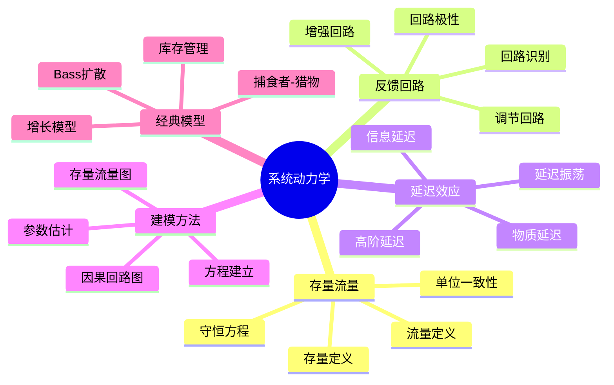

# 11.6 系统动力学

---

📌 **内容摘要**

本文档深入探讨系统动力学的核心原理和关键方法。内容涵盖系统科学领域的主要知识点，包括相关理论、方法及应用。适合有一定基础的学习者系统学习。

**关键词**: 系统科学

📚 **学习目标**

- 掌握系统动力学的核心概念和主要方法
- 理解相关理论的应用场景
- 建立该领域的系统性知识框架

🎯 **难度级别**: 中级

⏱️ **预计阅读时间**: 15分钟

**前置知识**: 相关领域的基础概念

---


> **System Dynamics**
> 参考：Forrester, J. W. (1961). _Industrial Dynamics_; Sterman, J. D. (2000). _Business Dynamics_

---

## 6.1 存量与流量

### 6.1.1 存量的形式化定义

**定义 6.1.1**（存量）：累积量，系统的状态变量：

$$
S(t) = S(t_0) + \int_{t_0}^{t} [I(s) - O(s)] ds
$$

其中 $I$ 为流入量，$O$ 为流出量。

**定义 6.1.2**（离散形式）：

$$
S_{t+\Delta t} = S_t + \Delta t \cdot (Inflow_t - Outflow_t)
$$

**存量特征**：

| 特征 | 说明 | 示例 |
|------|------|------|
| 状态性 | 描述系统状态 | 库存水平 |
| 累积性 | 流量随时间累积 | 人口数量 |
| 记忆性 | 反映历史输入 | 银行账户余额 |

### 6.1.2 流量的形式化定义

**定义 6.1.3**（流量）：单位时间内存量的变化率，不累积。

**定义 6.1.4**（净流量）：

$$
Net\ Flow = Inflow - Outflow = \frac{dS}{dt}
$$

**流量类型**：

| 类型 | 定义 | 示例 |
|------|------|------|
| **流入量** | 增加存量的速率 | 出生率、入库率 |
| **流出量** | 减少存量的速率 | 死亡率、出库率 |
| **双向流** | 可正可负 | 净迁移 |

### 6.1.3 守恒方程

**定理 6.1.1**（存量流量守恒）：对于任何存量：

$$
\frac{dS}{dt} = \sum Inflows - \sum Outflows
$$

**物质守恒**：封闭系统中物质总量恒定。

---

## 6.2 反馈回路

### 6.2.1 增强回路

**定义 6.2.1**（增强回路/正反馈）：回路中任意变量的变化引起同方向的变化。

**典型结构**：

$$
S \xrightarrow{+} Flow \xrightarrow{+} S
$$

**示例**：

| 系统 | 增强机制 | 结果 |
|------|----------|------|
| 人口增长 | 更多人→更多出生→更多人 | 指数增长 |
| 资本积累 | 更多投资→更多利润→更多投资 | 复利增长 |
| 病毒传播 | 更多感染者→更多传播→更多感染者 | 指数爆发 |

### 6.2.2 调节回路

**定义 6.2.2**（调节回路/负反馈）：回路中任意变量的变化引起反方向的变化，趋向目标值。

**典型结构**：

$$
S \xrightarrow{+} Flow \xrightarrow{-} S
$$

**示例**：

| 系统 | 调节机制 | 结果 |
|------|----------|------|
| 温度控制 | 温度偏差→调节加热→温度恢复 | 稳态 |
| 库存管理 | 库存偏差→调整订货→库存恢复 | 目标库存 |
|  predator-prey | 捕食者增加→猎物减少→捕食者减少 | 振荡 |

### 6.2.3 回路分析

**定义 6.2.3**（回路极性）：

- 奇数个负因果链 → 负反馈（调节）
- 偶数个负因果链 → 正反馈（增强）

**延迟的影响**：

- 延迟导致振荡
- 延迟越长，振荡周期越长
- 延迟导致超调

---

## 6.3 延迟效应

### 6.3.1 物质延迟

**定义 6.3.1**（一阶物质延迟）：

$$
\frac{dS}{dt} = \frac{Inflow - S/D}{1} = \frac{Inflow}{D} - \frac{S}{D}
$$

其中 $D$ 为延迟时间。

**定理 6.3.1**（延迟输出）：输出等于存量除以延迟时间：

$$
Outflow = \frac{S}{D}
$$

**延迟特性**：

| 特性 | 说明 |
|------|------|
| 平均延迟 | 等于延迟时间 $D$ |
| 分布 | 指数分布 |
| 输出形状 | 对阶跃输入呈指数趋近 |

### 6.3.2 信息延迟

**定义 6.3.2**（平滑/信息延迟）：

$$
\frac{dS}{dt} = \frac{Input - S}{D}
$$

即指数平滑：$S$ 是对 $Input$ 的平滑估计。

**应用场景**：

- 需求预测
- 信息传递
- 感知形成

### 6.3.3 高阶延迟

**定义 6.3.3**（$n$阶延迟）：$n$个一阶延迟串联。

**特性对比**：

| 延迟阶数 | 峰值时间 | 形状 | 应用 |
|----------|----------|------|------|
| 一阶 | $t = 0$ | 指数衰减 | 简单排队 |
| 二阶 | $t = D$ | 钟形 | 制造过程 |
| 三阶 | $t = 2D$ | 更对称 | 供应链 |
| 无限阶 | $t = D$ | 脉冲 | 纯时滞 |

---

## 6.4 系统建模方法

### 6.4.1 建模步骤

**步骤 1：问题定义**

- 明确研究问题和边界
- 确定关键利益相关者
- 定义时间范围

**步骤 2：动态假设**

- 识别关键变量
- 绘制因果回路图(CLD)
- 确定反馈结构

**步骤 3：存量流量图**

- 区分存量和流量
- 建立数学方程
- 确定参数初值

**步骤 4：仿真与验证**

- 参数估计
- 模型验证
- 敏感性分析

**步骤 5：政策设计**

- 场景分析
- 政策测试
- 结果解释

### 6.4.2 因果回路图

**绘制规则**：

- 变量为名词短语
- 因果链用箭头表示
- 极性（+/-）标注在箭头上
- 识别回路类型

**极性定义**：

- **+**：原因增加 → 结果增加
- **-**：原因增加 → 结果减少

### 6.4.3 存量流量图

**图形约定**：

| 符号 | 名称 | 含义 |
|------|------|------|
| 矩形 | 存量 | 状态变量 |
| 管道+阀门 | 流量 | 变化率 |
| 云 | 源/汇 | 系统边界外 |
| 箭头 | 信息链 | 因果关系 |
| 圆圈 | 辅助变量 | 中间计算 |

---

## 6.5 经典模型

### 6.5.1 Bass扩散模型

**定义 6.5.1**（Bass模型）：新产品采纳

$$
\frac{dF}{dt} = (p + qF)(1 - F)
$$

其中：

- $F$：市场渗透率
- $p$：创新系数（外部影响）
- $q$：模仿系数（内部影响）

**销售率**：

$$
S(t) = m \frac{dF}{dt}
$$

其中 $m$ 为市场潜力。

**峰值时间**：

$$
t^* = \frac{1}{p+q} \ln\left(\frac{q}{p}\right)
$$

### 6.5.2 捕食者-猎物模型

**定义 6.5.2**（Lotka-Volterra）：

$$
\begin{cases}
\frac{dx}{dt} = \alpha x - \beta xy \\
\frac{dy}{dt} = \delta xy - \gamma y
\end{cases}
$$

其中：

- $x$：猎物数量
- $y$：捕食者数量
- $\alpha$：猎物增长率
- $\beta$：捕食率
- $\delta$：捕食者转化效率
- $\gamma$：捕食者死亡率

### 6.5.3 库存管理模型

**基本结构**：

$$
\frac{dInventory}{dt} = Receipts - Sales
$$

**订货决策**：

$$
Order = Expected\ Sales + \frac{Target\ Inventory - Inventory}{Adjustment\ Time}
$$

**牛鞭效应**：需求信息在供应链上游被逐级放大。

---

## 6.6 思维导图



---

## 6.7 对比矩阵

### 6.7.1 建模方法对比

| 特性 | SD（系统动力学） | ABM（多主体建模） | DE（离散事件） |
|------|------------------|-------------------|----------------|
| **核心视角** | 反馈结构 | 个体行为 | 事件序列 |
| **时间处理** | 连续 | 离散/连续 | 离散 |
| **数学基础** | 微分方程 | 规则/策略 | 排队论 |
| **适用系统** | 连续流 | 异质主体 | 排队系统 |
| **学习曲线** | 中 | 高 | 中 |
| **软件工具** | Vensim, Stella | NetLogo, Repast | AnyLogic, Simio |

### 6.7.2 反馈回路对比

| 特性 | 增强回路 | 调节回路 |
|------|----------|----------|
| **极性** | 正（+） | 负（-） |
| **行为** | 指数增长/衰减 | 目标寻求/振荡 |
| **平衡点** | 不稳定 | 稳定 |
| **典型行为** | S型增长、崩溃 | 阻尼振荡、超调 |
| **延迟效应** | 加速或延缓增长 | 引起振荡 |

### 6.7.3 延迟类型对比

| 类型 | 物理意义 | 数学形式 | 应用 |
|------|----------|----------|------|
| **物质延迟** | 物理传输 | 存量-流量 | 运输、排队 |
| **信息延迟** | 感知/认知 | 平滑/自适应 | 预测、决策 |
| **感知延迟** | 报告延迟 | 纯延迟 | 数据收集 |
| **反应延迟** | 决策延迟 | 多阶延迟 | 政策响应 |

---

## 6.8 Python实现

```python
"""
系统动力学：存量流量建模与仿真
经典SD模型实现
"""

import numpy as np
import matplotlib.pyplot as plt
from scipy.integrate import odeint
from typing import List, Callable, Tuple


class StockFlowModel:
    """通用存量流量模型"""

    def __init__(self, initial_stocks: dict):
        self.stocks = initial_stocks.copy()
        self.history = {name: [value] for name, value in initial_stocks.items()}
        self.time = [0]

    def flows(self, stocks: dict, t: float) -> dict:
        """
        计算流量（子类重写）
        返回: {stock_name: net_flow}
        """
        raise NotImplementedError

    def simulate(self, dt: float, t_max: float):
        """运行仿真"""
        n_steps = int(t_max / dt)

        for step in range(n_steps):
            t = step * dt
            current_stocks = {name: values[-1] for name, values in self.history.items()}

            # 计算流量
            net_flows = self.flows(current_stocks, t)

            # 更新存量
            for name in self.stocks:
                if name in net_flows:
                    new_value = current_stocks[name] + dt * net_flows[name]
                    self.history[name].append(new_value)

            self.time.append((step + 1) * dt)

        return self.time, self.history


class BassDiffusion(StockFlowModel):
    """Bass扩散模型"""

    def __init__(self, p: float = 0.03, q: float = 0.38, m: float = 1000000):
        self.p = p
        self.q = q
        self.m = m
        super().__init__({'Adopted': 0, 'Potential': m})

    def flows(self, stocks: dict, t: float) -> dict:
        adopted = stocks['Adopted']
        potential = stocks['Potential']

        # 采纳率 = (p + q*F) * (1 - F) * m
        F = adopted / self.m
        adoption_rate = (self.p + self.q * F) * (1 - F) * self.m

        return {
            'Adopted': adoption_rate,
            'Potential': -adoption_rate
        }

    def peak_time(self) -> float:
        """计算销售高峰时间"""
        if self.q > self.p:
            return -1 / (self.p + self.q) * np.log(self.p / self.q)
        return 0


class LotkaVolterra(StockFlowModel):
    """捕食者-猎物模型"""

    def __init__(self, alpha: float = 1.0, beta: float = 0.1,
                 delta: float = 0.075, gamma: float = 1.5,
                 x0: float = 10, y0: float = 5):
        self.alpha = alpha
        self.beta = beta
        self.delta = delta
        self.gamma = gamma
        super().__init__({'Prey': x0, 'Predator': y0})

    def flows(self, stocks: dict, t: float) -> dict:
        x = stocks['Prey']
        y = stocks['Predator']

        dx = self.alpha * x - self.beta * x * y
        dy = self.delta * x * y - self.gamma * y

        return {'Prey': dx, 'Predator': dy}


if __name__ == "__main__":
    # Bass扩散模型示例
    bass = BassDiffusion(p=0.03, q=0.38, m=1000000)
    t, history = bass.simulate(dt=0.01, t_max=10)

    adopted = history['Adopted']
    adoption_rate = np.diff(adopted) / 0.01

    print("Bass Diffusion Model:")
    print(f"  Peak time: {bass.peak_time():.2f}")
    print(f"  Final adoptions: {adopted[-1]:.0f}")
    print(f"  Max adoption rate: {max(adoption_rate):.0f}")

    # 捕食者-猎物模型示例
    lv = LotkaVolterra(alpha=1.0, beta=0.1, delta=0.075, gamma=1.5, x0=10, y0=5)
    t_lv, history_lv = lv.simulate(dt=0.01, t_max=50)

    print(f"\nLotka-Volterra Model:")
    print(f"  Initial prey: {history_lv['Prey'][0]:.2f}")
    print(f"  Final prey: {history_lv['Prey'][-1]:.2f}")
    print(f"  Initial predator: {history_lv['Predator'][0]:.2f}")
    print(f"  Final predator: {history_lv['Predator'][-1]:.2f}")
```

---

## 6.9 应用案例

### 6.9.1 项目管理动态

**问题描述**：分析软件项目的进度动态

**关键存量**：

- 剩余工作量
- 已完成任务
- 团队规模

**反馈回路**：

- **增强回路**：进度压力 → 加班 → 疲劳 → 缺陷增加 → 返工增加 → 进度压力
- **调节回路**：进度偏差 → 招聘 → 团队规模 → 生产率 → 进度改善

**政策分析**：

- 单纯加班的局限性
- 质量投资的重要性
- 渐进式交付策略

### 6.9.2 城市交通拥堵

**问题描述**：分析交通拥堵的形成与缓解

**存量流量结构**：

- 存量：道路上的车辆
- 流入：进入市区的车辆
- 流出：离开市区的车辆
- 容量：道路通行能力

**关键延迟**：

- 出行决策延迟
- 交通信息传播延迟
- 基础设施改善延迟

**政策评估**：

| 政策 | 短期效果 | 长期效果 | 副作用 |
|------|----------|----------|--------|
| 扩建道路 | 缓解 | 诱发需求，回到原点 | 占地、污染 |
| 拥堵收费 | 显著减少交通量 | 稳定 | 公平性问题 |
| 公共交通 | 中等 | 结构性改善 | 投资大 |
| 远程办公 | 显著 | 可持续 | 文化阻力 |

---

## 6.10 与其他模块的交叉引用

### 6.10.1 前置知识

| 概念 | 来源模块 | 具体位置 |
|------|----------|----------|
| 微分方程 | 01_数学基础 | 04_分析学 |
| 系统概念 | 本模块 | 01_一般系统论 |
| 反馈控制 | 本模块 | 02_控制论 |

### 6.10.2 后续应用

| 概念 | 目标模块 | 应用场景 |
|------|----------|----------|
| 存量流量 | 04_软件工程 | 资源管理建模 |
| 反馈回路 | 06_调度系统 | 负载均衡分析 |
| 延迟分析 | 04_软件工程 | 系统响应时间 |

---

## 6.11 参考文献

1. Forrester, J. W. (1961). _Industrial Dynamics_. MIT Press.

2. Sterman, J. D. (2000). _Business Dynamics: Systems Thinking and Modeling for a Complex World_. McGraw-Hill.

3. Meadows, D. H. (2008). _Thinking in Systems: A Primer_. Chelsea Green Publishing.

4. Bass, F. M. (1969). "A New Product Growth for Model Consumer Durables". _Management Science_, 15(5), 215-227.

5. Lotka, A. J. (1925). _Elements of Physical Biology_. Williams & Wilkins.

---

## 📚 延伸阅读

- [03.1 系统动力学](./05_形式化理论/03_控制论/03.1_系统动力学.md)
- [11.22 反馈回路](./11_系统科学/06_系统动力学/06.2_反馈回路.md)
- [11.23 系统建模方法](./11_系统科学/06_系统动力学/06.3_系统建模方法.md)
- [03.2 反馈控制](./05_形式化理论/03_控制论/03.2_反馈控制.md)
- [11.1 系统的概念](./11_系统科学/01_一般系统论/01.1_系统的概念.md)
